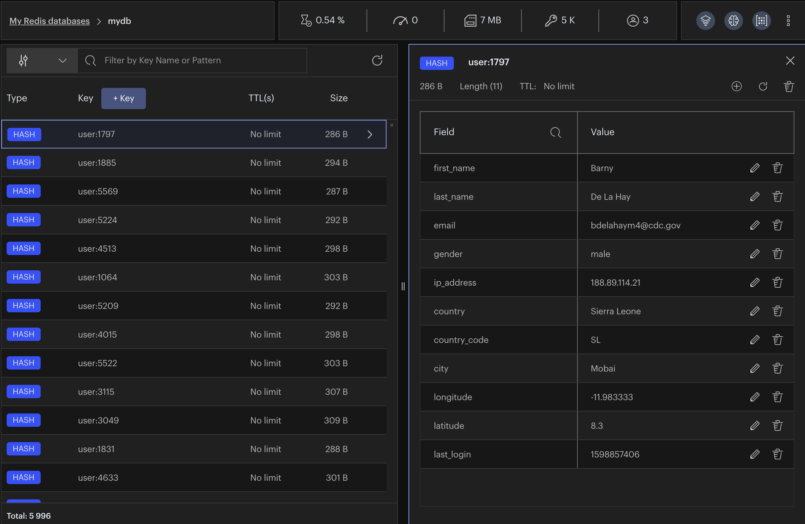
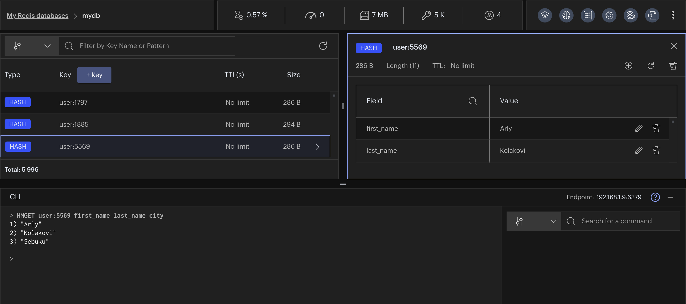

import Tabs from '@theme/Tabs';
import TabItem from '@theme/TabItem';
import useBaseUrl from '@docusaurus/useBaseUrl';
import RedisCard from '@site/src/theme/RedisCard';



RedisInsight is a 100% free Redis GUI that allows you to visualise, monitor, and optimize while developing your applications with Redis. It provides an intuitive and efficient GUI for Redis allowing developers like you to interact with your databases and manage your data. RedisInsight v2.0 now incorporates a completely new tech stack based on the popular Electron and Elastic UI frameworks. You can run the application locally along with your favorite IDE, and it remains cross-platform, supported on Linux, Windows, and MacOS.


## What's New in the RedisInsight v2.0 Browser Tool?

RedisInsight Browser lets you explore keys in your Redis server. You can add, edit and delete a key. You can even update the key expiry and copy the key name to be used in different parts of the application. Below are the list of features available under the browser tool:

- Browse, filter and visualize key-value Redis data structures
- Visual cues per data type
- Quick view of size and ttl in the main browser view
- Ability to filter by pattern and/or data type
- Ability to change the number of keys to scan through during filtering
- CRUD support for Lists, Hashes, Strings, Sets, Sorted Sets
- Search within the data structure (except for Strings)
- CRUD support for RedisJSON

In order to understand the capabilities of the browser tool, let us take a simple example and demonstrate each of the browser tool's options:

### Step 1. Download RedisInsight

To use RedisInsight on a local Mac, you can download the software directly from the Redis official website:

[Click this link](https://redis.com/redis-enterprise/redis-insight/#insight-form) to access a form that allows you to select the operating system of your choice.


Fill out the rest of the form and click “Download.” Please note that the package name is the combination of the platform and version as shown here: redisinsight-preview-platform-version

### Step 2. Install RedisInsight

Click on the RedisInsight executable and install it in your system.


Once the RedisInsight software is installed, click on its icon to open the RedisInsight application. It will display the End-User License Agreement and Privacy Settings. Enable Analytics and Encrypt sensitive information as per your preference.


### Step 3. Connect to a Redis Database

There are multiple ways you can connect to a Redis database - either by creating a new Redis Enterprise Cloud database or connecting to an existing database. To connect to Redis Enterprise Cloud, choose the "Create a Free on Redis Cloud" option.


Once clicked, it will redirect to [the link](https://redis.com/try-free/?utm_source=redis&utm_medium=app&utm_campaign=redisinsight) where you will need to complete the form.


You can follow [this link](/create/rediscloud) to create a New Redis Enterprise Cloud database.
In case you have an existing Redis database, follow the below steps.

Assuming that you already have Redis database up and running locally, proceed to the next step to select "ADD REDIS DATABASE"

### Step 4. Add Redis database

Enter the requested details, including Host (endpoint), Port, and Alias in the form, as shown below. You can skip username for now. Then click “ADD REDIS DATABASE”:


Once added, you will see the database added as shown below:


### Step 5: Open "Browser Tool"

Click on "Key icon" on the left sidebar to open up the browser tool.


### Step 6: Importing keys

Let us import a user database( 6k keys). This dataset contains users stored as Redis Hash.


### 
**Users**

The user hashes contain the following fields:


*   `user:id` : The key of the hash.
*   `first_name` : First Name.
*   `last_name` : Last name.
*   `email` : email address.
*   `gender` : Gender (male/female).
*   `ip_address` : IP address.
*   `country` : Country Name.
*   `country_code` : Country Code.
*   `city` : City of the user.
*   `longitude` : Longitude of the user.
*   `latitude` : Latitude of the user.
*   `last_login` : Epoch time of the last login.

### Step 7: Cloning the repository

Open up the CLI terminal and run the following command:

 ```bash
  git clone https://github.com/redis-developer/redis-datasets
  cd redis-datasets/user-database
 ```


### Importing the user database:


 ```bash
  redis-cli -h localhost -p 6379 < ./import_users.redis
 ```


Refresh the keys database by clicking as shown below:


You can get a real-time view of the data in your Redis database as shown below:


Select any key in the key database and the results gets displayed in the right hand side that includes Fields and values.


### Step 8. Modifying a key


Enter key name, field and value.


### Step 9: Using CLI

RedisInsight CLI lets you run commands against a redis server. You don’t need to remember the syntax - the integrated help shows you all the arguments and validates your command as you type.





## Further References

- [Slowlog Configuration using RedisInsight](/explore/redisinsight/slowlog)
- [Explore Redis keys using RedisInsight browser tool](/explore/redisinsight/browser)
- [Memory Analysis using RedisInsight](/explore/redisinsight/memoryanalyzer)


<div>
<a href="https://launchpad.redis.com" target="_blank" rel="noopener" className="link"> </a>
</div>


