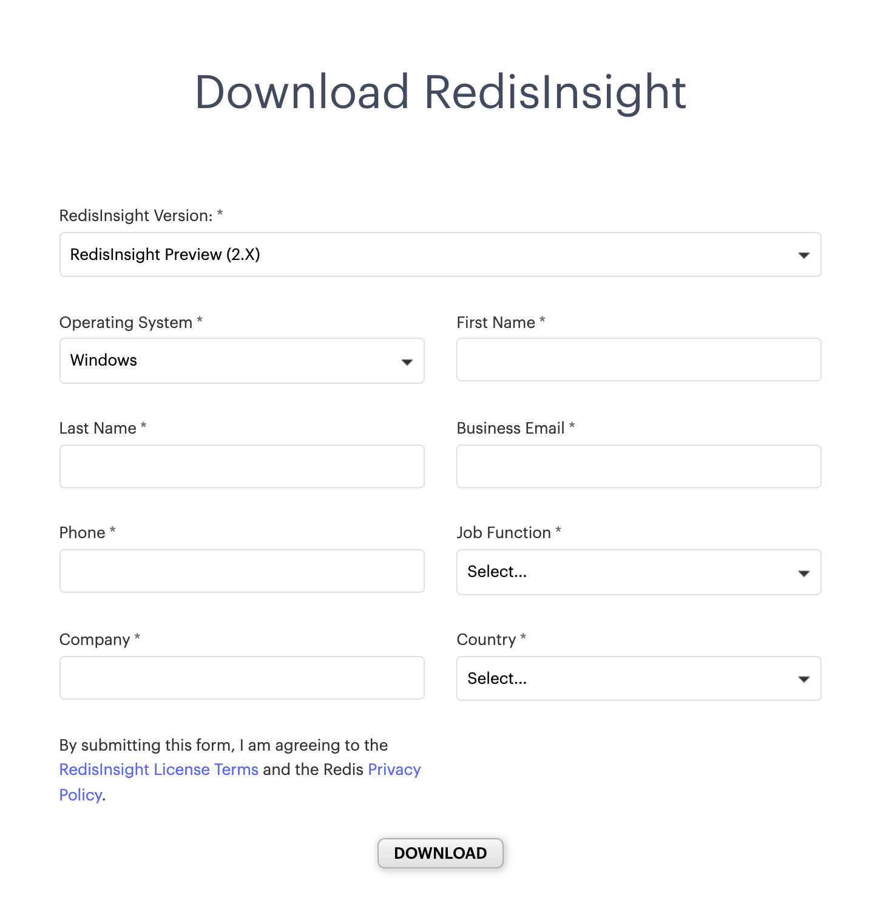

import Tabs from '@theme/Tabs';
import TabItem from '@theme/TabItem';
import useBaseUrl from '@docusaurus/useBaseUrl';
import RedisCard from '@site/src/theme/RedisCard';


RedisInsight is a visual tool that lets you do both GUI- and CLI-based interactions with your Redis database, and so much more when developing your Redis based application. It is a fully-featured pure Desktop GUI client that provides capabilities to design, develop and optimize your Redis application. It works with any cloud provider as long as you run it on a host with network access to your cloud-based Redis server. It makes it easy to discover cloud databases and configure connection details with a single click. It allows you to automatically add Redis Enterprise Software and Redis Enterprise Cloud databases.

## What's New in RedisInsight v2.0?

RedisInsight v2.0 is a complete product rewrite based on a new tech stack comprising of [Electron](https://www.electronjs.org/), [Elastic UI](https://elastic.github.io/eui/#/), [Monaco Editor](https://microsoft.github.io/monaco-editor/) and [NodeJS](https://nodejs.org). This version contains a number of must-have and most-used capabilities from previous releases, plus a number of differentiators and delighters. You can run the application locally along with your favorite IDE, and it remains cross-platform, supported on Linux, Windows, and MacOS.

<div class="text--center">
<iframe width="760" height="315" src="https://www.youtube.com/embed/ppYSS6opUiQ" title="YouTube video player" frameborder="0" allow="accelerometer; autoplay; clipboard-write; encrypted-media; gyroscope; picture-in-picture" allowfullscreen></iframe>
</div>


Starting with RedisInsight v2.0 release, the code is open source and publicly available over on [GitHub](https://github.com/redisinsight/redisinsight). Below are the list of new features introduced with this latest release:

- Workbench - An advanced command line interface with intelligent command auto-complete and complex data visualizations
- Ability to write and render your own data visualizations within Workbench
- Built-in click-through Redis Guides available
- Support for Light and Dark themes
- Enhanced user experience with Browser


## Getting Started 

<Tabs
  defaultValue="MacOS"
  values={[
    {label: 'MacOS', value: 'MacOS'},
    {label: 'Linux', value: 'Linux'},
    {label: 'Windows', value: 'Windows'},
  ]}>
  <TabItem value="MacOS">


## Using MacOS

To install RedisInsight on MacOS, the easiest way is to install Redis Stack.
Make sure that you have Homebrew installed before starting on the installation instructions below.


### Step 1. Install Redis Stack using Homebrew

First, tap the Redis Stack Homebrew tap and then run `brew install` as shown below:

 ```bash
  brew tap redis-stack/redis-stack
  brew install --cask redis-stack
 ```

This will install all Redis and Redis Stack binaries. How you run these binaries depends on whether you already have Redis installed on your system.


 ```
  ==> Installing Cask redis-stack-redisinsight
  ==> Moving App 'RedisInsight-preview.app' to '/Applications/RedisInsight-preview.app'
  🍺  redis-stack-redisinsight was successfully installed!
  ==> Installing Cask redis-stack
  🍺  redis-stack was successfully installed!
 ```

:::info TIP

If this is the first time you’ve installed Redis on your system, then all Redis Stack binaries be installed and accessible on your paht. On M1 Macs, this assumes that `/opt/homebrew/bin` is in your path. On Intel-based Macs, `/usr/local/bin` should be in the path.

To check this, run:

 ```bash
  echo $PATH
 ```


Then, confirm that the output contains `/opt/homebrew/bin` (M1 Mac) or `/usr/local/bin` (Intel Mac). If these directories are not in the output, see the “Existing Redis installation” instructions below.
:::

### Start Redis Stack Server

You can now start Redis Stack Server as follows:

 ```bash
  redis-stack-server
 ```


### Existing Redis installation

If you have an existing Redis installation on your system, then you’ll need to modify your path to ensure that you’re using the latest Redis Stack binaries.

Open the file `~/.bashrc` or `~/zshrc` (depending on your shell), and add the following lines.


 ```bash
   export PATH=/usr/local/Caskroom/redis-stack-server/<VERSION>/bin:$PATH
 ```


Go to Applications and click "RedisInsight-v2" to bring up the Redis Desktop GUI tool.


### Step 2. Add Redis database


### Step 3. Enter Redis database details

Add the local Redis database endpoint and port.


### Step 5. Redis for time series


Redis Stack provides you with a native time series data structure. Let's see how a time series might be useful in our bike shop.

As we have multiple physical shops too, alongside our online shop, it could be helpful to have an overview of the sales volume. We will create one time series per shop tracking the total amount of all sales. In addition, we will mark the time series with the appropriate region label, east or west. This kind of representation will allow us to easily query bike sales performance per certain time periods, per shop, per region or across all shops.


Click "Guides" icon(just below the key) in the left sidebar and choose "Redis for the time series" for this demonstration. i


### Step 6. Create time series per shop


 ```bash
  TS.CREATE bike_sales_1 DUPLICATE_POLICY SUM LABELS region east compacted no
  TS.CREATE bike_sales_2 DUPLICATE_POLICY SUM LABELS region east compacted no
  TS.CREATE bike_sales_3 DUPLICATE_POLICY SUM LABELS region west compacted no
  TS.CREATE bike_sales_4 DUPLICATE_POLICY SUM LABELS region west compacted no
  TS.CREATE bike_sales_5 DUPLICATE_POLICY SUM LABELS region west compacted no
 ```
As shown in the following query, we make the shop id (1,2,3,4,5) a part of the time series name. You might also notice the `DUPLICATE_POLICY SUM` argument; this describes what should be done when two events in the same time series share the same timestamp: In this case, it would mean that two sales happened at exactly the same time, so the resulting value should be a sum of the two sales amounts.

Since the metrics are collected with a millisecond timestamp, we can compact our time series into sales per hour:


### Step 7. Running the query


### Step 8. Time series compaction

RedisTimeSeries supports downsampling with the following aggregations: avg, sum, min, max, range, count, first and last. If you want to keep all of your raw data points indefinitely, your data set grows linearly over time. However, if your use case allows you to have less fine-grained data further back in time, downsampling can be applied. This allows you to keep fewer historical data points by aggregating raw data for a given time window using a given aggregation function.

#### Example:


 ```
  TS.CREATERULE bike_sales_5 bike_sales_5_per_day AGGREGATION sum 86400000
 ```


### Overview of RedisInsight Workbench

With the new RedisInsight v2.0, a Workbench has been introduced. Workbench is basically an advanced command-line interface that lets you run commands against your Redis server. Workbench editor allows comments, multi-line formatting and multi-command execution. It is an Intelligent Redis command auto-complete and syntax highlighting with support for RediSearch, RedisJSON, RedisGraph, RedisTimeSeries, RedisGears, RedisAI, RedisBloom. It allows rendering custom data visualization per Redis command using externally developed plugins.

You can locate the workbench on the left sidebar of RedisInsight dashboard UI. It displays a built-in click-through guides for Redis capabilities. You can also see a number of metrics always on display within the database workspace. These metrics get updated every 5 seconds. The metrics include CPU, number of keys, commands/sec, network input, network output, total memory, number of connected clients.


Check out the reference section to learn more about the new RedisInsight v2.0 features.


### Accessing the CLI

The new RedisInsight v2.0 comes with a command-line interface with enhanced type-ahead command help. It includes an embedded command helper where you can filter and search for Redis commands. Click on "CLI" option to open CLI window:


Try executing Redis commands as shown below:


</TabItem>

<TabItem value="Linux">

## Using Linux

### Step 1. Download RedisInsight

To use RedisInsight on your Linux machine, you can download it directly from the official Redis website:

Open [this](https://redis.com/redis-enterprise/redis-insight/#insight-form) link to open up a form that allows you to select the operating system of your choice.


Fill out the rest of the form and click “Download”. Please note that the package is based on AppImage. The AppImage file is a compressed image which is temporarily mounted to allow access to the program, but not having to extract the program or modify the underlying system.


Package Name: RedisInsight-preview-linux.AppImage

```bash
 file RedisInsight-preview-linux.AppImage 
 RedisInsight-preview-linux.AppImage: ELF 64-bit LSB executable, x86-64, version 1 (SYSV), dynamically linked, interpreter /lib64/ld-linux-x86-64.so.2, for GNU/Linux 2.6.18, stripped
```

### Step 2. Install RedisInsight

Open a terminal and navigate to the folder containing the downloaded file.

Make your downloaded file into an executable.

```
chmod a+x RedisInsight-preview-linux.AppImage
```

### Step 3. Start RedisInsight.

Run the below command to open up RedisInsight dashboard.

```
./RedisInsight-preview-linux.AppImage
```


### Step 4. Changing the appearance

RedisInsight v2.x allows you to specify the color theme of your choice. Click on "Settings" and change the appearance from "Dark Theme" to "Light Theme" as shown in the image below:


### Step 5. Connect to Redis Database

There are multiple ways you can connect to a Redis database - either by creating a new Redis Enterprise Cloud database or connecting to an existing database. To connect to Redis Enterprise Cloud, choose the "Create a Free on Redis Cloud" option.


Once clicked, it will redirect to [the link](https://redis.com/try-free/?utm_source=redis&utm_medium=app&utm_campaign=redisinsight) where you will need to complete the form.


You can follow [this link](/create/rediscloud) to create a New Redis Enterprise Cloud database.
In case you have an existing Redis database, follow the below steps.

Assuming that you already have Redis database up and running locally, proceed to the next step to select "ADD REDIS DATABASE"

### Step 6. Add Redis database

Enter the requested details, including Host (endpoint), Port, and Alias in the form, as shown below. You can skip username for now. Then click “ADD REDIS DATABASE”:


Once added, you will see the database added as shown below:


### Step 7. Adding a New Key

Select the "Key" icon on the left sidebar of RedisInsight UI and click "+Key" to add a new key.


Once added, the dashboard UI shows the hash key details.


### Step 8. Accessing the Workbench

With the new RedisInsight v2.0, a Workbench has been introduced. Workbench is basically an advanced command-line interface that lets you run commands against your Redis server. Workbench editor allows comments, multi-line formatting and multi-command execution. It is an Intelligent Redis command auto-complete and syntax highlighting with support for RediSearch, RedisJSON, RedisGraph, RedisTimeSeries, RedisGears, RedisAI, RedisBloom. It allows rendering custom data visualization per Redis command using externally developed plugins.

You can locate the workbench on the left sidebar of RedisInsight dashboard UI. It displays a built-in click-through guides for Redis capabilities. You can also see a number of metrics always on display within the database workspace. These metrics get updated every 5 seconds. The metrics include CPU, number of keys, commands/sec, network input, network output, total memory, number of connected clients.


### Step 9. Accessing the CLI

The new RedisInsight v2.0 comes with a command-line interface with enhanced type-ahead command help. It includes an embedded command helper where you can filter and search for Redis commands. Click on "CLI" option to open CLI window:


Try executing Redis commands as shown below:


</TabItem>

<TabItem value="Windows">

## Using Windows

### Step 1. Download RedisInsight


To install RedisInsight on Windows, you need to first download the RedisInsight windows bits. 

Open [this](https://redis.com/redis-enterprise/redis-insight/#insight-form) link to open up a form that allows you to select the operating system of your choice.



### Step 2.  Install RedisInsight

Once you download the bits, double-click the file 'RedisInsight-preview-win-installer.exe' to install RedisInsight in your Windows desktop.


### Step 3. Accessing RedisInsight

Double-click on RedisInsight icon to access RedisInsight.

### Step 4. Changing the Theme

RedisInsight v2.x allows you to specify the color theme of your choice. Click on "Settings" and change the appearance from "Dark Theme" to "Light Theme" as shown in the image below:


### Step 5. Add a Redis Database

Enter the requested details, including Host (endpoint), Port, and Alias in the form, as shown below. You can skip username for now. Then click “ADD REDIS DATABASE”:


Once added, you will see the database added as shown below:


### Step 6. Adding a New Key

Select the "Key" icon on the left sidebar of RedisInsight UI and click "+Key" to add a new key.


Once added, the dashboard UI shows the hash key details.


### Step 7. Accessing the Workbench

With the new RedisInsight v2.0, a Workbench has been introduced. Workbench is basically an advanced command-line interface that lets you run commands against your Redis server. Workbench editor allows comments, multi-line formatting and multi-command execution. It is an Intelligent Redis command auto-complete and syntax highlighting with support for RediSearch, RedisJSON, RedisGraph, RedisTimeSeries, RedisGears, RedisAI, RedisBloom. It allows rendering custom data visualization per Redis command using externally developed plugins

You can locate the workbench on the left sidebar of RedisInsight dashboard UI. It displays a built-in click-through guides for Redis capabilities. You can also see a number of metrics always on display within the database workspace. These metrics get updated every 5 seconds. The metrics include CPU, number of keys, commands/sec, network input, network output, total memory, number of connected clients.


### Step 8. Accessing the CLI

The new RedisInsight v2.0 comes with a command-line interface with enhanced type-ahead command help. It includes an embedded command helper where you can filter and search for Redis commands. Click on "CLI" option to open CLI window:


Try executing Redis commands as shown below:


</TabItem>
</Tabs>

RedisInsight allows you to browse, filter and visualize key-value Redis data structures. It support CRUD operation for Lists, Hashes, Strings, Sets, Sorted Sets etc. [In our next tutorial](/explore/redisinsightv2/browser), we will explore the browser tool in more details.

### References

- [RedisInsight v2.0 Release Blog](https://redis.com/blog/introducing-redisinsight-2/)
- [RedisInsight v2.0 Release Notes](https://docs.redis.com/latest/ri/release-notes/v2.0.2/)
- [RedisInsight GitHub Repository](https://github.com/redisinsight/redisinsight)


