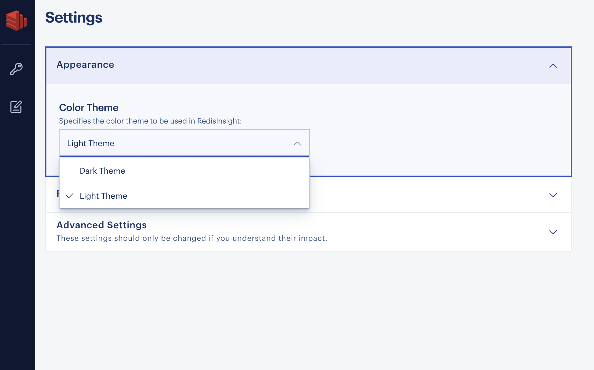
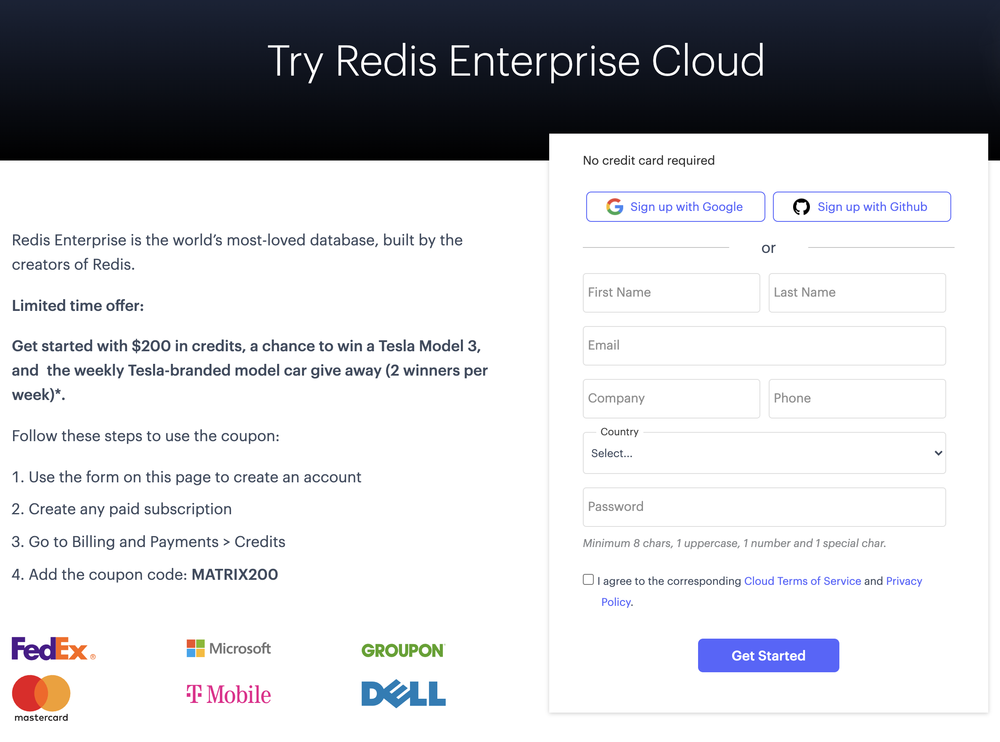
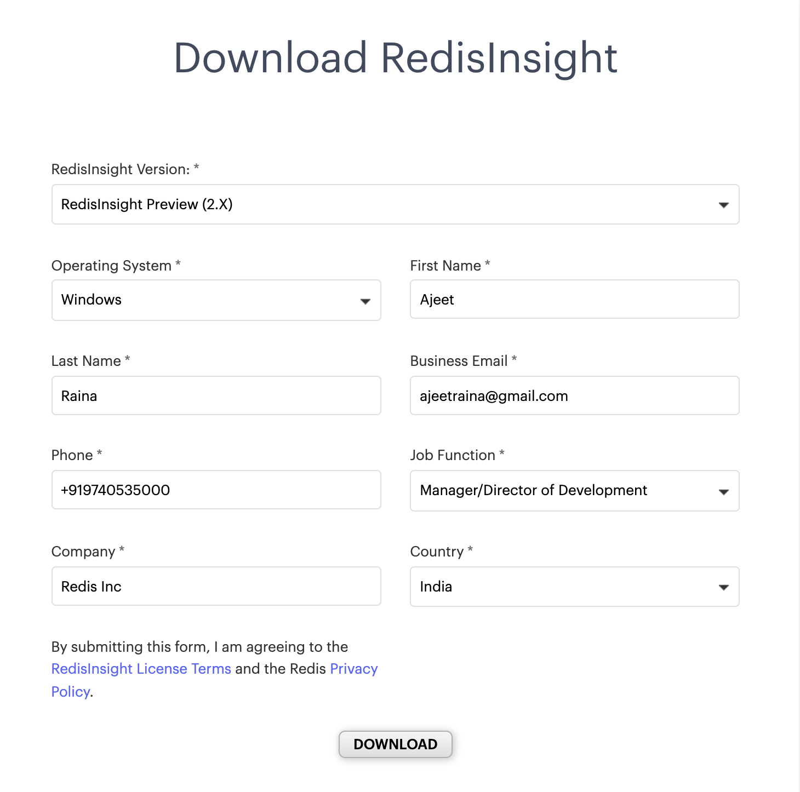

import Tabs from '@theme/Tabs';
import TabItem from '@theme/TabItem';
import useBaseUrl from '@docusaurus/useBaseUrl';
import RedisCard from '@site/src/theme/RedisCard';


RedisInsight v2.0 is a complete product rewrite based on a new tech stack comprising of Electron, Elastic UI and Monaco Editor. This version contains a number of must-have and most-used capabilities from previous releases, plus a number of differentiators and delighters.


<div class="text--center">
<iframe width="760" height="315" src="https://www.youtube.com/embed/ppYSS6opUiQ" title="YouTube video player" frameborder="0" allow="accelerometer; autoplay; clipboard-write; encrypted-media; gyroscope; picture-in-picture" allowfullscreen></iframe>
</div>

## What’s New in RedisInsight v2.0?


- Workbench - An advanced command line interface with intelligent command auto-complete and complex data visualizations
- Ability to write and render your own data visualizations within Workbench
- Built-in click-through Redis Guides available
- Support for Light and Dark themes
- Enhanced user experience with Browser


A full-featured pure desktop GUI client, RedisInsight is available for Windows, macOS, and Linux and is fully compatible with Redis Enterprise. It works with any cloud provider as long as you run it on a host with network access to your cloud-based Redis server. RedisInsight makes it easy to discover cloud databases and configure connection details with a single click. It allows you to automatically add Redis Enterprise Software and Redis Enterprise Cloud databases. 

## Getting Started with RedisInsight

<Tabs
  defaultValue="MacOS"
  values={[
    {label: 'MacOS', value: 'MacOS'},
    {label: 'Linux', value: 'Linux'},
    {label: 'Windows', value: 'Windows'},
  ]}>
  <TabItem value="MacOS">


## Using MacOS

### Step 1. Download RedisInsight

To use RedisInsight on a local Mac, you can download the software directly from the Redis official website:

[Click this link](https://redis.com/redis-enterprise/redis-insight/#insight-form) to access a form that allows you to select the operating system of your choice.


Fill out the rest of the form and click “Download.” Please note that the package name is the combination of the platform and version as shown here: redisinsight-preview-platform-version

### Step 2. Install RedisInsight

Click on the RedisInsight executable and install it in your system.


Once the RedisInsight software is installed, click on its icon to open the RedisInsight application. It will display the End-User License Agreement and Privacy Settings. Enable Analytics and Encrypt sensitive information as per your preference.


### Step 3. Changing the Theme

RedisInsight v2.x allows you to specify the color theme of your choice. Click on "Settings" and change the appearance from "Dark Theme" to "Light Theme" as shown in the image below:




### Step 4. Connect to a Redis Database

There are multiple ways you can connect to a Redis database - either by creating a new Redis Enterprise Cloud database or connecting to an existing database. To connect to Redis Enterprise Cloud, choose the "Create a Free on Redis Cloud" option.


Once clicked, it will redirect to [the link](https://redis.com/try-free/?utm_source=redis&utm_medium=app&utm_campaign=redisinsight) where you will need to complete the form.



You can follow [this link](/create/rediscloud) to create a New Redis Enterprise Cloud database.
In case you have an existing Redis database, follow the below steps.

Assuming that you already have Redis database up and running locally, proceed to the next step to select "ADD REDIS DATABASE"


### Step 5. Add Redis database

Enter the requested details, including Host (endpoint), Port, and Alias in the form, as shown below. You can skip username for now. Then click “ADD REDIS DATABASE”:


Once added, you will see the database added as shown below:


### Step 6. Adding a New Key

Select the "Key" icon on the left sidebar of RedisInsight UI and click "+Key" to add a new key.


Once added, the dashboard UI shows the hash key details.


### Step 7. Accessing the Workbench

With the new RedisInsight v2.0, a Workbench has been introduced. Workbench is basically an advanced command-line interface that lets you run commands against your Redis server. Workbench editor allows comments, multi-line formatting and multi-command execution. It is an Intelligent Redis command auto-complete and syntax highlighting with support for RediSearch, RedisJSON, RedisGraph, RedisTimeSeries, RedisGears, RedisAI, RedisBloom. It allows rendering custom data visualization per Redis command using externally developed plugins.

You can locate the workbench on the left sidebar of RedisInsight dashboard UI. It displays a built-in click-through guides for Redis capabilities. You can also see a number of metrics always on display within the database workspace. These metrics get updated every 5 seconds. The metrics include CPU, number of keys, commands/sec, network input, network output, total memory, number of connected clients.


Check out the reference section to learn more about the new RedisInsight v2.0 features.


### Step 8. Accessing the CLI

The new RedisInsight v2.0 comes with a command-line interface with enhanced type-ahead command help. It includes an embedded command helper where you can filter and search for Redis commands. Click on "CLI" option to open CLI window:


Try executing Redis commands as shown below:


</TabItem>

<TabItem value="Linux">

## Using Linux

### Step 1. Download RedisInsight

To use RedisInsight on your Linux machine, you can download it directly from the official Redis website:

Open [this](https://redis.com/redis-enterprise/redis-insight/#insight-form) link to open up a form that allows you to select the operating system of your choice.


Fill out the rest of the form and click “Download”. Please note that the package is based on AppImage. The AppImage file is a compressed image which is temporarily mounted to allow access to the program, but not having to extract the program or modify the underlying system.


Package Name: RedisInsight-preview-linux.AppImage

```bash
 file RedisInsight-preview-linux.AppImage 
 RedisInsight-preview-linux.AppImage: ELF 64-bit LSB executable, x86-64, version 1 (SYSV), dynamically linked, interpreter /lib64/ld-linux-x86-64.so.2, for GNU/Linux 2.6.18, stripped
```

### Step 2. Install RedisInsight

Open a terminal and navigate to the folder containing the downloaded file.

Make your downloaded file into an executable.

```
chmod a+x RedisInsight-preview-linux.AppImage
```

### Step 3. Start RedisInsight.

Run the below command to open up RedisInsight dashboard.

```
./RedisInsight-preview-linux.AppImage
```


### Step 4. Changing the appearance

RedisInsight v2.x allows you to specify the color theme of your choice. Click on "Settings" and change the appearance from "Dark Theme" to "Light Theme" as shown in the image below:


### Step 5. Connect to Redis Database

There are multiple ways you can connect to a Redis database - either by creating a new Redis Enterprise Cloud database or connecting to an existing database. To connect to Redis Enterprise Cloud, choose the "Create a Free on Redis Cloud" option.


Once clicked, it will redirect to [the link](https://redis.com/try-free/?utm_source=redis&utm_medium=app&utm_campaign=redisinsight) where you will need to fill-up the form.


You can follow [this link](/create/rediscloud) to create a New Redis Enterprise Cloud database.
In case you have an existing Redis database, follow the below steps.

Assuming that you already have Redis database up and running locally, proceed to the next step to select "ADD REDIS DATABASE"

### Step 6. Add Redis database

Enter the requested details, including Host (endpoint), Port, and Alias in the form, as shown below. You can skip username for now. Then click “ADD REDIS DATABASE”:


Once added, you will see the database added as shown below:


### Step 7. Adding a New Key

Select the "Key" icon on the left sidebar of RedisInsight UI and click "+Key" to add a new key.


Once added, the dashboard UI shows the hash key details.


### Step 8. Accessing the Workbench

With the new RedisInsight v2.0, a Workbench has been introduced. Workbench is basically an advanced command-line interface that lets you run commands against your Redis server. Workbench editor allows comments, multi-line formatting and multi-command execution. It is an Intelligent Redis command auto-complete and syntax highlighting with support for RediSearch, RedisJSON, RedisGraph, RedisTimeSeries, RedisGears, RedisAI, RedisBloom. It allows rendering custom data visualization per Redis command using externally developed plugins.

You can locate the workbench on the left sidebar of RedisInsight dashboard UI. It displays a built-in click-through guides for Redis capabilities. You can also see a number of metrics always on display within the database workspace. These metrics get updated every 5 seconds. The metrics include CPU, number of keys, commands/sec, network input, network output, total memory, number of connected clients.


### Step 9. Accessing the CLI

The new RedisInsight v2.0 comes with a command-line interface with enhanced type-ahead command help. It includes an embedded command helper where you can filter and search for Redis commands. Click on "CLI" option to open CLI window:


Try executing Redis commands as shown below:


</TabItem>

<TabItem value="Windows">

## Using Windows

### Step 1. Download RedisInsight


To install RedisInsight on Windows, you need to first download the RedisInsight windows bits. 

Open [this](https://redis.com/redis-enterprise/redis-insight/#insight-form) link to open up a form that allows you to select the operating system of your choice.



### Step 2.  Install RedisInsight

Once you download the bits, double-click the file 'RedisInsight-preview-win-installer.exe' to install RedisInsight in your Windows desktop.


### Step 3. Accessing RedisInsight

Double-click on RedisInsight icon to access RedisInsight.

### Step 4. Changing the Theme

RedisInsight v2.x allows you to specify the color theme of your choice. Click on "Settings" and change the appearance from "Dark Theme" to "Light Theme" as shown in the image below:


### Step 5. Add a Redis Database

Enter the requested details, including Host (endpoint), Port, and Alias in the form, as shown below. You can skip username for now. Then click “ADD REDIS DATABASE”:


Once added, you will see the database added as shown below:


### Step 6. Adding a New Key

Select the "Key" icon on the left sidebar of RedisInsight UI and click "+Key" to add a new key.


Once added, the dashboard UI shows the hash key details.


### Step 7. Accessing the Workbench

With the new RedisInsight v2.0, a Workbench has been introduced. Workbench is basically an advanced command-line interface that lets you run commands against your Redis server. Workbench editor allows comments, multi-line formatting and multi-command execution. It is an Intelligent Redis command auto-complete and syntax highlighting with support for RediSearch, RedisJSON, RedisGraph, RedisTimeSeries, RedisGears, RedisAI, RedisBloom. It allows rendering custom data visualization per Redis command using externally developed plugins

You can locate the workbench on the left sidebar of RedisInsight dashboard UI. It displays a built-in click-through guides for Redis capabilities. You can also see a number of metrics always on display within the database workspace. These metrics get updated every 5 seconds. The metrics include CPU, number of keys, commands/sec, network input, network output, total memory, number of connected clients.


### Step 8. Accessing the CLI

The new RedisInsight v2.0 comes with a command-line interface with enhanced type-ahead command help. It includes an embedded command helper where you can filter and search for Redis commands. Click on "CLI" option to open CLI window:


Try executing Redis commands as shown below:


</TabItem>
</Tabs>

RedisInsight allows you to browse, filter and visualize key-value Redis data structures. It support CRUD operation for Lists, Hashes, Strings, Sets, Sorted Sets etc. In our next tutorial, we will explore the browser tool in more details.

### References

- [RedisInsight v2.0 Release Blog](https://redis.com/blog/introducing-redisinsight-2/)
- [RedisInsight v2.0 Release Notes](https://docs.redis.com/latest/ri/release-notes/v2.0.2/)
- [RedisInsight GitHub Repository](https://github.com/redisinsight/redisinsight)


