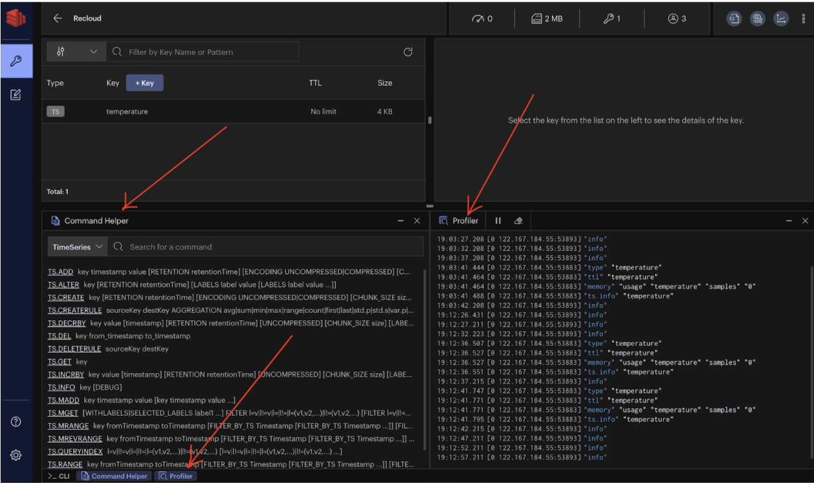
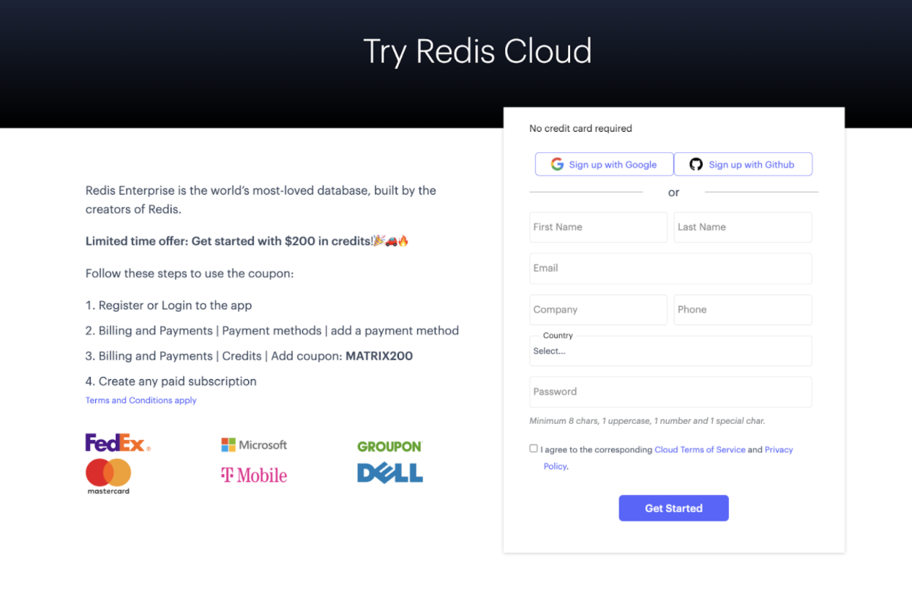
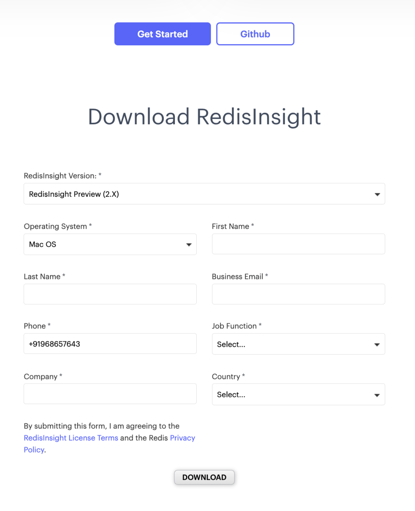
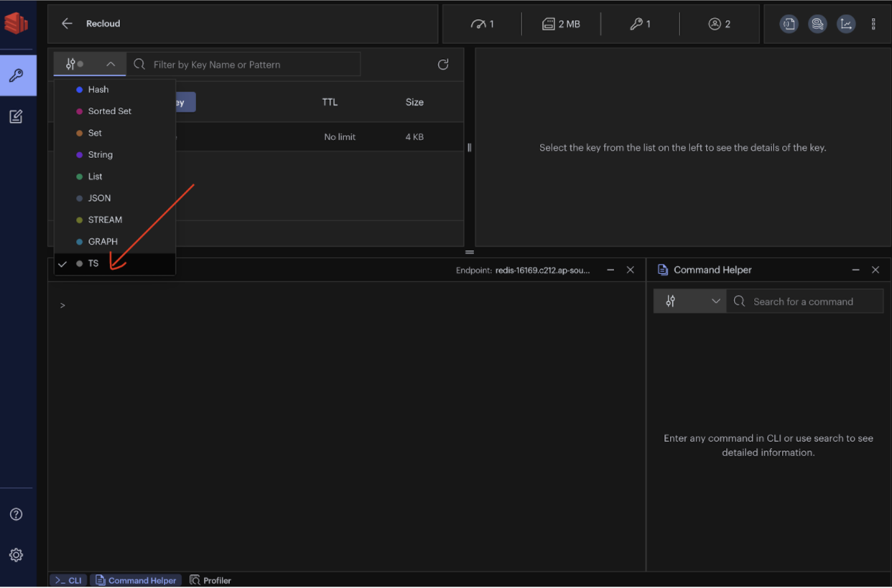
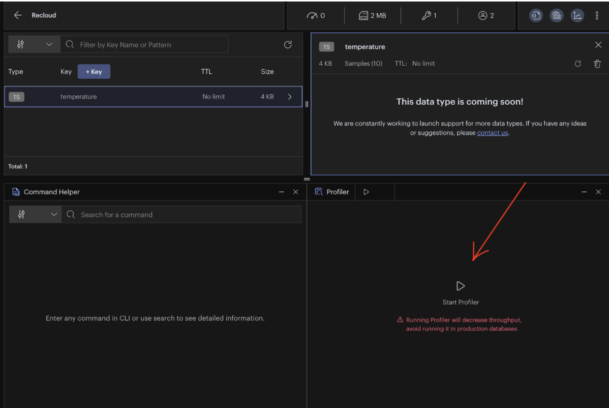

import Authors from '@theme/Authors';

<Authors frontMatter={frontMatter} />



Last week [the maintenance release of RedisInsight Preview 2.0](https://docs.redis.com/latest/ri/release-notes/v2.0.2/) (v2.0.4) was introduced by the RedisInsight Team. RedisInsight v2.0 is a complete product rewrite based on a new tech stack composed of [Electron](https://www.electronjs.org/), [Elastic UI](https://elastic.github.io/eui/#/), [Monaco Editor](https://microsoft.github.io/monaco-editor/), and [Node](https://nodejs.org/).js. This newer preview build added a dedicated RedisInsight Profiler UI for the first time. The profiler uses the MONITOR command to analyze every command sent to the Redis instance in real time.

RedisInsight Profiler analyzes your Redis commands that are being run on the Redis server in real time. The tool provides you detailed information about the number of commands processed, commands/second, and number of connected clients. It also gives information about top prefixes, top keys, and top commands.

It basically runs the Redis MONITOR command and generates a summarized view. MONITOR is a debugging command that streams back every command processed by the Redis server. It can help in understanding what is happening to the database. This command can both be used via redis-cli and via telnet. All the commands sent to the Redis instance are monitored for the duration of the profiling. The ability to see all the requests processed by the server is useful in order to spot bugs in an application, both when using Redis as a database and as a distributed caching system.

Follow the below instructions to test drive RedisInsight Profiler tool introduced under the RedisInsight v2.0.4 release:

### Step 1. Create Redis database with Redis Time Series module enabled



Visit [https://developer.redis.com/create/rediscloud](https://developer.redis.com/create/rediscloud) and create a Redis database. [Follow these steps to enable Redis Time Series module ](https://developer.redis.com/howtos/redistimeseries)on Redis Enterprise Cloud.

### Step 2. Create database

Click “Create Database”. Enter database name and select Redis Time Series.


Once the database is created, you will see the endpoint URL that gets generated. Save it for future reference.


### Step 3. Download RedisInsight

To install RedisInsight on your local system, you need to first download the software from the Redis website.\*\*

[Click this link ](https://redis.com/redis-enterprise/redis-insight/#insight-form)to access a form that allows you to select the operating system of your choice.\*\*



Execute the installer. Once it is installed on your computer, click on the RedisInsight icon to open the tool.


### Step 4. Connect to Redis Enterprise Cloud Database


As the database is empty, you won’t be able to see any key.


### Step 5. Execute the script

Below is the script that creates a time series representing sensor temperature measurements. After you create the time series, you can send temperature measurements. Then you can query the data for a time range on some aggregation rule.

```
from redistimeseries.client import Client as RedisTimeSeries
import time
import sys
import site
import datetime
import random

print(' \n '.join(sys.path))
redis = RedisTimeSeries(host='redis-16169.c212.ap-south-1-1.ec2.cloud.redislabs.com', port=16169, password='XXXX')

# redis.flushdb()
key = 'temperature'
def create(key):
       print('\n Create new time series: %s' % str(key))
       #redis.create(key,retentionSecs=30,labels={'sensor_id' : 2,'area_id' : 32})
       redis.create(key,retention_msecs=30000,labels={'sensor_id' : 2,'area_id' : 32})
       print('')
def store(key, interval):
       print("\n Append new value to time series:\n")
       begin_time = int(time.time())
       for i in range(interval):
               timestamp = int(time.time())
               value = round(random.uniform(0.0,100.0),2)
               timestamp_strftime = datetime.datetime.fromtimestamp(timestamp).strftime('%Y-%m-%d %H:%M:%S')
               sys.stdout.write(' %s : %.2f \n' % (timestamp_strftime, value))
               sys.stdout.flush()
               #redis.add(key,timestamp,value,retentionSecs=30, labels={'sensor_id' : 2,'area_id' : 32})
               redis.add(key,timestamp,value,retention_msecs=30000, labels={'sensor_id' : 2,'area_id' : 32})
               time.sleep(1)
       end_time = int(time.time()-1)
       return (begin_time, end_time)
def query(key, begin_time, end_time):
       begin_time_datetime = datetime.datetime.fromtimestamp(begin_time).strftime('%Y-%m-%d %H:%M:%S')
       end_time_datetime = datetime.datetime.fromtimestamp(end_time).strftime('%Y-%m-%d %H:%M:%S')
       print("\n Query time series in range:\n\n %s to %s \n" % (begin_time_datetime, end_time_datetime))
       try:
               #for record in redis.range(key,begin_time, end_time,bucketSizeSeconds=1):
               for record in redis.range(key,begin_time, end_time,bucket_size_msec=1000):
                       timestamp = datetime.datetime.fromtimestamp(record[0]).strftime('%Y-%m-%d %H:%M:%S')
                       value = round(float(record[1]),2)
                       print(' %s : %.2f ' % (timestamp,value))
       except Exception as e:
               print("\n Error: %s" % e)
       print('')
def print_info():
       print('\n Query time series info:\n')
       for key in redis.keys('*'):
               print(' key=%s' % (key.decode('utf8')))
               info = redis.info(key)
               sensor = info.labels['sensor_id']
               print(" sensor_id=%s " % str(sensor))
               area = info.labels['area_id']
               print(" area_id=%s " % str(area))
               last_time_stamp_seconds = info.__dict__['lastTimeStamp']
               last_time_stamp = datetime.datetime.fromtimestamp(last_time_stamp_seconds).strftime('%Y-%m-%d %H:%M:%S')
               print(" last_time_stamp=%s " % str(last_time_stamp))

       print('')

def print_loop(loops):

        for i in range(loops):

                if i == 0:
                        sys.stdout.write(' ')

                sys.stdout.write('.')
                sys.stdout.flush()
                time.sleep(1)

        print('')

create(key)
interval = 10
begin_time, end_time = store(key,interval)
time.sleep(1)
query(key,begin_time,end_time)
query(key,begin_time+4,end_time-5)
print_info()
print('\n Set expire key: %s' % str(key))
redis.expire(key, (30))
loops = 30
print_loop(loops)
query(key,begin_time,end_time)
time.sleep(1)
interval = 1
create(key)
begin_time, end_time = store(key,interval)
time.sleep(1)
query(key,begin_time,end_time)
time.sleep(1)
print('\n Delete key: %s' % str(key))
redis.delete(key)
time.sleep(1)

query(key,begin_time,end_time)

print('')

```

Results:

```
Create new time series: temperature


 Append new value to time series:

 2022-02-13 17:52:16 : 36.50
 2022-02-13 17:52:17 : 84.56
 2022-02-13 17:52:18 : 25.90
 2022-02-13 17:52:19 : 29.24
 2022-02-13 17:52:20 : 35.75
 2022-02-13 17:52:21 : 78.14
 2022-02-13 17:52:22 : 28.77
 2022-02-13 17:52:23 : 26.37
 2022-02-13 17:52:24 : 74.93
 2022-02-13 17:52:25 : 46.61

 Query time series in range:

 2022-02-13 17:52:16 to 2022-02-13 17:52:25

 2022-02-13 17:52:16 : 36.50
 2022-02-13 17:52:17 : 84.56
 2022-02-13 17:52:18 : 25.90
 2022-02-13 17:52:19 : 29.24
 2022-02-13 17:52:20 : 35.75
 2022-02-13 17:52:21 : 78.14
 2022-02-13 17:52:22 : 28.77
 2022-02-13 17:52:23 : 26.37
 2022-02-13 17:52:24 : 74.93
 2022-02-13 17:52:25 : 46.61


 Query time series in range:

 2022-02-13 17:52:20 to 2022-02-13 17:52:20

 2022-02-13 17:52:20 : 35.75


```

### Step 6. Running Profiler

The new RedisInsight Browser tool allows you to explore keys in your Redis server. You can add, edit, and delete a key. It also helps you to browse, filter, and visualize key-value Redis data structures.

Open Browser tool and select TS from the drop-down menu as shown below:



It will display temperature as a key. Choose the “Profiler” option and click on “Start Profiler.”



Soon you will be able to see the detailed information about the number of commands processed, commands/second, and number of connected clients. It also gives information about top prefixes, top keys, and top commands.


### References:

- [RedisInsight: The Best Redis GUI](https://redis.com/redis-enterprise/redis-insight/)
- [Slowlog Configuration using RedisInsight](/explore/redisinsight/slowlog)
- [Explore Redis keys using RedisInsight browser tool](/explore/redisinsight/browser)
- [Memory Analysis using RedisInsight](/explore/redisinsight/memoryanalyzer)
