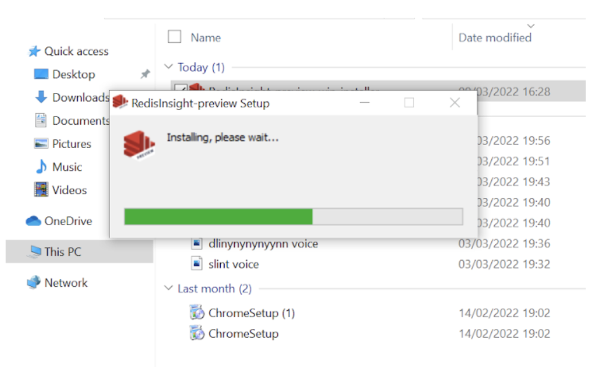
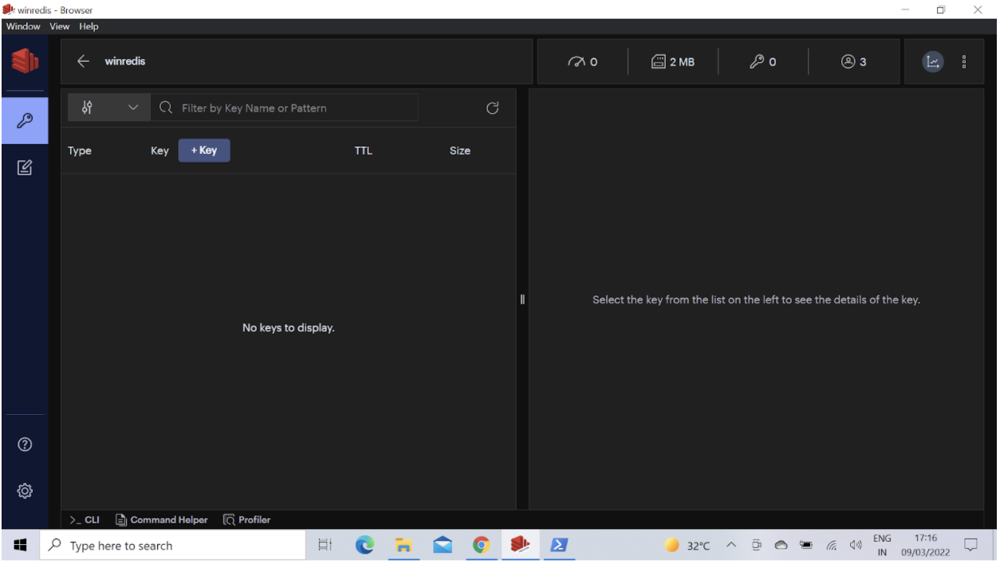
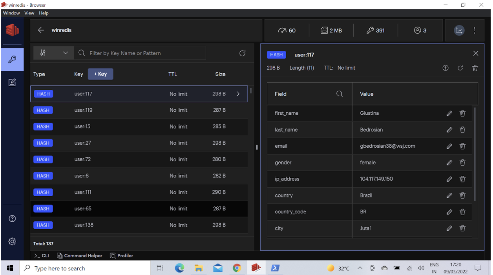
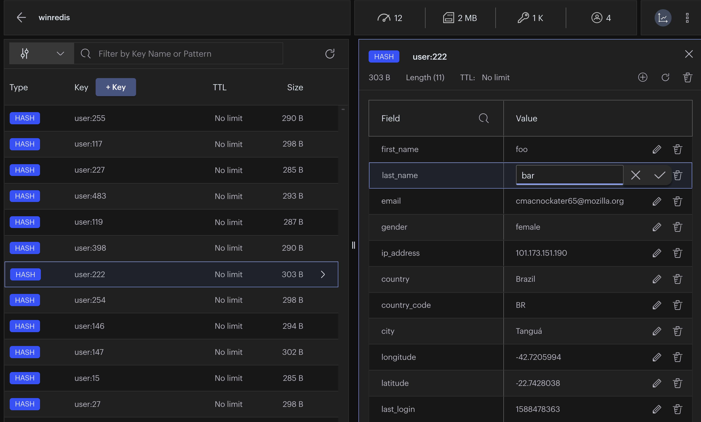

import Authors from '@site/src/theme/Authors';

<Authors frontMatter={frontMatter} />

RedisInsight is a visual tool that provides capabilities to design, develop and optimize your Redis application. It is a 100% free Redis GUI that allows developers like you to interact with your databases and manage your data.

RedisInsight v2.0 incorporates a completely new tech stack based on the popular Electron and Elastic UI frameworks. You can run the application locally along with your favorite IDE, and it remains cross-platform, supported on Linux, Windows, and MacOS. RedisInsight Browser lets you explore keys in your Redis server. You can add, edit and delete a key. You can even update the key expiry and copy the key name to be used in different parts of the application.

## RedisInsight Windows Installer

The RedisInsight desktop client installer for Windows is just 70 MB in size. It allows you to download and use the RedisInsight GUI locally. The desktop client is supported on Windows operating systems and works with all variants of Redis. RedisInsight should install and run on a fresh Windows system.

:::info
There is no need to install the .NET framework in order to install RedisInsight on Windows.
:::

## Getting Started

- Step 1. Create a free Cloud account
- Step 2. Create a database
- Step 3. Verify the database details
- Step 4. Install RedisInsight
- Step 5. Connect to the Redis database
- Step 6. Use Browser Tool
- Step 7. Clone the repository
- Step 8. Import user database keys
- Step 9. Modify a Redis key
- Step 10. Cleaning up

### Step 1. Create a free Cloud account

Create your free <a href="https://redis.com/try-free/" target="_blank" rel="noopener">Redis Enterprise Cloud account</a>. Once you click on “Get Started”, you will receive an email with a link to activate your account and complete your signup process.

:::tip
For a limited time, use **TIGER200** to get **$200** credits on Redis Enterprise Cloud and try all the advanced capabilities!

:tada: [Click here to sign up](https://redis.com/try-free)

:::

### Step 2. Create a database

Choose your preferred cloud vendor. Select the region and then click "Let's start free" to create your free database automatically.

:::tip
If you want to create a custom database with your preferred name and type of Redis,
click "Create a custom database" option shown in the image.
:::


### Step 3. Verify the database details

You will be provided with Public endpoint URL and "Redis Stack" as the type of database with the list of modules that comes by default.


### Step 4. Install RedisInsight

Click on the RedisInsight executable (.exe file) and install it in your system.



Once the RedisInsight software is installed, click on its icon to open the RedisInsight application. It will display the End-User License Agreement and Privacy Settings. Enable Analytics and Encrypt sensitive information as per your preference.


### Step 5. Connect to the Redis Database

Enter the requested details, including Host (endpoint), Port, and Alias in the form, as shown below. You can use "default" as the username for now. Then click “ADD REDIS DATABASE”.


Once added, you will see the database name listed as shown below:


### Step 6. Use "Browser Tool"

Click on the "Key" icon on the left sidebar to open up the browser tool.



### Step 5. Overview of User database keys

Let us import a user database (6k keys). This dataset contains users stored as Redis Hashes.

###

**Users**

The user hashes contain the following fields:

- `user:id` : The key of the hash.
- `first_name` : First Name.
- `last_name` : Last name.
- `email` : email address.
- `gender` : Gender (male/female).
- `ip_address` : IP address.
- `country` : Country Name.
- `country_code` : Country Code.
- `city` : City of the user.
- `longitude` : Longitude of the user.
- `latitude` : Latitude of the user.
- `last_login` : Epoch time of the last login.

### Step 6. Clone the repository

Open up the CLI terminal and run the following commands:

```bash
 git clone https://github.com/redis-developer/redis-datasets
 cd redis-datasets/user-database
```

### Step 7. Import the user database keys

Open up the CLI terminal and run the following command.

:::note
You will need a hostname, port and password to run this for a cloud database.
:::

```bash
 redis-cli -h redis-18386.c110-qa.us-east-1-1.ec2.cloud.redislabs.com -p 18386 -a <enter your password> < ./import_users.redis
```

Refresh the keys view by clicking as shown below:



You can get a real-time view of the data in your Redis database as shown below:

Select any key in the keys view and the key's value gets displayed in the right hand side that includes fields and values.


### Step 8. Modify a key

The RedisInsight browser tool allows you to modify the data instantly.
Select any key and change the values as shown in the following screenshot



### Step 9. Cleaning up

Run the following command to clean up all the Redis keys:


## Further References

- [How to Install Redis on Windows](/create/windows)
- [Slowlog Configuration using RedisInsight](/explore/redisinsight/slowlog)
- [Explore Redis keys using RedisInsight browser tool](/explore/redisinsight/browser)
- [Memory Analysis using RedisInsight](/explore/redisinsight/memoryanalyzer)

<div>
  <a
    href="https://launchpad.redis.com"
    target="_blank"
    rel="noopener"
    className="link">
    
  </a>
</div>
