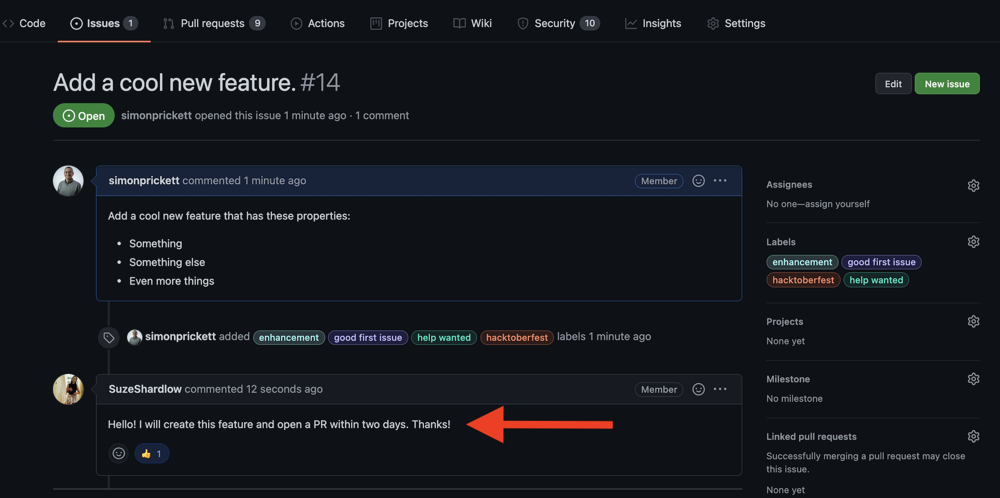
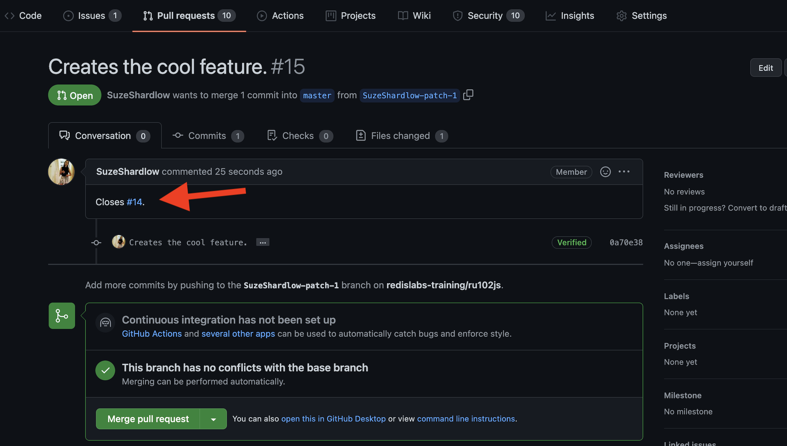
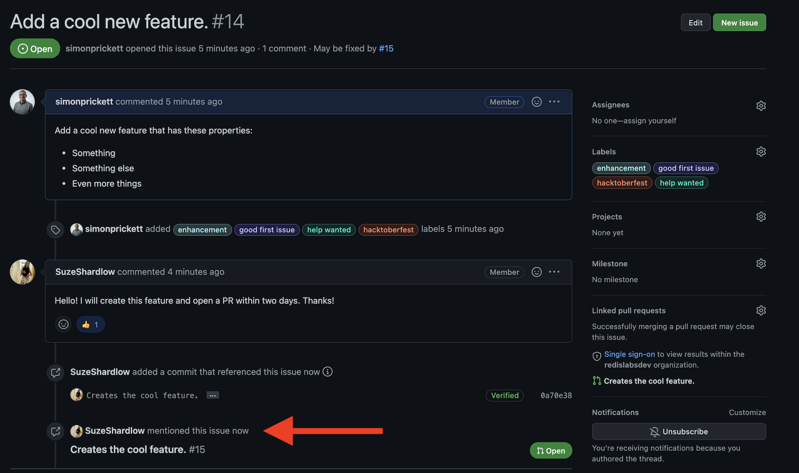

[Hacktoberfest](https://hacktoberfest.digitalocean.com/) is a month-long online festival which takes place every year in October. It is sponsored by [DigitalOcean](https://www.digitalocean.com/) and aims to encourage people to get involved in open source projects.  Hacktoberfest 2021 has now finished!  We've left the below information here so you can see how it worked and check out the recordings of our live streams.

<iframe
  width="560"
  height="315"
  src="https://www.youtube.com/embed/g9xt4p_-3AU"
  frameborder="0"
  allow="accelerometer; autoplay; clipboard-write; encrypted-media; gyroscope; picture-in-picture"
  allowfullscreen></iframe>

## How to get involved

We've created a number of GitHub issues for folks who want to contribute to our documentation and demo apps. [View our list of open issues](https://github.com/search?l=&q=%23hacktoberfest+user%3Aredislabs-training+user%3Aredis+user%3Aredis-developer+user%3ANodeRedis+label%3Ahacktoberfest&state=open&type=Issues).

### Get a GitHub account and Hacktoberfest account

You'll need a GitHub account to contribute to our repos. Sign up for free at [GitHub.com](https://github.com).

You'll also need to [register with Hacktoberfest](https://hacktoberfest.digitalocean.com/register) using your GitHub account if you want to be in with a chance of [earning swag from DigitalOcean](https://hacktoberfest.digitalocean.com/resources/participation). **Please note that Redis is not involved in allocating or sending swag.**

### Finding and working on an issue

1. Look for a suitable issue [on GitHub](https://github.com/search?l=&q=%23hacktoberfest+user%3Aredislabs-training+user%3Aredis+user%3Aredis-developer+user%3ANodeRedis+label%3Ahacktoberfest&state=open&type=Issues). Where possible, we have tagged them according to the skillset and level of experience required.

2. Read the guidance notes on each issue carefully so you know what's expected of you.

3. Add a comment in the issue stating that you're working on it. **To be fair to other contributors, only claim one issue at a time.**

   

4. **Open a pull request within two calendar days:**

   - This is to give more people a fair chance at finding an unclaimed issue.
   - Make sure you reference the issue number in your pull request so that it shows on the issue's page.
   - If you include your Twitter handle, we will give you a shout out.
   - If you're a member of our [Discord server](https://discord.gg/ueQwKUh5Z3), include your Discord handle and we will bestow the **Hacktoberfest 2021** role upon you.

   

   When you do this, your pull request will then be automatically referenced in the issue:

   

   - If you don't submit a pull request within two calendar days, we will make the issue available to other contributors.

5. We will review your pull request. If it's suitable, we'll merge it and add the `hacktoberfest-accepted` label. **If we feel that further work is required, we'll comment as part of our review.**

**Read DigitalOcean's complete Hacktoberfest rules [here](https://hacktoberfest.digitalocean.com/resources/participation).**

## Join the conversation

Need help with one of our issues, or just want to chat with other contributors? [Join us on Discord](https://discord.gg/ueQwKUh5Z3)!

## Looking for more repos?

If you're looking for more repos to contribute to during Hacktoberfest, [check out the Hacktoberfest topic on GitHub](https://github.com/topics/hacktoberfest). **Redis is not responsible for the content of third party repositories.**

## Learn more

Documentation is often cited as a great way to get your feet wet with open source. So to demystify the world of technical writing, we have hosted four live events with our documentation team. Suze Shardlow, Developer Community Manager, sat down with Technical Writers Kaitlyn Michael, Rachel Elledge and Lance Leonard for a series of fireside chats.

Fireside panel - Suze Shardlow with the documentation team: Technical Writing Explained

<iframe
  width="560"
  height="315"
  src="https://www.youtube.com/embed/3E8lLKGGdIk"
  frameborder="0"
  allow="accelerometer; autoplay; clipboard-write; encrypted-media; gyroscope; picture-in-picture"
  allowfullscreen></iframe>

Fireside 1:1 - Suze Shardlow with Kaitlyn Michael: Technical Writing Explained

<iframe
  width="560"
  height="315"
  src="https://www.youtube.com/embed/CB3tsJAAPXA"
  frameborder="0"
  allow="accelerometer; autoplay; clipboard-write; encrypted-media; gyroscope; picture-in-picture"
  allowfullscreen></iframe>

Fireside 1:1 - Suze Shardlow with Rachel Elledge: Technical Writing Explained

<iframe
  width="560"
  height="315"
  src="https://www.youtube.com/embed/w6XAFmzhteU"
  frameborder="0"
  allow="accelerometer; autoplay; clipboard-write; encrypted-media; gyroscope; picture-in-picture"
  allowfullscreen></iframe>

Fireside 1:1 - Suze Shardlow with Lance Leonard: Technical Writing Explained

<iframe
  width="560"
  height="315"
  src="https://www.youtube.com/embed/SeK0OGF5dgE"
  frameborder="0"
  allow="accelerometer; autoplay; clipboard-write; encrypted-media; gyroscope; picture-in-picture"
  allowfullscreen></iframe>

## Contact us

Hacktoberfest at Redis is brought to you by Suze Shardlow and Simon Prickett of the Redis Developer Relations team. [Contact us](mailto:redis.university@redis.com) if you have any questions that aren't addressed here. Please note that we are available during UK daytime.

We can't debug or refactor your code for you, but if you need help understanding how the project works, write a post in the Hacktoberfest channel on [our Discord server](https://discord.gg/ueQwKUh5Z3).
