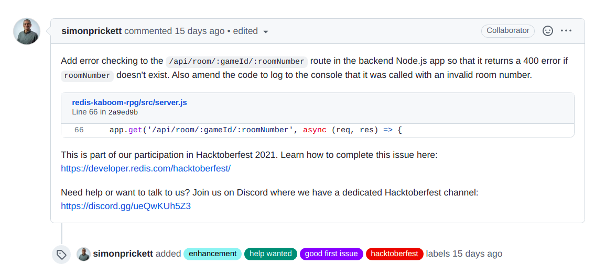
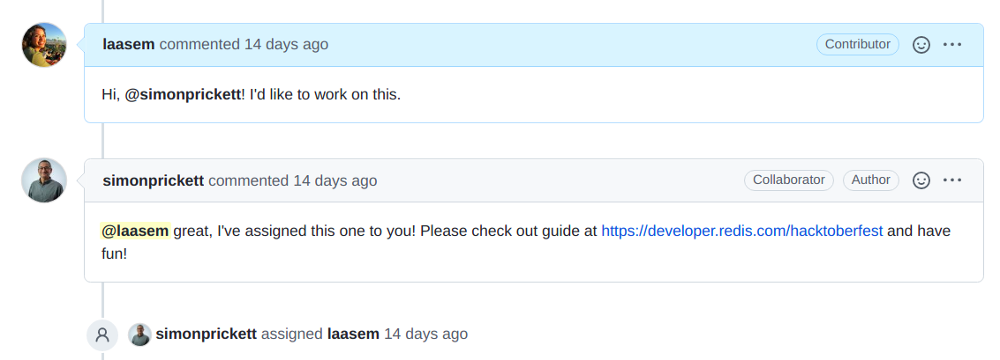

**Preface by Suze Shardlow, Developer Community Manager at Redis:**

> [Lara Aasem](https://laasem.github.io) is a backend software engineer based in Cairo, Egypt.  For Hacktoberfest, she contributed an enhancement to [Kaboom](https://www.youtube.com/watch?v=cowIZWASJNs), which is one of our demo apps.  This is her story.

Open source has always simultaneously fascinated and daunted me. As a backend engineer with a background in sociology, the fact that our world is powered by software built out of empathy, a desire to improve our collective experience, and genuine love of craft—rather than profit—seemed upliftingly radical to me. The open source community's codes of conduct, care for all involved, and emphasis on learning drew me in, but I was still intimidated by it. How do I even start contributing significantly to projects I know nothing about?

It was there that Hacktoberfest found me. It was 2020 and I was frustrated after a drawn-out attempt to make a sizable contribution to a project went awry because I could never find the time to properly address the review comments for a change of that size. After hearing about the event from coworkers, I realized there was a space in which I could make small, beginner-friendly yet meaningful contributions. While exploring unfamiliar codebases and using languages I may not be super comfortable with was challenging, it was also rewarding, especially with the support of maintainers and the knowledge that I was contributing to building the kind of world I dream about.

## Finding...

My first experience with Hacktoberfest was so fulfilling, I spent all of 2021 excited for October. When the time came, I once again used [www.goodfirstissues.com](http://goodfirstissues.com/), an aggregator that lists GitHub issues labeled as `goodfirstissue`, with the ability to filter by other labels as well as the programming language and name of the repository housing the issue. My criteria when searching for issues were:

* small and well-documented enough to be worked on in a few hours,
* in a language I know but am not necessarily proficient in, and
* exciting because of the nature of the project, the learning opportunities it offers, or (ideally) both.

This is how I came across [an issue by Redis](https://github.com/redis-developer/redis-kaboom-rpg/issues/7) to implement an API validation for a [Redis RPG game example](https://github.com/redis-developer/redis-kaboom-rpg) built with Kaboom.JS.

It fit all my criteria:

* As a straightforward change, it would only take a few hours to become familiar with the project, run it, implement the validation, and address any review comments, especially since the project was well-documented and the issue description explained exactly what was required and how to seek help from the maintainers.
* It was in Node.js, a framework I'm very familiar with.
* I was excited to learn more about Redis and contribute to a repository that helped other developers learn more about it.

## ... enjoying...

This last point made the issue all the more enjoyable to work on. I have a high-level understanding of how Redis works and have used it before with Ruby on Rails via `redis-rb`, a [Ruby client library](https://github.com/redis/redis-rb). It was exciting to try a [Node.js client](https://github.com/luin/ioredis) instead (`ioredis`) and to be exposed to RedisJSON, going through its [docs](https://oss.redis.com/redisjson/commands/) to find the most suitable command to use for this particular issue. It was also helpful to see another contributor suggest improvements to my implementation in their own [pull request (PR)](https://github.com/redis-developer/redis-kaboom-rpg/pull/12) implementing validation for another API.

## ... and working on the issue

**1. Finding out how to contribute**

Different projects have different guidelines for contributing. These may be outlined in the `README.md` of the project's GitHub repo, in a separate `CONTRIBUTING.md` file in the repo's base directory, or in a guide on the project or organization's website, the latter being the case with Redis as explained in the issue description. The [Redis Hacktoberfest guide](https://developer.redis.com/hacktoberfest/) asked contributors to comment on the issue they're working on and to only claim one at a time out of fairness, which seems to be standard procedure across many open source repos.

**2. Running the project**

After quickly combing through the `README.md`, my next step was to run the project to get a better sense of how it worked. At the time, the project structure was that you could run Redis via Docker but you had to run the API server locally (this has since been addressed via [another issue](https://github.com/redis-developer/redis-kaboom-rpg/issues/1)), so this is what I did. I also made sure to load the sample data as instructed in the Setup section of the `README.md` (and after, if I remember correctly, a few errors).

# TODO insert screen grabs of the terminal
``

``

``

**3. Trying out the API**

The API in question is a `GET` request that fetches the data for a room given the game ID.

# TODO insert screen grab of Postman showing the room diagram
``

**4. Implementing the validation**

If this API was called with an invalid room number, the server would crash with a `500` HTTP status code. The issue was to explicitly validate the room number, returning a more meaningful `400` HTTP status code and response body to the client.

After combing through the sample data I had loaded previously via npm run load and finding out that the room data was persisted as an array of JSON objects, I assumed the minimum room number would be 0. To get the maximum, then, I would need to get the last index in the array by getting the array length and subtracting one from it. For this, I used the `JSON.ARRLEN` RedisJSON command, validating that the room number sent in the request path was within range and returning `400` otherwise.

# TODO insert screen grab of the file changes in GitHub
``

**5. Testing**

Always a beautiful moment:

# TODO insert screen grab of Postman
``

6. Opening a PR
Once I was satisfied with the functionality and quality of the code, I pushed my changes to a fork of the upstream repo and opened a PR. I simply linked the issue number in the PR description as there was no required template to follow and there wasn't much else to note regarding the implementation.

# TODO insert screen grab of the PR
``

## Post-merge-um

On checking my PR to see that it was reviewed, approved, and merged (and to revel in the beauty of all those `hacktoberfest-accepted`, `Merged`, and `Closed` labels), I noticed another contributor had referenced my PR in their own. They had some good comments on a corner case I had missed as well as the format of the response I was sending.

# TODO insert screen grab of Chris' comment
``

A quarter of the way into Hacktoberfest 2021 and I had already learned a lot, engaged with other members of the open source community, and had a good time doing it. While finding and contributing to suitable open source issues could still be challenging at times, it was no longer the seemingly impossible task it used to be.
