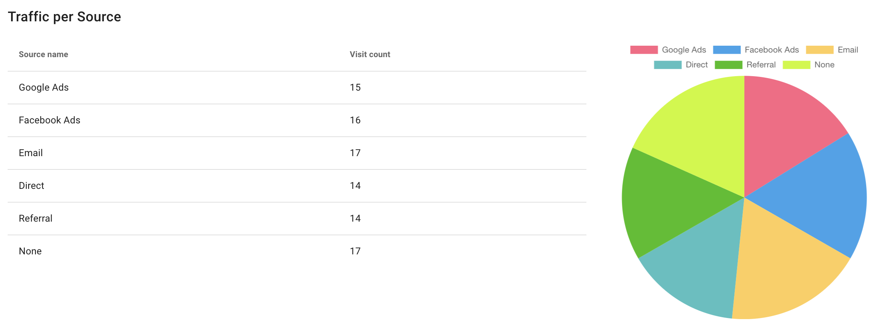

import Authors from '@site/src/theme/Authors';

<Authors frontMatter={frontMatter} />

Interactive analytics dashboards serve several purposes. They allow you to share data and provide you with all those vital information to make game-changing decisions at a faster pace. Building a real-time dynamic dashboard using a traditional relational database might require a complex set of queries. By using a NoSQL database like Redis, you can build a powerful interactive and dynamic dashboard with a small number of Redis commands.

Redis is an open source, in-memory, key-value data store most commonly used as a primary database, cache, message broker, and queue. Redis cache delivers sub-millisecond response times, enabling fast and powerful real-time applications in industries such as gaming, fintech, ad-tech, social media, healthcare, and IoT.
This tutorial shows a basic analytics dashboard app writen in NodeJS (JavaScript) that uses the Redis Bitmap data type.

<div class="text--center">
  <iframe
    width="760"
    height="415"
    src="https://www.youtube.com/embed/Ugym4yUeIhA"
    title="YouTube video player"
    frameborder="0"
    allow="accelerometer; autoplay; clipboard-write; encrypted-media; gyroscope; picture-in-picture"
    allowfullscreen></iframe>
</div>

### Step 1. Prepare the environment

- Install Node - v12.19.0
- Install NPM - v6.14.8
- Install Docker - v19.03.13 (optional)

### Step 2. Clone the repository

```bash
 git clone https://github.com/redis-developer/basic-analytics-dashboard-redis-bitmaps-nodejs
```

### Step 3. Setting up backend

First we will be setting up some environment variables.

Go to /server folder (cd ./server) and then execute the following command:

```bash
 cp .env.example .env
```

### Step 4. Install dependencies

```bash
 npm install
```

### Step 5. Run Docker Compose to install Redis

```bash
 docker network create global
 docker-compose up -d --build
```

You may need to preface the docker command with `sudo`. If you don't want to use sudo, create a Unix group called docker and add users to it. When the Docker daemon starts, it creates a Unix socket accessible by members of the docker group.
Once the Redis database is up and running, you can connect to it using the `redis-cli` command.

:::info TIP

- By default, Redis runs on port 6379 but you can change it by specifying an alternative host port in the docker compose file.
- You can use a Redis configuration file and mount it as volumes in the docker compose YAML file.
- You can connect to the Redis instance by using `redis-cli -h hostname -p port` command.
- You can run the Redis `INFO` command to get statistics, metrics and health information from the Redis instance like cache, memory stats, Redis metrics and modules enabled.
- Use the Redis `MONITOR` command to get a real time view of commands that clients send to Redis.
  :::

### Step 6. Run the backend

```bash
 npm run dev
```

### Step 7. Setting up the frontend

Go to /client folder (cd ./client) and then:

```bash
 cp .env.example .env
```

### Step 8. Install dependencies

```bash
 npm install
```

### Step 9. Run the frontend

```bash
 npm run serve
```



### How does it work?

#### How the data is stored:

The event data is stored in various keys and various data types.

For each of time spans:

- year: like 2021
- month: like 2021-03 (means March of 2021)
- day: like 2021-03-03 (means 3rd March of 2021)
- weekOfMonth: like 2021-03/4 (means 4th week of March 2021)
- anytime

and for each of scopes:

- source
- action
- source + action
- action + page
- userId + action
- global

and for each of data types (types):

- count (Integer stored as String)
- bitmap
- set

Is generated key like:

```bash
 rab:{type}[:custom:{customName}][:user:{userId}][:source:{source}][:action:{action}][:page:{page}]:timeSpan:{timeSpan}
```

where values in [] are optional.

- For each generated key like rab:count:\*, data is stored like: INCR {key}
  Example:

  ```bash
   INCR rab:count:action:addToCart:timeSpan:2015-12/3
  ```

- For each generated key like: rab:set:\*, data is stored like: SADD {key} {userId}
  Example:

  ```bash
   SADD rab:set:action:addToCart:timeSpan:2015-12/3 8
  ```

- For each generated key like rab:bitmap:\*, data is stored like: SETBIT {key} {userId} 1.
  Example:

  ```bash
   SETBIT rab:bitmap:action:addToCart:timeSpan:2015-12/3 8 1
  ```

### Cohort data

- We store users who register and then bought some products (action order matters).
- For each buy action in December we check if user performed register action before (register counter must be greater than zero).
- If so, we set user bit to 1 like: SETBIT rab:bitmap:custom:cohort-buy:timeSpan:{timeSpan} {userId} 1

- E.g User Id 2 bought 2 products on 2015-12-17. It won't be stored.
- E.g User Id 10 bought 1 product on 2015-12-17 and registered on 2015-12-16.
  It will be stored like: SETBIT rab:bitmap:custom:cohort-buy:timeSpan:2015-12 10 1.
- We assume that user cannot buy without register.

#### Retention data

- Retention means users who bought on two different dates
- For each buy action we check if user bought more products anytime than bought on particular day (current purchase not included).
- If so, we add user id to set like: SADD rab:set:custom:retention-buy:timeSpan:{timeSpan} {userId}
- E.g User Id 5 bought 3 products on 2015-12-15. His retention won't be stored (products bought on particular day: 2, products bought anytime: 0).
- E.g User Id 3 bought 1 product on 2015-12-15 and before - 1 product on 2015-12-13. His retention will be stored (products bought on particular day: 0, products bought anytime: 1) like: SADD rab:set:custom:retention-buy:timeSpan:2015-12 3.

#### How the data is accessed:

- Total Traffic:

December: `BITCOUNT rab:bitmap:custom:global:timeSpan:2015-12`
X week of December: `BITCOUNT rab:bitmap:custom:global:timeSpan:2015-12/{X}`
Example:

```bash
 BITCOUNT rab:bitmap:custom:global:timeSpan:2015-12/3
```

- Traffic per Page ({page} is one of: homepage, product1, product2, product3):

```
December: BITCOUNT rab:bitmap:action:visit:page:{page}:timeSpan:2015-12
```

Example:

```bash
 BITCOUNT rab:bitmap:action:visit:page:homepage:timeSpan:2015-12
```

- X week of December:

```
BITCOUNT rab:bitmap:action:visit:page:{page}:timeSpan:2015-12/{X}
```

Example:

```bash
 BITCOUNT rab:bitmap:action:visit:page:product1:timeSpan:2015-12/2
```

- Traffic per Source ({source} is one of: google, Facebook, email, direct, referral, none):

December:

```
BITCOUNT rab:bitmap:source:{source}:timeSpan:2015-12
```

Example:

```bash
 BITCOUNT rab:bitmap:source:referral:timeSpan:2015-12
```

- X week of December: `BITCOUNT rab:bitmap:source:{source}:timeSpan:2015-12/{X}`

Example:

```bash
 BITCOUNT rab:bitmap:source:google:timeSpan:2015-12/1
```

- Trend traffic ({page} is one of: homepage, product1, product2, product3):

- December: from `BITCOUNT rab:bitmap:action:visit:{page}:timeSpan:2015-12-01` to `BITCOUNT rab:bitmap:action:visit:{page}:timeSpan:2015-12-31`
- 1 Week of December: Similar as above, but from 2015-12-01 to 2015-12-07
- 2 Week of December: Similar as above, but from 2015-12-08 to 2015-12-14
- 3 Week of December: Similar as above, but from 2015-12-15 to 2015-12-21
- 4 Week of December: Similar as above, but from 2015-12-22 to 2015-12-28
- 5 Week of December: Similar as above, but from 2015-12-29 to 2015-12-31
- Example:

  ```bash
   BITCOUNT rab:bitmap:action:visit:homepage:timeSpan:2015-12-29 => BITCOUNT rab:bitmap:action:visit:homepage:timeSpan:2015-12-30 => BITCOUNT rab:bitmap:action:visit:homepage:timeSpan:2015-12-31
  ```

- Total products bought:

- December: `GET rab:count:action:buy:timeSpan:2015-12`
- X week of December: `GET rab:count:action:buy:timeSpan:2015-12/{X}`
  Example:

  ```bash
   GET rab:count:action:buy:timeSpan:2015-12/1
  ```

- Total products added to cart:

December: `GET rab:count:action:addToCart:timeSpan:2015-12`
X week of December: `GET rab:count:action:addToCart:timeSpan:2015-12/{X}`
Example:

```bash
 GET rab:count:action:addToCart:timeSpan:2015-12/1
```

- Shares of products bought ({productPage} is on of product1, product2, product3):

December: `GET rab:count:action:buy:page:{productPage}:timeSpan:2015-12`
Example:

```bash
 GET rab:count:action:buy:page:product3:timeSpan:2015-12
```

- X week of December: `GET rab:count:action:buy:page:{productPage}:timeSpan:2015-12/{X}`
  Example:

  ```bash
   GET rab:count:action:buy:page:product1:timeSpan:2015-12/2
  ```

#### Customer and Cohort Analysis

- People who registered: BITCOUNT rab:bitmap:action:register:timeSpan:2015-12
- People who register then bought (order matters): BITCOUNT rab:bitmap:custom:cohort-buy:timeSpan:2015-12
- Dropoff: (People who register then bought / People who register) \* 100 [%]
- Customers who bought only specified product ({productPage} is one of: product1, product2, product3):

```
SMEMBERS rab:set:action:buy:page:{productPage}:timeSpan:2015-12
```

Example:

```bash
 SMEMBERS rab:set:action:buy:page:product2:timeSpan:2015-12
```

- Customers who bought Product1 and Product2:

```
SINTER rab:set:action:buy:page:product1:timeSpan:anytime rab:set:action:buy:page:product2:timeSpan:anytime
```

- Customer Retention (customers who bought on the different dates): SMEMBERS rab:set:custom:retention-buy:timeSpan:anytime

### References

- [Complete Source Code](https://github.com/redis-developer/basic-analytics-dashboard-redis-bitmaps-nodejs)
- [Use cases of Bitmaps](https://redis.io/topics/data-types-intro)
