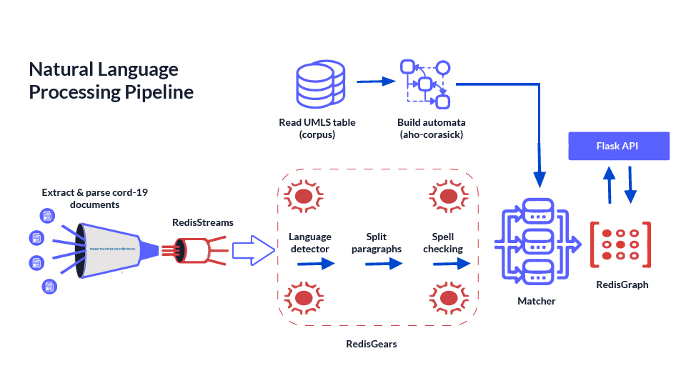
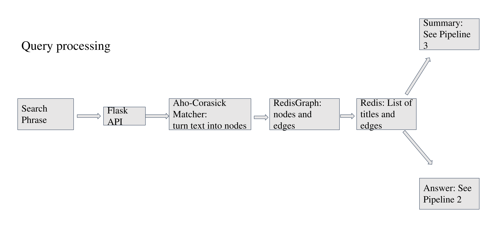
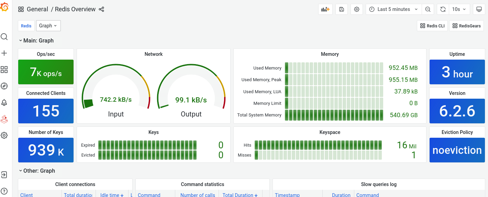
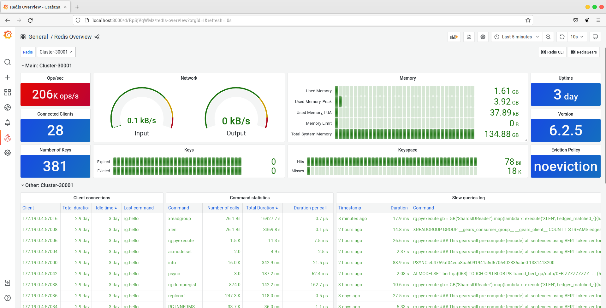

<head>
  <link
    rel="canonical"
    href="https://reference-architecture.ai/docs/bert-qa-benchmarking/"
  />
</head>

## Introduction

In this article, we will explore the challenges and opportunities associated with deploying [large BERT Question Answering Transformer](https://huggingface.co/bert-large-uncased-whole-word-masking-finetuned-squad) models from Hugging Face, using [RedisGears](/howtos/redisgears) and [RedisAI](/howtos/redisai/getting-started) to perform a lot of the heavy lifting while also leveraging the in-memory datastore Redis.

## Why do we need RedisAI?

In data science workloads:

- You want to load high-performance hardware as close to 100% as possible
- You prefer to re-calculate results

However, in a client-facing application:

- You want to be able to distribute the load evenly, so it never reaches 100%, and client-facing servers can perform additional functions
- You prefer to cache results of previous calculations and fetch data from the cache as fast as possible to provide a seamless customer experience

So before we go any further, **why should you read this article?** Here are some numbers for inspiration:

First:

```
python3 transformers_plain_bert_qa.py
airborne transmission of respiratory infections is the lack of established methods for the detection of airborne respiratory microorganisms
10.351818372 seconds
```

The above script uses a slightly modified transformer from the default pipeline for BERT QA, and running it on the server takes 10 seconds. The server uses the latest 12th Gen Intel(R) Core(TM) i9-12900K, [full cpuinfo](https://gist.github.com/AlexMikhalev/354ddc3094b0d3b95b11a411ea000a5a).

However:

```
time curl -i -H "Content-Type: application/json" -X POST -d '{"search":"Who performs viral transmission among adults"}' http://localhost:8080/qasearch

real	0m0.747s
user	0m0.004s
sys	0m0.000s

```

The scriptscript runs BERT QA inference on **each shard**, which is equal to the number of available CPUs by default, and returns answers under one second.

Incredible, right? Let's dive in!

# Background

BERT Question Answering inference works where the ML model selects an answer from the given text. In other words, BERT QA "thinks" through the following: "What is the answer from the text, assuming the answer to the question exists within the paragraph selected."

So it's important to select text potentially containing an answer. A typical pattern is to use Wikipedia data to build [Open Domain Question Answering](https://lilianweng.github.io/posts/2020-10-29-odqa/).

Our QA system is a medical domain-specific question/answering pipeline, hence we need a first pipeline that turns data into a knowledge graph. This NLP pipeline is available at Redis LaunchPad, is fully [open source](https://github.com/applied-knowledge-systems/the-pattern), and is described in [previous article](/howtos/nlp). Here is a 5 minute [video](https://www.youtube.com/watch?v=VgJ8DTX5Mt4) describing it, and below you will find and architectural overview:



# BERT Question Answering pipeline and API

In the BERT QA pipeline (or in any other modern NLP inference task), there are two steps:

1. Tokenize text - turn text into numbers
2. Run the inference - large matrix multiplication

With Redis, we have the opportunity to pre-compute everything and store it in memory, but how do we do it? Unlike with the summarization ML learning task, the question is not known in advance, so we can't pre-compute all possible answers. However, we can pre-tokenize all potential answers (i.e. all paragraphs in the dataset) using RedisGears:

```python
def parse_sentence(record):
    import redisAI
    import numpy as np
    global tokenizer
    if not tokenizer:
        tokenizer=loadTokeniser()
    hash_tag="{%s}" % hashtag()

    for idx, value in sorted(record['value'].items(), key=lambda item: int(item[0])):
        tokens = tokenizer.encode(value, add_special_tokens=False, max_length=511, truncation=True, return_tensors="np")
        tokens = np.append(tokens,tokenizer.sep_token_id).astype(np.int64)
        tensor=redisAI.createTensorFromBlob('INT64', tokens.shape, tokens.tobytes())

        key_prefix='sentence:'
        sentence_key=remove_prefix(record['key'],key_prefix)
        token_key = f"tokenized:bert:qa:{sentence_key}:{idx}"
        redisAI.setTensorInKey(token_key, tensor)
        execute('SADD',f'processed_docs_stage3_tokenized{hash_tag}', token_key)

```

See the [full code on GitHub](https://github.com/applied-knowledge-systems/the-pattern-api/blob/156633b9934f1243775671ce6c18ff2bf471c0ce/qasearch/tokeniser_gears_redisai.py#L17)

Then for each Redis Cluster shard, we pre-load the BERT QA model by downloading, exporting it into torchscript, then loading it into each shard:

```python
def load_bert():
    model_file = 'traced_bert_qa.pt'

    with open(model_file, 'rb') as f:
        model = f.read()
    startup_nodes = [{"host": "127.0.0.1", "port": "30001"}, {"host": "127.0.0.1", "port":"30002"}, {"host":"127.0.0.1", "port":"30003"}]
    cc = ClusterClient(startup_nodes = startup_nodes)
    hash_tags = cc.execute_command("RG.PYEXECUTE",  "gb = GB('ShardsIDReader').map(lambda x:hashtag()).run()")[0]
    print(hash_tags)
    for hash_tag in hash_tags:
        print("Loading model bert-qa{%s}" %hash_tag.decode('utf-8'))
        cc.modelset('bert-qa{%s}' %hash_tag.decode('utf-8'), 'TORCH', 'CPU', model)
        print(cc.infoget('bert-qa{%s}' %hash_tag.decode('utf-8')))
```

The [full code is available on GitHub](https://github.com/applied-knowledge-systems/the-pattern-api/blob/156633b9934f1243775671ce6c18ff2bf471c0ce/qasearch/export_load_bert.py)

And when a question comes from the user, we tokenize and append the question to the list of potential answers before running the RedisAI model:

```python
    token_key = f"tokenized:bert:qa:{sentence_key}"
    # encode question
    input_ids_question = tokenizer.encode(question, add_special_tokens=True, truncation=True, return_tensors="np")
    t=redisAI.getTensorFromKey(token_key)
    input_ids_context=to_np(t,np.int64)
    # merge (append) with potential answer, context - is pre-tokenized paragraph
    input_ids = np.append(input_ids_question,input_ids_context)
    attention_mask = np.array([[1]*len(input_ids)])
    input_idss=np.array([input_ids])
    num_seg_a=input_ids_question.shape[1]
    num_seg_b=input_ids_context.shape[0]
    token_type_ids = np.array([0]*num_seg_a + [1]*num_seg_b)
    # create actual model runner for RedisAI
    modelRunner = redisAI.createModelRunner(f'bert-qa{hash_tag}')
    # make sure all types are correct
    input_idss_ts=redisAI.createTensorFromBlob('INT64', input_idss.shape, input_idss.tobytes())
    attention_mask_ts=redisAI.createTensorFromBlob('INT64', attention_mask.shape, attention_mask.tobytes())
    token_type_ids_ts=redisAI.createTensorFromBlob('INT64', token_type_ids.shape, token_type_ids.tobytes())
    redisAI.modelRunnerAddInput(modelRunner, 'input_ids', input_idss_ts)
    redisAI.modelRunnerAddInput(modelRunner, 'attention_mask', attention_mask_ts)
    redisAI.modelRunnerAddInput(modelRunner, 'token_type_ids', token_type_ids_ts)
    redisAI.modelRunnerAddOutput(modelRunner, 'answer_start_scores')
    redisAI.modelRunnerAddOutput(modelRunner, 'answer_end_scores')
    # run RedisAI model runner
    res = await redisAI.modelRunnerRunAsync(modelRunner)
    answer_start_scores=to_np(res[0],np.float32)
    answer_end_scores = to_np(res[1],np.float32)
    answer_start = np.argmax(answer_start_scores)
    answer_end = np.argmax(answer_end_scores) + 1
    answer = tokenizer.convert_tokens_to_string(tokenizer.convert_ids_to_tokens(input_ids[answer_start:answer_end],skip_special_tokens = True))
    log("Answer "+str(answer))
    return answer
```

Checkout the [full code, available on GitHub](https://github.com/applied-knowledge-systems/the-pattern-api/blob/156633b9934f1243775671ce6c18ff2bf471c0ce/qasearch/qa_redisai_keymiss_no_cache_np.py#L34)

The process for making a BERT QA API call looks like this:


Here I use two cool features of RedisGears: capturing events on key miss and using async/await to run RedisAI on each shard without locking the primary thread - so that Redis Cluster can continue to serve other customers. For benchmarks, caching responses from RedisAI is [disabled](https://github.com/applied-knowledge-systems/the-pattern-api/blob/156633b9934f1243775671ce6c18ff2bf471c0ce/qasearch/qa_redisai_keymiss_no_cache_np.py#L29). If you are getting response times in nanoseconds on the second call rather then milliseconds, check to make sure the line linked above is commented out.

# Running the Benchmark

Pre-requisites for running the benchmark:

Assuming you are running Debian or Ubuntu and have Docker and docker-compose installed (or can create a virtual environment via conda), run the following commands:

```
git clone --recurse-submodules https://github.com/applied-knowledge-systems/the-pattern.git
cd the-pattern
./bootstrap_benchmark.sh
```

The above commands should end with a curl call to the qasearch API, since Redis caching is disabled for the benchmark.

Next, invoke curl like this:

```
time curl -i -H "Content-Type: application/json" -X POST -d '{"search":"Who performs viral transmission among adults"}' http://localhost:8080/qasearch
```

Expect the following output, or something similar based on your runtime environment:

```
HTTP/1.1 200 OK
Server: nginx/1.18.0 (Ubuntu)
Date: Sun, 29 May 2022 12:05:39 GMT
Content-Type: application/json
Content-Length: 2120
Connection: keep-alive

{"links":[{"created_at":"2002","rank":13,"source":"C0001486","target":"C0152083"}],"results":[{"answer":"adenovirus","sentence":"The medium of 40 T150 flasks of adenovirus transducer dec CAR CHO cells yielded 0 5 1 my of purified msCEACAM1a 1 4 protein","sentencekey":"sentence:PMC125375.xml:{mG}:202","title":"Crystal structure of murine sCEACAM1a[1,4]: a coronavirus receptor in the CEA family"}] OUTPUT_REDUCTED}
```

I modified the output of the API for the benchmark to return results from all shards - even if the answer is empty. In the run above five shards return answers. The overall API call response takes less than one second with all additional hops to search in RedisGraph!



# Deep Dive into the Benchmark

Let's dig deeper into what's happening under the hood:

You should have a sentence key with shard id, which you get by looking at the "Cache key" from `docker logs -f rgcluster`. In my setup the cache key is, "bertqa{6fd}\_PMC169038.xml:{6fd}:33_Who performs viral transmission among adults". If you think it looks like a function call it's because it is a function call. It is triggered if the key isn't present in the Redis Cluster, which for the benchmark will be every time since if you remember we disabled caching the output.

One more thing to figure out from the logs is the port of the shard corresponding to the hashtag, also known as the `shard id`. It is the text found in betweeen the curly brackets – looks like `{6fd}` above. The same will be in the output for the `export_load` script. In my case the cache key was found in "30012.log", so my port is 30012.

Next I run the following command:

```
redis-cli -c -p 300012 -h 127.0.0.1 get "bertqa{6fd}_PMC169038.xml:{6fd}:33_Who performs viral transmission among adults"
```

and then run the benchmark:

```
redis-benchmark -p 30012 -h 127.0.0.1 -n 10 get "bertqa{6fd}_PMC169038.xml:{6fd}:33_Who performs viral transmission among adults"
====== get bertqa{6fd}_PMC169038.xml:{6fd}:33_Who performs viral transmission among adults ======
  10 requests completed in 0.04 seconds
  50 parallel clients
  3 bytes payload
  keep alive: 1

10.00% <= 41 milliseconds
100.00% <= 41 milliseconds
238.10 requests per second
```

If you are wondering, `-n` = number of times. In this case we run the benchmark 10 times. You can also add:

– `csv` if you want to output in CSV format

– `precision 3` if you want more decimals in the ms

More information about the benchmarking tool can be found on the [redis.io Benchmarks page](https://redis.io/topics/benchmarks)

if you don't have redis-utils installed locally, you can use Docker as follows:

```bash
docker exec -it rgcluster /bin/bash
redis-benchmark -p 30012 -h 127.0.0.1 -n 10 get "bertqa{6fd}_PMC169038.xml:{6fd}:33_Who performs viral transmission among adults"
====== get bertqa{6fd}_PMC169038.xml:{6fd}:33_Who performs viral transmission among adults ======
  10 requests completed in 1.75 seconds
  50 parallel clients
  99 bytes payload
  keep alive: 1
  host configuration "save":
  host configuration "appendonly": no
  multi-thread: no

Latency by percentile distribution:
0.000% <= 243.711 milliseconds (cumulative count 1)
50.000% <= 987.135 milliseconds (cumulative count 5)
75.000% <= 1577.983 milliseconds (cumulative count 8)
87.500% <= 1662.975 milliseconds (cumulative count 9)
93.750% <= 1744.895 milliseconds (cumulative count 10)
100.000% <= 1744.895 milliseconds (cumulative count 10)

Cumulative distribution of latencies:
0.000% <= 0.103 milliseconds (cumulative count 0)
10.000% <= 244.223 milliseconds (cumulative count 1)
20.000% <= 409.343 milliseconds (cumulative count 2)
30.000% <= 575.487 milliseconds (cumulative count 3)
40.000% <= 821.247 milliseconds (cumulative count 4)
50.000% <= 987.135 milliseconds (cumulative count 5)
60.000% <= 1157.119 milliseconds (cumulative count 6)
70.000% <= 1497.087 milliseconds (cumulative count 7)
80.000% <= 1577.983 milliseconds (cumulative count 8)
90.000% <= 1662.975 milliseconds (cumulative count 9)
100.000% <= 1744.895 milliseconds (cumulative count 10)

Summary:
  throughput summary: 5.73 requests per second
  latency summary (msec):
          avg       min       p50       p95       p99       max
     1067.296   243.584   987.135  1744.895  1744.895  1744.895
```

The platform only has 20 articles and 8 Redis nodes (4 masters + 4 slaves), so relevance would be wrong and it doesn't need a lot of memory.

## AI.INFO

Now let's check how long our RedisAI model runs on the `{6fd}` shard:

```
127.0.0.1:30012> AI.INFO bert-qa{6fd}
 1) "key"
 2) "bert-qa{6fd}"
 3) "type"
 4) "MODEL"
 5) "backend"
 6) "TORCH"
 7) "device"
 8) "CPU"
 9) "tag"
10) ""
11) "duration"
12) (integer) 8928136
13) "samples"
14) (integer) 58
15) "calls"
16) (integer) 58
17) "errors"
18) (integer) 0

```

`bert-qa{6fd}` is the key of the actual (very large) model saved. The `AI.INFO` command gives us a cumulative duration of 8928136 microseconds and 58 calls, which is approximately 153 milliseconds per call.

Let's double-check to make sure that's right by resetting the stats and then re-runnning the benchmark.

First, reset the stats:

```
127.0.0.1:30012> AI.INFO bert-qa{6fd} RESETSTAT
OK
127.0.0.1:30012> AI.INFO bert-qa{6fd}
 1) "key"
 2) "bert-qa{6fd}"
 3) "type"
 4) "MODEL"
 5) "backend"
 6) "TORCH"
 7) "device"
 8) "CPU"
 9) "tag"
10) ""
11) "duration"
12) (integer) 0
13) "samples"
14) (integer) 0
15) "calls"
16) (integer) 0
17) "errors"
18) (integer) 0
```

Then, re-run the benchmark:

```
redis-benchmark -p 30012 -h 127.0.0.1 -n 10 get "bertqa{6fd}_PMC169038.xml:{6fd}:33_Who performs viral transmission among adults"
====== get bertqa{6fd}_PMC169038.xml:{6fd}:33_Who performs viral transmission among adults ======
  10 requests completed in 1.78 seconds
  50 parallel clients
  99 bytes payload
  keep alive: 1
  host configuration "save":
  host configuration "appendonly": no
  multi-thread: no

Latency by percentile distribution:
0.000% <= 188.927 milliseconds (cumulative count 1)
50.000% <= 995.839 milliseconds (cumulative count 5)
75.000% <= 1606.655 milliseconds (cumulative count 8)
87.500% <= 1692.671 milliseconds (cumulative count 9)
93.750% <= 1779.711 milliseconds (cumulative count 10)
100.000% <= 1779.711 milliseconds (cumulative count 10)

Cumulative distribution of latencies:
0.000% <= 0.103 milliseconds (cumulative count 0)
10.000% <= 189.183 milliseconds (cumulative count 1)
20.000% <= 392.191 milliseconds (cumulative count 2)
30.000% <= 540.159 milliseconds (cumulative count 3)
40.000% <= 896.511 milliseconds (cumulative count 4)
50.000% <= 996.351 milliseconds (cumulative count 5)
60.000% <= 1260.543 milliseconds (cumulative count 6)
70.000% <= 1456.127 milliseconds (cumulative count 7)
80.000% <= 1606.655 milliseconds (cumulative count 8)
90.000% <= 1692.671 milliseconds (cumulative count 9)
100.000% <= 1779.711 milliseconds (cumulative count 10)

Summary:
  throughput summary: 5.62 requests per second
  latency summary (msec):
          avg       min       p50       p95       p99       max
     1080.454   188.800   995.839  1779.711  1779.711  1779.711
```

Now check the stats again:

```
AI.INFO bert-qa{6fd}
 1) "key"
 2) "bert-qa{6fd}"
 3) "type"
 4) "MODEL"
 5) "backend"
 6) "TORCH"
 7) "device"
 8) "CPU"
 9) "tag"
10) ""
11) "duration"
12) (integer) 1767749
13) "samples"
14) (integer) 20
15) "calls"
16) (integer) 20
17) "errors"
18) (integer) 0
```

Now we get 88387.45 microseconds per call, which is pretty fast! Also, considering we started with 10 seconds per call, I think the benefits of using RedisAI in combination with RedisGears are pretty obvious. However, the trade-off is high memory usage.

There are many ways to optimize this deployment. For example, you can add a FP16 quantization and ONNX runtime. If you would like to try that, [this script](https://github.com/applied-knowledge-systems/the-pattern-api/blob/7bcf021e537dc8d453036730f0a993dd52e1781f/qasearch/export_load_bert.py) will be a good starting point.

# Using Grafana to monitor RedisGears throughput, CPU, and Memory usage

Thanks to the contribution of [Mikhail Volkov](https://volkovlabs.com/from-a-basic-redistimeseries-data-source-to-2-million-downloads-in-grafana-marketplace-9921ed9ac5a), we can now observe RedisGears and RedisGraph throughput and memory consumption using Grafana. When you cloned repository it started Graphana Docker, which has pre-build templates to monitor RedisCluster, including RedisGears and RedisAI, and Graph - which is Redis with RedisGraph. "The Pattern" dashboard provides an overview, with all the key benchmark metrics you care about:




