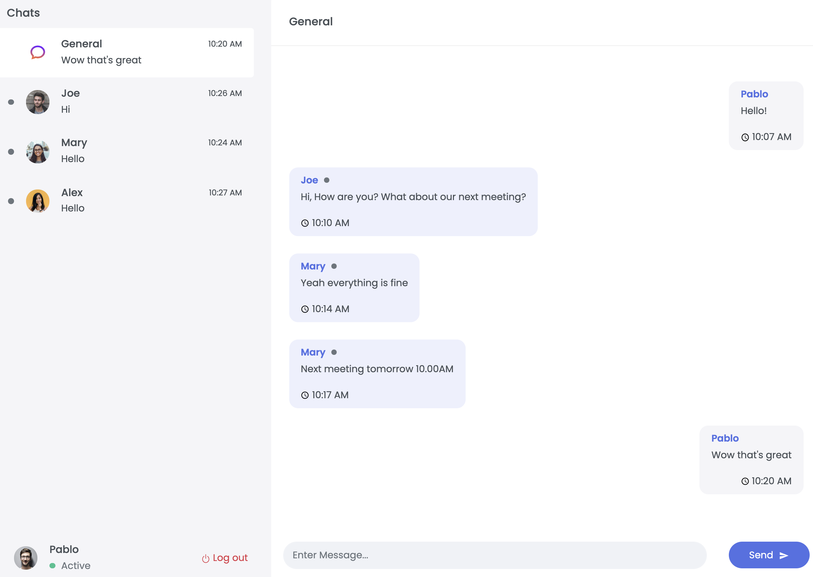

import Tabs from '@theme/Tabs';
import TabItem from '@theme/TabItem';
import useBaseUrl from '@docusaurus/useBaseUrl';
import RedisCard from '@site/src/theme/RedisCard';


Real-time chat app is an online communication channel that allows you to conduct real-time conversations. More and more developers are tapping into the power of Redis as it is extremely fast & due to its support for variety of rich data structure such as Lists, Sets, Sorted Sets, Hashes etc. Redis comes along with a Pub/Sub messaging feature functionality that allows developers to scale the backend by spawning multiple server instances.
Please note that this code is open source. You can find the link at the end of this tutorial.


<div class="text--center">
<iframe width="760" height="415" src="https://www.youtube.com/embed/miK7xDkDXF0" title="YouTube video player" frameborder="0" allow="accelerometer; autoplay; clipboard-write; encrypted-media; gyroscope; picture-in-picture" allowfullscreen></iframe>
</div>


In this tutorial, we will see how to develop real time messaging apps with Flask, Socket.IO and Redis. This example uses Redis Pub/sub feature  combined with websockets for implementing the real time chat app communication between client and server.


Please note that this code is open source and implements the basic features of a live chat app. You can find the link at the end of this tutorial.


### Step 1. Prerequisites

In order to perform this instant messaging app development, you will need the following software:

- Python 3.6+

### Step 2. Clone the repository 

First of all, we will clone the project that implements basic chat functionality.


```
git clone https://github.com/redis-developer/basic-redis-chat-app-demo-python
```


### Step 3. Installing the requred packages

```
cd client
yarn install
```

### Step 4. Starting the frontend

To run the frontend of the chat app, run the following command:

```
yarn start
```

```
You can now access a chat window in the browser.

  Local:            http://localhost:3000
  On Your Network:  http://192.168.1.9:3000
```


### Step 4. Installing the required Python modules


```
cd ..
pip3 install -r requirements.txt
```

### Step 5: Running the Backend

To start the fully chat app, run the following commands:


```
python3 -m venv venv/
source venv/bin/activate
python3 app.py
```

```
python3 app.py                  
 * Restarting with stat
 * Debugger is active!
 * Debugger PIN: 220-696-610
(8122) wsgi starting up on http://127.0.0.1:5000
```



### How it works?

This instant messaging app server works as a basic REST API which involves keeping the session and handling the user state in the chat room (besides the WebSocket/real-time part). When the server starts, the initialization step occurs. At first, a new Redis connection is established and it's checked whether it's needed to load the demo data.


#### Initialization

For simplicity, a key with total_users value is checked: if it does not exist, we fill the Redis database with initial data. EXISTS total_users (checks if the key exists)
The demo data initialization is handled in multiple steps:

#### Creating of demo users

We create a new user id: INCR total_users. Then we set a user ID lookup key by user name: e.g. 

```
SET username:nick user:1
```

And finally, the rest of the data is written to the hash set: 

Example:

 ```bash
   HSET user:1 username "nick" password "bcrypt_hashed_password".
 ```

Additionally, each user is added to the default "General" room. 
For handling chat rooms for each user, we have a set that holds the chat room ids. Here's an example command of how to add the room: 

 ```bash
  SADD user:1:rooms "0"
 ```

Populate private messages between users. At first, private rooms are created: if a private room needs to be established, for each user a room id: room:1:2 is generated, where numbers correspond to the user ids in ascending order.

E.g. Create a private room between 2 users: 
 
 ```bash
  SADD user:1:rooms 1:2 and SADD user:2:rooms 1:2
 ```

Then we add messages to this room by writing to a sorted set: 

 ```bash
  ZADD room:1:2 1615480369 "{'from': 1, 'date': 1615480369, 'message': 'Hello', 'roomId': '1:2'}"
 ```
We use a stringified JSON for keeping the message structure and simplify the implementation details for this demo-app.

Populate the "General" room with messages. Messages are added to the sorted set with id of the "General" room: room:0

#### Pub/sub

After initialization, a pub/sub subscription is created: SUBSCRIBE MESSAGES. At the same time, each server instance will run a listener on a message on this channel to receive real-time updates.

Again, for simplicity, each message is serialized to JSON, which we parse and then handle in the same manner, as WebSocket messages.

Pub/sub allows connecting multiple servers written in different platforms without taking into consideration the implementation detail of each server.

#### Real-time chat and session handling

When a WebSocket/real-time server is instantiated, which listens for the next events:

- Connection. A new user is connected. At this point, a user ID is captured and saved to the session (which is cached in Redis). Note, that session caching is language/library-specific and it's used here purely for persistence and maintaining the state between server reloads.

A global set with online_users key is used for keeping the online state for each user. So on a new connection, a user ID is written to that set:

 ```bash
  SADD online_users 1
 ```

Here we  have added user with id 1 to the set online_users

After that, a message is broadcasted to the clients to notify them that a new user is joined the chat.

- Disconnect. It works similarly to the connection event, except we need to remove the user for online_users set and notify the clients: SREM online_users 1 (makes user with id 1 offline).

- Message. A user sends a message, and it needs to be broadcasted to the other clients. The pub/sub allows us also to broadcast this message to all server instances which are connected to this Redis:

 ```
  PUBLISH message "{'serverId': 4132, 'type':'message', 'data': {'from': 1, 'date': 1615480369, 'message': 'Hello', 'roomId': '1:2'}}"
 ```

Note we send additional data related to the type of the message and the server id. Server id is used to discard the messages by the server instance which sends them since it is connected to the same MESSAGES channel.

The type field of the serialized JSON corresponds to the real-time method we use for real-time communication (connect/disconnect/message).

The data is method-specific information. In the example above it's related to the new message.

### How the data is stored?

Redis is used mainly as a database to keep the user/messages data and for sending messages between connected servers.

The real-time functionality is handled by Socket.IO for server-client messaging. Additionally each server instance subscribes to the MESSAGES channel of pub/sub and dispatches messages once they arrive. Note that, the server transports pub/sub messages with a separate event stream (handled by Server Sent Events), this is due to the need of running pub/sub message loop apart from socket.io signals.

The chat data is stored in various keys and various data types.
User data is stored in a hash set where each user entry contains the next values:
- username: unique user name;
- password: hashed password

- Additionally a set of chat rooms is associated with user
- Rooms are sorted sets which contains messages where score is the timestamp for each message
- Each chat room has a name associated with it
- Online set is global for all users is used for keeping track on which user is online.
- User hash set is accessed by key user:{userId}. The data for it stored with HSET key field data. User id is calculated by incrementing the total_users key (INCR total_users)

- Usernames are stored as separate keys (`username:{username}`) which returns the userId for quicker access and stored with `SET username:{username} {userId}`.

- Rooms which a user belongs to are stored at `user:{userId}:rooms` as a set of chat room ids. A room is added by `SADD user:{userId}:rooms {roomId}` command.

- Messages are stored at `room:{roomId}` key in a sorted set (as mentioned above). They are added with the `ZADD room:{roomId} {timestamp} {message}` command. Messages are serialized to an app-specific JSON string.

### How the data is accessed?

Get User HGETALL user:{id}. 

 ```bash
  HGETALL user:2
 ```

where we get data for the user with id: 2.

- Online users: SMEMBERS online_users. This will return ids of users which are online

- Get room ids of a user: SMEMBERS user:{id}:rooms. 
Example: 

 ```
  SMEMBERS user:2:rooms
 ```

This will return IDs of chat rooms for user with ID: 2

- Get list of messages `ZREVRANGE room:{roomId} {offset_start} {offset_end}`. 
Example: 

 ```
  ZREVRANGE room:1:2 0 50
 ```
It will return 50 messages with 0 offsets for the private room between users with IDs 1 and 2.


## Related Posts

- [Building a Chat application demo in .Net](https://github.com/redis-developer/basic-redis-chat-app-demo-dotnet)
- [Building a Chat application demo in Java](https://github.com/redis-developer/basic-redis-chat-app-demo-java)
- [Building a Chat application demo in NodeJS](https://github.com/redis-developer/basic-redis-chat-app-demo-nodejs)
- [Building a Chat application demo in Go](https://github.com/redis-developer/basic-redis-chat-demo-go)
- [Building a Chat application demo in Ruby](https://github.com/redis-developer/basic-redis-chat-demo-ruby)
 


