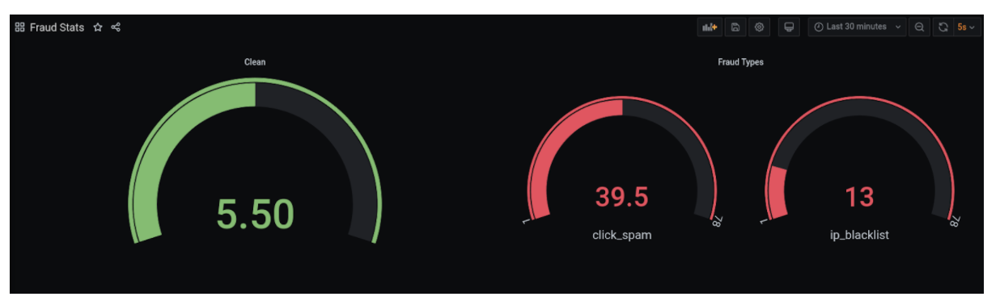
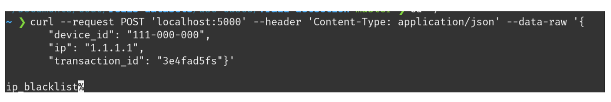
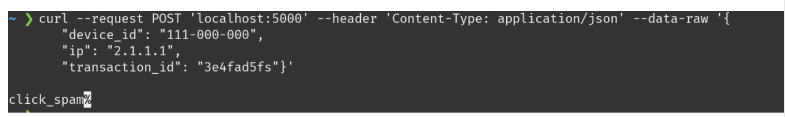
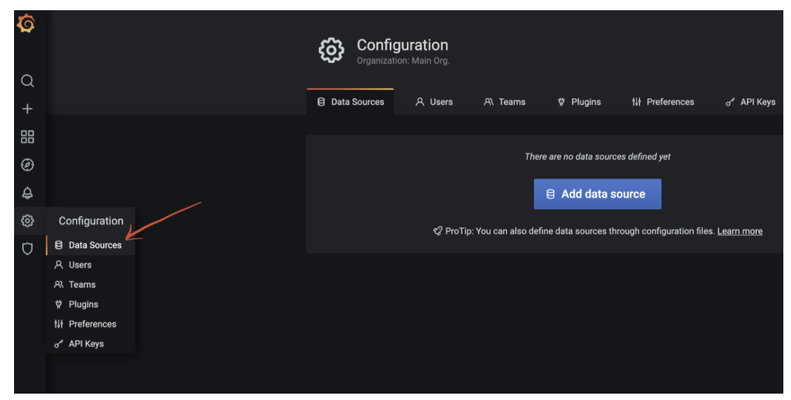
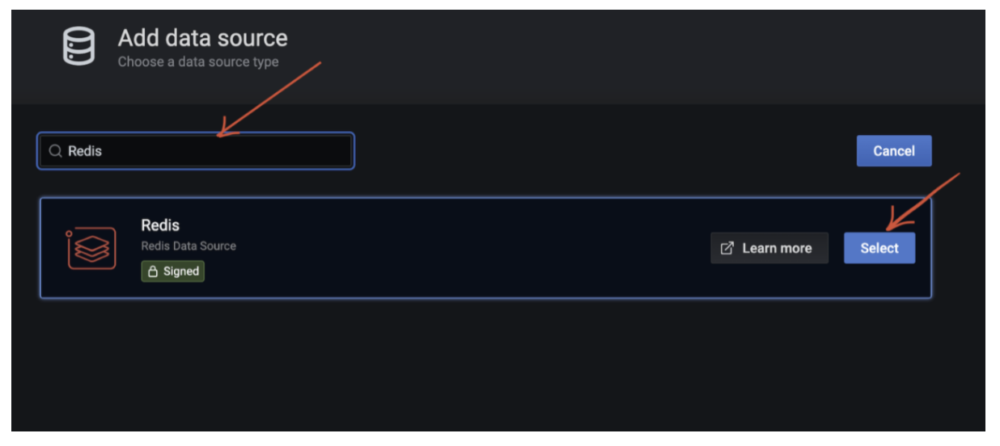
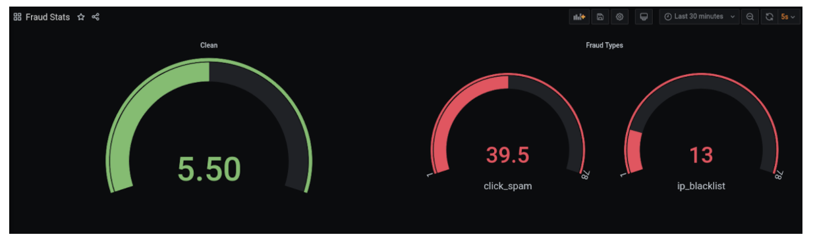
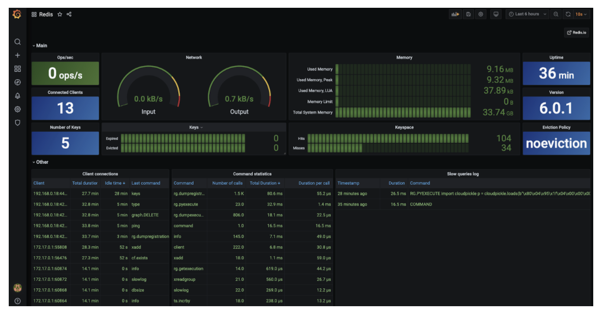

Authors: [Sachin Kottarathodi](https://www.linkedin.com/in/ksachin1), [Ajeet Singh Raina](https://www.linkedin.com/in/ajeetsraina/)

Imagine that your ads are generating a lot of traffic, but you are not seeing the desired results from your ad spend. This might not be a coincidence—fraudsters often try to steal digital ad marketing budgets through various sophisticated mechanisms. Faking clicks can make it appear as though a real user was engaging with the ad, but in reality when these fake clicks drive installs, the cost of the install goes to the fraudster’s pocket. As companies’ willingness to spend more on digital advertisements grows, the number of fraudsters in ad markets also increases.



This blog post will demonstrate a simplified use case of how real-time fraud detection works—so that you can understand how to stay ahead of the fraudsters.

Here’s what we have used:

- Python-based fraud detector module which performs two kinds of fraud checks : IP blacklisting & click spamming
- IP blacklisting uses Redis Cuckoo Filter from the RedisBloom package.
- Click spamming uses Redis Sorted Set.
- The data is then pushed to RediStream which is consumed by RedisGears for processing
- RedisTimeSeries gets updated and Redis Data Source for Grafana displays the dashboard


### Step #1: Installing Docker

You can follow https://docs.docker.com/get-docker/ to get Docker installed on your local system.

### Step #2: Get Ready to Redis

You will need a Redis server up and running on your local machine. You can use the below CLI to bring up Redis server with RedisGears.

```bash
 $ docker run -d -p 6379:6379 redislabs/redismod
```

The command will pull the image from redis docker repo and start the Redis server with all the required modules and the logs ends like this.

### Step #3: Cloning the Repository

```bash
 $ git clone https://github.com/redis-developer/redis-datasets.git
```

### Step #4: Building and Running the Docker Container

Change directory to fraud-detection

```bash
 $ cd redis-datasets/use-cases/fraud-detection
```

The code is present in use-cases/fraud-detection. The app is dockerized with necessary packages (including client packages for redis modules).

Create the image using the command:

```bash
 $ docker build -t redis-fraud:latest .
```

Create the container using the command:

```bash
 $ docker run -e REDIS_HOST='<host>' -e REDIS_PORT=6379 -p 5000:5000 -d redis-fraud
```

You will get the container Id, which can be used to tail application logs.

```
 $ docker logs -f <container-id>
```

If you are using a redismod image to run Redis locally, please provide the IP of the host machine (and not localhost or 127.0.0.1).

### Step #5: Verifying the Application

Let's take a look at how connections are managed in this project.

```python
 import os
 import redis
 from redisbloom.client import Client
 from singleton_decorator import singleton


 @singleton
 class RedisConn:
 	def __init__(self):
    	host = os.getenv("REDIS_HOST")
   	port = os.getenv("REDIS_PORT")

   	if not host or not port:
       	raise Exception("No Redis Host or Port provided. Please provide Host and Port in docker run command as env")

   	port = int(port)
   	self.redis_client = redis.Redis(host=host, port=port)
   	self.bloom_client = Client(host=host, port=port)

	def redis(self):
   		return self.redis_client

	def bloom(self):
   		return self.bloom_client
```

In line 2, we import the redis package for package. All the core Redis commands are available in this Redis package.

In line 4, we import the redisbloom package. Since RedisBloom is a module, the clients used to interact with this module are also different. We will see more such examples below.
The singleton_decorator ensures only one instance of this connection class is created, and os package is used to read the environment variables to form the connection.

Now let’s take a look at how we use Redis to solve click spamming and IP fraud.

Gist: https://gist.github.com/Sachin-Kottarathodi/c3a0647d3fdd0fe8a76425e0594e11c5

```python
 def ip_fraud(self, data):
  	 exists = RedisConn().bloom().cfExists(Constants.IP_CUCKOO_FILTER_NAME, data['ip'])
  	 if exists:
  		 data['fraud_type'] = Constants.IP_BLACKLIST
  		 data['status'] = Constants.FRAUD

  	 return exists

 def click_spam(self, data):
	is_click_spammed = False
	count = RedisConn().redis().zcount(data.get('device_id'), data['ts'] - self.click_spam_window_in_sec, data['ts'])
	if count >= self.click_spam_threshold:
		 is_click_spammed = True
		 data['fraud_type'] = Constants.CLICK_SPAM
		 data['status'] = Constants.FRAUD
	return is_click_spammed

 def publish(self, data):
	RedisConn().redis().xadd(Constants.STREAM_NAME, data, id='*')
```

In the above code, Cuckoo Filter is used to find blacklisted IP fraud. Cuckoo Filter is a probabilistic data structure that’s part of the module, RedisBloom. Checking for existence of IP in Cuckoo Filter is done using the cfExists method provided by bloom client. Please note that Cuckoo Filter can return false positives. To configure the error rate, cf.reserve command can be used to create the filter and custom bucket size can be provided.

To identify click spam, we use the zcount method of sorted sets provided in redis package.
Using zcount, we find the number of clicks from a device in a certain pre configured window. If the count received is greater than a certain threshold, we identify it as anomalous.

Finally, data is pushed to Redistream using the xadd command. id=’\*’ indicates Redistream to generate a unique id for our message.

#### Registering Gears:

When the app appears, a gear is registered, which reacts to the stream that we use to push data.

Gist:https://gist.github.com/Sachin-Kottarathodi/f9dac7a3342a3643e792e2143a6adf7d

```
 from gearsclient import GearsRemoteBuilder as GearsBuilder
 from redistimeseries.client import Client

 def stream_handler(item):
  data = item['value']
  member = json.dumps(
 	{'device_id': data['device_id'],
  	'transaction_id': data['transaction_id'],
  	'ts': data['ts'],
  	})
  redis.Redis().zadd(data.get('device_id'), {member: data['ts']})
  Client().incrby(data['fraud_type'], 1)

  GearsBuilder(reader='StreamReader', r=redis_conn, requirements=["redis", "redistimeseries"]).foreach(stream_handler).register('data_stream')
```

As mentioned before, since RedisGears and RedisTimeSeries are modules, we need to use the clients provided in their respective packages.

We use the GearsRemoteBuilder class to build the Gear. StreamReader ensures that the stream_handler function is executed for every new message from the stream. The stream_handler adds the data to the sorted set using zadd (This information is used in zcount to identify click_spam) and increments the count of time series for clean and fraud types using incrby of the RedisTimeSeries module, which is later used for visualization.


Gear registration can be checked on RedisInsight as well.

Finally, we incorporate the flask app which exposes the end point for trigger.

Gist: https://gist.github.com/Sachin-Kottarathodi/2a6cccb29b4a9fdc7d58086af07aa6eb

```python
 from flask import Flask, request
 from fraud_checks import FraudChecks
 from setup import Setup
 app = Flask(__name__)


 @app.route('/', methods=['POST'])
 def check_fraud():
	try:
   	response = FraudChecks().check_fraud(request.get_json())
   	code = 200
	except Exception as e:
   	print("Error occurred ", e)
   	response = str(e)
   	code = 500

	return response, code


 if __name__ == '__main__':
	Setup().init()
	app.run(port=5000, debug=False, host='0.0.0.0')
```

Here, the app is exposed on port 5000. Before starting the server, our init method of setup is called to register the gear.The endpoint calls the function that does the fraud checks and returns the response.

The application is written in python and exposes an endpoint which accepts a few parameters. Use the below command to invoke the application:

```bash
 $ curl --request POST 'localhost:5000' --header 'Content-Type: application/json' --data-raw '{
      "device_id": "111-000-000",
      "ip": "1.1.1.1",
      "transaction_id": "3e4fad5fs"}'
 clean
```

Since initially no data is available in Cuckoo Filter, all IPs will be allowed through.
To add data to Cuckoo Filter, connect to Redis using cli and run the command

```bash
 cf.addnx ip_cf 1.1.1.1
```

Run the post command with this IP again. This time, the result will be ip_blacklist.



### Click Spamming:

The app is configured to allow two events in a window of 10 seconds from the same device. To verify, make more than two curl requests within 10 seconds and the result will be `click_spam`.



Optional: The following variables can be configured during the ‘docker run’ command.
-e CLICK_SPAM_THRESHOLD=3 -e CLICK_SPAM_WINDOW_IN_SEC=10

### Step #6: Deploy Grafana

It’s exciting to see the fraud detection plotted in Grafana. To implement this, run the command below:

```bash
 $ docker run -d -e "GF_INSTALL_PLUGINS=redis-app" -p 3000:3000 grafana/grafana
```

Point your browser to https://<IP_ADDRESS>:3000.


Login as ‘admin’ with password as ‘admin’, you can reset the password after your first login.



Click on the gear icon on the left panel (Configuration) and choose Data Sources.


Choose ‘Add data source’.



Search for Redis and choose Redis Data Source.


Copy and paste the raw json content from [here](https://github.com/redis-developer/redis-datasets/blob/master/use-cases/fraud-detection/Fraud-Stats-Grafana.json) in the ‘Import via panel json’ box. Click on Load.


This creates a dashboard ‘Fraud Stats’. If you get an error while importing the dashboard, try changing the name and UUID of the dashboard.





### Conclusion & future work

- If we consider the entire flow starting from fraud check, from event streaming to data processing to visualization (using insights), all of this would have required multiple components and extensive orchestration. With Redis Ecosystem, most of this is removed.
- This is just the beginning of more checks that can be done on events. A lot of other checks can be done using modules and data structures. For example; Redis provides geospatial data structures built over sorted sets. Since latitude and longitude can be derived from IP using IP to location conversion providers, a lot of insight can be derived on whether the event can be fraudulent or not.
- To reject servicing requests altogether, the redis-cell module to rate limit requests against a key can be used.
- RedisAI and neural-redis can be used to improve efficiency of identifying fraud based.

### References and Links

- [Source Code](https://github.com/redis-developer/redis-datasets/tree/master/use-cases/fraud-detection)
- [Build modern fraud-detection platforms with Redis Enterprise](https://redis.com/solutions/use-cases/fraud-detection/)
- [Redis Enterprise to Power Modern Fraud-Detection Platforms](https://lp.redis.com/rs/915-NFD-128/images/RedisLabs-Solution-Fraud-Detection.pdf)
- [LifeLock Counts on Redis Enterprise for Fraud Mitigation](https://redis.com/docs/lifelock-counts-redis-enterprise-fraud-mitigation/)
