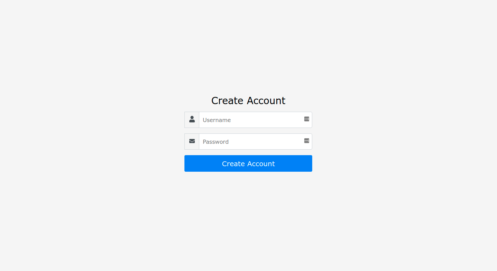
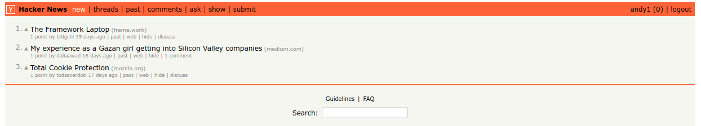
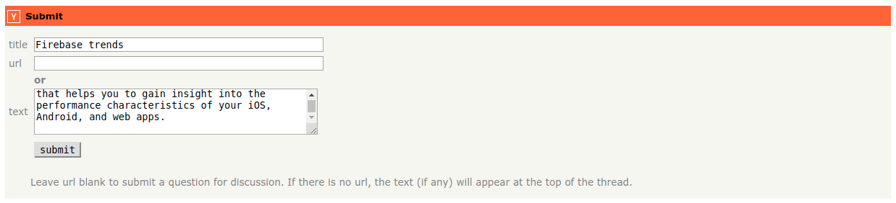

import Authors from '@theme/Authors';

<Authors frontMatter={frontMatter} />

Hacker News (sometimes abbreviated as HN) is a social news website focusing on computer science and entrepreneurship.
It developed as a project of Graham's company Y Combinator, functioning as a real-world application of the Arc . programming language which Graham co-developed.

This is a HackerNews clone built upon React, NextJS as a frontend and NodeJS, ExpressJS & Redis as a backend.
This application uses JSON for storing the data and Search in Redis Stack for searching.


### Step 1. Install the prerequisites

#### Install the below packages

- NPM v7.8.0
- NODE v15.10.0

### Step 2. Create Redis Enterprise Cloud database

Redis is an open source, in-memory, key-value data store most commonly used as a primary database, cache, message broker, and queue. Redis is popular among the developers as it delivers sub-millisecond response times, enabling fast and powerful real-time applications in industries such as gaming, fintech, ad-tech, social media, healthcare, and IoT.

Redis Cloud is a fully-managed cloud service for hosting and running your Redis dataset in a highly-available and scalable manner, with predictable and stable top performance. Redis Enterprise cloud allows you to run Redis server over the Cloud and access instance via multiple ways like RedisInsight, Redis command line as well as client tools. You can quickly and easily get your apps up and running with Redis Cloud through its Redis Heroku addons , just tell us how much memory you need and get started instantly with your first Redis database. You can then add more Redis databases (each running in a dedicated process, in a non-blocking manner) and increase or decrease the memory size of your plan without affecting your existing data.

[Follow this link](../create/rediscloud) to create a Redis Enterprise Cloud account with 2 databases with Redis Stack.

Save the database endpoint URL and password for our future reference

### Step 3. Clone the repository

```bash
 git clone https://github.com/redis-developer/redis-hacker-news-demo
 cd redis-hacker-news-demo
```

### Step 4. Setting up environment variables

Copy .env.sample to .env and provide the values as shown below:

```bash
 MAILGUN_API_KEY=YOUR_VALUE_HERE
 SEARCH_REDIS_SERVER_URL=redis://redis-XXXXX.c10.us-east-1-2.ec2.cloud.redislabs.com:10292
 SEARCH_REDIS_PASSWORD=ABCDXYZbPXHWsC
 JSON_REDIS_SERVER_URL=redis://redis-XXXXX.c14.us-east-1-2.ec2.cloud.redislabs.com:14054
 JSON_REDIS_PASSWORD=ABCDXYZA3tzw2XYMPi2P8UPm19D
 LOG_LEVEL=1
 USE_REDIS=1
 REDIS_REINDEX=
 PRODUCTION_WEBSITE_URL=i
```

### Step 5. Run the developer environment

```bash
 npm install
 npm run dev
```

### Step 6. Pull Hacker News API to seed database

Using [API](https://github.com/HackerNews/API), it pulls the latest hackernews data.
Next, you need to seed top stories from hacker news. First create a moderator with moderator:password123

```bash
 node ./backend/scripts/seed.js
```

### Step 7. Access the HackerNews URL

Open https://localhost:3001 and you should be able to access the HackerNews login screen as shown below:



### How it works

#### By Screens

#### Signup


- Make sure user(where username is andy1) does not exist.

```bash
 FT.SEARCH idx:user @username:"andy1" NOCONTENT LIMIT 0 1 SORTBY _id DESC
```

- Get and increase the next id in users collection.

```bash
 GET user:id-indicator // 63
 INCR user:id-indicator  // 64 will be next user id, 63 is current user id
```

- Create user:63 hash and json.(json also collects authToken and password hash etc)

```bash
  HSET user:63 username andy1 email  created 1615569194 karma 0 about  showDead false isModerator false shadowBanned false banned false _id 63
```

```bash
  JSON.SET user:63 .
```

```bash
 '{"username":"andy1","password":"$2a$10$zy8tsCske8MfmDX5CcWMce5S1U7PJbPI7CfaqQ7Bo1PORDeqJxqhe","authToken":"AAV07FIwTiEkNrPj0x1yj6BPJQSGIPzV0sICw2u0","  authTokenExpiration":1647105194,"email":"","created":1615569194,"karma":0,"showDead":false,"isModerator":false,"shadowBanned":false,"banned":false,"_id":63}'
```

#### Login


- Find user

```bash
 FT.SEARCH idx:user  @username:"andy1" NOCONTENT LIMIT 0 1 SORTBY _id DESC
```

- Make sure password is correct

```bash
 JSON.MGET user:63 .
```

- Compare password and new password hash and create cookie if it's successful

#### Item list page



- Check if user has toggled hidden attribute on a specific item.

```bash
 FT.SEARCH idx:user-hidden  @username:"andy1" NOCONTENT LIMIT 0 10000 SORTBY _id DESC
 // Result - [0, "item:4"]
```

- If that is not null

```bash
 FT.SEARCH idx:item  (-(@id:"item:4")) (@dead:"false") NOCONTENT LIMIT 0 30 SORTBY _id ASC
```

- If it's empty array

```bash
 FT.SEARCH idx:item (@dead:"false") NOCONTENT LIMIT 0 30 SORTBY _id ASC
 // Result - [3,"item:1","item:2","item:3"]
```

- Get all items from Redis using `JSON.MGET`

```bash
 JSON.MGET item:1 item:2 item:3 .
 // Result - [{"id":"bkWCjcyJu5WT","by":"todsacerdoti","title":"Total Cookie
 Protection","type":"news","url":"https://blog.mozilla.org/security/2021/02/23/total-cookie-
 protection/","domain":"mozilla.org","points":1,"score":1514,"commentCount":0,"created":1614089461,"dead":false,"_id":3}]]
```

- Get items posted within last 1 week

```bash
 FT.SEARCH idx:item  (@created:[(1615652598 +inf]) (@dead:"false") NOCONTENT LIMIT 0 0 SORTBY _id DESC
 // Result - [13,"item:19","item:17","item:16","item:15","item:14","item:13","item:12","item:11","item:8","item:5","item:4","item:3","item:1"]
```

:::note

In this case, 1615652598 is a timestamp of 1 week ealier than current timestamp

:::

```bash
 JSON.MGET item:19 item:17 item:16 item:15 item:14 item:13 item:12 item:11 item:8 item:5 item:4 item:3 item:1 .
 // Result - the JSON of selected items
```

#### Item Detail


- Get the item object first

```bash
 JSON.MGET item:1 .
```

- Find item:1 's root comments

```bash
 FT.SEARCH idx:comment  (@parentItemId:"kDiN0RhTivmJ") (@isParent:"true") (@dead:"false") NOCONTENT LIMIT 0 30 SORTBY points ASC
 // Result - [3,"comment:1","comment:2","comment:12"]
```

- Get those comments

```bash
 JSON.MGET comment:1 comment:2 comment:12 .
 // one comment example result - {"id":"jnGWS8TTOecC","by":"ploxiln","parentItemId":"kDiN0RhTivmJ","parentItemTitle":"The Framework
 Laptop","isParent":true,"parentCommentId":"","children":[13,17,20],"text":"I don&#x27;t see any mention of the firmware and drivers efforts for this.
 Firmware and drivers always end up more difficult to deal with than expected.<p>The Fairphone company was surprised by difficulties upgrading and
 patching android without support from their BSP vendor, causing many months delays of updates _and_ years shorter support life than they were
 planning for their earlier models.<p>I purchased the Purism Librem 13 laptop from their kickstarter, and they had great plans for firmware and
 drivers, but also great difficulty following through. The trackpad chosen for the first models took much longer than expected to get upstream linux
 support, and it was never great (it turned out to be impossible to reliably detect their variant automatically). They finally hired someone with
 sufficient skill to do the coreboot port _months_ after initial units were delivered, and delivered polished coreboot firmware for their initial
 laptops _years_ after they started the kickstarter.<p>So, why should we have confidence in the firmware and drivers that Framework will deliver
 :)","points":1,"created":1614274058,"dead":false,"_id":12}
```

- Using children of each comment, fetch children comments

```bash
 FT.SEARCH idx:comment  (@dead:"false") (@_id:("3"|"7"|"11")) NOCONTENT LIMIT 0 10000 SORTBY _id DESC
```

- Iterate this over until all comments are resolved

#### Submit



- Get next item's id and increase it

```bash
 GET item:id-indicator
 // Result - 4
 SET item:id-indicator 5
```

- Create hash and index

```bash
 HSET item:4 id iBi8sU4HRcZ2 by andy1 title Firebase trends type ask url  domain  text Firebase Performance Monitoring is a service that helps you to
 gain insight into the performance characteristics of your iOS, Android, and web apps. points 1 score 0 created 1615571392 dead false _id 4
```

```bash
 JSON.SET item:4 . '{"id":"iBi8sU4HRcZ2","by":"andy1","title":"Firebase trends","type":"ask","url":"","domain":"","text":"Firebase Performance
 Monitoring is a service that helps you to gain insight into the performance characteristics of your iOS, Android, and web
 apps.","points":1,"score":0,"commentCount":0,"created":1615571392,"dead":false,"_id":4}'
```

#### Update Profile


- Get the user

```bash
 FT.SEARCH idx:user  (@username:"andy1") NOCONTENT LIMIT 0 1 SORTBY _id DESC
```

```bash
 JSON.MGET user:63 .
```

- Update new user

```bash
 HSET user:63 username andy1 email  created 1615569194 karma 1 about I am a software engineer. showDead false isModerator false shadowBanned false
 banned false _id 63
```

```bash
 JSON.SET user:63 .
'{"username":"andy1","password":"$2a$10$zy8tsCske8MfmDX5CcWMce5S1U7PJbPI7CfaqQ7Bo1PORDeqJxqhe","authToken":"KJwPLN1idyQrMp5qEY5hR3VhoPFTKRcC8Npxxoju","   authTokenExpiration":1647106257,"email":"","created":1615569194,"karma":1,"about":"I am a software
 engineer.","showDead":false,"isModerator":false,"shadowBanned":false,"banned":false,"_id":63}'
```

#### Moderation Logs screen


- Find all moderation logs

```bash
 FT.SEARCH idx:moderation-log * NOCONTENT LIMIT 0 0 SORTBY _id DESC
  // Result - [1,"moderation-log:1"]
```

- Get that moderation logs

```bash
 JSON.MGET moderation-log:1 .
```

#### Search


- Get items that contains "fa"

```bash
 FT.SEARCH idx:item  (@title:fa*) (-(@id:"aaaaaaaaa")) (@dead:"false") NOCONTENT LIMIT 0 30 SORTBY score ASC
  // Result - [2,"item:18","item:16"]
```

- Get those items via json

```bash
 JSON.MGET item:18 item:16 .
```

## Example commands

#### There are 2 type of fields, indexed and non-indexed.

1. Indexed fields will be stored in hash using HSET/HGET.
2. Non-indexed fields will be stored in JSON.

- Create an index

When schema is created, it should created index.

```bash
 FT.CREATE idx:user ON hash PREFIX 1 "user:" SCHEMA username TEXT SORTABLE email TEXT SORTABLE karma NUMERIC SORTABLE
```

- Drop search index

Should drop/update index if the schema has changed

```bash
 FT.DROPINDEX idx:user
```

- Get search info

Validate if the fields are indexed properly. If not, it will update the index fields or drop/recreate.

```bash
 FT.INFO idx:user
```

- Create a new user

It will require new hash and new JSON record

```bash
 HSET user:andy username "andy" email "andy@gmail.com" karma 0
```

```bash
 JSON.SET user:andy '{"passoword": "hashed_password", "settings": "{ \"showDead\": true }" }'
```

- Update a user

```bash
 HSET user:1 username "newusername"
```

```bash
 JSON.SET user:andy username "newusername"
```

- Find user with username 'andy'

1. Find the user's hash first

```
 FT.SEARCH idx:user '@username:{andy}'
```

2. Fetch the JSON object to get the related JSON object

```
 JSON.GET user:andy
```

- Find user whose id is andy1 or andy2

```bash
 FT.SEARCH idx:user '@id:("andy1"|"andy2")'
```

- Find user whose id is not andy1 or andy2

```bash
 FT.SEARCH idx:user '(-(@id:("andy1"|"andy2")))'
```

- Find user whose id is andy1 or username is andy

```bash
 FT.SEARCH idx:user '(@id:"andy1") | (@username:"andy")'
```

- Find user whose id is andy1 and username is andy

```bash
 FT.SEARCH idx:user '(@id:"andy1") (@username:"andy")'
```

- Find first 10 users order by username

```bash
 FT.SEARCH idx:user '*' LIMIT 0 10 SORTBY username ASC
```

- Find next 10 users

```bash
 FT.SEARCH idx:user '*' LIMIT 10 20 SORTBY username ASC
```

- Get from JSON from multiple keys

```bash
 JSON.MGET idx:user "andy1" "andy2" "andy3"
```

### References

- [JSON and Python](/howtos/redisjson/using-python)
- [How to store and retrieve nested JSON document](/howtos/redisjson/storing-complex-json-document)
- [Importing JSON data into Redis using NodeJS](/howtos/redisjson/using-nodejs)
- Learn more about [JSON in Redis](https://oss.redis.com/redisjson/) in the Quickstart tutorial.
- [How to build shopping cart app using NodeJS and JSON in Redis](/howtos/shoppingcart)
- [Indexing, Querying, and Full-Text Search of JSON Documents with Redis](https://redis.com/blog/index-and-query-json-docs-with-redis/)
