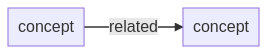
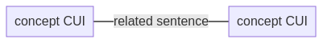
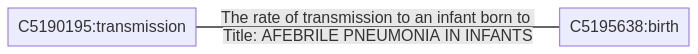
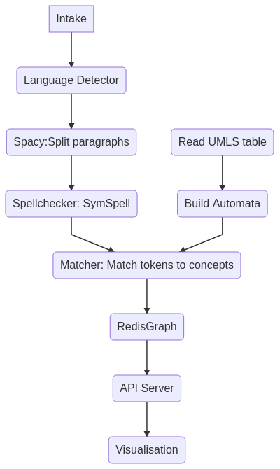

import Authors from '@theme/Authors';

<Authors frontMatter={frontMatter} />

## Goal

In this tutorial, you will learn how to build a pipeline for Natural Language Processing(NLP) using [RedisGears](https://developer.redis.com/howtos/redisgears). For this demonstration, we will be leveraging the Kaggle CORD19 datasets. The implementation is designed to avoid running out of memory, leveraging Redis Cluster and RedisGears, where the use of RedisGears allows for processing data on storage without the need to move data in and out of the Redis Cluster—using Redis Cluster as data fabric. Redis Cluster allows for horizontal scalability up to 1000 nodes, and together with RedisGears, provides a distributed system where data science/ML engineers can focus on processing steps, without the worry of writing tons of scaffoldings for distributed calculations.


This project was built with the aim to make it easier for other people to contribute and build better information and knowledge management products.

## Why data scientists uses RedisGears?

[RedisGears](https://redis.com/modules/redis-gears/) have enormous potential, particularly for text processing—you can process your data “on data” without needing to move them in and out of memory. Summary of the important points:

- In Memory storage (Horizontally scalable if it’s Redis cluster)
- Processing of data (on data) without need to move in and out
- Gears - like Spark on Hadoop, process data intelligently on storage(in-memory) without need to move data in and out
- Redis in cluster mode with RedisGears and python enabled takes 20 MB RAM. Think how much more data you can shuffle into your laptop or server.

## What is a knowledge graph?

Today, we live in the world of new systems that operate not just files, folders, or web pages, but entities with their properties and relationships between them, organized into hierarchies of classes and categories. These systems are used everywhere from the military-industrial complex to our everyday lives. Palantir, Primer, and other data companies enable massive intelligence and counterintelligence projects in military and security forces, Quid and RecordedFuture enable competitive analytics, Bottlenose and similar enterprises enable online reputation analytics. Microsoft Graph enables new kinds of productivity apps for the enterprises, Google Knowledge Graph and Microsoft’s Satori enable everyday search queries, and together with Amazon Information Graph they power corresponding AI assistants by enabling them to answer questions about the world facts

All these (and many other more specialized) systems are used in different domains, but all of them use Knowledge Graphs as their foundation.

Knowledge graphs are one of the best ways to connect and make sense out of information from different data sources, following the motto of one of the vendors— [“It’s about things not strings”](https://www.poolparty.biz/news-events/knowledge-graphs-connecting-dots-increasingly-complex-world/).

Knowledge Graph consists of thesaurus, taxonomy and ontology. In this pipeline I assume knowledge is captured in medical metathesaurus [UMLS](https://www.nlm.nih.gov/research/umls/index.html) and concepts in text are related if they are part of the same sentence, therefore concept become node, their relationship becomes edge:




Concepts have CUI (Concept Unique Identifiers) and those will be primary keys in nodes, linked to UMLS thesaurus. For example, if you search, “How does temperature and humidity affect the transmission of 2019-nCoV?” on the demo website [http://thepattern.digital/](http://thepattern.digital) and move slider to 1996, there is an edge-connecting transmission (C5190195) and birth (C5195639) and the part of sentence matched, “the rate of transmission to an infant born to,” from the report titled, “Afebrile Pneumonia in infants.”



## RedisGears for NLP pre-processing

### Overall Architecture Overview (Components Diagram)



Intake step - is very simple put all JSON records into RedisCluster, then NLP pipeline starts processing all records, code is [here](https://github.com/applied-knowledge-systems/the-pattern-platform/blob/main/RedisIntakeRedisClusterSample.py).

### How does the NLP pipeline steps fit into RedisGears?

1. For each record — detect language (discard non English), it’s [filter](https://oss.redis.com/redisgears/operations.html#filter)

2. Map paragraphs into a sentence — [flatmap](https://oss.redis.com/redisgears/operations.html#flatmap)

3. Sentences spellchecker — it’s [map](https://oss.redis.com/redisgears/operations.html#map)

4. Save sentences into hash — [processor](https://oss.redis.com/redisgears/operations.html#processor)

### Step 1. Pre-requisite

Ensure that you install virtualenv in your system

### Step 2. Clone the repository

```bash
 git clone --recurse-submodules https://github.com/applied-knowledge-systems/the-pattern.git
 cd the-pattern
```

### Step 3. Bring up the application

```bash
 docker-compose -f docker-compose.dev.yml up --build -d
```

### Step 4. Apply cluster configuration settings

You can deploy PyTorch and spacy to run on RedisGears.

```bash
 bash post_start_dev.sh
```

:::tip

For Data science-focused deployment, RedisCluster should be in HA mode with at least one slave for each master.
One need to change a few default parameters for rgcluster to accommodate the size of PyTorch and spacy libraries (each over 1GB zipped), gist with settings.
:::

### Step 5. Create or activate Python virtual environment

```bash
 cd ./the-pattern-platform/
```

### Step 6. Create new environment

You can create it via

```bash
 conda create -n pattern_env python=3.8
```

or

Alternatively, you can activate by using the below CLI:

```bash
 source ~/venv_cord19/bin/activate #or create new venv
 pip install -r requirements.txt
```

### Step 7. Run pipeline

```
 bash cluster_pipeline.sh
```

### Step 8. Validating the functionality of the NLP pipeline

Wait for a bit and then check:

### Verifying Redis Graph populated:

```bash
 redis-cli -p 9001 -h 127.0.0.1 GRAPH.QUERY cord19medical "MATCH (n:entity) RETURN count(n) as entity_count"
 redis-cli -p 9001 -h 127.0.0.1 GRAPH.QUERY cord19medical "MATCH (e:entity)-[r]->(t:entity) RETURN count(r) as edge_count"
```

### Checking API responds:

```bash
 curl -i -H "Content-Type: application/json" -X POST -d '{"search":"How does temperature and humidity affect the transmission of 2019-nCoV"}'
 http://localhost:8080/gsearch
```

## Walkthrough

While RedisGears allows to deploy and run Machine Learning libraries like [spacy](https://github.com/AlexMikhalev/cord19redisknowledgegraph/blob/master/spacy_sentences_geared.py) and [BERT transformers](https://github.com/AlexMikhalev/cord19redisknowledgegraph/blob/master/tokenizer_bert_geared.py), the solution above uses simpler approach:

```python
 gb = GB('KeysReader')
 gb.filter(filter_language)
 gb.flatmap(parse_paragraphs)
 gb.map(spellcheck_sentences)
 gb.foreach(save_sentences)
 gb.count()
 gb.register('paragraphs:*',keyTypes=['string','hash'], mode="async_local")
```

This is the overall pipeline: those 7 lines allow you to run logic in a distributed cluster or on a single machine using all available CPUs - no changes required until you need to scale over more 1000 nodes. I use KeysReader registered for namespace paragraphs for all strings or hashes. My pipeline would need to run in async mode. For data scientists, I would recommend using gb.run to make sure gears function work and it will run in batch mode and then change it to register - to capture new data. By default, functions will return output, hence the need for count() - to prevent fetching the whole dataset back to the command issuing machine (90 GB for Cord19).

Overall pre-processing is a straightforward - [full code](https://github.com/applied-knowledge-systems/the-pattern-platform/blob/main/gears_pipeline_sentence_register.py) is here.

Things to keep in mind:

1. Node process can only save locally - we don't move data, anything you want to save should have hashtag, for example to add to the set of processed_docs:

```python
 execute('SADD','processed_docs_{%s}' % hashtag(),article_id)
```

2. Loading external libraries into the computational threat, for example, symspell requires additional dictionaries and needs two steps to load:

```python
 """
 load symspell and relevant dictionaries
 """
 sym_spell=None

 def load_symspell():
  import pkg_resources
  from symspellpy import SymSpell, Verbosity
  sym_spell = SymSpell(max_dictionary_edit_distance=1, prefix_length=7)
  dictionary_path = pkg_resources.resource_filename(
      "symspellpy", "frequency_dictionary_en_82_765.txt")
  bigram_path = pkg_resources.resource_filename(
      "symspellpy", "frequency_bigramdictionary_en_243_342.txt")
  # term_index is the column of the term and count_index is the
  # column of the term frequency
  sym_spell.load_dictionary(dictionary_path, term_index=0, count_index=1)
  sym_spell.load_bigram_dictionary(bigram_path, term_index=0, count_index=2)
  return sym_spell
```

3. Scispacy is a great library and data science tool, but after a few iterations with deploying it I ended up reading data model documentation for UMLS Methathesaurus and decided to build Aho-Corasick automata directly from UMLS data. (MRXW_ENG.RRF contains all terms form for English mapped to CUI). Aho-Corasick allowed me to match incoming sentences into pairs of nodes (concepts from the medical dictionary) and present sentences as edges in a graph, Gears related code is simple:

```
 bg = GearsBuilder('KeysReader')
 bg.foreach(process_item)
 bg.count()
 bg.register('sentence:*',  mode="async_local",onRegistered=OnRegisteredAutomata)

```

OnRegisteredAutomata will perform similarly to symspell example above except it will download pre-build Aho-Corasick automata (30Mb).
Aho-Corasick is a very fast matcher and allows to perform >900 Mb text per second even on commodity laptop, RedisGears cluster makes a very smooth distribution of data and ML model and matching using available CPU and Memory. Full matcher [code](https://github.com/applied-knowledge-systems/the-pattern-platform/blob/main/sentences_matcher_register.py).

Output of the matcher: nodes and edges are candidates to use another RedisGears pattern rgsync where you can write fast into Redis and RedisGears are going to replicate data into slower storage using RedisStreams.
But I decided to use streams and handcraft the population of the RedisGraph database, which will be focus of the next blog post.

Output of the matcher: nodes and edges are candidates to use another RedisGears pattern [rgsync](https://github.com/RedisGears/rgsync) where you can write fast into Redis and RedisGears are going to replicate data into slower storage using RedisStreams, while this demo uses streams and populates RedisGraph database with nodes and edges calculating rank of each.

## Call to action

We took OCR scans in JSON format and turned them into Knowledge Graph, demonstrating how you can traditional Semantic Network/OWL/Methathesaurus technique based on Unified Medical Language System. Redis Ecosystem offers a lot to the data science community, and can take place at the core of Kaggle notebooks, ML frameworks and make deployment and distribution of data more enjoyable. The success of our industry depends on how our tools work together — regardless of whether they are engineering, data science, machine learning and organisational or architectural.

With the collaboration of RedisLabs and community, the full pipeline code is available via https://github.com/applied-knowledge-systems/the-pattern-platform. In case, you want to try it locally, then you can find a Docker Launch script in the root of the repository along with short quickstart guide. PR and suggestions are welcome. The overall goal of the project is to allow other to build their more interesting pipeline on top of it.

### References

- [Covid19 - Redis Knowledge Graph in 3D](http://thepattern.digital/)
- [COVID-19 Open Research Dataset Challenge (CORD-19)](https://www.kaggle.com/allen-institute-for-ai/CORD-19-research-challenge)
- [Source Code for NLP pipeline based on RedisGears ](https://github.com/applied-knowledge-systems/the-pattern-platform)
