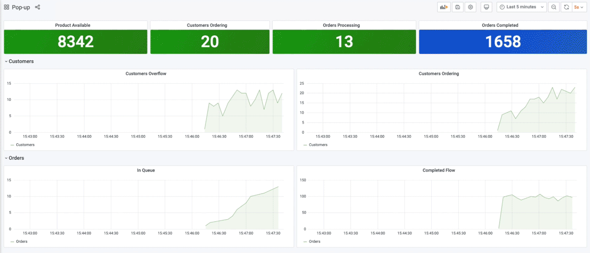
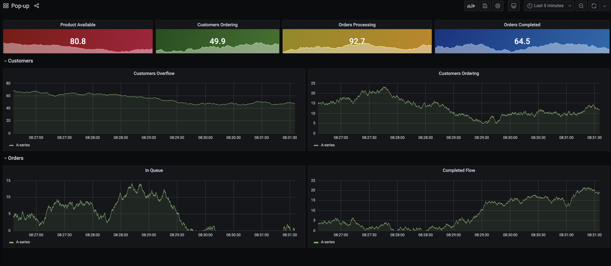
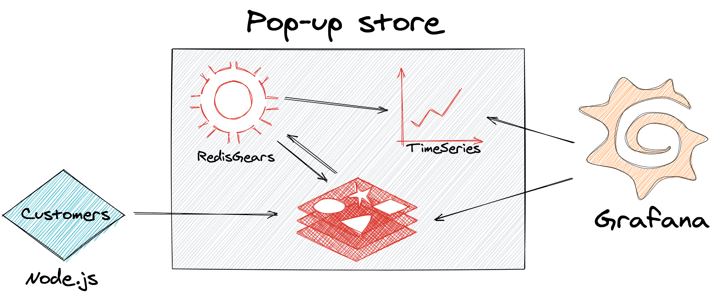

Pop-up stores are becoming a popular channel for retailers to create a new revenue stream, generate buzz with customers, test product concepts, or unload excess inventory. Since the idea is to spin up the store quickly and then close it shortly thereafter, it doesn’t make sense to spend a lot of time on development. With the right Redis modules, you can create a robust customer experience without a lot of development effort.

This pop-up store demo illustrates a company that sells a single product and has 10,000 units available for purchase. Each customer can purchase one unit and the sale lasts only 10 minutes, so order processing must be instantaneous. The demo shows how to visualize data pipeline in real-time using [Redis Streams](https://redis.io/topics/streams-intro), [RedisTimeSeries](https://developer.redislabs.com/howtos/redistimeseries), [RedisGears](https://developer.redislabs.com/howtos/redisgears) and [Redis Datasource with Grafana](https://developer.redislabs.com/explore/redisdatasource).




### Step 1. Cloning the repository

```
git clone https://github.com/redis-developer/redis-pop-up-store/
```


### Step 2. Running the application

```
docker-compose up -d
```

### Step 3. Accessing Grafana dashboard

Open http://IPAddress:3000 to access the grafana dashboard




Grafana query streams and Time-Series keys every 5 seconds to display samples using Grafana Redis Datasource.This Grafana dashboard displays:

- Product Available: the value of product key, which decreases as orders complete
- Customers Ordering, Orders Processing, and Orders Completed: the length of queue:customers, queue:orders, and queue:complete streams
- Customers Overflow: the difference between customer-submitted orders and orders completed
- Customers Ordering: orders created in 5 seconds
- Orders In Queue: orders waiting to be processed
- Completed Flow: orders completed in 5 seconds


## How it works



- Node.js script adds random data to Customers and Orders streams
- RedisGears is using `StreamReader` to watch all `queue:` keys and adding Time-Series samples

```
# Add Time-Series
def tsAdd(x):
   xlen = execute('XLEN', x['key'])
   execute('TS.ADD', 'ts:len:'+x['key'], '*', xlen)
   execute('TS.ADD', 'ts:enqueue:' + x['key'], '*', x['value'])


# Stream Reader for any Queue
gb = GearsBuilder('StreamReader')
gb.countby(lambda x: x['key']).map(tsAdd)
gb.register(prefix='queue:*', duration=5000, batch=10000, trimStream=False)
```

- Another RedisGears script completes orders
  - adding data to `queue:complete` stream
  - deleting client's ordering
  - decreasing product amount
  - trimming Orders queue

```
# Complete order
def complete(x):
    execute('XADD', 'queue:complete', '*', 'order', x['id'],
            'customer', x['value']['customer'])
    execute('XDEL', 'queue:customers', x['value']['customer'])
    execute('DECR', 'product')


# Stream Reader for Orders queue
gb = GearsBuilder('StreamReader')
gb.map(complete)
gb.register(prefix='queue:orders', batch=3, trimStream=True)
```

### Addition Resources

- [Redis Popup Store GitHub Repository](https://github.com/redis-developer/redis-pop-up-store)
- [3 Real-Life Apps Built with Redis Data Source for Grafana](https://redislabs.com/blog/3-real-life-apps-built-with-redis-data-source-for-grafana/)

