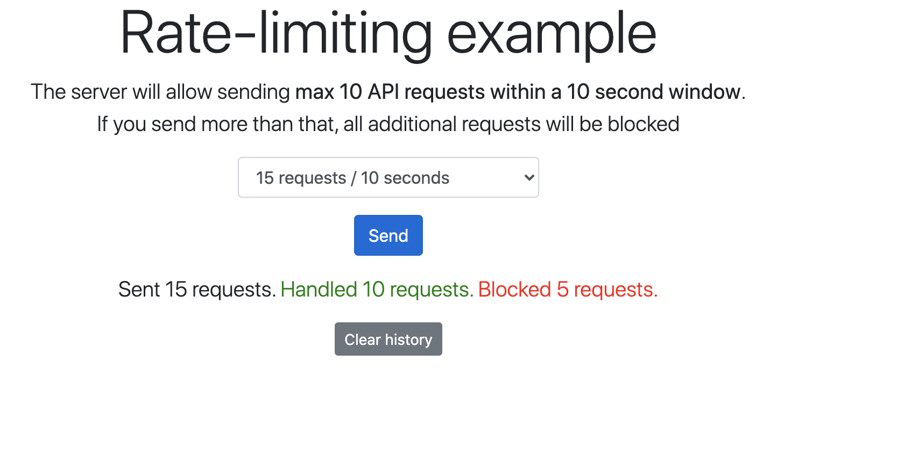

import Tabs from '@theme/Tabs';
import TabItem from '@theme/TabItem';
import Authors from '@site/src/theme/Authors';

<Authors frontMatter={frontMatter} />

Rate limiting is a mechanism that many developers may have to deal with at some point in their life. It’s useful for a variety of purposes like sharing access to limited resources or limiting the number of requests made to an API endpoint and responding with a 429 status code.

<div class="text--center">
  <iframe
    width="760"
    height="415"
    src="https://www.youtube.com/embed/_mFWjk7ONa8"
    title="YouTube video player"
    frameborder="0"
    allow="accelerometer; autoplay; clipboard-write; encrypted-media; gyroscope; picture-in-picture"
    allowfullscreen></iframe>
</div>

In this tutorial, we will see how to implement Rate Limiting using various programming languages:

<Tabs
  defaultValue="Python"
  values={[
    {label: 'Python', value: 'Python'},
    {label: 'NodeJS', value: 'NodeJS'},
    {label: 'Java', value: 'Java'},
    {label: 'Ruby', value: 'Ruby'},
  ]}>
  <TabItem value="Python">

## Using Python

### Step 1. Pre-requisite

- Python
- Docker
- Docker Compose

### Step 2. Clone the repository

```
git clone https://github.com/redis-developer/basic-rate-limiting-demo-python
```

### Step 3. Run docker compose or install redis manually

```sh
docker network create global
docker-compose up -d --build
```

If you install redis manually open django-backend/configuration folder and copy `.env.example` to create `.env`. And provide the values for environment variables - REDIS_HOST: Redis server host - REDIS_PORT: Redis server port - REDIS_DB: Redis server db index - REDIS_PASSWORD: Redis server password

### Step 4. Setup and run

Install python, pip and venv (on mac: https://installpython3.com/mac/)

Use python version: 3.8

```sh
python3 -m venv venv
source ./venv/bin/activate
pip3 install -r requirements.txt
python3 manage.py collectstatic
python3 manage.py runserver
```

Step 5. Accessing the rate limiting app


#### How it works?

#### How the data is stored:

This app will block connections from a client after surpassing certain amount of requests (default: 10) per time (default: 10 sec)
The application will return after each request the following headers. That will let the user know how many requests they have remaining before the run over the limit.
On the 10th run server should return an HTTP status code of 429 Too Many Requests

SETNX is short for "SET if Not eXists". It basically sets key to hold string value if key does not exist. In that case, it is equal to SET.
When key already holds a value, no operation is performed. New responses are added key-ip as shown below:

```
 SETNX your_ip:PING limit_amount
 Example: SETNX 127.0.0.1:PING 10
```

[More information](https://redis.io/commands/setnx)

Set a timeout on key:

```
 EXPIRE your_ip:PING timeout
 Example: EXPIRE 127.0.0.1:PING 1000
```

[More information](https://redis.io/commands/expire)

#### How the data is accessed:

Next responses are get bucket:

```
 GET your_ip:PING
 Example: GET 127.0.0.1:PING
```

[More information](https://redis.io/commands/get)

Next responses are changed bucket:

```
 DECRBY your_ip:PING amount
 Example: DECRBY 127.0.0.1:PING 1
```

[More information](https://redis.io/commands/decrby)

</TabItem>

<TabItem value="NodeJS">

## Using NodeJS

### Step 1. Pre-requisite

- Node - v12.19.0
- NPM - v6.14.8
- Docker - v19.03.13 (optional)

### Step 2. Clone the repository

```bash
 git clone https://github.com/redis-developer/basic-redis-rate-limiting-demo-nodejs/
```

### Step 3. Copy file and set proper data inside

Copy .env.example to .env and make the changes as per your environment

- REDIS_ENDPOINT_URI: Redis server URI
- REDIS_PASSWORD: Password to the server

### Step 4. Install dependencies

```bash
 npm cache clean && npm install
```

### Step 5. Run docker compose or install redis manually

```bash
 docker network create global
 docker-compose up -d --build
```

### Step 6. Running the frontend

```bash
 cd client
 yarn
 yarn serve
```

### Step 7. Running the backend

```bash
 npm run dev
```

### Step 8. Accessing the rate limiting app


</TabItem>

<TabItem value="Java">

## Using Java

### Step 1. Pre-requisite

- Java
- Docker
- Docker Compose

### Step 2. Clone the repository

```
https://github.com/redis-developer/basic-rate-limiting-demo-java
```

### Step 3. Run docker compose or install redis manually

```sh
docker network create global
docker-compose up -d --build
```

### Step 4. Setting up environment variables

Open directory server (` cd server``): copy  `.env.example`to create`.env` and provide the values for environment variables (if needed).

```
- REDIS_URL: Redis server url
- REDIS_HOST: Redis server host
- REDIS_PORT: Redis server port
- REDIS_DB: Redis server db index
- REDIS_PASSWORD: Redis server password
```

### Step 5. Setup and run

Install gradle (on mac: https://gradle.org/install/)

```
brew install gradle
```

Install JDK (on mac: https://docs.oracle.com/javase/10/install/installation-jdk-and-jre-macos.htm)

```sh
cd server
export $(cat .env | xargs)
./gradlew build
./gradlew run
```

### Step 6. Accessing the rate limiting app

Point your browser to http://IP:5000 and you will be able to select various requests per second option on the screen. As shown in the above example, the server will allow sending max 10 API requests within a 10 second window.If you send more than that, all additional requests will be blocked


</TabItem>

<TabItem value="Ruby">

## Using Ruby

The server will allow sending particular number of requests (permitted_requests_count stored in Redis) within a 10 second window. If you send more than that, all additional requests will be blocked.

### Step 1. Pre-requisite

- Ruby - v2.7.0
- Rails - v5.2.4.5
- NPM - v7.6.0

### Step 2. Clone the repository

```bash
 git clone https://github.com/redis-developer/basic-redis-rate-limiting-demo-ruby/
```

### Step 3. Copy files and set proper data inside

Copy config/application.yml.example to config/application.yml

```bash
 cp config/application.yml.example config/application.yml
```

```
 - REDIS_URL: Redis server URI
```

### Step 4. Install dependencies

```bash
 bundle install
```

### Step 5. Run Redis Docker container

```bash
 docker run -d -p 6379:6379 redislabs/redismod
```

### Step 6. Running the app

```bash
 rails s
```

### Step 7. Accessing the app

Go to the browser and type https://localhost:3000 to access the app



### How it works?

This app was built using rack-defense gem which will block connections from a client after surpassing certain amount of requests (permitted_requests_count, default: 10) per time (10 seconds).

#### Code to configure rack-defence

```ruby
 Rack::Defense.setup do |config|
 config.store = ENV['REDIS_URL']

 permitted_requests_count = config.store.get('permitted_requests_count')

 if permitted_requests_count.present?
   permitted_requests_count = permitted_requests_count.to_i
 else
   config.store.set('permitted_requests_count', 10)
 end

 # 10000 - time, ms
 # || 10 - to avoid ArgumentError on first run
 config.throttle('ping', permitted_requests_count || 10, 10000) do |req|
   req.ip if req.path == '/ping' && req.get?
  end
 end
```

The application will return response headers after each successful request:

```ruby
 # example
 X-RateLimit-Limit: 10
 X-RateLimit-Remaining: 9
```

The application will also return request header after each request (including blocking requests) with count of remaining requests:

```ruby
 # example
 RateLimit-Remaining: 1
```

#### How the data is stored:

The permitted_requests_count is stored in Redis store in string format. By default, it's 10. You can set new VALUE with these commands:

```ruby
 SET permitted_requests_count VALUE
 INCR permitted_requests_count
 DECR permitted_requests_count
```

IMPORTANT! For the new permitted_requests_count value to take effect you need to restart an app (rails) server after these commands.

#### How the data is accessed:

You can get permitted_requests_count with this command:

```ruby
 GET permitted_requests_count
```

 </TabItem>

</Tabs>

### References

- [Basic Rate Limiting](https://redis.com/redis-best-practices/basic-rate-limiting/)
- [Rate Limiting with Redis Webinar](https://redis.com/webinars-on-demand/rate-limiting-with-redis/)
- [How to use Redis for real-time metering applications](https://www.infoworld.com/article/3230455/how-to-use-redis-for-real-time-metering-applications.html)
- [redis-cell: a Rate Limiting Redis Module](https://redis.com/blog/redis-cell-rate-limiting-redis-module/)

##

<div>
  <a
    href="https://launchpad.redis.com"
    target="_blank"
    rel="noopener"
    className="link">
    
  </a>
</div>
