Whenever you shop online, there is a recommendation system (just like a digital salesman) that is busy guiding you toward the most likely product you might purchase. One good example is movie recommendations offered up when you are searching through the leading entertainment services such as Amazon Prime or Netflix. Modern multi-channel retailers are turning to real-time retail data analytics to understand their customer behavior so that they can properly plan and promote products, increase sales, and optimize supply chain performance. 

### What is Market Basket Analysis?

With the rapid growth of e-commerce data, more and more organizations are discovering ways of using **Market Basket Analysis** (MBA) to gain useful insights into associations and hidden relationships. A predictive version of market basket analysis is gaining popularity across many sectors in an effort to identify sequential purchases.

Market basket analysis is a technique based on buying a group item. The approach is based on the theory that customers who buy a certain item (or group of items) are more likely to buy another specific item (or group of items). It creates If-Then scenario rules; for example, if item A is purchased, then item B is likely to be purchased. The rules are probabilistic in nature or, in other words, they are derived from the frequencies of co-occurrence in the observations.

				If {A} then likelihood of B is probably more accurate  

Say you are in a mobile retail shop to buy a mobile phone. Based on the analysis, are you more likely to buy a  leather phone case or earphones in the same transaction than somebody who did not buy a phone?


If someone buys a mobile phone, they are more likely to buy accessories like a leather cover, battery pack, wireless headphones, and so on. 


<table>
  <tr>
   <td>Basket
   </td>
   <td>Product 1
   </td>
   <td>Product 2
   </td>
   <td> Product 3
   </td>
  </tr>
  <tr>
   <td>1
   </td>
   <td>Mobile Phone
   </td>
   <td>Leather Cover
   </td>
   <td>Tempered Glass Screen
   </td>
  </tr>
  <tr>
   <td>2
   </td>
   <td>Mobile Phone
   </td>
   <td>Tempered Glass Screen
   </td>
   <td>
   </td>
  </tr>
  <tr>
   <td>3
   </td>
   <td>Mobile Phone
   </td>
   <td>64GB SD card
   </td>
   <td>Battery Pack
   </td>
  </tr>
  <tr>
   <td>4
   </td>
   <td>Leather Cover
   </td>
   <td>1 year Damage Protection
   </td>
   <td>
   </td>
  </tr>
  <tr>
   <td>5
   </td>
   <td>Mobile Phone
   </td>
   <td>1 year Damage Protection
   </td>
   <td>Tempered Glass Screen
   </td>
  </tr>
</table>


As shown above, there are five baskets containing varying combinations of Mobile Phone, Earphone, Battery Pack, and Leather Cover. Retailers use the results of the Market Basket Analysis to guide product placement in stores as well as cross-category and co-marketing promotions.

Online fraud, which is soaring due to growth in online transactions, digital identity threats, cybercrime, and customer fraud, [is a $20 billion problem](https://www.marketsandmarkets.com/Market-Reports/fraud-detection-prevention-market-1312.html) that just keeps getting worse and worse, especially for financial services companies. According to a recent report, 79% of retailers have observed an increase in fraud. All of these results are driving fraud detection to be much more important than ever before. 

Interestingly, Market Basket Analysis is also used in fraud detection. It may be possible to identify purchase behavior that can be associated with fraud on the basis of MBA data that contain credit card information. Watch this [video](https://www.youtube.com/watch?v=UBRuYVn4MjQ) for more information on this topic. 

In the following example, we demonstrate how you can quickly run your Market Basket Analysis using RedisAI and RedisGears. This tutorial will allow you to score various baskets based on pre-populated users and profiles. The data was pulled from [Amazon reviews datasets](https://s3.amazonaws.com/amazon-reviews-pds/readme.html) and the model was built using reviews with verified purchases. Individual user profiles were compiled and analyzed to describe baskets that were trained to build the model that is included in this repo.

### Prerequisites:


* Docker
* Docker Compose

### Step 1. Clone the repository


```
git clone https://github.com/redis-field-engineering/demo-market-basket-analysis
```


### Step 2. Bring up the services

The below compose file specifies the two services: redis as a backend and Market Basket Analysis as a frontend application. It uses a redismod Docker image that is exposed to port 6379 while the application service uses `maguec/ai_basket_analysis:latest `image that runs a container exposed to port 8080.


#### Redis service

The `redis` service uses a public Redis image called redismod that holds all the necessary Redis modules, such as RedisGears and RedisAI. It then binds the container and the host machine to the exposed port, `6379`. 


#### Frontend service

The `application `service uses an image `maguec/ai_basket_analysis:latest` pulled from the Docker Hub registry. The Docker image uses [app.py](https://github.com/redis-field-engineering/demo-market-basket-analysis/blob/master/app.py) that is just 161 lines of Python code written to be as simple as possible. It then binds the container and the host machine to the exposed port, `8080.`


```
version: '3'


services:
  redis:
    image: "redislabs/redismod:edge"
    ports:
      - "6379:6379"
  application:
    image: "maguec/ai_basket_analysis:latest"
    links:
      - "redis:redis"
    ports:
      - "8080:8080"
    environment:
        - REDIS_SERVER=redis
        - REDIS_PORT=6379

```


From your project directory, start up your application by running `docker-compose up`.


```
docker-compose up -d 
```


### Step 3. List the service status


```
docker-compose ps
NAME                                        COMMAND                  SERVICE             STATUS              PORTS
demo-market-basket-analysis-application-1   "python3 app.py"         application         running             0.0.0.0:8080->8080/tcp
demo-market-basket-analysis-redis-1         "redis-server --load…"   redis               running             0.0.0.0:6379->6379/tcp

```


### Step 4. Access the app

Open [https://localhost:8080](https://localhost:8080) to access the application.


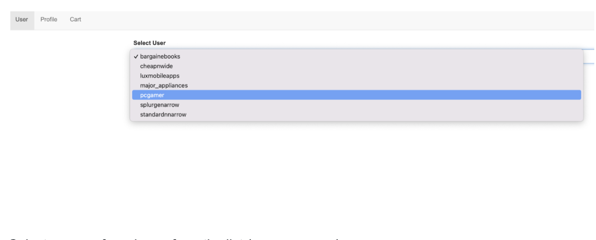


Select your preferred user from the list (e.g., pcgamer)

Once you select the user, click login and that will open the profile page:


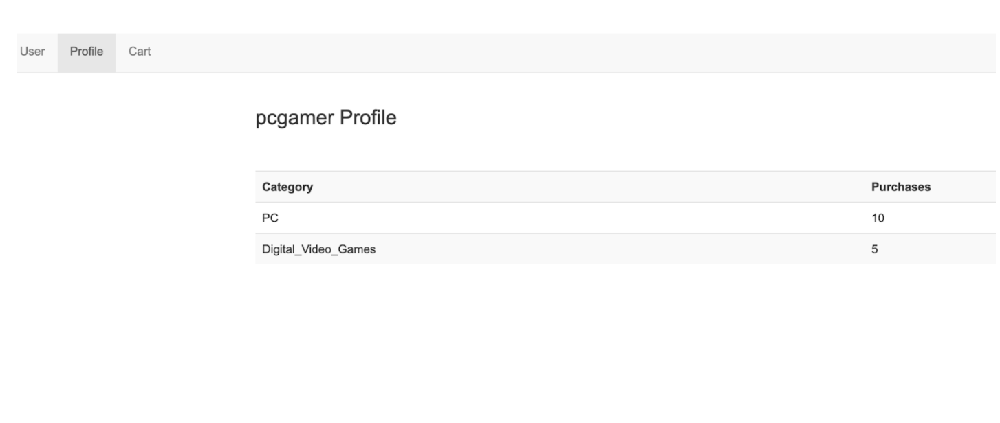


Click on the cart tab and add new items.


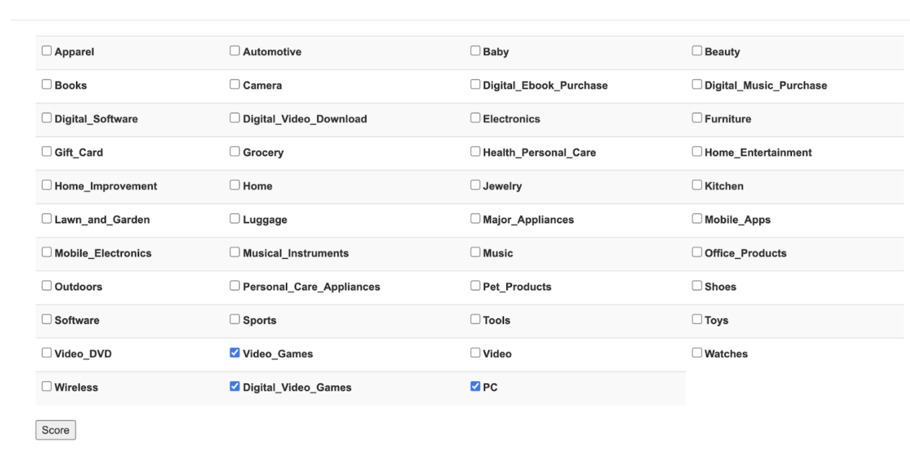


Click “Score” and you will find that all the previously purchased categories will get pre-checked.


As shown above, red indicates that this category of item has not been purchased by the customer before, while green indicates what has previously been purchased. Let us select a different user and experiment with baskets.


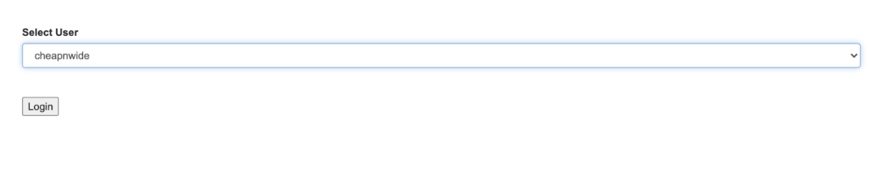


Click “Login.”


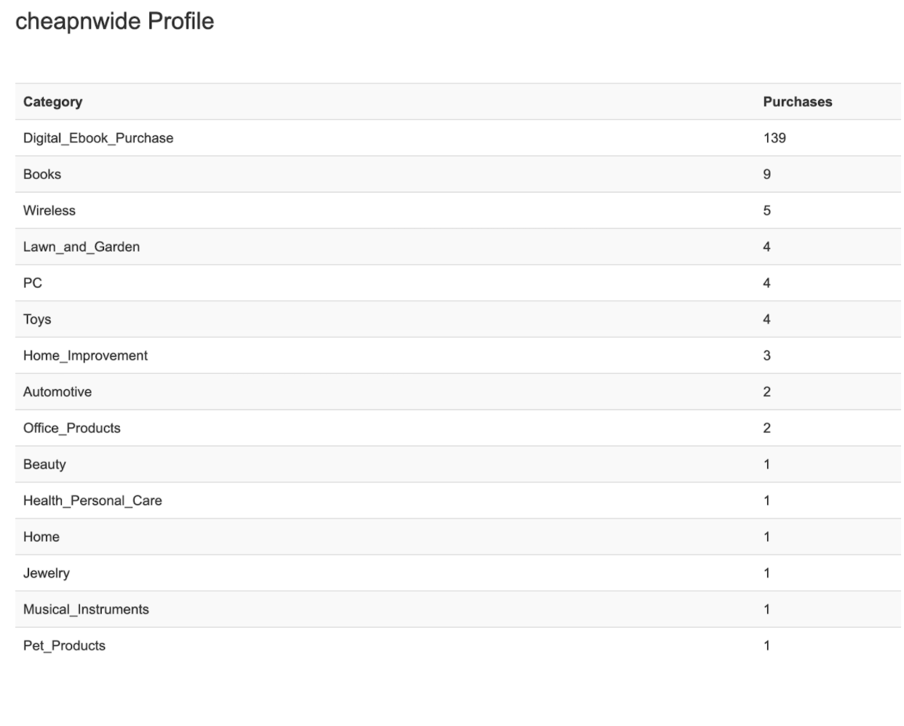


Click “Cart.”


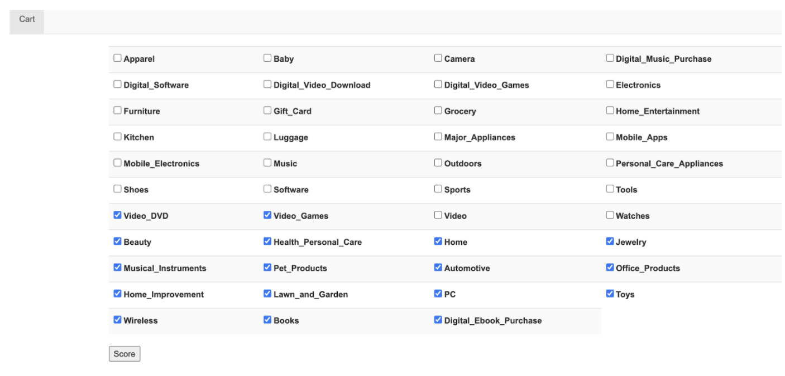


Click “Score.”


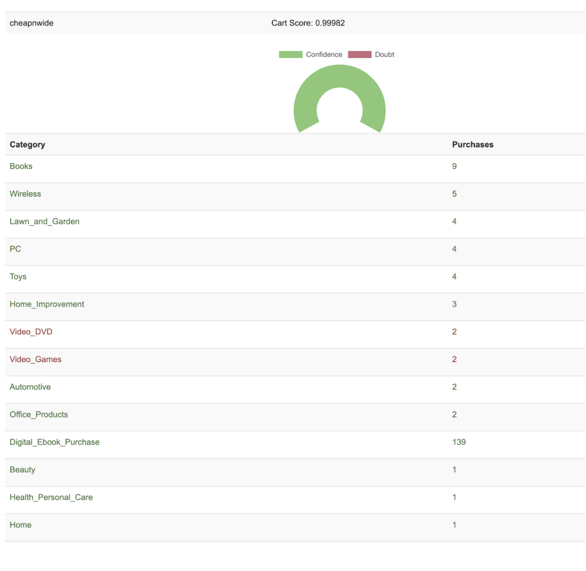


### How does it work?


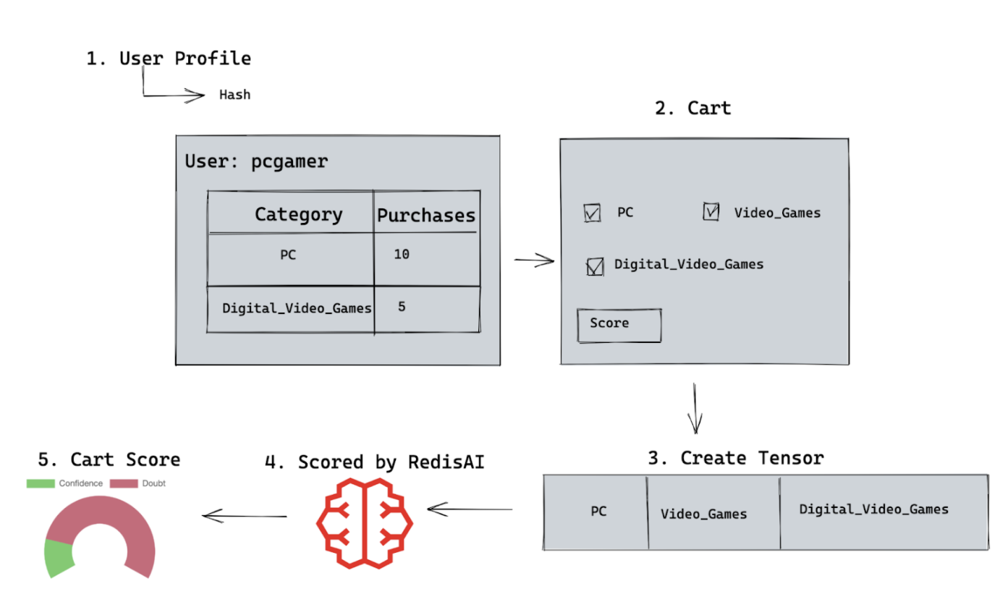


User profiles are stored in Redis as [hash data structures](https://redis.io/commands#hash). After the user adds items to the cart for scoring, the cart is transformed into a tensor scored by [RedisAI](https://redisai.io/), and a confidence score is returned.

 


### Scoring

The scores vary between 0 and 1. A score closer to 1 indicates that the basket of items by category is more likely to mirror broader purchasing patterns. Let’s look at another example for a user profile named "splurgenarrow":


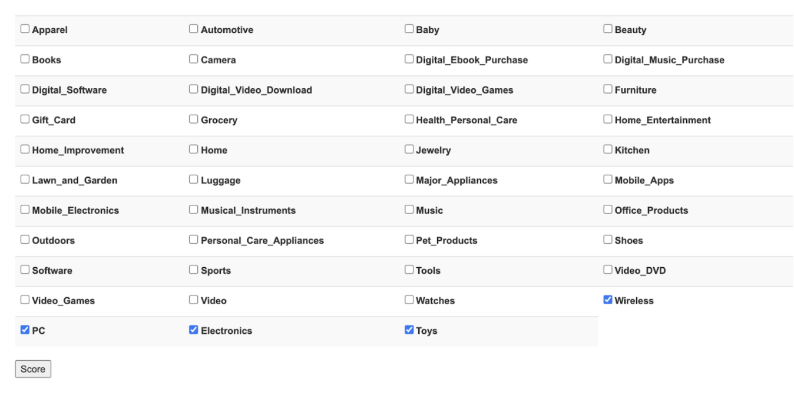


If we add Wireless, then this is a highly likely basket with a score of 0.99989. Adding items categorized as "Wireless" results in a basket with a high likelihood of matching the purchasing patterns that we have modeled from previous data.


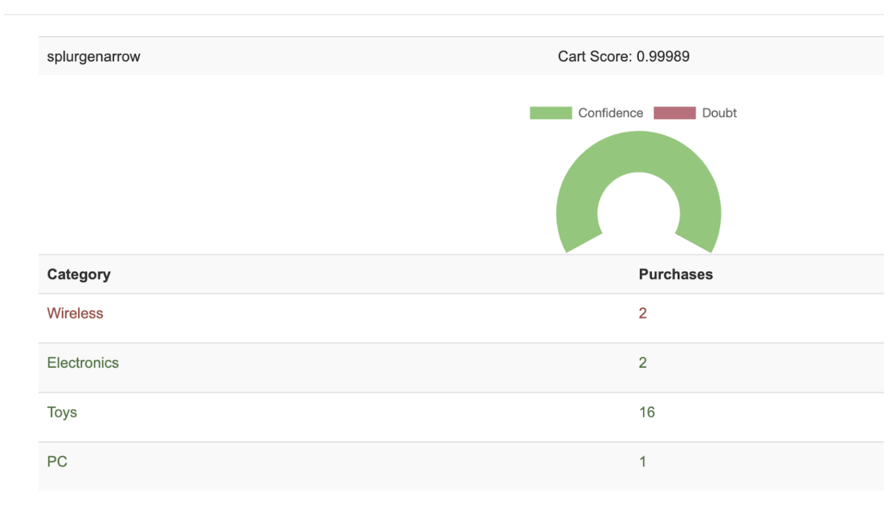


You can use the Redis [MONITOR](https://redis.io/commands/monitor) command in order to stream back every command processed by the Redis server. As shown below, you will find Redis data structures called “Hashes” commands that hold various field-value pairs for representing data objects. 


```
"GET" "session:53ee3f94-c507-4075-a60f-871546e2f90f"
"EXISTS" "USERLIST"
"SMEMBERS" "USERLIST"
...
"SETEX" 
"GET" "session:53ee3f94-c507-4075-a60f-871546e2f90f"
"SETEX" 
..
"GET" "session:53ee3f94-c507-4075-a60f-871546e2f90f"
"HGETALL" "user:splurgenarrow"
```


But if we add Major_Appliances, it will be an unlikely basket with a score of 0.00917


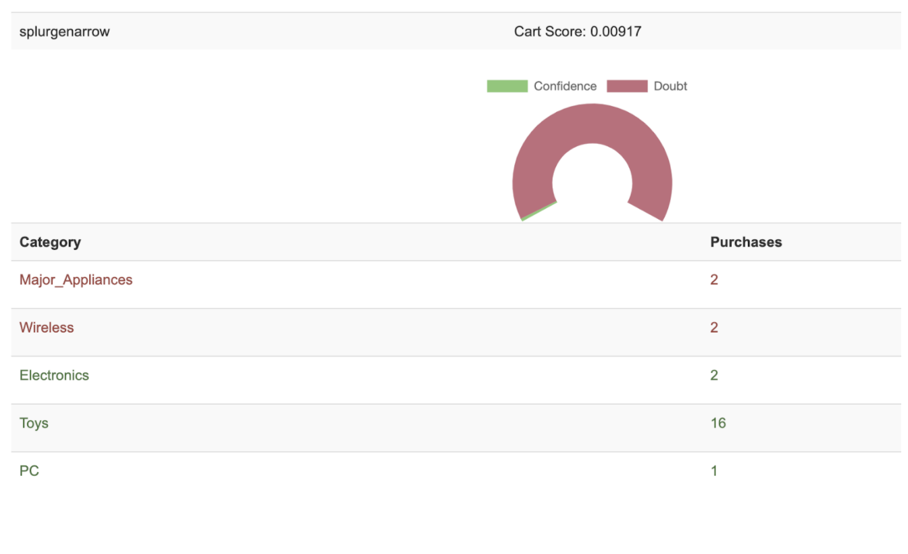


```
"GET" "session:53ee3f94-c507-4075-a60f-871546e2f90f"
"AI.TENSORSET" "TENSOR:53ee3f94-c507-4075-a60f-871546e2f90f" "FLOAT" "1" "43" "VALUES" "0.0" "0.0" "0.0" "0.0" "0.0" "0.0" "0.0" "0.0" "0.0" "0.0" "0.0" "2.0" "0.0" "0.0" "0.0" "0.0" "0.0" "0.0" "0.0" "0.0" "0.0" "0.0" "0.0" "2.0" "0.0" "0.0" "0.0" "0.0" "0.0" "0.0" "1.0" "0.0" "0.0" "0.0" "0.0" "0.0" "0.0" "16.0" "0.0" "0.0" "0.0" "0.0" "0.0"
"AI.MODELRUN" "profile_model" "INPUTS" "TENSOR:53ee3f94-c507-4075-a60f-871546e2f90f" "OUTPUTS" "TENSOR:53ee3f94-c507-4075-a60f-871546e2f90f:results"
"AI.TENSORGET" "TENSOR:53ee3f94-c507-4075-a60f-871546e2f90f:results" "META" "BLOB"
"DEL" "TENSOR:53ee3f94-c507-4075-a60f-871546e2f90f"
"DEL" "TENSOR:53ee3f94-c507-4075-a60f-871546e2f90f:results"
"HGETALL" "user:splurgenarrow"
"SETEX" 

```


### Conclusion

As digital marketing continues to grow, data-mining techniques such as Market Basket Analysis, powered with Redis Modules like RedisAI and RedisGears, are increasingly necessary  for online retailers to better understand customer purchasing patterns. Retailers can use this  insight into which items are frequently purchased together  in order to optimize product placement, offer special deals, and create new product bundles to increase sales while also being better able to identify online fraud.

### Further References:


* [Source code of Market Basket Analysis ](https://github.com/redis-field-engineering/demo-market-basket-analysis)
* [Real-Time Fraud Detection with Azure and Redis Enterprise](https://www.youtube.com/watch?v=UBRuYVn4MjQ)

