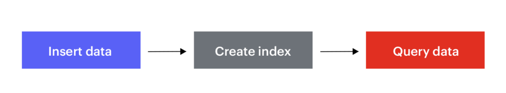

RediSearch is a powerful text search and secondary indexing engine, built on top of Redis as a Redis module. Written in C, RediSearch is extremely fast compared to other open-source search engines. It implements multiple data types and commands that fundamentally change what you can do with Redis. RediSearch supports capabilities for search and filtering such as geo-spatial queries, retrieving only IDs (instead of whole documents), and custom document scoring. Aggregations can combine map, filter, and reduce/group-by operations in custom pipelines that run across millions of elements in an instant. 

RediSearch also supports auto-completion with fuzzy prefix matching, and atomic real-time insertion of new documents to a search index.With the latest RediSearch 2.0 release, it’s now easier than ever to create a secondary index on top of your existing data. You can just add RediSearch to your existing Redis database, create an index, and start querying it, without having to migrate your data or use new commands for adding data to the index. This drastically lowers the learning curve for new RediSearch users and lets you create indexes on your existing Redis databases—without even having to restart them.


### Step 1. Register and subscribe

Follow [this link to register](/create/cloud/rediscloud) and subscribe to Redis Enterprise Cloud


### Step 2. Create a database with Redisearch Module


### Step 3. Connect to a database


Follow [this](explore/redisinsight) link to know how to connect to a database


### Step 4. Getting Started with Redisearch


To begin, let’s create a basic dataset based on movies information, which we will use to show how to:

- Insert data
- Create an index
- Query data




#### Insert data into RediSearch

We are now ready to insert some data. This example uses movies data stored as Redis Hashes, so let’s insert a couple of movies:

```
HSET movies:11002 title "Star Wars: Episode V - The Empire Strikes Back" plot "Luke Skywalker begins Jedi training with Yoda." release_year 1980 genre "Action" rating 8.7 votes 1127635

(integer) 6 

> HSET movies:11003 title "The Godfather" plot "The aging patriarch of an organized crime dynasty transfers control of his empire to his son." release_year 1972 genre "Drama" rating 9.2 votes 1563839 

(integer) 6
```

Your Redis Enterprise Cloud database now contains two Hashes. It is simple to retrieve information using the HMGET command, if you know the key of the movies (movies:11002):

```
> HMGET movies:11002 title rating

1) "Star Wars: Episode V - The Empire Strikes Back"
2) "8.7"
```

#### Create an index in RediSearch

To be able to query the hashes on the field for title, say, or genre, you must first create an index. To create an index, you must define a schema to list the fields and their types that are indexed, and that you can use in your queries.

Use the FT.CREATE command to create an index, as shown here:

```
> FT.CREATE idx:movies ON hash PREFIX 1 "movies:" SCHEMA title TEXT SORTABLE release_year NUMERIC SORTABLE rating NUMERIC SORTABLE genre TAG SORTABLE

OK
```

In the command above, we:

- Create an index named idx:movies
- Used a schema made up of four fields:
title
release_year
rating
genre

Before running queries on our new index, though, let’s take a closer look at the elements of the FT.CREATE command:

- idx:movies: the name of the index, which you will use when doing queries
- ON hash: the type of structure to be indexed. (Note that RediSearch 2.0 supports only the Hash structure, but this parameter will allow RediSearch to index other structures in the future.)
- PREFIX 1 “movies:”: the prefix of the keys that should be indexed. This is a list, so since we want to index only movies:* keys the number is 1. If you want to index movies and TV shows with the same fields, you could use: PREFIX 2 “movies:” “tv_show:”
- SCHEMA …: defines the schema, the fields, and their type to index. As you can see in the command, we are using TEXT, NUMERIC, and TAG, as well as SORTABLE parameters.

The RediSearch 2.0 engine will scan the database using the PREFIX values, and update the index based on the schema definition. This makes it easy to add an index to an existing application that uses Hashes, there’s no need to change your code.

#### Search the movies in the RediSearch index

You can now use the FT.SEARCH to search your database, for example, to search all movies sorted by release year:

```
>  FT.SEARCH idx:movies * SORTBY release_year ASC RETURN 2 title release_year
1) (integer) 2
2) "movies:1003"
3) 1) "release_year"
   2) "1972"
   3) "title"
   4) "The Godfather"
4) "movies:1002"
5) 1) "release_year"
   2) "1980"
   3) "title"
   4) "Star Wars: Episode V - The Empire Strikes Back"
```


You can also search “action” movies that contain “star” in the index (in our sample index, the term “star” will occur only in the title):

```
>  FT.SEARCH idx:movies "star @genre:{action}" RETURN 2 title release_year
1) (integer) 1
2) "movies:1002"
3) 1) "title"
   2) "Star Wars: Episode V - The Empire Strikes Back"
   3) "release_year"
   4) "1980"
```

The FT.SEARCH command is the base command to search your database, it has many options and is associated with a powerful and rich query syntax that you can find in the documentation. (Note: You can also use the index to do data aggregation using the FT.AGGREGATE command.)


### Next Step

- Learn more about RediSearch in the [Getting Started with RediSearch 2.0](https://github.com/RediSearch/redisearch-getting-started/)  tutorial on GitHub.
- [How to list and search Movie database using Redisearch](/howtos/moviesdatabase/getting-started)


