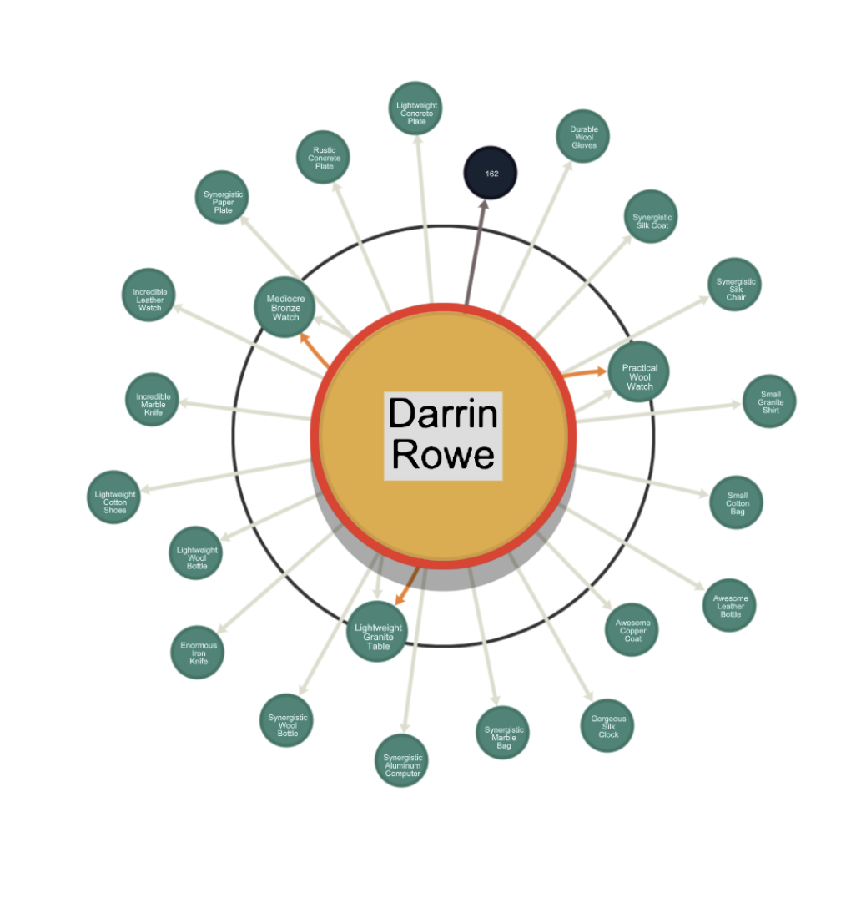

import Authors from '@site/src/theme/Authors';

<Authors frontMatter={frontMatter} />

[RedisGraph](https://redis.com/modules/redis-graph/) is the fastest graph database that processes complex graph operations in real time, 10x – 600x faster than any other graph database. It shows how your data is connected through multiple visualization integrations including [RedisInsight](/explore/redisinsight/getting-started), Linkurious, and Graphileon.
It allows you to query graphs using the industry-standard Cypher query language and you can easily use graph capabilities from application code.


## RedisGraph Bulk Loader

If you have a bunch of CSV files that you want to load to RedisGraph database, you must try out [this Bulk Loader utility](https://github.com/RedisGraph/redisgraph-bulk-loader). Rightly called RedisGraph Bulk Loader, this tool is written in Python and helps you in building RedisGraph databases from CSV inputs. This utility requires a Python 3 interpreter.

Follow the steps below to load CSV data into RedisGraph database:

### Step 1. Run Redis Stack Docker container

```bash
 docker run -p 6379:6379 --name redis/redis-stack
```

### Step 2. Verify if RedisGraph module is loaded

```bash
 info modules
 # Modules
 module:name=graph,ver=20405,api=1,filters=0,usedby=[],using=[],options=[]
```

### Step 3. Clone the Bulk Loader Utility

```bash
 $ git clone https://github.com/RedisGraph/redisgraph-bulk-loader
```

### Step 4. Installing the RedisGraph Bulk Loader tool

The bulk loader can be installed using pip:

```bash
  pip3 install redisgraph-bulk-loader
```

Or

```bash
 pip3 install git+https://github.com/RedisGraph/redisgraph-bulk-loader.git@master
```

### Step 5. Create a Python virtual env for this work

```python
 python3 -m venv redisgraphloader
```

### Step 6. Step into the venv:

```bash
 source redisgraphloader/bin/activate
```

### Step 7. Install the dependencies for the bulk loader:

```bash
 pip3 install -r requirements.txt
```

If the above command doesn’t work, install the below modules:

```bash
 pip3 install pathos
 pip3 install redis
 pip3 install click
```

### Step 8. Install groovy

```bash
 groovy generateCommerceGraphCSVForImport.groovy
```

### Step 9. Verify the .csv files created

```
 head -n2 *.csv
 ==> addtocart.csv <==
 src_person,dst_product,timestamp
 0,1156,2010-07-20T16:11:20.551748

 ==> contain.csv <==
 src_person,dst_order
 2000,1215

 ==> order.csv <==
 _internalid,id,subTotal,tax,shipping,total
 2000,0,904.71,86.40,81.90,1073.01

 ==> person.csv <==
 _internalid,id,name,address,age,memberSince
  0,0,Cherlyn Corkery,146 Kuphal Isle South Jarvis MS 74838-0662,16,2010-03-18T16:25:20.551748

 ==> product.csv <==
 _internalid,id,name,manufacturer,msrp
 1000,0,Sleek Plastic Car,Thiel Hills and Leannon,385.62

 ==> transact.csv <==
 src_person,dst_order
 2,2000

 ==> view.csv <==
 src_person,dst_product,timestamp
 0,1152,2012-04-14T11:23:20.551748
```

### Step 10. Run the Bulk loader script

```bash
  python3 bulk_insert.py prodrec-bulk -n person.csv -n product.csv -n order.csv -r view.csv -r addtocart.csv -r transact.csv -r contain.csv
 person  [####################################]  100%
 1000 nodes created with label 'person'
 product  [####################################]  100%
 1000 nodes created with label 'product'
 order  [####################################]  100%
 811 nodes created with label 'order'
 view  [####################################]  100%
 24370 relations created for type 'view'
 addtocart  [####################################]  100%
 6458 relations created for type 'addtocart'
 transact  [####################################]  100%
 811 relations created for type 'transact'
 contain  [####################################]  100%
 1047 relations created for type 'contain'
 Construction of graph 'prodrec-bulk' complete: 2811 nodes created, 32686 relations created in 1.021761 seconds
```

```bash
 graph.query prodrec "match (p:person) where p.id=200 return p.name"
 1) 1) "p.name"
 2) (empty array)
 3) 1) "Cached execution: 0"
    2) "Query internal execution time: 0.518300 milliseconds"
```

### Step 10 . Install RedisInsight

To use RedisInsight on a local Mac, you can download from the RedisInsight page on the RedisLabs website:

[Click this link to access a form](https://redis.com/redis-enterprise/redis-insight/#insight-form) that allows you to select the operating system of your choice.


If you have Docker Engine installed in your system, the quick way is to run the following command:

```
 docker run -d -v redisinsight:/db -p 8001:8001 redislabs/redisinsight:latest
```

### Step 11. Accessing RedisInsight

Next, point your browser to http://localhost:8001.

### Step 12. Run the Graph Query

```bash
 GRAPH.QUERY "prodrec-bulk" "match (p:person) where p.id=199 return p"
```



### References

- [Building Movies database app using RedisGraph and NodeJS](/howtos/redisgraphmovies/)
- Learn more about RedisGraph in the [Quickstart](https://oss.redis.com/redisgraph/) tutorial.
- [Query, Visualize and Manipulate Graphs using RedisGraph Browser Tool](/explore/redisinsight/redisgraph)

##

<div>
  <a
    href="https://launchpad.redis.com"
    target="_blank"
    rel="noopener"
    className="link">
    
  </a>
</div>
