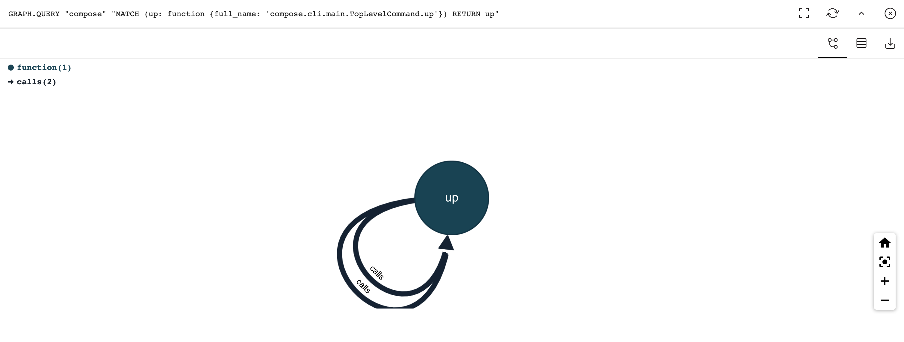
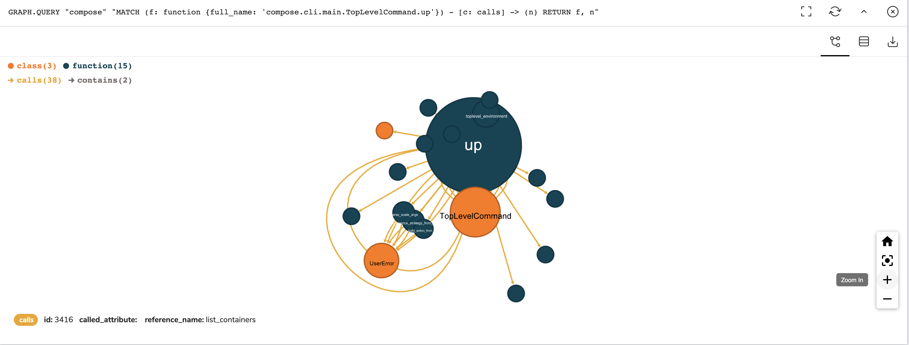

import Authors from '@site/src/theme/Authors';

<Authors frontMatter={frontMatter} />

Pycograph is an open source tool that creates a RedisGraph model of your Python code. The tool lets you to explore your Python codebase with graph queries. With Pycograph, you can query the python code with Cypher. Additionally, it is possible to visualize the graph model using RedisInsight.

The project is hosted over https://pycograph.com/ and package is available in [PyPI repository](https://pypi.org/project/pycograph/). It was introduced for the first time by [Reka Horvath](https://pypi.org/user/reka/) during RedisConf 2021.

<div class="text--center">
  <iframe
    width="560"
    height="315"
    src="https://www.youtube.com/embed/pE3cg6jK2Zg"
    title="YouTube video player"
    frameborder="0"
    allow="accelerometer; autoplay; clipboard-write; encrypted-media; gyroscope; picture-in-picture"
    allowfullscreen></iframe>
</div>

Let us see how to explore Python code using Pycograph and RedisGraph below:

### Step 1. Install Docker

```bash
 curl -sSL https://get.docker.com/ | sh
```

### Step 2. Install Pycograph from PyPI

```bash
 pip install pycograph
```

### Step 3. Start RedisGraph Module

The redislabs/redismod Docker image provides you all the essential Redis modules.

```bash
 docker run -d -p 6379:6379 redislabs/redismod
```

### Step 4. Run RedisInsight

```bash
 docker run -d -v redisinsight:/db -p 8001:8001 redislabs/redisinsight:latest
```

### Step 5. Load a sample Python code

We will be using a popular Docker compose project for our sample python code.
Clone the Docker Compose project repository

```bash
  git clone https://github.com/docker/compose
```

### Step 6. Load Python Code

Load your project's code with the pycograph load command:

```bash
 pycograph load --project-dir compose
```

<b>Results</b>:

```bash
 Graph successfully updated.
 {'graph name': 'compose', 'nodes added': 2428, 'edges added': 11239}
```

### Step 7. Visualize the project

Open RedisInsight, select RedisGraph on the left menu and run the below query:

#### Query #1: Return every node

```
 MATCH (n) RETURN n
```

You will see the below output:


#### Query #2: Return every non-test object


#### Query #3. Displaying the function behind the docker-compose up command

A query returning exactly one node using the unique full_name property. Double-click on the node to display all its relationships.



#### Query #4. Displaying the 'docker-compose up' and its calls relationships



#### Query #5. Displaying the 'docker-compose up' vs 'docker-compose run'

Functions called by the Docker Compose top level commands up and run


### References:

- [Pycograph Project](https://pycograph.com/)
- [Docker Compose Source Code](https://github.com/docker/compose)

##

<div>
  <a
    href="https://launchpad.redis.com"
    target="_blank"
    rel="noopener"
    className="link">

    

  </a>
</div>
