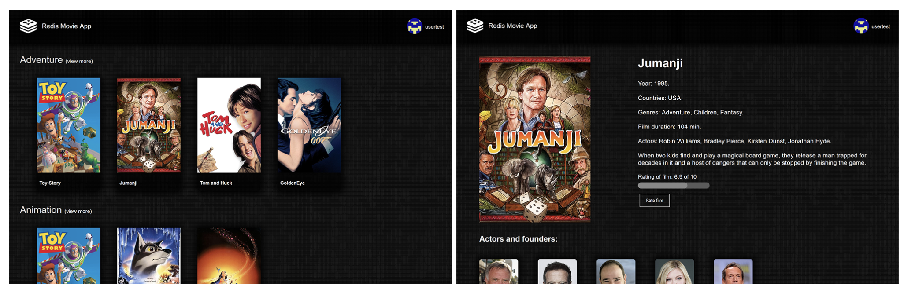
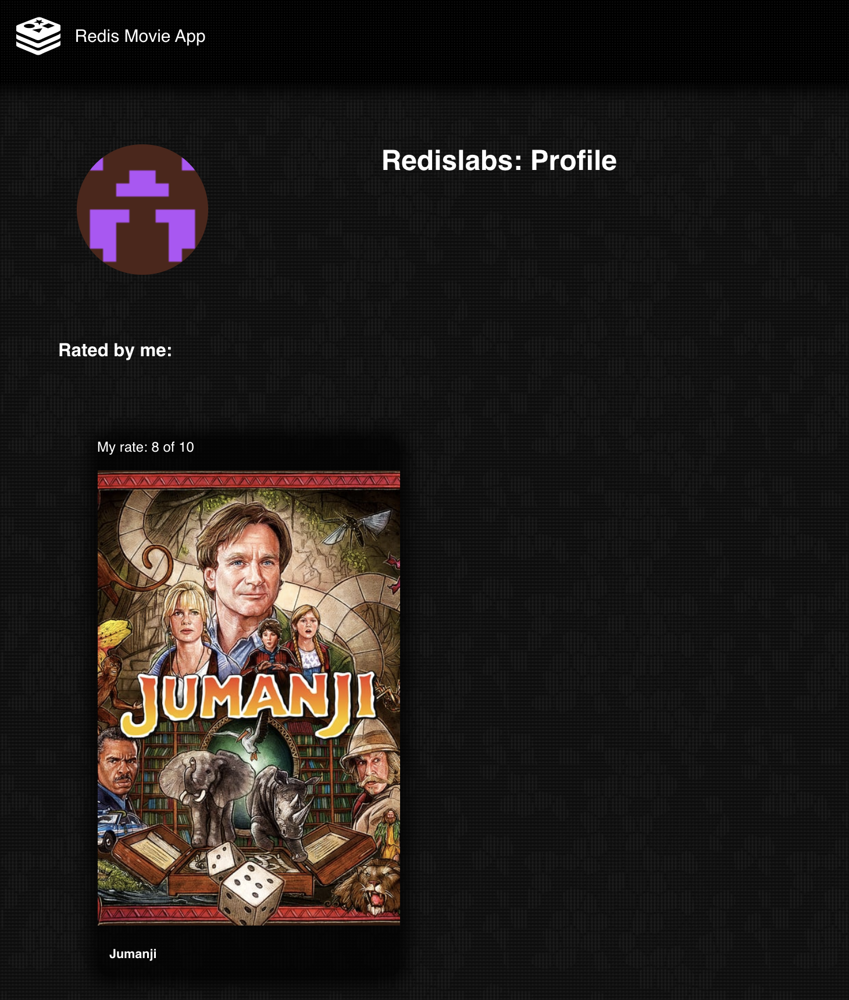
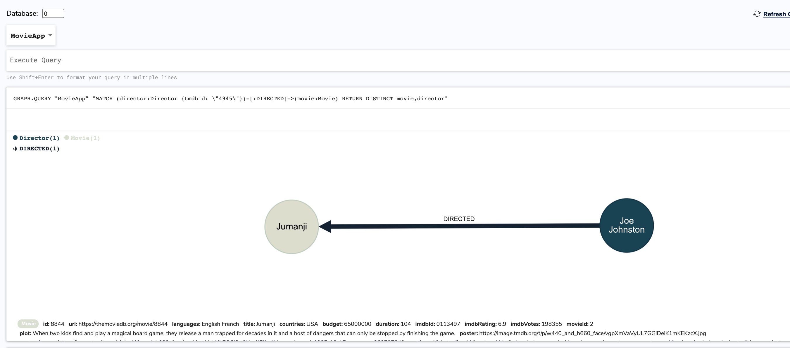

import Authors from '@theme/Authors';
import GraphEol from '@site/docs/common/_graph-eol.mdx';

<GraphEol />
<Authors frontMatter={frontMatter} />

IMDb(Internet Movie Database) is the world's most popular and authoritative source for information on movies, TV shows and celebrities. This application is an IMDB clone with basic account authentication and movie recommendation functionality. You will learn the power of RedisGraph and NodeJS to build a simple movie database.



### Tech Stack

- Frontend - React
- Backend - Node.js, Redis, RedisGraph

### Step 1. Install the pre-requisites

- Node - v13.14.0+
- NPM - v7.6.0+

### Step 2. Run Redis Stack Docker container

```bash
 docker run -d -p 6379:6379 redis/redis-stack
```

Ensure that Docker container is up and running:

```bash
 docker ps
 CONTAINER ID   IMAGE                           COMMAND                  CREATED             STATUS             PORTS                    NAMES
 fd5ef30f025a   redis/redis-stack               "redis-server --load…"   2 hours ago         Up 2 hours         0.0.0.0:6379->6379/tcp   nervous_buck
```

### Step 3. Run RedisInsight Docker container

```bash
 docker run -d -v redisinsight:/db -p 8001:8001 redislabs/redisinsight:latest
```

Ensure that Docker container is up and runnig

```bash
 docker ps
 CONTAINER ID   IMAGE                           COMMAND                  CREATED             STATUS             PORTS                    NAMES
 264db1706dcc   redislabs/redisinsight:latest   "bash ./docker-entry…"   About an hour ago   Up About an hour   0.0.0.0:8001->8001/tcp   angry_shirley
 fd5ef30f025a   redis/redis-stack               "redis-server --load…"   2 hours ago         Up 2 hours         0.0.0.0:6379->6379/tcp   nervous_buck
```

### Step 4. Clone the repository

```bash
 git clone https://github.com/redis-developer/basic-redisgraph-movie-demo-app-nodejs
```

### Step 5. Setting up environment variables

Copy `.env.sample` to `.env` and add the following details:

```bash
  REDIS_ENDPOINT_URL = "Redis server URI"
  REDIS_PASSWORD = "Password to the server"
```

### Step 6. Install the dependencies

```bash
 npm install
```

### Step 7. Run the backend server

```bash
 node app.js
```

### Step 8. Run the client

```bash
 cd client
 yarn install
 yarn start
```

### Step 9. Accessing the Movie app

Open http://IP:3000 to access the movie app


### Step 10. Sign up for a new account


Enter the details to create a new account:


### Step 11. Sign-in to movie app


### Step 12. Rate the movie


### Step 13. View the list of rated movie



### Step 14. View directed movie over RedisInsight

```
 GRAPH.QUERY "MovieApp" "MATCH (director:Director {tmdbId: \"4945\"})-[:DIRECTED]->(movie:Movie) RETURN DISTINCT movie,director"
```



### Step 15. Find movies where actor acted in.

Run the below query under RedisGraph to find the author acted in a movie

```
 GRAPH.QUERY "MovieApp" "MATCH (actor:Actor {tmdbId: \"8537\"})-[:ACTED_IN_MOVIE]->(movie:Movie) RETURN DISTINCT movie,actor"
```


### Step 16. Store a user in a database

```
 CREATE (user:User {id: 32,
 username: "user", password: "hashed_password", api_key: "525d40da10be8ec75480"})
 RETURN user
```


### Step 17. Find a user by username

```
 MATCH (user:User {username: "user"}) RETURN user
```


### How it works?

The app consumes the data provided by the Express API and presents it through some views to the end user, including:

- Home page
- Sign-up and Login pages
- Movie detail page
- Actor and Director detail page
- User detail page

#### Home page


The home page shows the genres and a brief listing of movies associated with them.

#### How the data is stored

#### Add a new genre:

```Cypher
 create (g:Genre{name:"Adventure"})
```

#### Add a movie:

```Cypher
 create (m:Movie {
  url: "https://themoviedb.org/movie/862",
  id:232,
  languages:["English"],
  title:"Toy Story",
  countries:["USA"],
  budget:30000000,
  duration:81,
  imdbId:"0114709",
  imdbRating:8.3,
  imdbVotes:591836,
  movieId:42,
  plot:"...",
  poster:"https://image.tmd...",
  poster_image:"https://image.tmdb.or...",
  released:"1995-11-22",
  revenue:373554033,
  runtime:$runtime,
  tagline:"A cowboy doll is profoundly t...",
  tmdbId:"8844",
  year:"1995"})
```

#### Set genre to a movie:

```Cypher
 MATCH (g:Genre), (m:Movie)
 WHERE g.name = "Adventure" AND m.title = "Toy Story"
 CREATE (m)-[:IN_GENRE]->(g)
```

#### How the data is accessed

#### Get genres:

```Cypher
 MATCH (genre:Genre) RETURN genre
```

#### Get moves by genre:

```Cypher
 MATCH (movie:Movie)-[:IN_GENRE]->(genre)
 WHERE toLower(genre.name) = toLower("Film-Noir") OR id(genre) = toInteger("Film-Noir")
 RETURN movie
```

#### Code example: Get movies with genre

```Javascript
 const getByGenre = function (session, genreId) {
 const query = [
  'MATCH (movie:Movie)-[:IN_GENRE]->(genre)',
  'WHERE toLower(genre.name) = toLower($genreId) OR id(genre) = toInteger($genreId)',
  'RETURN movie',
 ].join('\n');

 return session
 .query(query, {
    genreId,
  })
  .then((result) => manyMovies(result));
};
```

#### Sign-up and Login pages


To be able to rate movies a user needs to be logged in: for that a basic JWT-based authentication system is implemented, where user details are stored in the RedisGraph for persistence.

#### How the data is stored

#### Store user in the database:

```Cypher
 CREATE (user:User {id: 32,
 username: "user", password: "hashed_password", api_key: "525d40da10be8ec75480"})
 RETURN user
```

#### How the data is accessed

#### Find by user name:

```Cypher
 MATCH (user:User {username: "user"}) RETURN user
```

#### Code Example: Find user

```Javascript
 const me = function (session, apiKey) {
 return session
   .query('MATCH (user:User {api_key: $api_key}) RETURN user', {
     api_key: apiKey,
   })
   .then((foundedUser) => {
     if (!foundedUser.hasNext()) {
       throw {message: 'invalid authorization key', status: 401};
     }
     while (foundedUser.hasNext()) {
       const record = foundedUser.next();
       return new User(record.get('user'));
     }
   });
 };
```

#### Movie detail page


On this page a user can rate the film and view the Actors/directors who participated in the production of the film.

#### How the data is stored

#### Associate actor with a movie:

```Cypher
 MATCH (m:Movie) WHERE m.title="Jumanji" CREATE (a:Actor :Person{
 bio:"Sample...",
 bornIn:"Denver, Colorado, USA",
 imdbId:"0000245",
 name:"Robin Williams",
 poster:"https://image.tmdb.org/t/p/w440_and_...",
 tmdbId:"2157",
 url:"https://themoviedb.org/person/2157"})-[r:ACTED_IN_MOVIE
 {role: "Alan Parrish"}]->(m)
```

#### Associate director with a movie:

```Cypher
 MATCH (m:Movie) WHERE m.title="Dead Presidents" CREATE (d:Director :Person{
  bio: "From Wikipedia, the free e...",
  bornIn: "Detroit, Michigan, USA",
  imdbId: "0400436",
  name: "Albert Hughes",
  tmdbId: "11447",
  url: "https://themoviedb.org/person/11447"})-[r:DIRECTED]->(m)
```

#### How the data is accessed

#### Find movie by id with genre, actors and director:

```Cypher
 MATCH (movie:Movie {tmdbId: $movieId})
 OPTIONAL MATCH (movie)<-[my_rated:RATED]-(me:User {id: "e1e3991f-fe81-439e-a507-aa0647bc0b88"})
 OPTIONAL MATCH (movie)<-[r:ACTED_IN_MOVIE]-(a:Actor)
 OPTIONAL MATCH (movie)-[:IN_GENRE]->(genre:Genre)
 OPTIONAL MATCH (movie)<-[:DIRECTED]-(d:Director)
 WITH DISTINCT movie, my_rated, genre, d,  a, r
 RETURN DISTINCT movie,
 collect(DISTINCT d) AS directors,
 collect(DISTINCT a) AS actors,
 collect(DISTINCT genre) AS genres
```

#### Code Example: Get movie detail

```Javascript
 const getById = function (session, movieId, userId) {
 if (!userId) throw {message: 'invalid authorization key', status: 401};
 const query = [
   'MATCH (movie:Movie {tmdbId: $movieId})\n' +
     '  OPTIONAL MATCH (movie)<-[my_rated:RATED]-(me:User {id: $userId})\n' +
     '  OPTIONAL MATCH (movie)<-[r:ACTED_IN_MOVIE]-(a:Actor)\n' +
     '  OPTIONAL MATCH (movie)-[:IN_GENRE]->(genre:Genre)\n' +
     '  OPTIONAL MATCH (movie)<-[:DIRECTED]-(d:Director)\n' +
     '  WITH DISTINCT movie, my_rated, genre, d,  a, r\n' +
     '  RETURN DISTINCT movie,\n' +
     '  collect(DISTINCT d) AS directors,\n' +
     '  collect(DISTINCT a) AS actors,\n' +
     '  collect(DISTINCT genre) AS genres',
 ].join(' ');
 return session
   .query(query, {
     movieId: movieId.toString(),
     userId: userId.toString(),
   })
   .then((result) => {
     if (result.hasNext()) {
       return _singleMovieWithDetails(result.next());
     }
     throw {message: 'movie not found', status: 404};
   });
 };
```

#### Actor and Director detail page


#### How the data is accessed

#### Find movies where actor acted in:

```Cypher
 MATCH (actor:Actor {tmdbId: "8537"})-[:ACTED_IN_MOVIE]->(movie:Movie)
 RETURN DISTINCT movie,actor
```

#### Find movies directed by:

```Cypher
 MATCH (director:Director {tmdbId: "4945"})-[:DIRECTED]->(movie:Movie)
 RETURN DISTINCT movie,director
```

#### Get movies directed by

```Javascript
 const getByDirector = function (session, personId) {
 const query = [
   'MATCH (director:Director {tmdbId: $personId})-[:DIRECTED]->(movie:Movie)',
   'RETURN DISTINCT movie,director',
 ].join('\n');

 return session
   .query(query, {
     personId,
   })
   .then((result) => manyMovies(result));
 };
```

#### User detail page


#### Shows the profile info and movies which were rated by user

#### How the data is stored

#### Set rating for a movie:

```Cypher
 MATCH (u:User {id: 42}),(m:Movie {tmdbId: 231})
 MERGE (u)-[r:RATED]->(m)
 SET r.rating = "7"
 RETURN m
```

#### How the data is accessed

#### Get movies and user ratings:

```Cypher
 MATCH (:User {id: "d6b31131-f203-4d5e-b1ff-d13ebc06934d"})-[rated:RATED]->(movie:Movie)
 RETURN DISTINCT movie, rated.rating as my_rating
```

#### Get rated movies for user

```Javascript
 const getRatedByUser = function (session, userId) {
 return session
   .query(
     'MATCH (:User {id: $userId})-[rated:RATED]->(movie:Movie) \
      RETURN DISTINCT movie, rated.rating as my_rating',
     {userId},
   )
   .then((result) =>
     result._results.map((r) => new Movie(r.get('movie'), r.get('my_rating'))),
   );
 };
```

#### Data types:

- The data is stored in various keys and various relationships.
  - There are 5 types of data
    - User
    - Director
    - Actor
    - Genre
    - Movie

#### Each type has its own properties

- Actor: `id, bio, born , bornIn, imdbId, name, poster, tmdbId, url`
- Genre: `id, name`
- Director: `id, born, bornIn, imdbId, name, tmdbId, url`
- User: `id, username, password, api_key`
- Movie: `id, url, languages, countries, budget, duration, imdbId, imdbRating, indbVotes, movieId, plot, poster, poster_image, released, revenue, runtime, tagline, tmdbId, year`

#### And there are 4 types of relationship:

- User-`RATED`->Movie
- Director-`DIRECTED`->Movie
- Actor-`ACTED_IN_MOVIE`->Movie
- Movie-`IN_GENRE`->Genre

### References

- [How to list and search Movies Database using Redisearch](/howtos/moviesdatabase/getting-started)
- [Redis Search Indexing Capabilities to add search to Movie app](https://redis.com/blog/getting-started-with-redisearch-2-0/)
