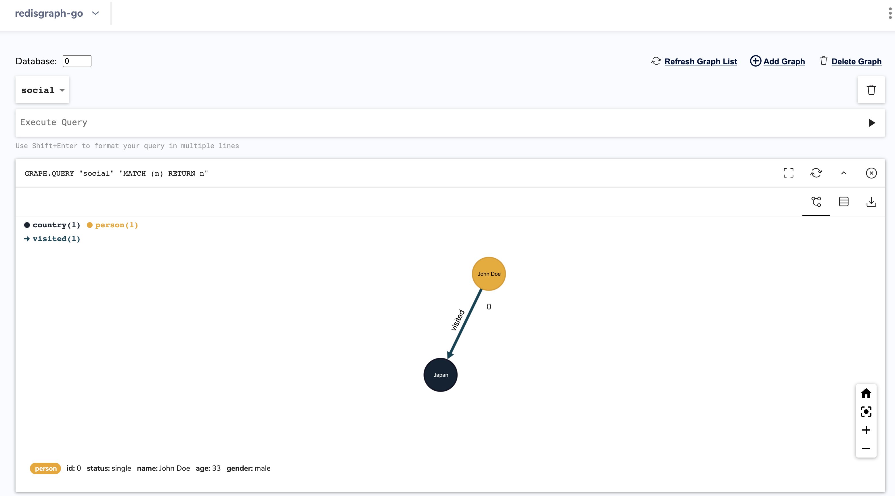

import Authors from '@site/src/theme/Authors';

<Authors frontMatter={frontMatter} />

RedisGraph is the fastest graph database that processes complex graph operations in real time, 10x – 600x faster than any other graph database. Show how your data is connected through multiple visualization integrations including RedisInsight, Linkurious, and Graphileon. Query graphs using the industry-standard Cypher query language and easily use graph capabilities from application code.

## RedisGraph Go Client

The `redisgraph-go` is a Golang client for the RedisGraph module. It relies on redigo for Redis connection management and provides support for RedisGraph's QUERY, EXPLAIN, and DELETE commands.

Follow the steps below to get started with RedisGraph with Go:

### Step 1. Run RedisMod Docker container

```bash
 docker run -p 6379:6379 --name redislabs/redismodCopy
```

### Step 2. Verify if RedisGraph module is loaded

```bash
 info modules
 # Modules
 module:name=graph,ver=20405,api=1,filters=0,usedby=[],using=[],options=[]
```

### Step 3. Loading the RedisGraph Module

```bash
 go get github.com/redislabs/redisgraph-go
```

### Step 4. Clone the repository

```bash
 git clone https://github.com/RedisGraph/redisgraph-go
```

### Step 5. Running the Test suite

```go
 go test
 found packages redisgraph (client_test.go) and main (main.go) in /Users/ajeetraina/projects/redisgraph-go
```

### Step 6. Running the Go Program

```bash
 go run main.go
 +----------+-------+--------+
 |  p.name  | p.age | c.name |
 +----------+-------+--------+
 | John Doe |    33 | Japan  |
 +----------+-------+--------+

 Cached execution 0.000000
 Query internal execution time 3.031700
 Visited countries by person:

 Name: John Doe

 Age: 33
 Pathes of persons vi
```

### Step 7. Monitor the Graph query

```bash
 redis-cli
 127.0.0.1:6379> monitor
 OK
 1633495122.588292 [0 172.17.0.1:58538] "GRAPH.DELETE" "social"
 1633495122.589641 [0 172.17.0.1:58538] "GRAPH.QUERY" "social" "CREATE (UPoQSvSnBD:person{gender:\"male\",status:\"single\",name:\"John Doe\",age:33}),(ZNxbsnHGoO:country{name:\"Japan\"}),(UPoQSvSnBD)-[:visited]->(ZNxbsnHGoO)" "--compact"
 1633495122.591407 [0 172.17.0.1:58538] "GRAPH.QUERY" "social" "MATCH (p:person)-[v:visited]->(c:country)\n           RETURN p.name, p.age, c.name" "--compact"
 1633495122.593040 [0 172.17.0.1:58538] "GRAPH.QUERY" "social" "MATCH p = (:person)-[:visited]->(:country) RETURN p" "--compact"
 1633495122.594405 [0 172.17.0.1:58538] "GRAPH.QUERY" "social" "CALL db.labels()" "--compact"
 1633495122.595552 [0 172.17.0.1:58538] "GRAPH.QUERY" "social" "CALL db.propertyKeys()" "--compact"
 1633495122.596942 [0 172.17.0.1:58538] "GRAPH.QUERY" "social" "CALL db.relationshipTypes()" "--compact"
```

### Step 8. Install RedisInsight

Run the RedisInsight container. The easiest way is to run the following command:

```bash
 docker run -d -v redisinsight:/db -p 8001:8001 redislabs/redisinsight:latest
```

### Step 9. Accessing RedisInsight

Next, point your browser to http://localhost:8001.

### Step 10. Run the Graph Query

You can use the limit clause to limit the number of records returned by a query:

GRAPH.QUERY "social" "MATCH (n) RETURN n"



### References

- [Building Movies database app using RedisGraph and NodeJS](/howtos/redisgraphmovies/)
- Learn more about RedisGraph in the [Quickstart](https://oss.redis.com/redisgraph/) tutorial.
- [Query, Visualize and Manipulate Graphs using RedisGraph Browser Tool](/explore/redisinsight/redisgraph)

##

<div>
  <a
    href="https://launchpad.redis.com"
    target="_blank"
    rel="noopener"
    className="link">
    
  </a>
</div>
