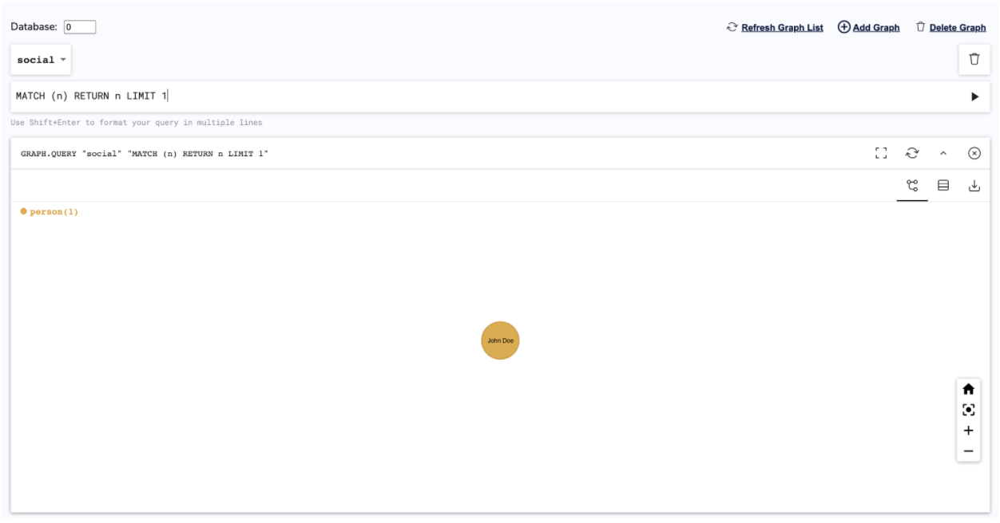

import Authors from '@site/src/theme/Authors';

<Authors frontMatter={frontMatter} />

RedisGraph is the fastest graph database that processes complex graph operations in real time, 10x – 600x faster than any other graph database. Show how your data is connected through multiple visualization integrations including RedisInsight, Linkurious, and Graphileon. Query graphs using the industry-standard Cypher query language and easily use graph capabilities from application code.


## RedisGraph Python Client

The 'redisgraph-py' is a package that allows querying Graph data in a Redis database that is extended with the RedisGraph module. The package extends redisgraph-py's interface with RedisGraph's API

Follow the steps below to get started with RedisGraph with Python:

### Step 1. Run RedisMod Docker container

```bash
 docker run -p 6379:6379 --name redislabs/redismodCopy
```

### Step 2. Verify if RedisGraph module is loaded

```bash
 info modules
 # Modules
 module:name=graph,ver=20405,api=1,filters=0,usedby=[],using=[],options=[]
```

### Step 3. Loading the Python Module

```bash
 pip install redisgraph
```

### Step 4. Write a python code

```python
 import redis
 from redisgraph import Node, Edge, Graph, Path

 r = redis.Redis(host='localhost', port=6379)

 redis_graph = Graph('social', r)

 john = Node(label='person', properties={'name': 'John Doe', 'age': 33, 'gender': 'male', 'status': 'single'})
 redis_graph.add_node(john)

 japan = Node(label='country', properties={'name': 'Japan'})
 redis_graph.add_node(japan)

 edge = Edge(john, 'visited', japan, properties={'purpose': 'pleasure'})
 redis_graph.add_edge(edge)

 redis_graph.commit()

 query = """MATCH (p:person)-[v:visited {purpose:"pleasure"}]->(c:country)
		   RETURN p.name, p.age, v.purpose, c.name"""

 result = redis_graph.query(query)

 # Print resultset
 result.pretty_print()

 # Use parameters
 params = {'purpose':"pleasure"}
 query = """MATCH (p:person)-[v:visited {purpose:$purpose}]->(c:country)
		   RETURN p.name, p.age, v.purpose, c.name"""

 result = redis_graph.query(query, params)

 # Print resultset
 result.pretty_print()

 # Use query timeout to raise an exception if the query takes over 10 milliseconds
 result = redis_graph.query(query, params, timeout=10)

 # Iterate through resultset
 for record in result.result_set:
	person_name = record[0]
	person_age = record[1]
	visit_purpose = record[2]
	country_name = record[3]

 query = """MATCH p = (:person)-[:visited {purpose:"pleasure"}]->(:country) RETURN p"""

 result = redis_graph.query(query)

 # Iterate through resultset
 for record in result.result_set:
   path = record[0]
   print(path)


 # All done, remove graph.
 redis_graph.delete()
```

### Step 5. Execute the Python Script

```python
  python3 test.py
 +-----------+----------+--------------+-----------+
 | b'p.name' | b'p.age' | b'v.purpose' | b'c.name' |
 +-----------+----------+--------------+-----------+
 |  John Doe |    33    |   pleasure   |   Japan   |
 +-----------+----------+--------------+-----------+

 Cached execution 0.0
 internal execution time 3.3023
 +-----------+----------+--------------+-----------+
 | b'p.name' | b'p.age' | b'v.purpose' | b'c.name' |
 +-----------+----------+--------------+-----------+
 |    John Doe |    33    |   pleasure   |   Japan   |
 +-----------+----------+--------------+-----------+

 Cached execution 0.0
 internal execution time 0.2475
 <(0)-[0]->(1)>
```

### Step 6. Monitor the Graph query

```bash
 127.0.0.1:6379> monitor
 OK
 1632661901.024018 [0 172.17.0.1:61908] "GRAPH.QUERY" "social" "CREATE (youkjweasb:person{age:33,gender:\"male\",name:\"John Doe\",status:\"single\"}),(jilbktlmgw:country{name:\"Japan\"}),(youkjweasb:person{age:33,gender:\"male\",name:\"John Doe\",status:\"single\"})-[:visited{purpose:\"pleasure\"}]->(jilbktlmgw:country{name:\"Japan\"})" "--compact"
 1632661901.025810 [0 172.17.0.1:61908] "GRAPH.QUERY" "social" "MATCH (p:person)-[v:visited {purpose:\"pleasure\"}]->(c:country)\n\t\t   RETURN p.name, p.age, v.purpose, c.name" "--compact"
 1632661901.027485 [0 172.17.0.1:61908] "GRAPH.QUERY" "social" "CYPHER purpose=\"pleasure\" MATCH (p:person)-[v:visited {purpose:$purpose}]->(c:country)\n\t\t   RETURN p.name, p.age, v.purpose, c.name" "--compact"
 1632661901.029539 [0 172.17.0.1:61908] "GRAPH.QUERY" "social" "CYPHER purpose=\"pleasure\" MATCH (p:person)-[v:visited {purpose:$purpose}]->(c:country)\n\t\t   RETURN p.name, p.age, v.purpose, c.name" "--compact" "timeout" "10"
 1632661901.030965 [0 172.17.0.1:61908] "GRAPH.QUERY" "social" "MATCH p = (:person)-[:visited {purpose:\"pleasure\"}]->(:country) RETURN p" "--compact"
 1632661901.032250 [0 172.17.0.1:61908] "GRAPH.RO_QUERY" "social" "CALL db.labels()" "--compact"
 1632661901.033323 [0 172.17.0.1:61908] "GRAPH.RO_QUERY" "social" "CALL db.propertyKeys()" "--compact"
 1632661901.034589 [0 172.17.0.1:61908] "GRAPH.RO_QUERY" "social" "CALL db.relationshipTypes()" "--compact"
 1632661901.035625 [0 172.17.0.1:61908] "GRAPH.DELETE" "social"
```

Let us comment out the last line. Try to query Graph data over over RedisInsight.

### Step 7. Install RedisInsight

Run the RedisInsight container. The easiest way is to run the following command:

```bash
 docker run -d -v redisinsight:/db -p 8001:8001 redislabs/redisinsight:latest
```

### Step 8. Accessing RedisInsight

Next, point your browser to http://localhost:8001.

### Step 9. Run the Graph Query

You can use the limit clause to limit the number of records returned by a query:

MATCH (n) RETURN n LIMIT 1



### Step 10. Run the Graph Query with no LIMIT

MATCH (n) RETURN n


### References

- [Building Movies database app using RedisGraph and NodeJS](/howtos/redisgraphmovies/)
- Learn more about RedisGraph in the [Quickstart](https://oss.redis.com/redisgraph/) tutorial.
- [Query, Visualize and Manipulate Graphs using RedisGraph Browser Tool](/explore/redisinsight/redisgraph)

##

<div>
  <a
    href="https://launchpad.redis.com"
    target="_blank"
    rel="noopener"
    className="link">
    
  </a>
</div>
