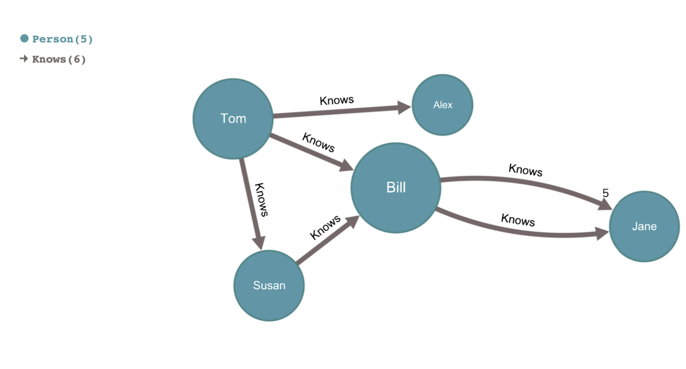
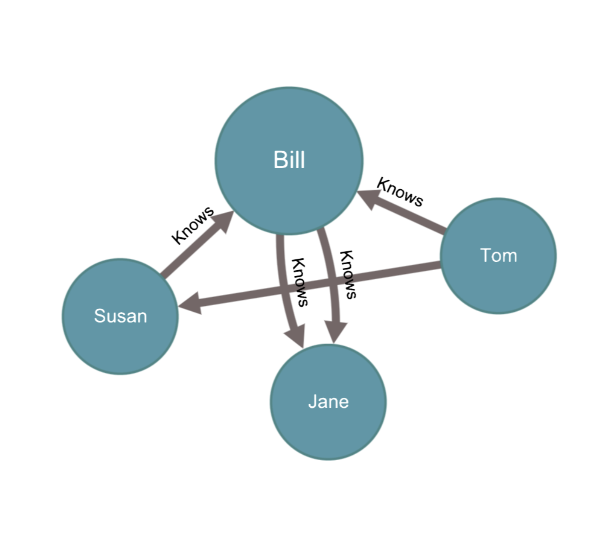
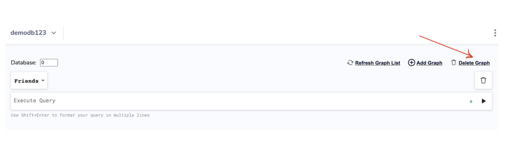

import Authors from '@theme/Authors';
import GraphEol from '@site/docs/common/_graph-eol.mdx';

<GraphEol />
<Authors frontMatter={frontMatter} />

If you’re a Redis user who prefers to use a Graphical User Interface(GUI) for graph queries, then RedisInsight is a right tool for you. It’s 100% free pure desktop Redis GUI that provides easy-to-use browser tools to query, visualize and interactively manipulate graphs. You can add new graphs, run queries and explore the results over the GUI tool.

RedisInsight supports [RedisGraph](https://oss.redis.com/redisgraph/) and allows you to:

- Build and execute queries
- Navigate your graphs
- Browse, analyze, and export results
- Keyboard shortcuts to zoom
- Button to reset view; center entire graph
- Zoom capability via mouse wheel(Double right-click to zoom out, Double right-click to zoom out.)
- Ability to copy commands with a button click
- Ability to persist nodes display choices between queries

As a benefit, you get faster turnarounds when building your application using Redis and RedisGraph.

Follow the below steps to see how your data is connected via the RedisInsight Browser tool.

## Step 1. Create Redis database

[Follow this link to create a Redis database](https://developer.redis.com/howtos/redisgraph) using Redis Cloud with RedisGraph module enabled


## Step 2: Download RedisInsight

To install RedisInsight on your local system, you need to first download the software from the Redis website.

[Click this link ](https://redis.com/redis-enterprise/redis-insight/#insight-form) to access a form that allows you to select the operating system of your choice.


Run the installer. After the web server starts, open http://YOUR_HOST_IP:8001 and add a Redis database connection.

Select "Connect to a Redis database"


Enter the requested details, including Name, Host (endpoint), Port, and Password. Then click “ADD REDIS DATABASE”.

## Step 3: Click “RedisGraph” and then “Add Graph”

Select RedisGraph from the menu.


## Step 4. Create a new Graph called “Friends”


## Step 5. Add new nodes(individuals) and links

Let us add individuals to the graph. CREATE is used to introduce new nodes and relationships.Run the below cypher query on RedisInsight GUI to add a label called person and property called “name”.

```
CREATE (:Person{name:"Tom" }),  (:Person{name:"Alex" }), (:Person{name:"Susan" }), (:Person{name:"Bill" }), (:Person{name:"Jane" })
```


As we see that “1” label is added and that refers to a person label. It’s the same for every node and hence created once. Overall there are 5 nodes created. The five “name” properties refer to 5 name properties that have been added.

## Step 6: View all the individuals (nodes)

Match describes the relationship between queried entities, using ascii art to represent pattern(s) to match against. Nodes are represented by parentheses () , and Relationships are represented by brackets [] .

As shown below, we have added lowercase “p” in front of our label and is a variable we can make a reference to. It returns all the nodes with a label called “Person”.

```
MATCH (p:Person) RETURN p
```


You can select "Graph View" on the right menu to display the graphical representation as shown below:


## Step 7. Viewing just one individual(node)

```
MATCH (p:Person {name:"Tom"}) RETURN p
```


## Step 8: Visualize the relationship between the individuals

Run the below query to build a relationship between two nodes and how the relationship flows from one node(“Tom”) to the another node(“Alex”).

```
MATCH (p1:Person {name: "Tom" }), (p2:Person {name: "Alex" }) CREATE (p1)-[:Knows]->(p2)
```

The symbol “>” (greater than) shows which way the relationship flows.


You can view the relationship in the form of graph as shown below:


## Step 9. Create and visualize the multiple relationships

Run the below query to create and visualize relationsship between the multiple individuals

```
MATCH (p1:Person {name: "Tom" }), (p2:Person {name: "Susan" }), (p3:Person {name: "Bill" }) CREATE (p1)-[:Knows]->(p2), (p1)-[:Knows]->(p3)
```


## Step 10. Create and visualize the relationship between two individuals (Susan and Bill)

Let us look at how to generate graph showcasing the relationship between two individuals - Susan and Bill

```
MATCH (p1:Person {name: "Susan"}), (p2:Person {name: "Bill"}) CREATE (p1)-[:Knows]->(p2)
```


## Step 11. Create and visualize the relationship between two indiviual (Bill and Jane)

```
MATCH (p1:Person {name: "Bill"}), (p2:Person {name: "Jane"}) CREATE (p1)-[:Knows]->(p2)
```


## Step 12. Building a social networking

This can be achieved by “friend of friends” kind of relationship. Say, If Tom wanted to social network with Jane. He has two contacts that know Jane - one is Susan and the other person is Bill.



```
MATCH p = (p1:Person {name: "Tom" })-[:Knows*1..3]-(p2:Person {name: "Jane"}) RETURN p
```

In this query, we assign a variable “p” to a node graph path. We search for “Tom” as p1 and “Jane” as “p2”. We say interested in knows link with 1..3 degree of separation.



## Step 13. Cleaning up the Graph



## Importing the Bulk Graph data

Let us try to insert bulk data using Python and then extrapolate it in the form of nodes and relationships.

## Step 14. Cloning the repository\*\*

```
$ git clone https://github.com/redis-developer/redis-datasets
cd redis-datasets/redisgraph/datasets/iceandfire
```

## Step 15. Execute the script

```
$ python3 bulk_insert.py GOT_DEMO -n data/character.csv -n data/house.csv -n data/book.csv -n data/writer.csv -r data/wrote.csv -r data/belongs.csv -h 192.168.1.9 -p 6379


2124 nodes created with label 'b'character''
438 nodes created with label 'b'house''
12 nodes created with label 'b'book''
3 nodes created with label 'b'writer''
14 relations created for type 'b'wrote''
2208 relations created for type 'b'belongs''
Construction of graph 'GOT_DEMO' complete: 2577 nodes created, 2222 relations created in 0.169954 seconds


```

## Step 16. Run the cypher query

```
GRAPH.QUERY GOT_DEMO "MATCH (w:writer)-[wrote]->(b:book) return w,b"
```


## Additional Resources

- [RedisGraph Project](https://oss.redis.com/redisgraph/)

##

<div>
  <a
    href="https://launchpad.redis.com"
    target="_blank"
    rel="noopener"
    className="link">
    
  </a>
</div>
