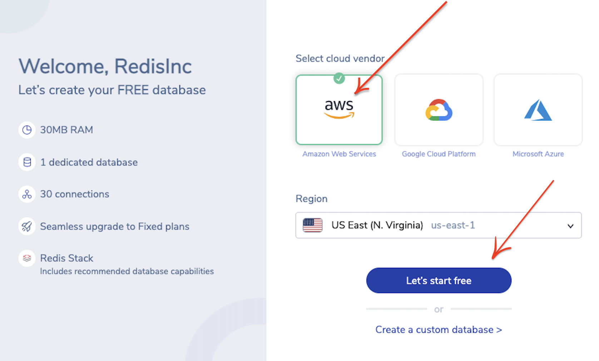

import Authors from '@site/src/theme/Authors';

<Authors frontMatter={frontMatter} />

Redis Stack is an extension of Redis that adds modern data models and processing engines to provide a complete developer experience. Redis Stack provides a simple and seamless way to access different data models such as full-text search, document store, graph, time series, and probabilistic data structures enabling developers to build any real-time data application.

In this tutorial, you will see how Redis Stack can help you in storing and querying JSON documents.

### Step 1. Create a free Cloud account

Create your free <a href="https://redis.com/try-free/" target="_blank" rel="noopener">Redis Enterprise Cloud account</a>. Once you click on “Get Started”, you will receive an email with a link to activate your account and complete your signup process.

:::info TIP
For a limited time, use **TIGER200** to get **$200** credits on Redis Enterprise Cloud and try all the advanced capabilities!

:tada: [Click here to sign up](https://redis.com/try-free)

:::

### Step 2. Create Your database

Choose your preferred cloud vendor. Select the region and then click "Let's start free" to create your free database automatically.

:::info TIP
If you want to create a custom database with your preferred name and type of Redis,
click "Create a custom database" option shown in the image.
:::



### Step 3. Verify the database details

You will be provided with Public endpoint URL and "Redis Stack" as the type of database with the list of modules that comes by default.


### Step 4. Using RedisInsight

RedisInsight is a visual tool that lets you do both GUI- and CLI-based interactions with your Redis database, and so much more when developing your Redis based application. It is a fully-featured pure Desktop GUI client that provides capabilities to design, develop and optimize your Redis application. It works with any cloud provider as long as you run it on a host with network access to your cloud-based Redis server. It makes it easy to discover cloud databases and configure connection details with a single click. It allows you to automatically add Redis Enterprise Software and Redis Enterprise Cloud databases.

[Follow this link](/explore/redisinsightv2/getting-started) to install RedisInsight v2 on your local system.
Assuming that you already have RedisInsight v2 installed on your MacOS, you can browse through the Applications and click "RedisInsight-v2" to bring up the Redis Desktop GUI tool.

### Step 5. Enter Redis Enterprise Cloud details

Add the Redis Enterprise cloud database endpoint, port and password.


### Step 6. Verify the database under RedisInsight dashboard


### Step 7. Getting Started with RedisJSON

The following steps use some basic RedisJSON commands. You can run them from the Redis command-line interface (redis-cli) or use the CLI available in RedisInsight.

To interact with RedisJSON, you will most often use the JSON.SET and JSON.GET commands. Before using RedisJSON, you should familiarize yourself with its commands and syntax as detailed in the documentation: RedisJSON Commands.

Let’s go ahead and test drive some JSON-specific operations for setting and retrieving a Redis key with a JSON value:

- Scalar
- Objects (including nested objects)
- Arrays of JSON objects
- JSON nested objects

#### Scalar

Under RedisJSON, a key can contain any valid JSON value. It can be scalar, objects or arrays. JSON scalar is basically a string. You will have to use the JSON.SET command to set the JSON value. For new Redis keys the path must be the root, so you will use “.” path in the example below. For existing keys, when the entire path exists, the value that it contains is replaced with the JSON value. Here you will use JSON.SET to set the JSON scalar value to “Hello JSON!” Scalar will contain a string that holds “Hello JSON!”

<b>Command</b>:

```
JSON.SET greetings .  ' "Hello JSON!" '
```

<b>Result</b>:

```
OK
```

Use JSON.GET to return the value at path in JSON serialized form:

<b>Command</b>:

```
JSON.GET greetings
```

<b>Result</b>:

```
"\"Hello JSON!\""
```

#### Objects

Let’s look at a JSON object example. A JSON object contains data in the form of a key-value pair. The keys are strings and the values are the JSON types. Keys and values are separated by a colon. Each entry (key-value pair) is separated by a comma. The { (curly brace) represents the JSON object:

```
{
    "employee": {
        "name": "alpha",
        "age": 40,
        "married": true
    }
}
```

Here is the command to insert JSON data into Redis:

<b>Command</b>:

```
JSON.SET employee_profile $ '{ "employee": { "name": "alpha", "age": 40,"married": true }  } '
```

:::important

Please note that the above command works for 2.0+ release of RedisJSON. If you are using the older version of RedisJSON, you can replace "$" with "."
:::

<b>Result</b>:

```
"OK"
```

The subcommands below change the reply’s format and are all set to the empty string by default: _ INDENT sets the indentation string for nested levels _. NEWLINE sets the string that’s printed at the end of each line. \* SPACE sets the string that’s put between a key and a value:

<b>Command</b>:

```
JSON.GET employee_profile
```

<b>Result</b>:

```
"{\"employee\":{\"name\":\"alpha\",\"age\":40,\"married\":true}}"
```

#### Retrieving a part of JSON document

You can also retrieve a part of the JSON document from Redis. In the example below, “.ans” can be passed in the commandline to retrieve the value 4:

<b>Command</b>:

```
JSON.SET object . '{"foo":"bar", "ans":"4" }'
```

<b>Result</b>:

```
"OK"
```

<b>Command</b>:

```
JSON.GET object
```

<b>Result</b>:

```
"{\"foo\":\"bar\",\"ans\":\"4\"}"
```

<b>Command</b>:

```
JSON.GET object .ans
```

<b>Results</b>:

```
"\"4\""
```

#### Retrieving the type of JSON data

JSON.TYPE reports the type of JSON value at path and path defaults to root if not provided. If the key or path do not exist, null is returned.

<b>Command</b>:

```
JSON.TYPE employee_profile
```

<b>Result:</b>

```
"Object"
```

#### JSON arrays of objects

The JSON array represents an ordered list of values. A JSON array can store multiple values, including strings, numbers, or objects. In JSON arrays, values must be separated by a comma. The [ (square bracket) represents the JSON array. Let’s look at a simple JSON array example with four objects:

```
{"employees":[
    {"name":"Alpha", "email":"alpha@gmail.com", "age":23},
    {"name":"Beta", "email":"beta@gmail.com", "age":28},
    {"name":"Gamma", "email":"gamma@gmail.com", "age":33},
    {"name":"Theta", "email":"theta@gmail.com", "age":41}
]}
```

<b>Command</b>:

```
JSON.SET testarray .  '{"employees":[         {"name":"Alpha", "email":"alpha@gmail.com", "age":23},         {"name":"Beta", "email":"beta@gmail.com", "age":28},       {"name":"Gamma", "email":"gamma@gmail.com", "age":33},         {"name":"Theta", "email":"theta@gmail.com", "age":41}    ]}   '
```

<b>Result:</b>

```
"OK"
```

<b>Command</b>:

```
JSON.GET testarray
```

<b>Result:</b>

```
"{\"employees\":[{\"name\":\"Alpha\",\"email\":\
alpha@gmail.com

\",\"age\":23},{\"name\":\"Beta\",\"email\":\"beta@gmail.com....
```

#### JSON nested objects

A JSON object can also have another object. Here is a simple example of a JSON object having another object nested in it:

<b>Command</b>:

```
>> JSON.SET employee_info . ' { "firstName": "Alpha",         "lastName": "K", "age": 23,        "address" : {            "streetAddress": "110 Fulbourn Road Cambridge",  "city": "San Francisco", "state": "California", "postalCode": "94016"  } } '
```

<b>Command</b>:

```
>> JSON.GET employee_info
```

<b>Result</b>:

```
"{\"firstName\":\"Alpha\",\"lastName\":\"K\",\"age\":23,\"address\":{\"streetAddress\":\"110 Fulbourn Road Cambridge\",\"city\":\"San Francisco\",\"state\":\"California\",\"postalCode\":\"94016\"}}"
```

### Next Steps

- [RU204: Storing, Querying and Indexing JSON at Speed](https://university.redis.com/courses/ru204/) - a course at Redis University
- Learn more about [RedisJSON](https://oss.redis.com/redisjson/) in the Quickstart tutorial.
- [How to build shopping cart app using NodeJS and RedisJSON](/howtos/shoppingcart)
- [Indexing, Querying, and Full-Text Search of JSON Documents with Redis](https://redis.com/blog/index-and-query-json-docs-with-redis/)

##

<div>
  <a
    href="https://launchpad.redis.com"
    target="_blank"
    rel="noopener"
    className="link">

    

  </a>
</div>
