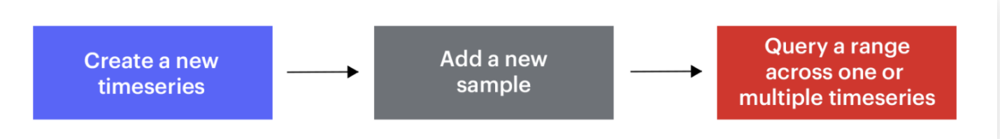

[RedisTimeseries](https://redis.com/modules/redis-timeseries/) is a Redis module developed by Redis Inc. to enhance your experience managing time-series data with Redis. It simplifies the use of Redis for time-series use cases such as internet of things (IoT) data, stock prices, and telemetry. With RedisTimeSeries, you can ingest and query millions of samples and events at the speed of Redis. Advanced tooling such as downsampling and aggregation ensure a small memory footprint without impacting performance. Use a variety of queries for visualization and monitoring with built-in connectors to popular monitoring tools like Grafana, Prometheus, and Telegraf.

<div class="text--center">
  <iframe
    width="760"
    height="415"
    src="https://www.youtube.com/embed/nkUZqxjs2rk"
    title="YouTube video player"
    frameborder="0"
    allow="accelerometer; autoplay; clipboard-write; encrypted-media; gyroscope; picture-in-picture"
    allowfullscreen></iframe>
</div>

### Step 1. Create a free Cloud account

Create your free <a href="https://redis.com/try-free/" target="_blank" rel="noopener">Redis Enterprise Cloud account</a>. Once you click on “Get Started”, you will receive an email with a link to activate your account and complete your signup process.

:::info TIP
For a limited time, use **TIGER200** to get **$200** credits on Redis Enterprise Cloud and try all the advanced capabilities!

:tada: [Click here to sign up](https://redis.com/try-free)

:::

### Step 2. Create Your database

Choose your preferred cloud vendor. Select the region and then click "Let's start free" to create your free database automatically.

:::info TIP
If you want to create a custom database with your preferred name and type of Redis,
click "Create a custom database" option shown in the image.
:::


### Step 3. Verify the database details

You will be provided with Public endpoint URL and "Redis Stack" as the type of database with the list of modules that comes by default.


### Step 4. Install RedisInsight

RedisInsight is a visual tool that lets you do both GUI- and CLI-based interactions with your Redis database, and so much more when developing your Redis based application. It is a fully-featured pure Desktop GUI client that provides capabilities to design, develop and optimize your Redis application. It works with any cloud provider as long as you run it on a host with network access to your cloud-based Redis server. It makes it easy to discover cloud databases and configure connection details with a single click. It allows you to automatically add Redis Enterprise Software and Redis Enterprise Cloud databases.

You can install Redis Stack on your local system to get RedisInsight GUI tool up and running. Ensure that you have the `brew` package installed in your Mac system.

```bash
 brew tap redis-stack/redis-stack
 brew install --cask redis-stack
```

```
  ==> Installing Cask redis-stack-redisinsight
  ==> Moving App 'RedisInsight-preview.app' to '/Applications/RedisInsight-preview.app'
  🍺  redis-stack-redisinsight was successfully installed!
  ==> Installing Cask redis-stack
  🍺  redis-stack was successfully installed!
```

Go to Applications and click "RedisInsight-v2" to bring up the Redis Desktop GUI tool.

### Step 5. Add Redis database


### Step 6. Enter Redis Enterprise Cloud details

Add the Redis Enterprise cloud database endpoint, port and password.


### Step 7. Verify the database under RedisInsight dashboard


### Step 8. Getting Started with RedisTimeSeries

This section will walk you through using some basic RedisTimeseries commands. You can run them from the Redis command-line interface (redis-cli) or use the CLI available in RedisInsight. (See part 2 of this tutorial to learn more about using the RedisInsight CLI.)
Using a basic air-quality dataset, we will show you how to:

- Create a new time series
- Add a new sample to the list of series
- Query a range across one or multiple time series



#### Create a new time series

Let’s create a time series representing air quality dataset measurements. To interact with RedisTimeSeries you will most often use the TS.RANGE command, but here you will create a time series per measurement using the TS.CREATE command. Once created, all the measurements will be sent using TS.ADD.

The sample command below creates a time series and populates it with three entries:

```
>> TS.CREATE ts:carbon_monoxide
>> TS.CREATE ts:relative_humidity
>> TS.CREATE ts:temperature RETENTION 60 LABELS sensor_id 2 area_id 32
```

In the above example, ts:carbon_monoxide, ts:relative_humidity and ts:temperature are key names. We are creating a time series with two labels (sensor_id and area_id are the fields with values 2 and 32 respectively) and a retention window of 60 milliseconds:

#### Add a new sample data to the time series

Let’s start to add samples into the keys that will be automatically created using this command:

```
>> TS.ADD ts:carbon_monoxide 1112596200 2.4
>> TS.ADD ts:relative_humidity 1112596200 18.3
>> TS.ADD ts:temperature 1112599800 28.3
```

```
>> TS.ADD ts:carbon_monoxide 1112599800 2.1
>> TS.ADD ts:relative_humidity 1112599800 13.5
>> TS.ADD ts:temperature 1112603400 28.5
```

```
>> TS.ADD ts:carbon_monoxide 1112603400 2.2
>> TS.ADD ts:relative_humidity 1112603400 13.1
>> TS.ADD ts:temperature 1112607000 28.7
```

#### Querying the sample

Now that you have sample data in your time series, you’re ready to ask questions such as:

#### “How do I get the last sample?”

TS.GET is used to get the last sample. The returned array will contain the last sample timestamp followed by the last sample value, when the time series contains data:

```
>> TS.GET ts:temperature
1) (integer) 1112607000
2) "28.7"
```

#### “How do I get the last sample matching the specific filter?”

TS.MGET is used to get the last samples matching the specific filter:

```
>> TS.MGET FILTER area_id=32
1) 1) "ts:temperature"
   2) (empty list or set)
   3) 1) (integer) 1112607000
      2) "28.7"
```

#### “How do I get the sample with labels matching the specific filter?”

```
>> TS.MGET WITHLABELS FILTER area_id=32
1) 1) "ts:temperature"
   2) 1) 1) "sensor_id"
         2) "2"
      2) 1) "area_id"
         2) "32"
   3) 1) (integer) 1112607000
      2) "28.7"
```

#### Query a range across one or more time series

TS.RANGE is used to query a range in forward directions while TS.REVRANGE is used to query a range in reverse directions, They let you answer such questions as:

#### “How do I get the sample for a time range?”

```
>> TS.RANGE ts:carbon_monoxide 1112596200 1112603400
1) 1) (integer) 1112596200
   2) "2.4"
2) 1) (integer) 1112599800
   2) "2.1"
3) 1) (integer) 1112603400
   2) "2.2"
```

#### Aggregation

You can use various aggregation types such as avg, sum, min, max, range, count, first, last etc. The example below example shows how to use “avg” aggregation type to answer such questions as:

#### “How do I get the sample for a time range on some aggregation rule?”

```
>> TS.RANGE ts:carbon_monoxide 1112596200 1112603400 AGGREGATION avg 2
1) 1) (integer) 1112596200
   2) "2.4"
2) 1) (integer) 1112599800
   2) "2.1"
3) 1) (integer) 1112603400
   2) "2.2"
```

### Next Step

- Learn more about RedisTimeSeries in the [Quickstart](https://oss.redis.com/redistimeseries/) tutorial.
- [Build Your Financial Application on RedisTimeSeries](https://redis.com/blog/build-your-financial-application-on-redistimeseries/)
- [How to Manage Real-Time IoT Sensor Data in Redis](https://redis.com/blog/how-to-manage-real-time-iot-sensor-data-in-redis/)
- [Introduction to RedisTimeSeries - Video](https://www.youtube.com/watch?v=rXynFOrrd-Q)

##

<div>
  <a
    href="https://launchpad.redis.com"
    target="_blank"
    rel="noopener"
    className="link">
    {' '}
    
  </a>
</div>
