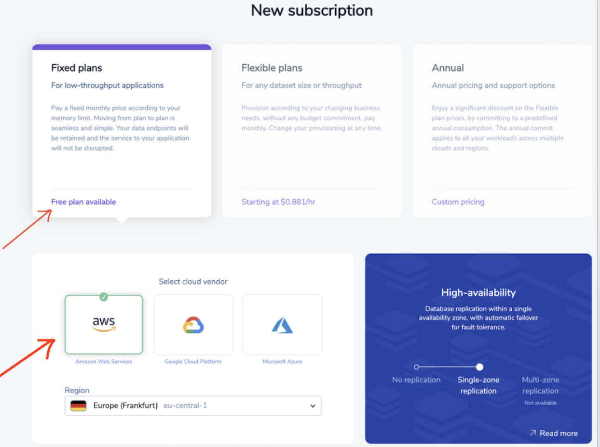

import Authors from '@site/src/theme/Authors';

<Authors frontMatter={frontMatter} />


RedisTimeSeries is a Redis module that allows Redis to be used as a fast in-memory time series database designed to collect, manage, and deliver time series data at scale. The RedisTimeSeries module shares the performance and simplicity aspects of Redis. Under the hood, it uses efficient data structures such as Radix tree to index data by timestamp, which makes it extremely fast and efficient to run time-aggregate queries.

## RedisTimeSeries Go Client

redistimeseries-go is a package that gives developers easy access to the RedisTimeSeries module. Go client for RedisTimeSeries ([https://github.com/RedisTimeSeries/redistimeseries](https://github.com/RedisTimeSeries/redistimeseries)), based on redigo.Client and ConnPool based on the work of dvirsky and mnunberg on [https://github.com/RediSearch/redisearch-go](https://github.com/RediSearch/redisearch-go)

Follow the steps below to get started with RedisTimeSeries with Go:

### Step 1. Create free Redis Enterprise Cloud account

Create your free [Redis Enterprise Cloud account](https://redis.com/try-free/). Once you click on “Get Started”, you will receive an email with a link to activate your account and complete your signup process.


### Step 2. Create Your subscription

Next, you will have to create a Redis Enterprise Cloud subscription. In the Redis Enterprise Cloud menu, click "Create your Subscription".


### Step 3. Select the right Subscription Plan

#### Select "Fixed Plan" for low throughout application as for now.


### Step 4. Select cloud vendor

For the cloud provider, select your preferred cloud (for demo purpose)



### Step 5. Click "Create Subscription"

Finally, click on the "Create Subscription" button.


You can now verify the subscription as shown below:


### Step 6. Create database

Click "Create Database". Enter database name and your preferred module.


### Step 7.Installing RedisTimeSeries Go client

```
$ go get github.com/RedisTimeSeries/redistimeseries-go
```

### Step 8. Writing the Go program

```

package main

import (
        "fmt"
        redistimeseries "github.com/RedisTimeSeries/redistimeseries-go"
)

func main() {
                // Connect to localhost with no password
        var client = redistimeseries.NewClient("redis-XXXX.c264.ap-south-1-1.ec2.cloud.redislabs.com:port", "add your password here", nil)
        var keyname = "mytest"
        _, haveit := client.Info(keyname)
        if haveit != nil {
                        client.CreateKeyWithOptions(keyname, redistimeseries.DefaultCreateOptions)
                        client.CreateKeyWithOptions(keyname+"_avg", redistimeseries.DefaultCreateOptions)
                        client.CreateRule(keyname, redistimeseries.AvgAggregation, 60, keyname+"_avg")
        }
                // Add sample with timestamp from server time and value 100
        // TS.ADD mytest * 100
        _, err := client.AddAutoTs(keyname, 100)
        if err != nil {
                fmt.Println("Error:", err)
        }
}

```

### Step 9. Run the Go program

```bash
 go run test.go
```

### Step 10. Monitor the Redis database

```
monitor
OK
1635490098.157530 [0 52.149.144.189:48430] "TS.INFO" "mytest"
1635490098.353530 [0 52.149.144.189:48430] "TS.CREATE" "mytest"
1635490098.553530 [0 52.149.144.189:48430] "TS.CREATE" "mytest_avg"
1635490098.753530 [0 52.149.144.189:48430] "TS.CREATERULE" "mytest" "mytest_avg" "AGGREGATION" "AVG" "60"
1635490098.949529 [0 52.149.144.189:48430] "TS.ADD" "mytest" "*" "100"
```

## References

- [Getting Started with RedisTimeSeries](/howtos/redistimeseries/getting-started/)
- Learn more about RedisTimeSeries in the [Quickstart](https://oss.redis.com/redistimeseries/) tutorial.
- [Build Your Financial Application on RedisTimeSeries](https://redis.com/blog/build-your-financial-application-on-redistimeseries/)
- [How to Manage Real-Time IoT Sensor Data in Redis](https://redis.com/blog/how-to-manage-real-time-iot-sensor-data-in-redis/)
- [Introduction to RedisTimeSeries - Video](https://www.youtube.com/watch?v=rXynFOrrd-Q)
