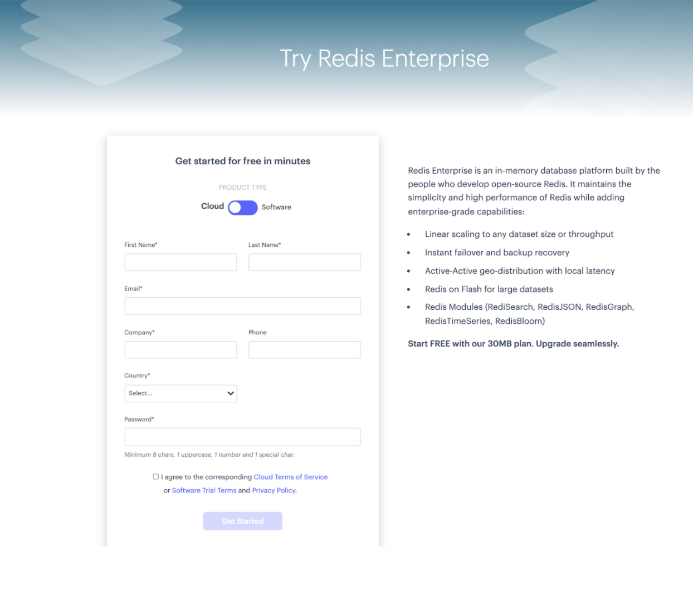
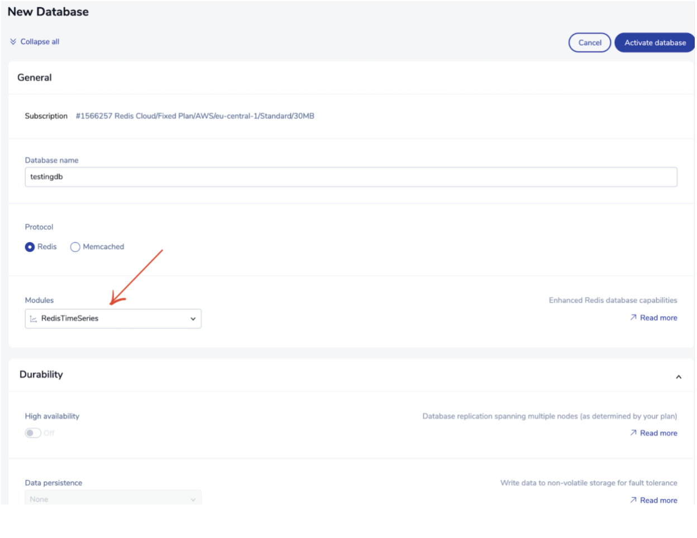

Time series data is a series of data stored in the time order (Example: Stock performance over time). Industries today are collecting and analyzing time-based data more than ever before. Traditional databases that rely on relational or document data models are designed neither for storing and indexing data based on time, nor for running time-bucketed aggregation queries. Time-series databases fill this void by providing a data model that optimizes data indexing and querying by time.

RedisTimeSeries is a Redis module that allows Redis to be used as a fast in-memory time series database designed to collect, manage, and deliver time series data at scale. The RedisTimeSeries module shares the performance and simplicity aspects of Redis. Under the hood, it uses efficient data structures such as Radix tree to index data by timestamp, which makes it extremely fast and efficient to run time-aggregate queries.


## RedisTimeSeries Python Client

The redistimeseries-py is a package that gives developers easy access to the RedisTimeSeries module. The package extends [redis-py](https://github.com/andymccurdy/redis-py)'s interface with RedisTimeSeries's API.

Follow the steps below to get started with RedisTimeSeries with Python:


### Step 1. Create a free Redis Enterprise cloud account

Create your free [Redis Enterprise Cloud account](https://redislabs.com/try-free/). Once you click on “Get Started”, you will receive an email with a link to activate your account and complete your signup process.





### Step 2. Create Your subscription

Next, you will have to create a Redis Enterprise Cloud subscription. In the Redis Enterprise Cloud menu, click "Create your Subscription".


### Step 3. Select the right Subscription Plan


Select "Fixed Plan" for low throughout application as for now.


### Step 4. Select cloud vendor

For the cloud provider, select your preferred cloud (for demo purpose)


### Step 5. Click "Create Subscription"

Finally, click on the "Create Subscription" button.


You can now verify the subscription as shown below:


### Step 6. Create database

Click "Create Database". Enter database name and your preferred module.





### Step 7.Installation


```
$ pip install redistimeseries
```


```
Collecting redistimeseries
  Downloading redistimeseries-1.4.3.tar.gz (8.1 kB)
Collecting hiredis>=0.2.0
  Downloading hiredis-2.0.0.tar.gz (75 kB)
     |████████████████████████████████| 75 kB 4.1 MB/s 
Collecting redis>=2.10
  Downloading redis-3.5.3-py2.py3-none-any.whl (72 kB)
     |████████████████████████████████| 72 kB 1.1 MB/s 
Collecting rmtest>=0.2
  Downloading rmtest-0.7.0.tar.gz (6.8 kB)
Using legacy setup.py install for redistimeseries, since package 'wheel' is not installed.
Using legacy setup.py install for hiredis, since package 'wheel' is not installed.
Using legacy setup.py install for rmtest, since package 'wheel' is not installed.
Installing collected packages: hiredis, redis, rmtest, redistimeseries
    Running setup.py install for hiredis ... done
    Running setup.py install for rmtest ... done
    Running setup.py install for redistimeseries ... done
Successfully installed hiredis-2.0.0 redis-3.5.3 redistimeseries-1.4.3 rmtest-0.7.0
```

### Step 8. Create a script file

```bash
 from redistimeseries.client import Client as RedisTimeSeries
 import time
 import sys
 import site
 import datetime
 import random

 print(' \n '.join(sys.path))
 redis = RedisTimeSeries(host='redis-XXXX.c264.ap-south-1-1.ec2.cloud.redislabs.com', port=<add port>, password=<add password>)
 # redis.flushdb()
 key = 'temperature'
 def create(key):
        print('\n Create new time series: %s' % str(key))
        #redis.create(key,retentionSecs=30,labels={'sensor_id' : 2,'area_id' : 32})
        redis.create(key,retention_msecs=30000,labels={'sensor_id' : 2,'area_id' : 32})
        print('')
 def store(key, interval):
        print("\n Append new value to time series:\n")
        begin_time = int(time.time())
        for i in range(interval):
                timestamp = int(time.time())
                value = round(random.uniform(0.0,100.0),2)
                timestamp_strftime = datetime.datetime.fromtimestamp(timestamp).strftime('%Y-%m-%d %H:%M:%S')
                sys.stdout.write(' %s : %.2f \n' % (timestamp_strftime, value))
                sys.stdout.flush()
                #redis.add(key,timestamp,value,retentionSecs=30, labels={'sensor_id' : 2,'area_id' : 32})
                redis.add(key,timestamp,value,retention_msecs=30000, labels={'sensor_id' : 2,'area_id' : 32})
                time.sleep(1)
        end_time = int(time.time()-1)
        return (begin_time, end_time)
 def query(key, begin_time, end_time):
        begin_time_datetime = datetime.datetime.fromtimestamp(begin_time).strftime('%Y-%m-%d %H:%M:%S')
        end_time_datetime = datetime.datetime.fromtimestamp(end_time).strftime('%Y-%m-%d %H:%M:%S')
        print("\n Query time series in range:\n\n %s to %s \n" % (begin_time_datetime, end_time_datetime))
        try:
                #for record in redis.range(key,begin_time, end_time,bucketSizeSeconds=1):
                for record in redis.range(key,begin_time, end_time,bucket_size_msec=1000):
                        timestamp = datetime.datetime.fromtimestamp(record[0]).strftime('%Y-%m-%d %H:%M:%S')
                        value = round(float(record[1]),2)
                        print(' %s : %.2f ' % (timestamp,value))
        except Exception as e:
                print("\n Error: %s" % e)
        print('')
 def print_info():
        print('\n Query time series info:\n')
        for key in redis.keys('*'):
                print(' key=%s' % (key.decode('utf8')))
                info = redis.info(key)
                sensor = info.labels['sensor_id']
                print(" sensor_id=%s " % str(sensor))
                area = info.labels['area_id']
                print(" area_id=%s " % str(area))
                last_time_stamp_seconds = info.__dict__['lastTimeStamp']
                last_time_stamp = datetime.datetime.fromtimestamp(last_time_stamp_seconds).strftime('%Y-%m-%d %H:%M:%S')
                print(" last_time_stamp=%s " % str(last_time_stamp))

        print('')

 def print_loop(loops):

        for i in range(loops):

                if i == 0:
                        sys.stdout.write(' ')

                sys.stdout.write('.')
                sys.stdout.flush()
                time.sleep(1)

        print('')

 create(key)
 interval = 10
 begin_time, end_time = store(key,interval)
 time.sleep(1)
 query(key,begin_time,end_time)
 query(key,begin_time+4,end_time-5)
 print_info()
 print('\n Set expire key: %s' % str(key))
 redis.expire(key, (30))
 loops = 30
 print_loop(loops)
 query(key,begin_time,end_time)
 time.sleep(1)
 interval = 1
 create(key)
 begin_time, end_time = store(key,interval)
 time.sleep(1)
 query(key,begin_time,end_time)
 time.sleep(1)
 print('\n Delete key: %s' % str(key))
 redis.delete(key)
 time.sleep(1)

 query(key,begin_time,end_time)

 print('')

```

Save the above file with a name "ts.py".  

### Step 9. Executing the python script

```bash
 python3 ts.py
```

### Step 10. Monitor the Redis database


```
OK
1635487154.447976 [0 52.149.144.189:40066] "TS.CREATE" "temperature" "RETENTION" "30000" "LABELS" "sensor_id" "2" "area_id" "32"
1635487199.379907 [0 52.149.144.189:40572] "AUTH" "9740535000"
1635487199.575906 [0 52.149.144.189:40572] "TS.CREATE" "temperature" "RETENTION" "30000" "LABELS" "sensor_id" "2" "area_id" "32"
1635487199.775906 [0 52.149.144.189:40572] "TS.ADD" "temperature" "1635487199" "59.85" "RETENTION" "30000" "LABELS" "sensor_id" "2" "area_id" "32"
1635487200.975904 [0 52.149.144.189:40572] "TS.ADD" "temperature" "1635487200" "61.88" "RETENTION" "30000" "LABELS" "sensor_id" "2" "area_id" "32"
1635487202.175902 [0 52.149.144.189:40572] "TS.ADD" "temperature" "1635487202" "90.04" "RETENTION" "30000" "LABELS" "sensor_id" "2" "area_id" "32"
1635487203.375900 [0 52.149.144.189:40572] "TS.ADD" "temperature" "1635487203" "35.47" "RETENTION" "30000" "LABELS" "sensor_id" "2" "area_id" "32"
1635487204.575899 [0 52.149.144.189:40572] "TS.ADD" "temperature" "1635487204" "60.43" "RETENTION" "30000" "LABELS" "sensor_id" "2" "area_id" "32"
1635487205.775897 [0 52.149.144.189:40572] "TS.ADD" "temperature" "1635487205" "45.16" "RETENTION" "30000" "LABELS" "sensor_id" "2" "area_id" "32"
1635487206.975895 [0 52.149.144.189:40572] "TS.ADD" "temperature" "1635487206" "32.69" "RETENTION" "30000" "LABELS" "sensor_id" "2" "area_id" "32"
1635487208.175893 [0 52.149.144.189:40572] "TS.ADD" "temperature" "1635487208" "48.51" "RETENTION" "30000" "LABELS" "sensor_id" "2" "area_id" "32"
1635487209.379891 [0 52.149.144.189:40572] "TS.ADD" "temperature" "1635487209" "27.56" "RETENTION" "30000" "LABELS" "sensor_id" "2" "area_id" "32"
1635487210.579889 [0 52.149.144.189:40572] "TS.ADD" "temperature" "1635487210" "53.58" "RETENTION" "30000" "LABELS" "sensor_id" "2" "area_id" "32"
1635487212.779886 [0 52.149.144.189:40572] "TS.RANGE" "temperature" "1635487199" "1635487210"
1635487212.979886 [0 52.149.144.189:40572] "TS.RANGE" "temperature" "1635487203" "1635487205"
```

You will see bunch of RedisTimeSeries specific commands(TS.ADD. TS.CREATE and TS.RANGE) as shown above.

## References

- [Getting Started with RedisTimeSeries](/howtos/redistimeseries/getting-started/)
- Learn more about RedisTimeSeries in the [Quickstart](https://oss.redislabs.com/redistimeseries/) tutorial.
- [Build Your Financial Application on RedisTimeSeries](https://redislabs.com/blog/build-your-financial-application-on-redistimeseries/)
- [How to Manage Real-Time IoT Sensor Data in Redis](https://redislabs.com/blog/how-to-manage-real-time-iot-sensor-data-in-redis/)
- [Introduction to RedisTimeSeries - Video](https://www.youtube.com/watch?v=rXynFOrrd-Q)

##

<div>
<a href="https://launchpad.redis.com" target="_blank" rel="noopener" className="link"> </a>
</div>
