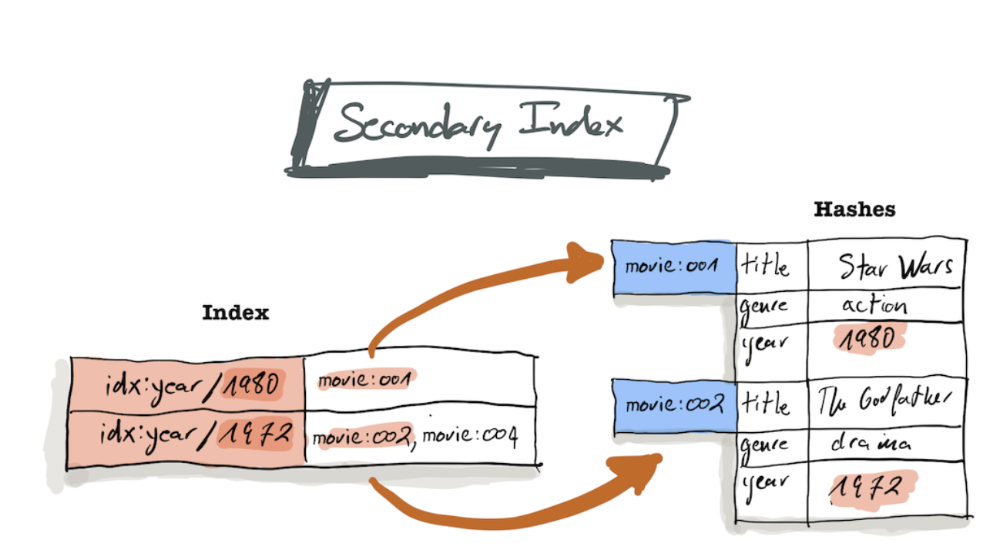

In this blog post we’ll build a social network application using RediSearch and NodeJS. This is the idea that we used for our app [Skillmarket](https://www.youtube.com/watch?v=18NPKZy28cQ)

The goal of the application is to match users with complementary skills. It will allow users to register and provide some information about themselves, like location, areas of expertise and interests. Using RediSearch it will match two users who are geographically close, and have complementary areas of expertise and interests, e.g., one of them knows French and want to learn Guitar and the other knows Guitar and want to learn French.

The full source code of our application can be found in GitHub (note that we used some features like <code>[FT.ADD](https://oss.redis.com/redisearch/Commands/#ftadd)</code> which now are deprecated):


* [Skillmarket Backend](https://github.com/julianmateu/skillmarket-backend)
* [Skillmarket Frontend](https://github.com/julianmateu/skillmarket-front)

We will be using a more condensed version of the backend which can be found in the [Skillmarket Blogpost](https://github.com/julianmateu/skillmarket-blogpost) GitHub repo.

Refer to the [official tutorial](https://github.com/RediSearch/redisearch-getting-started) for more information about RediSearch.


## Getting Familiar with RediSearch 


### Launching RediSearch in a Docker container

Let’s start by launching Redis from the RediSearch image using Docker:


```
docker run -d --name redis redislabs/redisearch:latest
```


Here we use the `docker run` command to start the container and pull the image if it is not present. The `-d` flag tells docker to launch the container in the background (detached mode). We provide a name with `--name redis` which will allow us to refer to this container with a friendly name instead of the hash or the random name docker will assign to it. 

Finally, `redislabs/readisearch:latest` tells docker to use the `latest` version of the <code>[redislabs/readisearch image](https://hub.docker.com/r/redislabs/redisearch)</code>

Once the image starts, we can use `docker exec` to launch a terminal inside the container, using the `-it` flag (interactive tty) and specifying the `redis` name provided before when creating the image, and the `bash` command:


```
docker exec -it redis bash
```


Once inside the container, let’s launch a `redis-cli` instance to familiarize ourselves with the CLI:


```
redis-cli
```


You will notice the prompt now indicates we’re connected to `127.0.0.1:6379`


### Creating Users

We’ll use a Hash as the data structure to store information about our users. This will be a proof of concept, so our application will only use Redis as the data store. For a real life scenario, it would probably be better to have a primary data store which is the authoritative source of user data, and use Redis as the search index which can be used to speed up searches.

In a nutshell, you can think of a hash as a key/value store where the key can be any string we want, and the values are a document with several fields. It’s common practise to use the hash to store many different types of objects, so they can be prefixed with their type, so a key would take the form of "object_type:id".

An index will then be used on this hash data structure, to efficiently search for values of given fields. The following diagram taken from the RediSearch docs exeplifies this with a database for movies: 





Use the `help @hash` command (or refer to the [documentation](https://redis.io/commands#hash)) to get a list of commands that can be used to manipulate hashes. To get help for a single command, like `HSET` let’s type `help HSET`:


```
127.0.0.1:6379> help hset

  HSET key field value [field value ...]
  summary: Set the string value of a hash field
  since: 2.0.0
  group: hash
```


As we see, we can provide a key and a list of `field value` pairs.

We’ll create a user in the hash table by using `user:id` as the key, and we’ll provide the fields `expertises`, `interests` and `location`:


```
HSET users:1 name "Alice" expertises "piano, dancing" interests "spanish, bowling" location "2.2948552,48.8736537"

HSET users:2 name "Bob" expertises "french, spanish" interests "piano" location "2.2945412,48.8583206"

HSET users:3 name "Charles" expertises "spanish, bowling" interests "piano, dancing" location "-0.124772,51.5007169"

```


### Query to match users

Here we can see the power of the RediSearch index, which allows us to query by [tags](https://oss.redis.com/redisearch/Tags/) (we provide a list of values, such as interests, and it will return any user whose interests match at least one value in the list), and [Geo](https://oss.redis.com/redisearch/Query_Syntax/#geo_filters_in_query) (we can ask for users whose location is at a given radius in km from a point).

To be able to do this, we have to instruct RediSearch to create an index:


```
FT.CREATE idx:users ON hash PREFIX 1 "users:" SCHEMA interests TAG expertises TAG location GEO
```


We use the <code>[FT.CREATE](https://oss.redis.com/redisearch/Commands/#ftcreate)</code> command to create a full text search index named <code>idx:users</code>. We specify <code>ON hash</code> to indicate that we’re indexing the hash table, and provide <code>PREFIX 1 "users:"</code> to indicate that we should index any document whose key starts with the prefix “users:”. Finally we indicate the <code>SCHEMA</code> of the index by providing a list of fields to index, and their type.

Finally, we can query the index using the <code>[FT.SEARCH](https://oss.redis.com/redisearch/Commands/#ftsearch)</code> command (see the [query syntax reference](https://oss.redis.com/redisearch/Query_Syntax/#search_query_syntax)):


```
127.0.0.1:6379> FT.SEARCH idx:users "@interests:{dancing|piano} @expertises:{spanish|bowling} @location:[2.2948552 48.8736537 5 km]"
1) (integer) 1
2) "users:2"
3) 1) "name"
   2) "Bob"
   3) "expertises"
   4) "french, spanish"
   5) "interests"
   6) "piano"
   7) "location"
   8) "2.2945412,48.8583206"
```


In this case we’re looking for matches for Alice, so we use her expertises in the `interests` field of the query, and her interests in the `expertises` field. We also search for users in a 5km radius from her location, and we get Bob as a match.

If we expand the search radius to 500km we’ll also see that Charles is returned:


```
127.0.0.1:6379> FT.SEARCH idx:users "@interests:{dancing|piano} @expertises:{spanish|bowling} @location:[2.2948552 48.8736537 500 km]"
1) (integer) 2
2) "users:3"
3) 1) "name"
   2) "Charles"
   3) "expertises"
   4) "spanish, bowling"
   5) "interests"
   6) "piano, dancing"
   7) "location"
   8) "-0.124772,51.5007169"
4) "users:2"
5) 1) "name"
   2) "Bob"
   3) "expertises"
   4) "french, spanish"
   5) "interests"
   6) "piano"
   7) "location"
   8) "2.2945412,48.8583206"

```


### Cleaning Up

We can now remove the docker instance and move on to building the web application, running the following command from outside the instance:


```
 docker rm -f redis

```


### Building a minimal backend in Typescript

After understanding how the index works, let’s build a minimal backend API in NodeJS that will allow us to create a user, and query for matching users.

Please note that this is just an example, and we’re not providing proper validation or error handling, nor other features required for the backend (e.g. authentication).


### Redis client

We’ll use the [node-redis](https://www.npmjs.com/package/redis) package to create a client:


```
const {
    REDIS_PORT = 6379,
    REDIS_HOST = 'localhost',
} = process.env;

const client: RediSearchClient = createClient({
    port: Number(REDIS_PORT),
    host: REDIS_HOST,
});
```


Given that the raw client does not include the functions from the rediSearch module, we have to add them by defining a new type and adding the commands (this is what the [redis-redisearch](https://www.npmjs.com/package/redis-redisearch) module does, and there’s also another module named [redisearchclient](https://www.npmjs.com/package/redisearchclient) which also provides more functions instead of providing arguments as strings).


```
type RediSearchClient = RedisClient & {
    ft_create?(args: any): any;
    ft_search?(args: any): any;
    hgetallAsync?(key: string): Promise<any>
    hsetAsync?(key: string, fields: string[]): Promise<any>
    ft_createAsync?(index: string, args: string[]): Promise<any>
    ft_searchAsync?(index: string, query: string): Promise<any>
};

addCommand('ft.create');
addCommand('ft.search');
```


All the functions in the library use callbacks, but we can use `promisify` to enable the `async/await` syntax:


```
client.hgetallAsync = promisify(client.hgetall).bind(client);
client.hsetAsync = promisify(client.hset).bind(client);
client.ft_createAsync = promisify(client.ft_create).bind(client);
client.ft_searchAsync = promisify(client.ft_search).bind(client);
```


Finally, let’s define a function to create the user index, as we did before in the CLI example:


```
async function createUserIndex() {
    client.ft_createAsync(
        'idx:users',
        ['ON', 'hash', 'PREFIX', '1', 'users:', 'SCHEMA', 'interests', 'TAG', 'expertises', 'TAG', 'location', 'GEO']
    );
}

```


### User controller

Let’s define the functions that the controller will use to expose a simple API on top of Redis. We’ll define 3 functions: - `findUserById(userId)` - `createUser(user)` - `findMatchesForUser(user)`

But first let’s define the model we’ll use for the users:


```
interface Location {
    latitude: number;
    longitude: number;
};

interface User {
    id?: string;
    name: string;
    interests: string[];
    expertises: string[];
    location: Location
};
```


Let’s start with the function to create a user from the model object:


```
async function createUser(user: User): Promise<string> {
    const id = uuid();
    redisearchClient.hsetAsync(`users:${id}`, _userToSetRequestString(user));
    return id;
}

function _userToSetRequestString(user: User): string[] {
    const { id, location, interests, expertises, ...fields } = user;
    let result = Object.entries(fields).flat();
    result.push('interests', interests.join(', '));
    result.push('expertises', expertises.join(', '));
    result.push('location', `${location.longitude},${location.latitude}`);
    return result;
}
```


We will create a UUID for the user, and then transform the TAG and GEO fields to the redis format. Here’s an example of how these two formats look like:


Let’s now look at the logic to retrieve an existing user from the Hash table using `HGETALL`:


```
async function findUserById(userId: string): Promise<User> {
    const response = await redisearchClient.hgetallAsync(`users:${userId}`);
    if (!response) {
        throw new Error('User Not Found');
    }
    return _userFromFlatEntriesArray(userId, Object.entries(response).flat());
}

function _userFromFlatEntriesArray(id: string, flatEntriesArray: any[]): User {
   let user: any = {};

    // The flat entries array contains all keys and values as elements in an array, e.g.:
    // [key1, value1, key2, value2]
    for (let j = 0; j < flatEntriesArray.length; j += 2) {
       let key: string = flatEntriesArray[ j ];
        let value: string = flatEntriesArray[ j + 1 ];
        user[ key ] = value;
    }

    const location: string[] = user.location.split(',');
    user.location = { longitude: Number(location[ 0 ]), latitude: Number(location[ 1 ]) };
    user.expertises = user.expertises.split(', ');
    user.interests = user.interests.split(', ');

    return {id, ...user};
}
```


Here we have the inverse logic, where we want to split the TAG and GEO fields into a model object. There’s also the fact that `HGETALL` returns the field names and values in an array, and we need to build the model object from that.

Let’s finally take a look at the logic to find matches for a given user:


```
async function findMatchesForUser(user: User, radiusKm: number): Promise<User[]> {
   const allMatches: User[] = await _findMatches(user.interests, user.expertises, user.location, radiusKm);
      return allMatches.filter(u => u.id !== user.id);
}

async function _findMatches(expertises: string[], interests: string[], location: Location, radiusKm: number): Promise<User[]> {
   let query = `@interests:{${interests.join('|')}}`
      query += ` @expertises:{${expertises.join('|')}}`
      query += ` @location:[${location.longitude} ${location.latitude} ${radiusKm} km]`;

      const response = await redisearchClient.ft_searchAsync('idx:users', query);

      return _usersFromSearchResponseArray(response);
}

function _usersFromSearchResponseArray(response: any[]): User[] {
   let users = [];

      // The search response is an array where the first element indicates the number of results, and then
      // the array contains all matches in order, one element is they key and the next is the object, e.g.:
      // [2, key1, object1, key2, object2]
      for (let i = 1; i <= 2 * response[ 0 ]; i += 2) {
         const user: User = _userFromFlatEntriesArray(response[ i ].replace('users:', ''), response[ i + 1 ]);
         users.push(user);
      }

      return users;
}
```


Here we swap interests and expertises to find the complementary skill set, and we build the query that we used previously in the CLI example. we finally call the `FT.SEARCH` function, and we build the model object from the response, which comes as an array. Results are filtered to exclude the current user from the matches list.


### Web API

Finally, we can build a trivial web API using express, exposing a `POST /users` endpoint to create a user, a `GET /users/:userId` endpoint to retrieve a user, and a `GET /users/:userId/matches` endpoint to find matches for the given user (the desired `radiusKm` can be optionally specified as a query parameter)


```
app.post('/users', async (req, res) => {
    const user: User = req.body;

    if (!user || !user.name || !user.expertises || !user.interests || user.location.latitude === undefined || user.location.longitude === undefined) {
        res.status(400).send('Missing required fields');
    } else {
        const userId = await userController.createUser(user);
        res.status(200).send(userId);
    }
});

app.get("/users/:userId", async (req, res) => {
    try {
        const user: User = await userController.findUserById(req.params.userId);
        res.status(200).send(user);
    } catch (e) {
        res.status(404).send();
    }
});

app.get("/users/:userId/matches", async (req, res) => {
    try {
        const radiusKm: number = Number(req.query.radiusKm) || 500;
        const user: User = await userController.findUserById(req.params.userId);
        const matches: User[] = await userController.findMatchesForUser(user, radiusKm);
        res.status(200).send(matches);
    } catch (e) {
        console.log(e)
        res.status(404).send();
    }
});

```


### Full code example

The code used in this blogpost can be found in the [GitHub repo](https://github.com/julianmateu/skillmarket-blogpost). The backend together with redis can be launched using docker compose:


```
 docker compose up -d --build
```


The backend API will be exposed on port `8080`. We can see the logs with `docker compose logs`, and use a client to query it. Here’s an example using httpie:


```
http :8080/users \
   name="Alice" \
   expertises:='["piano", "dancing"]' \
   interests:='["spanish", "bowling"]' \
   location:='{"longitude": 2.2948552, "latitude": 48.8736537}'

----------
HTTP/1.1 200 OK
Connection: keep-alive
Content-Length: 36
Content-Type: text/html; charset=utf-8
Date: Mon, 01 Nov 2021 05:24:52 GMT
ETag: W/"24-dMinMMphAGzfWiCs49RBYnyK+r8"
Keep-Alive: timeout=5
X-Powered-By: Express

03aef405-ef37-4254-ab3c-a5ddfbc4f04e
http ":8080/users/03aef405-ef37-4254-ab3c-a5ddfbc4f04e/matches?radiusKm=15"
HTTP/1.1 200 OK
Connection: keep-alive
Content-Length: 174
Content-Type: application/json; charset=utf-8
Date: Mon, 01 Nov 2021 05:26:29 GMT
ETag: W/"ae-3k2/swmuFaJd7BNHrkgvS/S+h2g"
Keep-Alive: timeout=5
X-Powered-By: Express
[
    {
        "expertises": [
            "french",
            " spanish"
        ],
        "id": "58e81f09-d9fa-4557-9b8f-9f48a9cec328",
        "interests": [
            "piano"
        ],
        "location": {
            "latitude": 48.8583206,
            "longitude": 2.2945412
        },
        "name": "Bob"
    }
]
```


Finally cleanup the environment:


```
docker compose down --volumes --remove-orphans
```


### References


* [Skillmarket Backend](https://github.com/julianmateu/skillmarket-backend)
* [Skillmarket Frontend](https://github.com/julianmateu/skillmarket-front)
* [RediSearch Official Tutorial](https://github.com/RediSearch/redisearch-getting-started)

##

<div>
<a href="https://launchpad.redis.com" target="_blank" rel="noopener" className="link"> </a>
</div>

