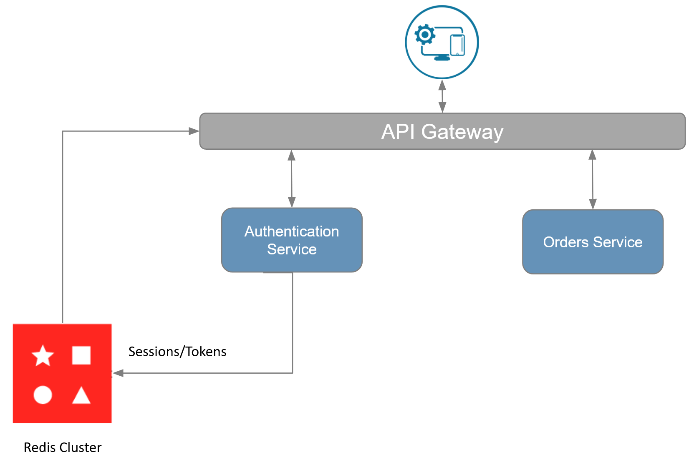

import Authors from '@theme/Authors';
import MicroservicesEcommerceDesign from '../common-data/microservices-ecommerce.mdx';
import MicroservicesArchitectureWithRedis from '../common-data/microservices-arch-with-redis.mdx';
import SourceCode from '../common-data/microservices-source-code-tip.mdx';
import RedisEnterprise from '../common-data/redis-enterprise.mdx';

<Authors frontMatter={frontMatter} />

<SourceCode />

## What is API Gateway Caching?

So you are building a microservices application, but you're struggling with how to handle authentication in a way that lets you reuse code and maximize performance. Typically for authentication you might use sessions, OAuth, authorization tokens, etc. For the purposes of this tutorial, let's say we're using an authorization token. In a monolithic application authentication is pretty straightforward:

When a request comes in...

1. Decode the `Authorization` header
1. Validate the credentials
1. Store the session information on the request for further use down the line

However, you might be left puzzled by how to accomplish something similar with microservices. Typically in a microservices application you have an API gateway that serves as the single entrypoint for clients, and routes traffic to the appropriate services. Depending on the nature of the request, those services may or may not require a user to be authenticated. Because of this, you might think it is a good idea to handle authentication in each respective service. While this works, you end up with a fair amount of duplicated code. It's also more difficult to understand where slowdowns are happening and scale services appropriately because you repeat some of the same work in each service. A more effective way of handling authentication is to handle it at the API gateway layer, and then pass the session information down to each service.

Great, you've decided to handle authentication at the API gateway layer. Now you have to decide where to store sessions. Imagine you're building an e-commerce app that uses MongoDB as the primary data store. You could store sessions in MongoDB, but think about how many times you will be hitting MongoDB to retrieve session information. If you have millions of customers, you don't want to be going to MongoDB for every single request made to the API. This is where Redis comes in.

## Why You Should Use Redis for API Gateway Caching

Redis is an in-memory datastore, making it perfect for caching session data. It allows you to reduce the load on your primary database while speeding up database reads. The rest of this tutorial covers how to do this in the context of an e-commerce application.

## Microservices Architecture for an E-commerce Application

<MicroservicesArchitectureWithRedis />

Below you will find a diagram depicting how the API gateway uses Redis as a cache for session information. It gets the session from Redis and then passes it on to each microservice. This provides an easy way to handle sessions in a single place, and permeate them throughout the rest of the application.



:::tip

If you're using a **Redis Enterprise Cluster**, you get the benefit of linear scaling to ensure API calls perform under peak loads. You also get 99.999% uptime and Active-Active geo-distribution to prevent loss of critical authentication and session data.

:::

## E-commerce Application Frontend using Next.js and Tailwind

<MicroservicesEcommerceDesign />

## API Gateway Caching in a Microservices Application with Redis and MongoDB

What's nice about a microservice architecture is each service is set up so it can scale independently. Now, seeing as how each service might require authentication, you will likely want to obtain session information for most requests. Therefore, it makes a lot of sense to use the API gateway to cache and retrieve session information and subsequently pass the information on to each service. Let's see how you might accomplish this.

In our sample application, all requests are routed through the API gateway. We are using [Express](https://expressjs.com/) to set up our API gateway and we're using the `Authorization` header to pass the authorization token from the frontend to the API. For every request, the API gateway gets the authorization token and looks it up in Redis. Then it passes it along to the correct microservice. Below you will find the code to validate the session:

```typescript
import {
  createProxyMiddleware,
  responseInterceptor,
} from 'http-proxy-middleware';

//-----
const app: Express = express();

app.use(cors());
app.use(async (req, res, next) => {
  const authorizationHeader = req.header('Authorization');
  const sessionInfo = await getSessionInfo(authorizationHeader); //---- (1)

  //add session info to request
  if (sessionInfo?.sessionData && sessionInfo?.sessionId) {
    req.session = sessionInfo?.sessionData;
    req.sessionId = sessionInfo?.sessionId;
  }
  next();
});

app.use(
  '/orders',
  createProxyMiddleware({
    // http://localhost:3000/orders/bar -> http://localhost:3001/orders/bar
    target: 'http://localhost:3001',
    changeOrigin: true,
    selfHandleResponse: true,
    onProxyReq(proxyReq, req, res) {
      // pass session info to microservice
      proxyReq.setHeader('x-session', req.session);
    },
    onProxyRes: applyAuthToResponse, //---- (2)
  }),
);

app.use(
  '/orderHistory',
  createProxyMiddleware({
    target: 'http://localhost:3002',
    changeOrigin: true,
    selfHandleResponse: true,
    onProxyReq(proxyReq, req, res) {
      // pass session info to microservice
      proxyReq.setHeader('x-session', req.session);
    },
    onProxyRes: applyAuthToResponse, //---- (2)
  }),
);
//-----

const getSessionInfo = async (authHeader?: string) => {
  // (For demo purpose only) random userId and sessionId values are created for first time, then userId is fetched gainst that sessionId for future requests
  let sessionId = '';
  let sessionData: string | null = '';

  if (!!authHeader) {
    sessionId = authHeader.split(/\s/)[1];
  } else {
    sessionId = 'SES_' + randomUUID(); // generate random new sessionId
  }

  const nodeRedisClient = getNodeRedisClient();
  if (nodeRedisClient) {
    const exists = await nodeRedisClient.exists(sessionId);
    if (!exists) {
      await nodeRedisClient.set(
        sessionId,
        JSON.stringify({ userId: 'USR_' + randomUUID() }),
      ); // generate random new userId
    }
    sessionData = await nodeRedisClient.get(sessionId);
  }

  return {
    sessionId: sessionId,
    sessionData: sessionData,
  };
};

const applyAuthToResponse = responseInterceptor(
  // adding sessionId to the response so that front end can store it for future requests

  async (responseBuffer, proxyRes, req, res) => {
    // detect json responses
    if (
      !!proxyRes.headers['content-type'] &&
      proxyRes.headers['content-type'].includes('application/json')
    ) {
      let data = JSON.parse(responseBuffer.toString('utf8'));

      // manipulate JSON data here
      if (!!(req as Request).sessionId) {
        data = Object.assign({}, data, { auth: (req as Request).sessionId });
      }

      // return manipulated JSON
      return JSON.stringify(data);
    }

    // return other content-types as-is
    return responseBuffer;
  },
);
```

:::info

The example above is not meant to be the de facto best practice for handling authentication. It is meant to illustrate what you might do with respect to Redis. You will likely have a different setup for authentication, but the concept of storing a session in Redis is similar.

:::

In the code above, we check for the `Authorization` header, else we create a new one and store it in Redis. Then we retrieve the session from Redis. Further down the line we attach the session to the `x-session` header prior to calling the orders service. Now let's see how the orders service receives the session.

```typescript {9}
router.post(API_NAMES.CREATE_ORDER, async (req: Request, res: Response) => {
  const body = req.body;
  const result: IApiResponseBody = {
    data: null,
    error: null,
  };

  const sessionData = req.header('x-session');
  const userId = sessionData ? JSON.parse(sessionData).userId : "";
  ...
});
```

The highlighted line above shows how to pull the session out of the `x-session` header and get the `userId`.

## Conclusion

That's all there is to it! You've now seen how to use Redis for API gateway caching. It is not too complicated to get started, but it will help you scale as you build out microservices. Check out additional resources below for learning more about Redis.

### Additional Resources

- [CQRS](/howtos/solutions/cqrs)
- [Interservice communication](/howtos/solutions/interservice-communication)
- [Query caching](/howtos/solutions/caching)
- [Redis YouTube channel](https://www.youtube.com/c/Redisinc)
- Clients like [Node Redis](https://github.com/redis/node-redis) and [Redis om Node](https://github.com/redis/redis-om-node) help you to use Redis in Node.js applications.
