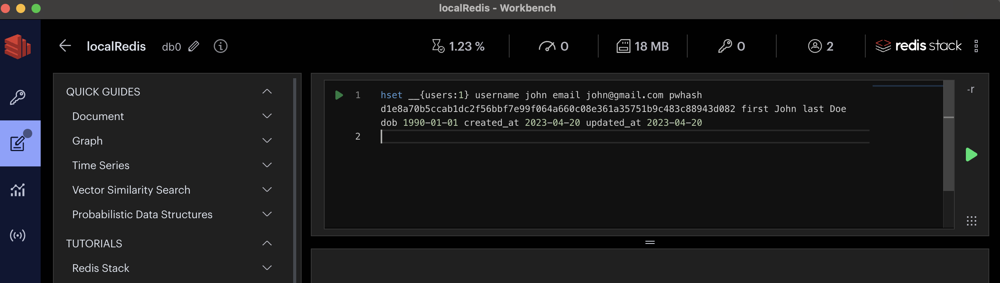
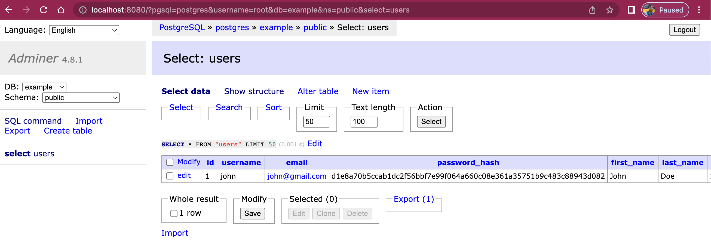
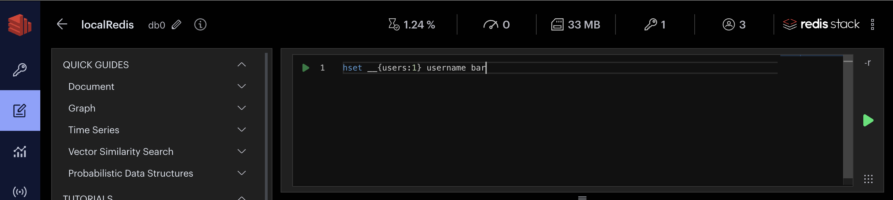

import Authors from '@theme/Authors';
import RedisGears from '../common-caching/redis-gears.mdx';
import CachingMovieAppDesign from '../common-caching/caching-movie-app.mdx';
import SourceCodeMovieApp from '../common-caching/source-code-movie-app.mdx';
import WritePatternDifferences from '../common-caching/write-behind-vs-write-through.mdx';

import mongoCompassImage from './images/mongo-compass.png';
import redisHashView from './images/04-redis-hash-view.png';
import redisHashUpdatedView from './images/07-redis-hash-updated-view.png';

<Authors frontMatter={frontMatter} />

## What is write-through caching?

Imagine you've built a movie streaming app. You used PostgreSQL as your data store, and as you needed to scale you implemented caching using Redis. However, now you are experiencing slowness in reflecting of updated user profile or subscription.

For example, When a user purchases or modifies subscription, user expects the changes to be reflected immediately on his account so that the desired movie/ show of new subscription is enabled for watching.
So you need a way of quickly providing strong consistency of user data. In such situation, What you need is called the "write-through pattern."

With the **Write-through** pattern, every time an application writes data to the cache, it also updates the records in the database, unlike [Write behind](/howtos/solutions/caching-architecture/write-behind) the thread waits in this pattern until the write to the database is also completed.

Below is a diagram of the write-through pattern for the application:


The pattern works as follows:

1. The application reads and writes data to Redis.
1. Redis syncs any changed data to the PostgreSQL database **synchronously/ immediately**.

Note : the **Redis server is blocked** until a response from the main database is received.

<WritePatternDifferences />

Learn more about [Write behind pattern](/howtos/solutions/caching-architecture/write-behind)

## Why you should use Redis for write-through caching

Write-through caching with Redis ensures that the (critical data) cache is always up-to-date with the database, providing **strong consistency** and **improving application performance**.

consider below scenarios of different applications :

- **E-commerce application**: In an e-commerce application, write-through caching can be used to ensure consistency of product inventory. Whenever a customer purchases a product, the inventory count should be updated immediately to avoid overselling. Redis can be used to cache the inventory count, and every update to the count can be written through to the database. This ensures that the inventory count in the cache is always up-to-date, and customers are not able to purchase items that are out of stock.

- **Banking application**: In a banking application, write-through caching can be used to ensure consistency of account balances. Whenever a transaction is made, the account balance should be updated immediately to avoid overdrafts or other issues. Redis can be used to cache the account balances, and every transaction can be written through to the database. This ensures that the balance in the cache is always up-to-date, and transactions can be processed with strong consistency.

- **Online gaming platform**: Suppose you have an online gaming platform where users can play games against each other. With write-through caching, any changes made to a user's score or game state would be saved to the database and also cached in Redis. This ensures that any subsequent reads for that user's score or game state would hit the cache first. This helps to reduce the load on the database and ensures that the game state displayed to users is always up-to-date.

- **Claims Processing System**: In an insurance claims processing system, claims data needs to be consistent and up-to-date across different systems and applications. With write-through caching in Redis, new claims data can be written to both the database and Redis cache. This ensures that different applications always have the most up-to-date information about the claims, making it easier for claims adjusters to access the information they need to process claims more quickly and efficiently.

- **Healthcare Applications**: In healthcare applications, patient data needs to be consistent and up-to-date across different systems and applications. With write-through caching in Redis, updated patient data can be written to both the database and Redis cache, ensuring that different applications always have the latest patient information. This can help improve patient care by providing accurate and timely information to healthcare providers.

- **Social media application**: In a social media application, write-through caching can be used to ensure consistency of user profiles. Whenever a user updates their profile, the changes should be reflected immediately to avoid showing outdated information to other users. Redis can be used to cache the user profiles, and every update can be written through to the database. This ensures that the profile information in the cache is always up-to-date, and users can see accurate information about each other.

## Redis programmability for write-through caching using RedisGears

:::tip

You can skip reading this section if you are already familiar with RedisGears)

:::

<RedisGears />

### Programming Redis using the write-through pattern

For our sample code, we will demonstrate writing `users` to Redis and then writing through to PostgreSQL. Use the docker-compose.yml file below to setup required environment:

```yaml title="docker-compose.yml"
version: '3.9'
services:
  redis:
    container_name: redis
    image: 'redislabs/redismod:latest'
    ports:
      - 6379:6379
    deploy:
      replicas: 1
      restart_policy:
        condition: on-failure
  postgres:
    image: postgres
    restart: always
    environment:
      POSTGRES_USER: root
      POSTGRES_PASSWORD: password
      POSTGRES_DB: example
  adminer:
    image: adminer
    restart: always
    ports:
      - 8080:8080
```

To run the docker-compose file, run the following command:

```shell
$ docker compose up -d
```

This will create a `Redis` server, a `PostgreSQL` server, and an `Adminer` server. Adminer is a web-based database management tool that allows you to view and edit data in your database.

Next, open your browser to [http://localhost:8080/?pgsql=postgres&username=root&db=example&ns=public&sql=](http://localhost:8080/?pgsql=postgres&username=root&db=example&ns=public&sql=). You will have to input the password (which is `password` in the example above),


then you will be taken to a SQL command page. Run the following SQL command to create a table:

```sql title="users.sql"
CREATE TABLE users (
    id SERIAL PRIMARY KEY,
    username VARCHAR(255) UNIQUE NOT NULL,
    email VARCHAR(255) UNIQUE NOT NULL,
    password_hash VARCHAR(255) NOT NULL,
    first_name VARCHAR(255),
    last_name VARCHAR(255),
    date_of_birth DATE,
    created_at TIMESTAMP NOT NULL DEFAULT CURRENT_TIMESTAMP,
    updated_at TIMESTAMP NOT NULL DEFAULT CURRENT_TIMESTAMP
);
```


Developers need to load some code (say python in our example) to the Redis server before using the write-through pattern (which syncs data from Redis to the system of record). Redis server has a RedisGears module that interprets the python code and syncs the data from Redis to the system of record.

Now, we need to create a RedisGears recipe that will write through to the PostgreSQL database. The following Python code will write through to the PostgreSQL database:

```python title="write-through.py"
from rgsync import RGWriteThrough
from rgsync.Connectors import PostgresConnector, PostgresConnection

'''
Create Postgres connection object
'''
connection = PostgresConnection('root', 'password', 'postgres:5432/example')

'''
Create Postgres users connector
'''
usersConnector = PostgresConnector(connection, 'users', 'id')

usersMappings = {
    'username': 'username',
    'email': 'email',
    'pwhash': 'password_hash',
    'first': 'first_name',
    'last': 'last_name',
    'dob': 'date_of_birth',
    'created_at': 'created_at',
    'updated_at': 'updated_at',
}

RGWriteThrough(GB, keysPrefix='__',     mappings=usersMappings,
               connector=usersConnector, name='UsersWriteThrough', version='99.99.99')
```

Make sure you create the file "write-through.py" because the next instructions will use it. For the purpose of this example we are showing how to map Redis hash fields to PostgreSQL table columns. The `RGWriteThrough` function takes in the `usersMapping`, where the keys are the Redis hash keys and the values are the PostgreSQL table columns.

:::tip What is a RedisGears recipe?

A collection of RedisGears functions and any dependencies they may have that implement a high-level functional purpose is called a `recipe`.
Example : "RGJSONWriteThrough" function in above python code

:::

The python file has a few dependencies in order to work. Below is the requirements.txt file that contains the dependencies, create it alongside the "write-through.py" file:

```text title="requirements.txt"
rgsync
psycopg2-binary
cryptography
```

There are two ways (gears CLI and RG.PYEXECUTE) to load that Python file into the Redis server:

1. Using the gears command-line interface (CLI)

Find more information about the Gears CLI at [gears-cli](https://github.com/RedisGears/gears-cli) and [rgsync](https://github.com/RedisGears/rgsync#running-the-recipe).

```shell
# install
pip install gears-cli
```

To run our write-through recipe using `gears-cli`, we need to run the following command:

```shell
$ gears-cli run --host localhost --port 6379 write-through.py --requirements requirements.txt
```

You should get a response that says "OK". That is how you know you have successfully loaded the Python file into the Redis server.

:::tip

If you are on Windows, we recommend you use WSL to install and use gears-cli.

:::

2. Using the RG.PYEXECUTE from the Redis command line.

```shell
# Via redis cli
RG.PYEXECUTE 'pythonCode' REQUIREMENTS rgsync psycopg2-binary cryptography
```

:::tip

The RG.PYEXECUTE command can also be executed from the Node.js code
(Consult <u>[the sample Node file](https://github.com/redis-developer/ebook-speed-mern-backend/blob/main/data/write-through/wt-main.js)</u> for more details)

:::

:::tip

Find more examples in the <u>[Redis Gears GitHub repository](https://github.com/RedisGears/rgsync/tree/master/examples/)</u>.

:::

### Verifying the write-through pattern using RedisInsight

:::tip

RedisInsight is the free redis GUI for viewing data in redis. <u>[Click here to download.](https://redis.com/redis-enterprise/redis-insight/)</u>

:::

The next step is to verify that RedisGears is syncing data between Redis and PostgreSQL. Note that in our Python file we specified a prefix for the keys. In this case, we specified `__` as the prefix, `users` as the table, and `id` as the unique identifier. This instructs RedisGears to look for the following key format: `__{users:<id>}`. Try running the following command in the Redis command line:

```
hset __{users:1} username john email john@gmail.com pwhash d1e8a70b5ccab1dc2f56bbf7e99f064a660c08e361a35751b9c483c88943d082 first John last Doe dob 1990-01-01 created_at 2023-04-20 updated_at 2023-04-20
```



Check [RedisInsight](https://redis.com/redis-enterprise/redis-insight/) to verify that the hash value made it into Redis. After RedisGears is done processing the `__{users:1}` key, it will be deleted from Redis and replaced by the `users:1` key. Check RedisInsight to verify that the `users:1` key is in Redis.


Next, confirm that the user is inserted in PostgreSQL too by opening up the [select page in Adminer](http://localhost:8080/?pgsql=postgres&username=root&db=example&ns=public&select=users). You should see the user inserted in the table.



This is how you can use RedisGears to write through to PostgreSQL, and so far we have only added a hash key. You can also update specific hash fields and it will be reflected in your PostgreSQL database. Run the following command to update the `username` field:

```
> hset __{users:1} username bar
```



In RedisInsight, verify that the `username` field is updated


Now go into Adminer and check the `username` field. You should see that it has been updated to `bar`.


## Ready to use Redis for write-through caching?

You now know how to use Redis for write-through caching. It's possible to incrementally adopt Redis wherever needed with different strategies/patterns. For more resources on the topic of caching, check out the links below:

## Additional resources

- Caching with Redis
  - [Write behind caching](/howtos/solutions/caching-architecture/write-behind)
  - [Cache prefetching](/howtos/solutions/caching-architecture/cache-prefetching)
  - [Query caching](/howtos/solutions/microservices/caching)
- [Redis YouTube channel](https://www.youtube.com/c/Redisinc)
- Clients like [Node Redis](https://github.com/redis/node-redis) and [Redis om Node](https://github.com/redis/redis-om-node) help you to use Redis in Node.js applications.
- [RedisInsight](https://redis.com/redis-enterprise/redis-insight/) : To view your Redis data or to play with raw Redis commands in the workbench
- [Try Redis Enterprise for free](https://redis.com/try-free/)
