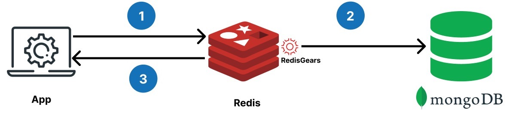
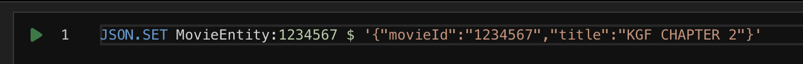
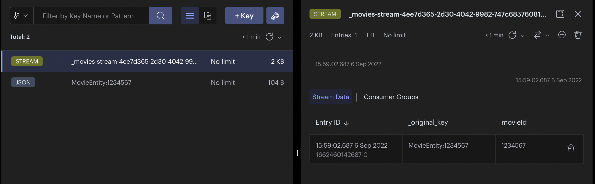

import Authors from '@theme/Authors';
import RedisGears from '../common-caching/redis-gears.mdx';
import CachingMovieAppDesign from '../common-caching/caching-movie-app.mdx';
import SourceCodeMovieApp from '../common-caching/source-code-movie-app.mdx';
import WritePatternDifferences from '../common-caching/write-behind-vs-write-through.mdx';

import mongoCompassImage from './images/mongo-compass.png';

<Authors frontMatter={frontMatter} />

## What is write-through caching?

Imagine you've built a movie streaming app. You used MongoDB as your data store, and as you needed to scale you implemented caching using Redis. However, now you are experiencing slowness in reflecting of updated user profile or subscription.

For example, When a user purchases or modifies subscription, user expects the changes to be reflected immediately on his account so that the desired movie/ show of new subscription is enabled for watching.
So you need a way of quickly providing strong consistency of user data. In such situation, What you need is called the "write-through pattern."

With the **Write-through** pattern, every time an application writes data to the cache, it also updates the records in the database, unlike [Write behind](/howtos/solutions/caching-architecture/write-behind) the thread waits in this pattern until the write to the database is also completed.

Below is a diagram of the write-through pattern for the application:



The pattern works as follows:

1. The application reads and writes data to Redis.
1. Redis syncs any changed data to the MongoDB database **synchronously/ immediately**.

Note : the **Redis server is blocked** until a response from the main database is received.

<WritePatternDifferences />

Learn more about [Write behind pattern](/howtos/solutions/caching-architecture/write-behind)

## Why you should use Redis for write-through caching

Write-through caching with Redis ensures that the (critical data) cache is always up-to-date with the database, providing **strong consistency** and **improving application performance**.

consider below scenarios of different applications :

- **E-commerce application**: In an e-commerce application, write-through caching can be used to ensure consistency of product inventory. Whenever a customer purchases a product, the inventory count should be updated immediately to avoid overselling. Redis can be used to cache the inventory count, and every update to the count can be written through to the database. This ensures that the inventory count in the cache is always up-to-date, and customers are not able to purchase items that are out of stock.

- **Banking application**: In a banking application, write-through caching can be used to ensure consistency of account balances. Whenever a transaction is made, the account balance should be updated immediately to avoid overdrafts or other issues. Redis can be used to cache the account balances, and every transaction can be written through to the database. This ensures that the balance in the cache is always up-to-date, and transactions can be processed with strong consistency.

- **Online gaming platform**: Suppose you have an online gaming platform where users can play games against each other. With write-through caching, any changes made to a user's score or game state would be saved to the database and also cached in Redis. This ensures that any subsequent reads for that user's score or game state would hit the cache first. This helps to reduce the load on the database and ensures that the game state displayed to users is always up-to-date.

- **Claims Processing System**: In an insurance claims processing system, claims data needs to be consistent and up-to-date across different systems and applications. With write-through caching in Redis, new claims data can be written to both the database and Redis cache. This ensures that different applications always have the most up-to-date information about the claims, making it easier for claims adjusters to access the information they need to process claims more quickly and efficiently.

- **Healthcare Applications**: In healthcare applications, patient data needs to be consistent and up-to-date across different systems and applications. With write-through caching in Redis, updated patient data can be written to both the database and Redis cache, ensuring that different applications always have the latest patient information. This can help improve patient care by providing accurate and timely information to healthcare providers.

- **Social media application**: In a social media application, write-through caching can be used to ensure consistency of user profiles. Whenever a user updates their profile, the changes should be reflected immediately to avoid showing outdated information to other users. Redis can be used to cache the user profiles, and every update can be written through to the database. This ensures that the profile information in the cache is always up-to-date, and users can see accurate information about each other.

## Redis programmability for write-through caching using RedisGears

:::tip

You can skip reading this section if you are already familiar with RedisGears)

:::

<RedisGears />

### Demo application

<CachingMovieAppDesign />

<SourceCodeMovieApp />

To demonstrate this pattern using the movie application, imagine that the user opens the pop-up to add a new movie.


Instead of the application directly storing the data in MongoDB, the application writes the changes to Redis. In the background, RedisGears automatically synchronizes the data with the MongoDB database **immediately**.

### Programming Redis using the write-through pattern

Developers need to load some code (say python in our example) to the Redis server before using the write-through pattern (which syncs data from Redis to MongoDB). The Redis server has a RedisGears module that interprets the python code and syncs the data from Redis to MongoDB.

Loading the Python code is easier than it sounds. Simply replace database details in the Python file and then load the file to the Redis server.

Create the Python file (shown below, and [available online](https://github.com/redis-developer/ebook-speed-mern-backend/blob/main/data/write-through/movies-write-through.py)). Then update the MongoDB connection details, database, collection, and primary key name to sync.

```python title="movies-write-through.py"
# Gears Recipe for a single write through

# import redis gears & mongo db libs
from rgsync import RGJSONWriteBehind, RGJSONWriteThrough
from rgsync.Connectors import MongoConnector, MongoConnection

# change mongodb connection
# MongoConnection(user, password, host, authSource (optional), fullConnectionUrl (optional) )
# connection = MongoConnection('ADMIN_USER','ADMIN_PASSWORD','ADMIN_HOST', "admin")
connection = MongoConnection("", "", "", "", "MONGODB_CONNECTION_URL")

# change MongoDB database
db = 'dbSpeedMernDemo'

# change MongoDB collection & it's primary key
movieConnector = MongoConnector(connection, db, 'movies', 'movieId')

# change redis keys with prefix that must be synced with mongodb collection
RGJSONWriteThrough(GB,  keysPrefix='MovieEntity',
                  connector=movieConnector, name='MoviesWriteThrough',
                  version='99.99.99')

```

:::tip What is a RedisGears recipe?

A collection of RedisGears functions and any dependencies they may have that implement a high-level functional purpose is called a `recipe`.
Example : "RGJSONWriteThrough" function in above python code

:::

There are two ways to load that Python file into the Redis server:

1. Using the gears command-line interface (CLI)

Find more information about the Gears CLI at [gears-cli](https://github.com/RedisGears/gears-cli) and [rgsync](https://github.com/RedisGears/rgsync#running-the-recipe).

```sh
# install
pip install gears-cli
```

```sh
# If python file is located at “/users/tom/movies-write-through.py”
gears-cli --host <redisHost> --port <redisPort> --password <redisPassword> run /users/tom/movies-write-through.py REQUIREMENTS rgsync pymongo==3.12.0
```

2. Using the RG.PYEXECUTE from the Redis command line.

Find more information at [RG.PYEXECUTE](https://oss.redis.com/redisgears/commands.html#rgpyexecute).

```sh
# Via redis cli
RG.PYEXECUTE 'pythonCode' REQUIREMENTS rgsync pymongo==3.12.0
```

The RG.PYEXECUTE command can also be executed from the Node.js code
(Consult [the sample Node file](https://github.com/redis-developer/ebook-speed-mern-backend/blob/main/data/write-through/wt-main.js) for more details)

Find more examples at [Redis Gears sync with MongoDB](https://github.com/RedisGears/rgsync/tree/master/examples/mongo).

### Verifying the write-through pattern using RedisInsight

:::tip

RedisInsight is the free redis GUI for viewing data in redis. <u>[Click here to download.](https://redis.com/redis-enterprise/redis-insight/)</u>

:::

The next step is to verify that RedisGears is syncing data between Redis and MongoDB.

Insert a key starting with the prefix (that's specified in the Python file) using the Redis CLI



Next, confirm that the JSON is inserted in MongoDB too.


You can also check [RedisInsight](https://redis.com/redis-enterprise/redis-insight/) to verify that the data is piped in via Streams for its consumers (like RedisGears).



How does all that work with the demo application? Below is a code snipped to insert a movie. Once data is written to Redis, RedisGears automatically synchronizes it to MongoDB.

```js title="BEFORE (using MongoDB)"
...
//(Node mongo query)
if (movie) {
  //insert movie to MongoDB
  await db.collection("movies")
           .insertOne(movie);
}
...
```

```js title="AFTER (using Redis)"
...
//(Redis OM Node query)
if (movie) {
  const entity = repository.createEntity(movie);
  //insert movie to Redis
  await moviesRepository.save(entity);
}
...
```

## Ready to use Redis for write-through caching?

You now know how to use Redis for write-through caching. It's possible to incrementally adopt Redis wherever needed with different strategies/patterns. For more resources on the topic of caching, check out the links below:

## Additional resources

- Caching with Redis
  - [Write behind caching](/howtos/solutions/caching-architecture/write-behind)
  - [Cache prefetching](/howtos/solutions/caching-architecture/cache-prefetching)
  - [Query caching](/howtos/solutions/microservices/caching)
- [Redis YouTube channel](https://www.youtube.com/c/Redisinc)
- Clients like [Node Redis](https://github.com/redis/node-redis) and [Redis om Node](https://github.com/redis/redis-om-node) help you to use Redis in Node.js applications.
- [RedisInsight](https://redis.com/redis-enterprise/redis-insight/) : To view your Redis data or to play with raw Redis commands in the workbench
- [Try Redis Enterprise for free](https://redis.com/try-free/)
