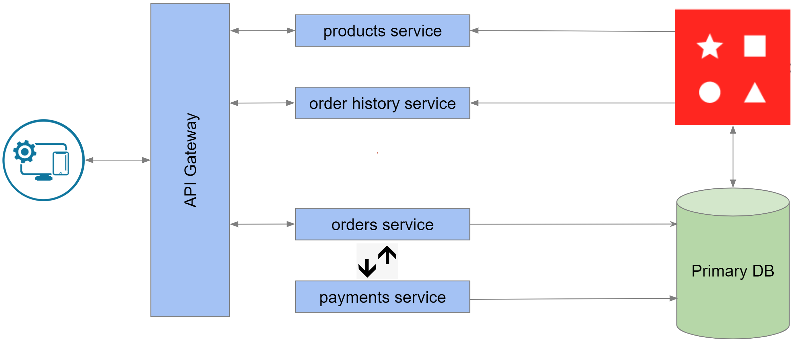

The e-commerce microservices application uses the following architecture:

1. `products service` - handles querying products from the database and returning them to the frontend
1. `orders service` - handles validating and creating orders
1. `order history service` - handles querying a customer's order history
1. `payments service` - handles processing orders for payment
1. `api gateway` - unifies your services under a single endpoint
1. `mongodb` - serves as the primary database, storing orders, order history, products, etc.
1. `redis` - serves as the stream processor and caching database

Here is what the architecture diagram looks like so far:

What's nice about this architecture is each service is set up so it can scale independently. What this also means is you can incrementally adopt Redis where needed.
