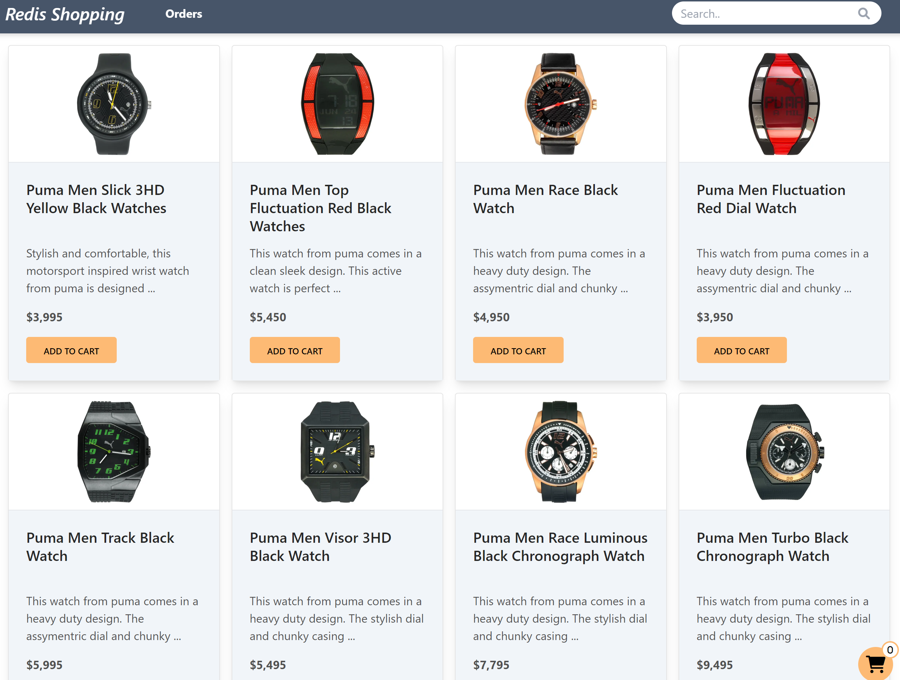
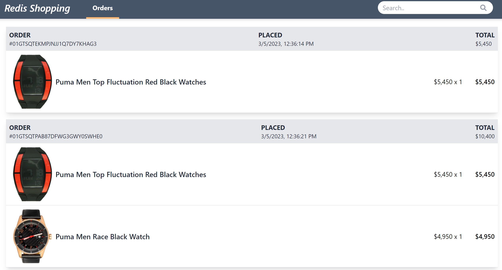

Consider below screenshots of sample e-commerce application

- Dashboard screen : To populate list of products with quick search functionality

  

- Shopping Cart view : To view added products in the cart
  

- Order history view : On `Orders` tab click in the top nav bar, you can see all the orders for the user

  

You can find the full source code for the app pictured above here. The frontend is build using **Next.js**, the backend is in **Node.js**, data is stored in **MongoDB** and **Redis**.

:::tip GITHUB CODE

Source code for the application

https://github.com/redis-developer/redis-microservices-ecommerce-solutions
:::
