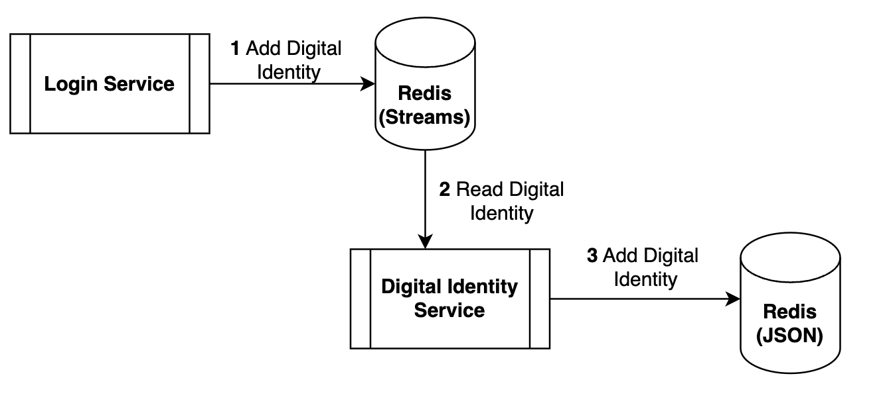
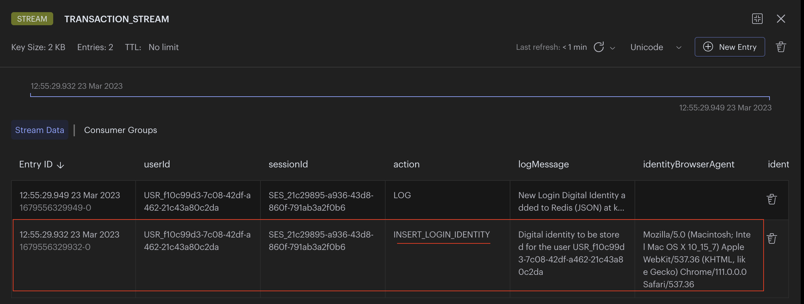
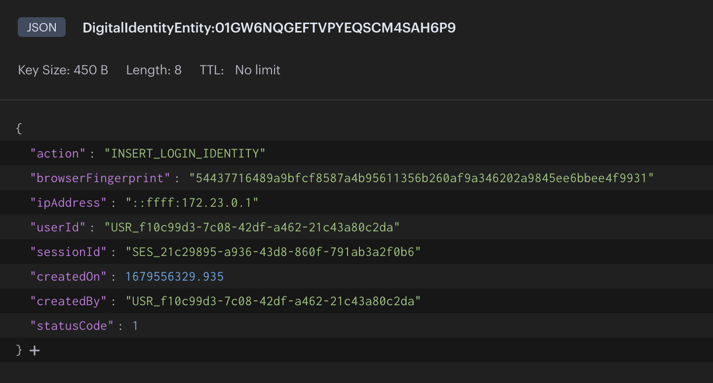
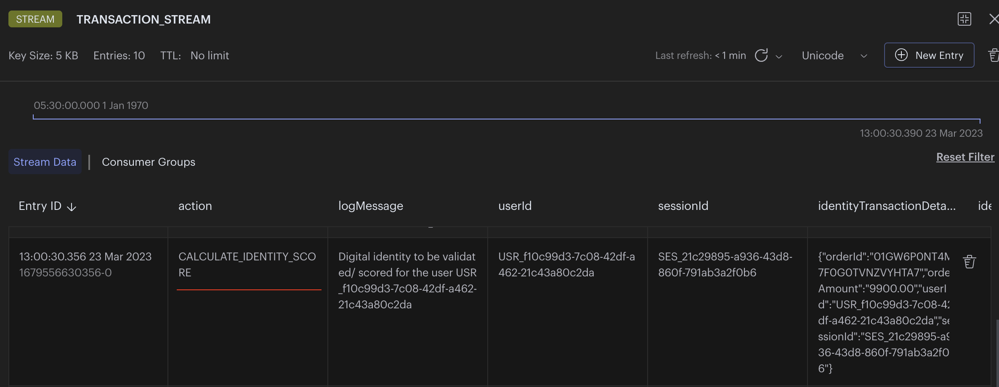
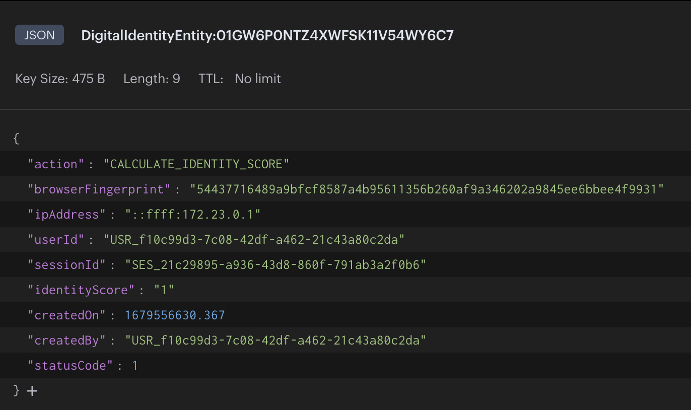

import Authors from '@theme/Authors';
import digitalIdentityImg from './images/digital-identity.png';
import SourceCodeFraudDetection from '../common-fraud/source-code-tip.mdx';

import MicroservicesEcommerceDesign from '../../microservices/common-data/microservices-ecommerce.mdx';
import MicroservicesArchitectureWithRedis from '../../microservices/common-data/microservices-arch-with-redis.mdx';

<Authors frontMatter={frontMatter} />

<SourceCodeFraudDetection />

## Digital identity validation for fraud detection introduction

As the digital landscape continues to evolve, the need for robust security measures to protect users and organizations becomes ever more critical. Digital identity validation and fraud detection are essential components of any comprehensive security plan. This article will explore the significance of digital identity validation, the challenges faced in this area, and a solution to digital identity validation using redis.

## Know Your Customer (KYC)

"Know Your Customer" (KYC) regulations refer to a set of policies and procedures that financial institutions and other regulated businesses must follow to verify the identity of their customers. Customer details can be like name, address, date of birth, and other government-issued identification documents.

As part of KYC, businesses must assess the potential risk posed by each customer and conduct **ongoing monitoring** of their transactions and behaviour to detect any suspicious activity. KYC regulations are enforced by regulatory authorities, and failure to comply can result in financial penalties and reputation damage.

KYC regulations are intended to prevent money laundering, terrorist financing, and other illicit activities. Financial services companies are combating the use of stolen identity information by reducing reliance on static methods for verifying identity (Knowledge-Based Authentication, or KBA) and instead moving to digital identities.

## What is digital identity?

Digital identity refers to the collection of attributes and identifiers that represent an individual online. These may include names, email addresses, phone numbers, usernames, and biometrics, among others. Digital identity validation is the process of verifying that these attributes are accurate and belong to the entity they claim to represent.

Identity validation is crucial because it helps establish trust in digital environments, where face-to-face interaction is often not possible. It ensures that the parties involved in a transaction are who they claim to be, minimizing the risk of fraud, identity theft, and other cyber crimes.


Digital identities consist of two parts:

- **Static** data: personally identifiable information (PII) such as name, address, and biometrics
- **Dynamic** data: behavioural and contextual information such as browsing history, device type, and location data. Dynamic digital identities are constantly updated based on the information available from each digital transaction.

Companies must monitor customer's every transaction and behaviour, then use stored digital identities to score the **risk**, identifying **possible suspicious activity** for a given transaction.

## Why you should use redis for digital identity validation

The following are the primary requirements of a storage layer for digital identities:

- Must maintain **real-time read latency** to fit within transaction SLA.
- Must have a **flexible data model** to store multiple unstructured data types such as behavioural, transactional, location, social/mobile and more.

These two factors are limiting for using traditional Relation Database Management Systems (RDBMS) to manage and validate digital identities in real time. While it is possible to use RDBMS to store digital identities, it is not the best choice for real-time validation of a flexible data model.

**Redis Enterprise**, on the other hand, is optimized for high throughput, low latency, data flexibility, and real-time query performance, easily satisfying the first criterion. With **sub-millisecond latency** and hundreds of millions of operations per second across both read and write operations, it is well-suited for managing dynamic digital identity data. As the volume of data grows, we can expect near-linear scalability and 99.999% of uptime with **Active-Active geo-replication**.

Redis Enterprise's flexible data model has native support for multiple data types, including **JSON, hashes, streams, graphs and more**. Additionally, it can process complex searches on structured and unstructured data, as well as filtering by numeric properties and geographical distances, making it easier to manage and query large datasets of digital identities.

## Microservices architecture for an E-commerce Application

<MicroservicesArchitectureWithRedis />

### Storing digital identities

Given we're discussing a microservices application, it makes sense to use a microservice for managing digital identities. Consider the following workflow outlining how digital identities are stored and retrieved from redis:



:::note

The demo application doesn't have a `login service`. All user sessions are currently authenticated in the `api gateway` service. So `login service` is synonymous with the `api gateway` with respect to the demo app.

:::

The demo application uses redis streams for interservice communication. The following outlines the workflow, and the responsibilities of each service:

1. `login service`: stores the (user) digital identity as a `INSERT_LOGIN_IDENTITY` stream entry to redis
   
2. `digital identity service`: reads the identity from the `INSERT_LOGIN_IDENTITY` stream
3. `digital identity service`: stores the identity as JSON to redis
   

### Validating digital identities

In an e-commerce application, validating digital identities happens at checkout time. You want to make sure the customer is who they say they are before you attempt to process their order. To validate digital identities, we need to calculate the digital identity score, starting in the `orders service`. The following outlines the workflow, and the responsibilities of each service:


1. `orders service`: stores the digital identity in a `CALCULATE_IDENTITY_SCORE` redis stream event to calculate it's identity score
   
1. `digital identity service`: reads the identity from the `CALCULATE_IDENTITY_SCORE` stream event
1. `digital identity service`: stores the identity with its calculated score as JSON
   

## E-commerce application frontend using Next.js and Tailwind

<MicroservicesEcommerceDesign />

<SourceCodeFraudDetection />

## Building a digital identity validation microservice with redis

Now, let's go step-by-step through the process of storing, scoring, and validating digital identities using redis with some example code. For demo purposes, we are only using a few characteristics of a user's digital identity like IP address, browser fingerprint, and session. In a real-world application you should store more characteristics like location, device type, and prior actions taken for better risk assessment and identity completeness.

### Storing digital identities in redis in a microservices architecture

1. `login service`: stores the (user) digital identity as a `INSERT_LOGIN_IDENTITY` stream entry to redis

```typescript
//addLoginToTransactionStream
const userId = 'USR_4e7acc44-e91e-4c5c-9112-bdd99d799dd3'; //from session
const sessionId = 'SES_94ff24a8-65b5-4795-9227-99906a43884e'; //from session
const persona = 'GRANDFATHER'; //from session

const entry: ITransactionStreamMessage = {
  action: TransactionStreamActions.INSERT_LOGIN_IDENTITY,
  logMessage: `[${REDIS_STREAMS.CONSUMERS.IDENTITY}] Digital identity to be stored for the user ${userId}`,
  userId,
  persona,
  sessionId,

  identityBrowserAgent: req.headers['user-agent'],
  identityIpAddress:
    req.headers['x-forwarded-for']?.toString() || req.socket.remoteAddress,
  transactionPipeline: JSON.stringify(TransactionPipelines.LOGIN),
};

const nodeRedisClient = getNodeRedisClient();
const streamKeyName = 'TRANSACTION_STREAM';
const id = '*'; //* = auto generate
await nodeRedisClient.xAdd(streamKeyName, id, entry);
```

2. `digital identity service`: reads the identity from the `INSERT_LOGIN_IDENTITY` stream

```typescript
interface ListenStreamOptions {
  streams: {
    streamKeyName: string;
    eventHandlers: {
      [messageAction: string]: IMessageHandler;
    };
  }[];
  groupName: string;
  consumerName: string;
  maxNoOfEntriesToReadAtTime?: number;
}

// Below is some code for how you would use redis to listen for the stream events:

const listenToStreams = async (options: ListenStreamOptions) => {
  /*
   (A) create consumer group for the stream
   (B) read set of messages from the stream
   (C) process all messages received
   (D) trigger appropriate action callback for each message
   (E) acknowledge individual messages after processing
  */
  const nodeRedisClient = getNodeRedisClient();
  if (nodeRedisClient) {
    const streams = options.streams;
    const groupName = options.groupName;
    const consumerName = options.consumerName;
    const readMaxCount = options.maxNoOfEntriesToReadAtTime || 100;
    const idInitialPosition = '0'; //0 = start, $ = end or any specific id
    const streamKeyIdArr: {
      key: string;
      id: string;
    }[] = [];

    streams.map(async (stream) => {
      LoggerCls.info(
        `Creating consumer group ${groupName} in stream ${stream.streamKeyName}`,
      );

      try {
        // (A) create consumer group for the stream
        await nodeRedisClient.xGroupCreate(
          stream.streamKeyName,
          groupName,
          idInitialPosition,
          {
            MKSTREAM: true,
          },
        );
      } catch (err) {
        LoggerCls.error(
          `Consumer group ${groupName} already exists in stream ${stream.streamKeyName}!`,
        );
      }

      streamKeyIdArr.push({
        key: stream.streamKeyName,
        id: '>', // Next entry ID that no consumer in this group has read
      });
    });

    LoggerCls.info(`Starting consumer ${consumerName}.`);

    while (true) {
      try {
        // (B) read set of messages from different streams
        const dataArr = await nodeRedisClient.xReadGroup(
          commandOptions({
            isolated: true,
          }),
          groupName,
          consumerName,
          //can specify multiple streams in array [{key, id}]
          streamKeyIdArr,
          {
            COUNT: readMaxCount, // Read n entries at a time
            BLOCK: 5, //block for 0 (infinite) seconds if there are none.
          },
        );

        // dataArr = [
        //   {
        //     name: 'streamName',
        //     messages: [
        //       {
        //         id: '1642088708425-0',
        //         message: {
        //           key1: 'value1',
        //         },
        //       },
        //     ],
        //   },
        // ];

        //(C) process all messages received
        if (dataArr && dataArr.length) {
          for (let data of dataArr) {
            for (let messageItem of data.messages) {
              const streamKeyName = data.name;

              const stream = streams.find(
                (s) => s.streamKeyName == streamKeyName,
              );

              if (stream && messageItem.message) {
                const streamEventHandlers = stream.eventHandlers;
                const messageAction = messageItem.message.action;
                const messageHandler = streamEventHandlers[messageAction];

                if (messageHandler) {
                  // (D) trigger appropriate action callback for each message
                  await messageHandler(messageItem.message, messageItem.id);
                }
                //(E) acknowledge individual messages after processing
                nodeRedisClient.xAck(streamKeyName, groupName, messageItem.id);
              }
            }
          }
        } else {
          // LoggerCls.info('No new stream entries.');
        }
      } catch (err) {
        LoggerCls.error('xReadGroup error !', err);
      }
    }
  }
};

// `listenToStreams` listens for events and calls the appropriate callback to further handle the events.
listenToStreams({
  streams: [
    {
      streamKeyName: REDIS_STREAMS.STREAMS.TRANSACTIONS,
      eventHandlers: {
        [TransactionStreamActions.INSERT_LOGIN_IDENTITY]: insertLoginIdentity,
        //...
      },
    },
  ],
  groupName: REDIS_STREAMS.GROUPS.IDENTITY,
  consumerName: REDIS_STREAMS.CONSUMERS.IDENTITY,
});
```

3. `digital identity service`: stores the identity as JSON to redis

```typescript
const insertLoginIdentity: IMessageHandler = async (
  message: ITransactionStreamMessage,
  messageId,
) => {
  LoggerCls.info(`Adding digital identity to redis for ${message.userId}`);

  // add login digital identity to redis
  const insertedKey = await addDigitalIdentityToRedis(message);

  //...
};

const addDigitalIdentityToRedis = async (
  message: ITransactionStreamMessage,
) => {
  let insertedKey = '';

  const userId = message.userId;
  const digitalIdentity: IDigitalIdentity = {
    action: message.action,
    userId: userId,
    sessionId: message.sessionId,

    ipAddress: message.identityIpAddress,
    browserFingerprint: crypto
      .createHash('sha256')
      .update(message.identityBrowserAgent)
      .digest('hex'),
    identityScore: message.identityScore ? message.identityScore : '',

    createdOn: new Date(),
    createdBy: userId,
    statusCode: DB_ROW_STATUS.ACTIVE,
  };

  const repository = digitalIdentityRepo.getRepository();
  if (repository) {
    const entity = repository.createEntity(digitalIdentity);
    insertedKey = await repository.save(entity);
  }

  return insertedKey;
};
```

### Validating digital identities using redis in a microservices architecture

1. `orders service`: stores the digital identity to be validated in a `CALCULATE_IDENTITY_SCORE` redis stream

```typescript
//adding Identity To TransactionStream
const userId = 'USR_4e7acc44-e91e-4c5c-9112-bdd99d799dd3';
const sessionId = 'SES_94ff24a8-65b5-4795-9227-99906a43884e';
let orderDetails = {
  orderId: '63f5f8dc3696d145a45775a6',
  orderAmount: '1000',
  userId: userId,
  sessionId: sessionId,
  orderStatus: 1,
  products: order.products, //array of product details
};

const entry: ITransactionStreamMessage = {
  action: 'CALCULATE_IDENTITY_SCORE',
  logMessage: `Digital identity to be validated/ scored for the user ${userId}`,
  userId: userId,
  sessionId: sessionId,
  orderDetails: orderDetails ? JSON.stringify(orderDetails) : '',
  transactionPipeline: JSON.stringify(TransactionPipelines.CHECKOUT),

  identityBrowserAgent: req.headers['user-agent'],
  identityIpAddress:
    req.headers['x-forwarded-for']?.toString() || req.socket.remoteAddress,
};

const nodeRedisClient = getNodeRedisClient();
const streamKeyName = 'TRANSACTION_STREAM';
const id = '*'; //* = auto generate
await nodeRedisClient.xAdd(streamKeyName, id, entry);
```

2. `Digital identity service` reads the identity from the `CALCULATE_IDENTITY_SCORE` stream

```typescript
listenToStreams({
  streams: [
    {
      streamKeyName: REDIS_STREAMS.STREAMS.TRANSACTIONS,
      eventHandlers: {
        // ...
        [TransactionStreamActions.CALCULATE_IDENTITY_SCORE]:
          scoreDigitalIdentity,
      },
    },
  ],
  groupName: REDIS_STREAMS.GROUPS.IDENTITY,
  consumerName: REDIS_STREAMS.CONSUMERS.IDENTITY,
});

const scoreDigitalIdentity: IMessageHandler = async (
  message: ITransactionStreamMessage,
  messageId,
) => {
  LoggerCls.info(`Scoring digital identity for ${message.userId}`);

  //step 1 - calculate score for validation digital identity
  const identityScore = await calculateIdentityScore(message);
  message.identityScore = identityScore.toString();

  LoggerCls.info(`Adding digital identity to redis for ${message.userId}`);
  //step 2 - add validation digital identity to redis
  const insertedKey = await addDigitalIdentityToRedis(message);

  // ...
};

const calculateIdentityScore = async (message: ITransactionStreamMessage) => {
  // Compare the "digital identity" with previously stored "login identities" and determine the identity score

  let identityScore = 0;
  const repository = digitalIdentityRepo.getRepository();

  if (message && message.userId && repository) {
    let queryBuilder = repository
      .search()
      .where('userId')
      .eq(message.userId)
      .and('action')
      .eq('INSERT_LOGIN_IDENTITY')
      .and('statusCode')
      .eq(DB_ROW_STATUS.ACTIVE);

    //console.log(queryBuilder.query);
    const digitalIdentities = await queryBuilder.return.all();

    if (digitalIdentities && digitalIdentities.length) {
      //if browser details matches -> +1 score
      const matchBrowserItems = digitalIdentities.filter((_digIdent) => {
        let identityBrowserAgentHash = crypto
          .createHash('sha256')
          .update(message.identityBrowserAgent)
          .digest('hex');
        return _digIdent.browserFingerprint == identityBrowserAgentHash;
      });
      if (matchBrowserItems.length > 0) {
        identityScore += 1;
      }

      //if IP address  matches -> +1 score
      const matchIpAddressItems = digitalIdentities.filter((_digIdent) => {
        return _digIdent.ipAddress == message.identityIpAddress;
      });
      if (matchIpAddressItems.length > 0) {
        identityScore += 1;
      }
    }
  }

  //calculate average score
  const noOfIdentityCharacteristics = 2; //2 == browserFingerprint, ipAddress
  identityScore = identityScore / noOfIdentityCharacteristics;
  return identityScore; // identityScore final value ranges between 0 (no match) and 1 (full match)
};
```

3. `digital identity service`: stores the identity with score as JSON in redis

```typescript
const addDigitalIdentityToRedis = async (
  message: ITransactionStreamMessage,
) => {
  let insertedKey = '';

  const userId = message.userId;
  const digitalIdentity: IDigitalIdentity = {
    action: message.action,
    userId: userId,
    sessionId: message.sessionId,

    ipAddress: message.identityIpAddress,
    browserFingerprint: crypto
      .createHash('sha256')
      .update(message.identityBrowserAgent)
      .digest('hex'),
    identityScore: message.identityScore ? message.identityScore : '',

    createdOn: new Date(),
    createdBy: userId,
    statusCode: DB_ROW_STATUS.ACTIVE, //1
  };

  const repository = digitalIdentityRepo.getRepository();
  if (repository) {
    const entity = repository.createEntity(digitalIdentity);
    insertedKey = await repository.save(entity);
  }

  return insertedKey;
};
```

## Conclusion

Now you have learned how to use redis to setup ongoing digital identity monitoring and scoring in a microservices application. This is also called "dynamic digital identity monitoring." Dynamic digital identities are constantly updated based on the information available from each digital transaction. By analyzing these transactions, businesses can build a comprehensive and up-to-date digital identity that includes both static and dynamic elements. These identities can then be scored to determine the risk that they pose to the business.

In addition to increasing security, digital identities can also improve the customer experience. By using the digital footprint left by a user, businesses can offer more personalized services and reduce friction in the authentication process.

Digital identity systems are typically designed to be interoperable and scalable, allowing for seamless integration with various applications and platforms.

### Additional Resources

- Redis Streams
  - Explore streams in detail in the [Redis University course on Redis Streams](https://university.redis.com/courses/ru202/)
  - Check out our e-book on [Understanding Streams in Redis and Kafka: A Visual Guide](https://redis.com/docs/understanding-streams-in-redis-and-kafka-a-visual-guide/)
- Fraud detection with Redis
  - [Transaction Risk Scoring](/howtos/solutions/fraud-detection/transaction-risk-scoring)
- [Microservices with Redis](/howtos/solutions#microservices)
- [Redis YouTube channel](https://www.youtube.com/c/Redisinc)
- Clients like [Node Redis](https://github.com/redis/node-redis) and [Redis om Node](https://github.com/redis/redis-om-node) help you to use Redis in Node.js applications.
- [RedisInsight](https://redis.com/redis-enterprise/redis-insight/) : To view your Redis data or to play with raw Redis commands in the workbench
- [Try Redis Enterprise for free](https://redis.com/try-free/)
