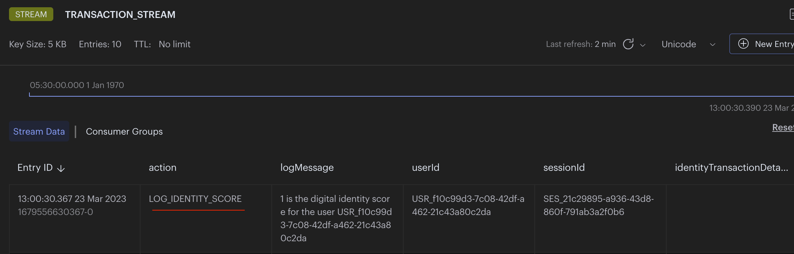

import Authors from '@theme/Authors';
import digitalIdentityImg from './images/digital-identity.png';

import MicroservicesEcommerceDesign from '../../microservices/common-data/microservices-ecommerce.mdx';
import MicroservicesArchitectureWithRedis from '../../microservices/common-data/microservices-arch-with-redis.mdx';
import SourceCode from '../../microservices/common-data/microservices-source-code-tip.mdx';

<Authors frontMatter={frontMatter} />

<SourceCode />

## Know Your Customer (KYC)

"Know Your Customer" (KYC) regulations refer to a set of policies and procedures that financial institutions and other regulated businesses must follow to verify the identity of their customers. Customer details can be like name, address, date of birth, and other government-issued identification/ documents.

KYC regulations are intended to prevent money laundering, terrorist financing, and other illicit activities.
Financial services companies are combating the use of stolen identity information by reducing reliance on static methods for verifying identity (Knowledge-Based Authentication - KBA) and instead moving to Digital Identities.

## What is Digital identity?

Digital identity refers to a set of attributes, credentials, and data that uniquely identify an individual or entity in the digital world, merging the physical and the online aspects of their identity.


Digital identities consist of two parts:

- **Static** data: personally identifiable information (PII) such as name, address, and biometrics
- **Dynamic** data: behavioural and contextual information such as browsing history, device type, and location data. Dynamic digital identities are constantly updated based on the information available from each digital transaction.

Companies must monitor customer's every transaction and behaviour, then use stored digital identities to score the **risk** (**possible suspicious activity**) of that transaction.

## Why You Should Use Redis for Digital Identity Validation

Main requirements of a storage layer for digital identities:

- Must maintain **real-time read latency** to fit within transaction SLA.
- Must have a **flexible data model** to store multiple unstructured data types such as behavioural, transactional, location, social/mobile and more.

These two factors are limiting for using RDBMS (Relation Database Management Systems) to manage and validate digital identities in real time.

**Redis Enterprise**, on the other hand, is optimized for high throughput, low latency, and real-time query performance, easily satisfying the first criterion. With **sub-millisecond latency** and hundreds of millions of operations per second across both read and write operations, it is well-suited for managing dynamic digital identity data. As the volume of data grows, we can expect near-linear scalability and 99.999% of uptime with **Active-Active geo-replication**.

Redis Enterprise's flexible data model has native support for multiple data types, including **JSON, hashes, streams, graphs and more**. Additionally, it can process complex searches on structured and unstructured data, as well as filtering by numeric properties and geographical distances, making it easier to manage and query large datasets of digital identities.

## Microservices Architecture for an E-commerce Application

<MicroservicesArchitectureWithRedis />

### Storing Digital identity


Note : Our demo (github) app doesn't have a `login service`, all user sessions are currently authenticated in `apigateway` service. so `login service` is equal to `apigateway` service as per demo app context.

1. `Login service` stores the (user) digital identity as stream entry to Redis
   

2. `Digital identity service` reads the identity from Redis stream

3. `Digital identity service` stores identity as JSON to Redis
   

### Validating Digital identity


1. `Orders service` stores the digital identity to Redis stream to calculate it's identity score
   

2. `Digital identity service` reads the identity from Redis stream
3. `Digital identity service` calculates the identity score and stores to Redis stream
   
4. `Digital identity service` stores identity with score as Redis JSON
   

## E-commerce Application Frontend using Next.js and Tailwind

<MicroservicesEcommerceDesign />

## Building a Digital Identity Validation Microservice with Redis

In this tutorial, we will be verifying "digital identity" by calculating "digital identity" score using Redis. Let's consider only few characteristics of user's Digital Identity for the demo like IP address, browser fingerprint and session (but you can always store more characteristics like location, device type..etc in a real application).

### Storing Digital identity

1. `Login service` stores the (user) digital identity as stream entry to Redis

```ts
//addLoginToTransactionStream
const userId = 'USR_4e7acc44-e91e-4c5c-9112-bdd99d799dd3';
const sessionId = 'SES_94ff24a8-65b5-4795-9227-99906a43884e';

const entry: ITransactionStreamMessage = {
  action: 'INSERT_LOGIN_IDENTITY',
  logMessage: `Digital identity to be stored for the user ${userId}`,
  userId: userId,
  sessionId: sessionId,

  identityBrowserAgent: req.headers['user-agent'],
  identityIpAddress:
    req.headers['x-forwarded-for']?.toString() || req.socket.remoteAddress,
};

const nodeRedisClient = getNodeRedisClient();
const streamKeyName = 'TRANSACTION_STREAM';
const id = '*'; //* = auto generate
await nodeRedisClient.xAdd(streamKeyName, id, entry);
```

2. `Digital identity service` reads the identity from Redis stream

```ts
// Below is some code for how you would use Redis to listen for the stream events:

async function listenToStream(
  onMessage: (message: any, messageId: string) => Promise<void>,
) {
  // using node-redis
  const redis = getNodeRedisClient();
  const streamKeyName = 'TRANSACTION_STREAM'; //stream name
  const groupName = 'TRANSACTION_CON_GROUP'; // listening consumer group name (custom)
  const consumerName = 'IDENTITY_CON'; // listening consumer name (custom)
  const readMaxCount = 100;

  // Check if the stream group already exists
  if (!(await redis.exists(streamKeyName))) {
    const idPosition = '0'; //0 = start, $ = end or any specific id
    await nodeRedisClient.xGroupCreate(streamKeyName, groupName, idPosition, {
      MKSTREAM: true,
    });
  }

  // setup a loop to listen for stream events
  while (true) {
    // read set of messages from different streams
    const dataArr = await nodeRedisClient.xReadGroup(
      commandOptions({
        isolated: true,
      }),
      groupName,
      consumerName,
      [
        {
          // you can specify multiple streams in array
          key: streamKeyName,
          id: '>', // Next entry ID that no consumer in this group has read
        },
      ],
      {
        COUNT: readMaxCount, // Read n entries at a time
        BLOCK: 0, // block for 0 (infinite) seconds if there are none.
      },
    );

    for (let data of dataArr) {
      for (let messageItem of data.messages) {
        // process the message received (in our case, perform payment)
        await onMessage(messageItem.message, messageItem.id);

        // acknowledge individual messages after processing
        nodeRedisClient.xAck(streamKeyName, groupName, messageItem.id);
      }
    }
  }
}

// `listenToStream` listens for events and calls the `onMessage` callback to further handle the events.
listenToStream({
  onMessage: processTransactionStream,
});
```

3. `Digital identity service` stores identity as JSON to Redis

```ts
const processTransactionStream: IMessageHandler = async (
  message: ITransactionStreamMessage,
  messageId,
) => {
  if (message) {
    if (message.action == 'INSERT_LOGIN_IDENTITY') {
      const insertedKey = await addDigitalIdentityToRedis(message);
    } else if (message.action == 'CALCULATE_IDENTITY_SCORE') {
      //...
    }
  }
};

const addDigitalIdentityToRedis = async (
  message: ITransactionStreamMessage,
) => {
  let insertedKey = '';

  const userId = message.userId;
  const digitalIdentity: IDigitalIdentity = {
    action: message.action,
    userId: userId,
    sessionId: message.sessionId,

    ipAddress: message.identityIpAddress,
    browserFingerprint: crypto
      .createHash('sha256')
      .update(message.identityBrowserAgent)
      .digest('hex'),
    identityScore: message.identityScore ? message.identityScore : '',

    createdOn: new Date(),
    createdBy: userId,
    statusCode: DB_ROW_STATUS.ACTIVE, //1
  };

  const repository = digitalIdentityRepo.getRepository();
  if (repository) {
    const entity = repository.createEntity(digitalIdentity);
    insertedKey = await repository.save(entity);
  }

  return insertedKey;
};
```

### Validating Digital identity

1. `Orders service` stores the digital identity to be validated in Redis stream

```ts
//adding Identity To TransactionStream
const userId = 'USR_4e7acc44-e91e-4c5c-9112-bdd99d799dd3';
const sessionId = 'SES_94ff24a8-65b5-4795-9227-99906a43884e';
let orderDetails = {
  orderId: '63f5f8dc3696d145a45775a6',
  orderAmount: '1000',
  userId: userId,
};

const entry: ITransactionStreamMessage = {
  action: 'CALCULATE_IDENTITY_SCORE',
  logMessage: `Digital identity to be validated/ scored for the user ${userId}`,
  userId: userId,
  sessionId: sessionId,

  identityBrowserAgent: req.headers['user-agent'],
  identityIpAddress:
    req.headers['x-forwarded-for']?.toString() || req.socket.remoteAddress,
  identityTransactionDetails: orderDetails ? JSON.stringify(orderDetails) : '',
};

const nodeRedisClient = getNodeRedisClient();
const streamKeyName = 'TRANSACTION_STREAM';
const id = '*'; //* = auto generate
await nodeRedisClient.xAdd(streamKeyName, id, entry);
```

2. `Digital identity service` reads the identity from Redis stream

```ts
// Below is some code for how you would use Redis to listen for the stream events:

async function listenToStream(
  onMessage: (message: any, messageId: string) => Promise<void>,
) {
  // using node-redis
  const redis = getNodeRedisClient();
  const streamKeyName = 'TRANSACTION_STREAM'; //stream name
  const groupName = 'TRANSACTION_CON_GROUP'; // listening consumer group name (custom)
  const consumerName = 'IDENTITY_CON'; // listening consumer name (custom)
  const readMaxCount = 100;

  // Check if the stream group already exists
  if (!(await redis.exists(streamKeyName))) {
    const idPosition = '0'; //0 = start, $ = end or any specific id
    await nodeRedisClient.xGroupCreate(streamKeyName, groupName, idPosition, {
      MKSTREAM: true,
    });
  }

  // setup a loop to listen for stream events
  while (true) {
    // read set of messages from different streams
    const dataArr = await nodeRedisClient.xReadGroup(
      commandOptions({
        isolated: true,
      }),
      groupName,
      consumerName,
      [
        {
          // you can specify multiple streams in array
          key: streamKeyName,
          id: '>', // Next entry ID that no consumer in this group has read
        },
      ],
      {
        COUNT: readMaxCount, // Read n entries at a time
        BLOCK: 0, // block for 0 (infinite) seconds if there are none.
      },
    );

    for (let data of dataArr) {
      for (let messageItem of data.messages) {
        // process the message received (in our case, perform payment)
        await onMessage(messageItem.message, messageItem.id);

        // acknowledge individual messages after processing
        nodeRedisClient.xAck(streamKeyName, groupName, messageItem.id);
      }
    }
  }
}

// `listenToStream` listens for events and calls the `onMessage` callback to further handle the events.
listenToStream({
  onMessage: processTransactionStream,
});
```

3. `Digital identity service` calculates the identity score and stores to Redis stream

```ts
const processTransactionStream: IMessageHandler = async (
  message: ITransactionStreamMessage,
  messageId,
) => {
  if (message) {
    if (message.action == 'INSERT_LOGIN_IDENTITY') {
      //...
    } else if (message.action == 'CALCULATE_IDENTITY_SCORE') {
      // calculate identity score
      const identityScore = await calculateIdentityScore(message);
      message.identityScore = identityScore.toString();

      //point 3 - store identity score to stream
      const entry = {
        action: 'LOG_IDENTITY_SCORE',
        logMessage: `${identityScore} is the digital identity score for the user ${message.userId}`,
        userId: message.userId,
        sessionId: message.sessionId,
        identityScore: identityScore.toString(),
      };
      const nodeRedisClient = getNodeRedisClient();
      const streamKeyName = 'TRANSACTION_STREAM';
      const id = '*'; //* = auto generate
      await nodeRedisClient.xAdd(streamKeyName, id, entry);

      // point 4
      const insertedKey = await addDigitalIdentityToRedis(message);
    }
  }
};

const calculateIdentityScore = async (message: ITransactionStreamMessage) => {
  //Compare the "digital identity" with previously stored "login identities" and determine the identity score

  let identityScore = 0;
  const repository = digitalIdentityRepo.getRepository();

  if (message && message.userId && repository) {
    let queryBuilder = repository
      .search()
      .where('userId')
      .eq(message.userId)
      .and('action')
      .eq('INSERT_LOGIN_IDENTITY')
      .and('statusCode')
      .eq(DB_ROW_STATUS.ACTIVE);

    //console.log(queryBuilder.query);
    const digitalIdentities = await queryBuilder.return.all();

    if (digitalIdentities && digitalIdentities.length) {
      //if browser details matches -> +1 score
      const matchBrowserItems = digitalIdentities.filter((_digIdent) => {
        let identityBrowserAgentHash = crypto
          .createHash('sha256')
          .update(message.identityBrowserAgent)
          .digest('hex');
        return _digIdent.browserFingerprint == identityBrowserAgentHash;
      });
      if (matchBrowserItems.length > 0) {
        identityScore += 1;
      }

      //if IP address  matches -> +1 score
      const matchIpAddressItems = digitalIdentities.filter((_digIdent) => {
        return _digIdent.ipAddress == message.identityIpAddress;
      });
      if (matchIpAddressItems.length > 0) {
        identityScore += 1;
      }
    }
  }

  //calculate average score
  const noOfIdentityCharacteristics = 2; //2 == browserFingerprint, ipAddress
  identityScore = identityScore / noOfIdentityCharacteristics;
  return identityScore; // identityScore final value ranges between 0 (no match) and 1 (full match)
};
```

4. `Digital identity service` stores identity with score as Redis JSON

```ts
const addDigitalIdentityToRedis = async (
  message: ITransactionStreamMessage,
) => {
  let insertedKey = '';

  const userId = message.userId;
  const digitalIdentity: IDigitalIdentity = {
    action: message.action,
    userId: userId,
    sessionId: message.sessionId,

    ipAddress: message.identityIpAddress,
    browserFingerprint: crypto
      .createHash('sha256')
      .update(message.identityBrowserAgent)
      .digest('hex'),
    identityScore: message.identityScore ? message.identityScore : '',

    createdOn: new Date(),
    createdBy: userId,
    statusCode: DB_ROW_STATUS.ACTIVE, //1
  };

  const repository = digitalIdentityRepo.getRepository();
  if (repository) {
    const entity = repository.createEntity(digitalIdentity);
    insertedKey = await repository.save(entity);
  }

  return insertedKey;
};
```

<!--
Referred application :
[Github Link](https://github.com/redis-field-engineering/demo-microservices-fraud/)
[About app](https://github.com/redis-field-engineering/demo-microservices-fraud/blob/master/docs/Presentation.md)
-->

## Conclusion

Digital Identity's extra characteristics helps in securing transaction better rather than just session validation.
Digital identity score along with user profile score and AI (Artificial Intelligence) score can greatly enhance the transaction security. Check out additional resources below for learning more about Redis.

### Additional Resources

- [Transaction Risk Scoring](/howtos/solutions/fraud-detection/transaction-risk-scoring)
- [CQRS](/howtos/solutions/microservices/cqrs)
- [Interservice communication](/howtos/solutions/microservices/interservice-communication)
- [Query caching](/howtos/solutions/microservices/caching)
- [API gateway caching](/howtos/solutions/microservices/api-gateway-caching)
- [Redis YouTube channel](https://www.youtube.com/c/Redisinc)
- Clients like [Node Redis](https://github.com/redis/node-redis) and [Redis om Node](https://github.com/redis/redis-om-node) help you to use Redis in Node.js applications.
- [RedisInsight](https://redis.com/redis-enterprise/redis-insight/) : To view your Redis data or to play with raw Redis commands in the workbench
