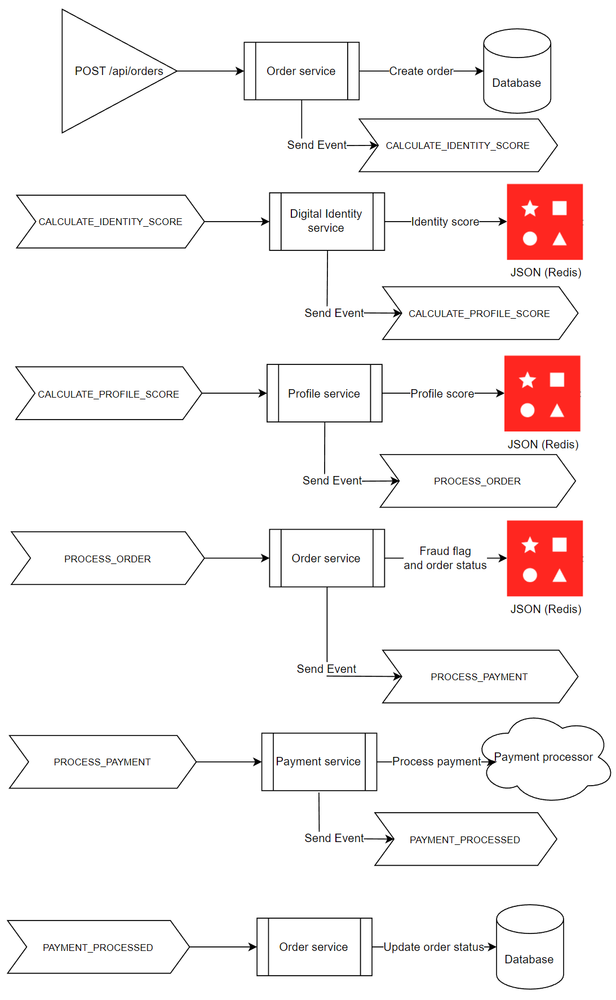
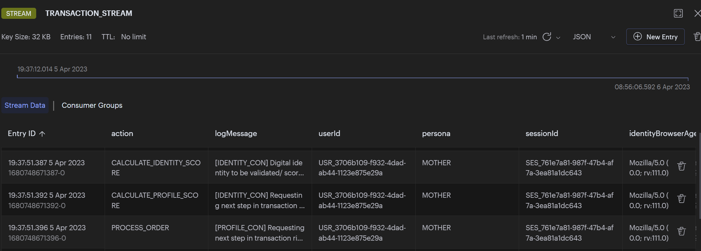
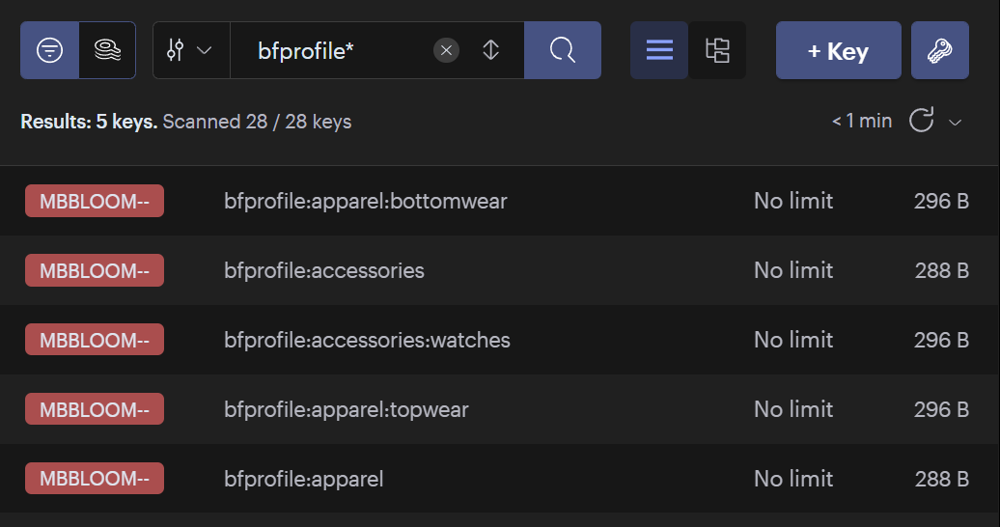
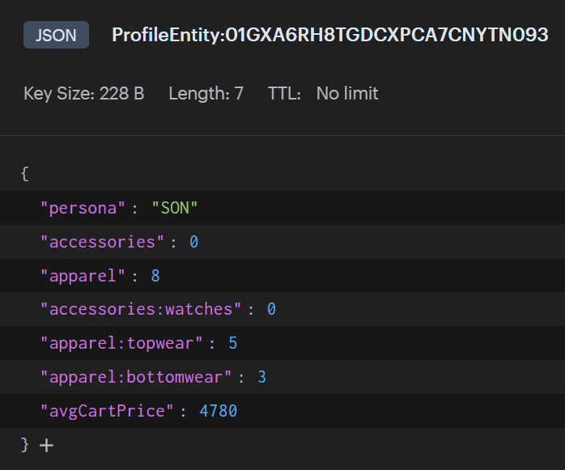

import Authors from '@theme/Authors';
import MicroservicesArchitectureWithRedis from '../../microservices/common-data/microservices-arch-with-redis.mdx';
import SourceCode from '../../microservices/common-data/microservices-source-code-tip.mdx';

<Authors frontMatter={frontMatter} />

<SourceCode />

## What is transaction risk scoring

"Transaction risk scoring" is a method of leveraging data science, machine learning, and statistical analysis to continuously monitor transactions and assess the relative risk associated with each transaction. By comparing transactional data to models of known fraud, the risk score can be calculated, and the closer a transaction matches fraudulent behaviour, the higher the risk score.

The score is typically based on a statistical analysis of historical transaction data to identify patterns and trends associated with fraudulent activity. The score can then be used to trigger alerts or to automatically decline transactions that exceed a certain risk threshold. It can also be used to trigger additional authentication steps for high-risk transactions. Additional steps might include a one-time password (OTP) sent via text, email, or biometric scan.

:::tip

Transaction risk scoring is often combined in a single system with other fraud detection methods, such as <u>[**digital identity validation**](/howtos/solutions/fraud-detection/digital-identity-validation)</u>.

:::

## Why you should use redis for transaction risk scoring

A risk-based approach must be designed to create a frictionless flow as possible to **avoid slowing down** the transaction experience for legitimate customers while simultaneously preventing fraud. If your risk-based approach is too strict, it will **block legitimate transactions** and frustrate customers. If it is too lenient, it will **allow fraudulent transactions** to go through.

### How to avoid false positives with rules engines

Rules-based automated fraud detection systems operate on simple "yes or no" logic to determine whether a given transaction is likely to be fraudulent. An example of a rule would be "block all transactions over $500 from a risky region". With a simple binary decision like this, the system is likely to block a lot of genuine customers. Sophisticated fraudsters easily fool such systems, and the complex nature of fraud means that simple "yes or no" rules may not be enough to assess the risk of each transaction accurately.

More accurate risk scoring with **AI/ML** addresses these issues. Modern fraud detection systems use machine learning models trained on large volumes of different data sets (user profiles, transaction patterns, behavioural attributes and more) to accurately identify fraudulent transactions. These models have been designed to be flexible, so they can adapt to new types of fraud. For example, a neural network can examine suspicious activities like how many pages a customer browses before making an order, whether they are copying and pasting information or typing it in manually and flag the customer for further review.

The models use historical as well as most recent data to create a risk profile for each customer. By analyzing past behaviour it is possible to create a profile of what is normal for each customer. Any transactions that deviate from this profile can be flagged as suspicious, reducing the likelihood of false positives. The models are very fast to adapt to changes in normal behaviour too, and can quickly identify patterns of fraud transactions.

This is exactly where **Redis Enterprise** excels in transaction risk scoring.

### How to use Redis Enterprise for transaction risk scoring

People use Redis Enterprise as the **in-memory** online store for online and **real-time access** to feature data as part of a transaction risk scoring system. By serving online features with low latency, Redis Enterprise enables the risk-scoring models to return results in real-time, thereby allowing the whole system to achieve high accuracy and **instant response** on approving legitimate online transactions.

Another very common use for Redis Enterprise in transaction risk scoring is for **transaction filters**. A transaction filter can be implemented as a **Bloom** filter that stores information about user behaviours. It can answer questions like "Have we seen this user purchase at this merchant before?" Or, "Have we seen this user purchase at this merchant in the X to Y price range before?" Being a probabilistic data structure, Redis Bloom filters do, indeed, sacrifice some accuracy, but in return, they get a very low memory footprint and response time.

Finally, both of the use cases above can be deployed in an Active-Active set-up, allowing for 99.999% uptime. This is a very important feature for transaction risk scoring systems, as they need to be available 24/7 in multiple regions across the globe.

:::tip

You might ask why not use a Redis Set to answer some of the questions above. Redis Sets are used to store unordered collections of unique strings (members). They are very efficient, with most operations taking O(1) time complexity. However, the `SMEMBERS` command is O(N), where N is the cardinality of the set, and can be very slow for large sets. This is why Redis Bloom filters are a better choice for transaction filters. Applications undergo millions of transactions every day, and Bloom filters maintain a speedy response time at scale.

:::

## Transaction risk scoring in a microservices architecture for an e-commerce application

<MicroservicesArchitectureWithRedis />

### Transaction risk scoring checkout procedure

When a user goes to checkout, the system needs to check the user's digital identity and profile to determine the risk of the transaction. The system can then decide whether to approve the transaction or to trigger additional authentication steps. The following diagram shows the flow of transaction risk scoring in the e-commerce application:



The following steps are performed in the checkout procedure:

1. The customer adds an item to the cart and proceeds to checkout.
1. The `order service` recives the checkout request and creates an order in the database.
1. The `order services` publishes a `CALCULATE_IDENTITY_SCORE` event to the `TRANSACTIONS` Redis stream.
1. The `identity service` subscribes to the `TRANSACTIONS` Redis stream and receives the `CALCULATE_IDENTITY_SCORE` event.
1. The `identity service` [calculates the identity score](/howtos/solutions/fraud-detection/digital-identity-validation) for the user and publishes a `CALCULATE_PROFILE_SCORE` event to the `TRANSACTIONS` Redis stream.
1. The `profile service` subscribes to the `TRANSACTIONS` Redis stream and receives the `CALCULATE_PROFILE_SCORE` event.
1. The `profile service` calculates the profile score by checking the products in the shopping cart against a known profile for the customer.
1. The `profile service` publishes a `PROCESS_ORDER` event to the `TRANSACTIONS` Redis stream.
1. The `order service` subscribes to the `TRANSACTIONS` Redis stream and receives the `PROCESS_ORDER` event.
1. The `order service` determines if there is a likelihood of fraud based on the identity and profile scores. If there is a likelihood of fraud, the `order service` triggers additional authentication steps. If there is no likelihood of fraud, the `order service` approves the order and proceeds to process payments.

### Coding example for transaction risk scoring with redis

<SourceCode />

Now that you understand the steps involved in the checkout process for transaction risk scoring, let's look at the code for the `order service` and `profile service` to facilitate this process:

:::note

To see the code for the `identity service` check out the [digital identity validation](/howtos/solutions/fraud-detection/digital-identity-validation) solution.

:::

#### Initiating the checkout process in the order service

When the `order service` receives a checkout request, it creates an order in the database and publishes a `CALCULATE_IDENTITY_SCORE` event to the `TRANSACTIONS` Redis stream. The event contains information about the order as well as the customer, such as the browser fingerprint, IP address, and persona (profile). This data will be used during the transaction by the `identity service` and `profile service` to calculate the identity and profile scores. The `order service` also specifies the transaction pipeline, meaning it determines the order of events called so that the `identity service` and `profile service` do not need to be aware of each other. The `order service` ultimately owns the transaction. The sample code below shows the `createOrder` function in the `order service`. The code example below is highly simplified. For more detail please see the source code linked above:

```typescript
const TransactionPipelines = {
  CHECKOUT: [
    TransactionStreamActions.CALCULATE_IDENTITY_SCORE,
    TransactionStreamActions.CALCULATE_PROFILE_SCORE,
    TransactionStreamActions.PROCESS_ORDER,
  ],
};

async function createOrder(
  order: IOrder,
  browserAgent: string,
  ipAddress: string,
  sessionId: string,
  sessionData: ISessionData,
) {
  order = await validateOrder(order);

  const orderId = await addOrderToRedis(order);
  order.orderId = orderId;

  await addOrderToMongoDB(order);

  // Log order creation to the LOGS stream
  await streamLog({
    action: 'CREATE_ORDER',
    message: `[${REDIS_STREAMS.CONSUMERS.ORDERS}] Order created with id ${orderId} for the user ${userId}`,
    metadata: {
      userId: userId,
      persona: sessionData.persona,
      sessionId: sessionId,
    },
  });

  let orderAmount = 0;
  order.products?.forEach((product) => {
    orderAmount += product.productPrice * product.qty;
  });

  const orderDetails: IOrderDetails = {
    orderId: orderId,
    orderAmount: orderAmount.toFixed(2),
    userId: userId,
    sessionId: sessionId,
    order,
  };

  // Initiate the transaction by adding the order details to the transaction stream and sending the first event
  await addMessageToTransactionStream({
    action: TransactionPipelines.CHECKOUT[0],
    logMessage: `[${REDIS_STREAMS.CONSUMERS.IDENTITY}] Digital identity to be validated/ scored for the user ${userId}`,
    userId: userId,
    persona: sessionData.persona,
    sessionId: sessionId,
    orderDetails: orderDetails ? JSON.stringify(orderDetails) : '',
    transactionPipeline: JSON.stringify(TransactionPipelines.CHECKOUT),

    identityBrowserAgent: browserAgent,
    identityIpAddress: ipAddress,
  });

  return orderId;
}
```

Let's look at the `addMessageToTransactionStream` function in more detail:

```typescript
async function addMessageToStream(message, streamKeyName) {
  try {
    const nodeRedisClient = getNodeRedisClient();
    if (nodeRedisClient && message && streamKeyName) {
      const id = '*'; //* = auto generate
      await nodeRedisClient.xAdd(streamKeyName, id, message);
    }
  } catch (err) {
    LoggerCls.error('addMessageToStream error !', err);
    LoggerCls.error(streamKeyName, message);
  }
}

async function addMessageToTransactionStream(
  message: ITransactionStreamMessage,
) {
  if (message) {
    const streamKeyName = REDIS_STREAMS.STREAMS.TRANSACTIONS;
    await addMessageToStream(message, streamKeyName);
  }
}
```

#### Checking an order against a known profile in the profile service

So you can see above, the transaction pipeline follows `CALCULATE_IDENTITY_SCORE` -> `CALCULATE_PROFILE_SCORE` -> `PROCESS_ORDER`. Let's now look at how the `profile service` subcribes to the `TRANSACTIONS` Redis stream and receives the `CALCULATE_PROFILE_SCORE` event. When the `profile service` starts, it subscribes to the `TRANSACTIONS` Redis stream and listens for events.

```typescript
function listenToTransactionStream() {
  listenToStreams({
    streams: [
      {
        streamKeyName: REDIS_STREAMS.STREAMS.TRANSACTIONS,
        processMessageCallback: processTransactionStream,
      },
    ],
    groupName: REDIS_STREAMS.GROUPS.PROFILE,
    consumerName: REDIS_STREAMS.CONSUMERS.PROFILE,
  });
}
```

A highly simplified version of the `listenToStreams` method looks as follows. It takes in a list of stream keys (events) with a callback to process the events, a stream group, and a consumer name. Then it handles the subscription to the stream and calling on the appropriate method when an event comes in:

```typescript
async function listenToStreams(options: ListenStreamOptions) {
  const nodeRedisClient = getNodeRedisClient();
  const streams = options.streams;
  const groupName = options.groupName;
  const consumerName = options.consumerName;

  try {
    const idPosition = '0'; //0 = start, $ = end or any specific id

    // Create a consumer group for each stream if not exists
    await Promise.all(
      streams.map((stream) => {
        return nodeRedisClient.xGroupCreate(
          stream.streamKeyName,
          groupName,
          idPosition,
          {
            MKSTREAM: true,
          },
        );
      }),
    );
    LoggerCls.info(`Created consumer group ${groupName}`);
  } catch (err) {
    LoggerCls.error('Consumer group already exists !'); //, err
  }

  LoggerCls.info(`Starting consumer ${consumerName}.`);

  // wait for new messages indefinitely
  while (true) {
    try {
      //read set of messages from different streams
      const dataArr = await nodeRedisClient.xReadGroup(
        commandOptions({
          isolated: true,
        }),
        groupName,
        consumerName,
        streams.map((stream) => ({ key: stream.streamKeyName, id: '>' })),
        {
          COUNT: readMaxCount,
          BLOCK: 5, //block for 0 (infinite) seconds if there are none.
        },
      );

      // data coming in looks as follows
      // dataArr = [
      //   {
      //     name: 'streamName',
      //     messages: [
      //       {
      //         id: '1642088708425-0',
      //         message: {
      //           key1: 'value1',
      //         },
      //       },
      //     ],
      //   },
      // ];
      if (dataArr && dataArr.length) {
        for (let data of dataArr) {
          for (let messageItem of data.messages) {
            const streamKeyName = data.name;

            const stream = streams.find(
              (s) => s.streamKeyName == streamKeyName,
            );

            if (!stream || !messageItem.message) {
              continue;
            }

            await stream.processMessageCallback(
              messageItem.message,
              messageItem.id,
            );

            //acknowledge individual messages after processing
            nodeRedisClient.xAck(streamKeyName, groupName, messageItem.id);
          }
        }
      }
    } catch (err) {
      LoggerCls.error('xReadGroup error !', err);
    }
  }
}
```

The `processTransactionStream` method is called when a new event comes in. It validates the event, making sure it is the `CALCULATE_PROFILE_SCORE` event, and if it is then it calculates the profile score. It uses a Redis Bloom filter to check if the user has ordered a similar set of products before. It uses a pre-defined persona for the purposes of this demo, but in reality you would build a profile of the user over time. In the demo application, each product has a "master category" and "subcategory". Bloom filters are setup for the master categories as well as the master+subcategories. The scoring logic is highlighted below:

```typescript {55-69}
async function processTransactionStream(
  message: ITransactionStreamMessage,
  messageId,
) {
  LoggerCls.info(`Incomming message in Profile Service ${messageId}`);
  if (
    !(
      message.action === TransactionStreamActions.CALCULATE_PROFILE_SCORE &&
      message.orderDetails &&
      message.persona
    )
  ) {
    return false;
  }

  // Log the event to the LOGS stream
  await streamLog({
    action: TransactionStreamActions.CALCULATE_PROFILE_SCORE,
    message: `[${REDIS_STREAMS.CONSUMERS.PROFILE}] Calculating profile score for the user ${message.userId}`,
    metadata: message,
  });

  // check profile score
  const { order }: IOrderDetails = JSON.parse(message.orderDetails);
  const persona = message.persona.toLowerCase();
  let score = 0;
  const nodeRedisClient = getNodeRedisClient();

  if (!nodeRedisClient) {
    return false;
  }

  const categories = (order.products ?? []).reduce((cat, product) => {
    const masterCategory = product.productData?.masterCategory?.typeName;
    const subCategory = product.productData?.subCategory?.typeName;

    if (masterCategory) {
      cat[`${masterCategory}`.toLowerCase()] = true;

      if (subCategory) {
        cat[`${masterCategory}:${subCategory}`.toLowerCase()] = true;
      }
    }

    return cat;
  }, {} as Record<string, boolean>);

  const categoryKeys = Object.keys(categories);
  const checks = categoryKeys.length;

  LoggerCls.info(
    `Checking ${checks} categories: ${JSON.stringify(categoryKeys)}`,
  );

  await Promise.all(
    categoryKeys.map(async (category) => {
      const exists = await nodeRedisClient.bf.exists(
        `bfprofile:${category}`.toLowerCase(),
        persona,
      );

      if (exists) {
        score += 1;
      }
    }),
  );

  LoggerCls.info(`After ${checks} checks, total score is ${score}`);
  score = score / (checks || 1);

  await streamLog({
    action: TransactionStreamActions.CALCULATE_PROFILE_SCORE,
    message: `[${REDIS_STREAMS.CONSUMERS.PROFILE}] Profile score for the user ${message.userId} is ${score}`,
    metadata: message,
  });

  await nextTransactionStep({
    ...message,
    logMessage: `[${REDIS_STREAMS.CONSUMERS.PROFILE}] Requesting next step in transaction risk scoring for the user ${message.userId}`,
    profileScore: `${score}`,
  });

  return true;
}
```

The `nextTransactionStep` method is called after the profile score has been calculated. It uses the `transactionPipeline` setup in the `order service` to publish the `PROCESS_ORDER` event. The logic for this is below:

```typescript
async function nextTransactionStep(message: ITransactionStreamMessage) {
  const transactionPipeline: TransactionStreamActions[] = JSON.parse(
    message.transactionPipeline,
  );
  transactionPipeline.shift();

  if (transactionPipeline.length <= 0) {
    return;
  }

  const streamKeyName = REDIS_STREAMS.STREAMS.TRANSACTIONS;
  await addMessageToStream(
    {
      ...message,
      action: transactionPipeline[0],
      transactionPipeline: JSON.stringify(transactionPipeline),
    },
    streamKeyName,
  );
}
```

In short, the `nextTransactionStep` method pops the current event off of the `transactionPipeline`, then it publishes the next event in the pipeline, which in this case is the `PROCESS_ORDER` event.

#### Finalizing the order with transaction risk scoring in the order service

The `order service` is responsible for finalizing the order prior to payment. It listens to the `PROCESS_ORDER` event, and then checks the calculated scores to determine if there is potential fraud.

:::note

The demo application keeps things very simple, and it only sets a "potentialFraud" flag on the order. In the real world, you need to choose not only what scoring makes sense for your application, but also how to handle potential fraud. For example, you may want to request additional information from the customer such as a one-time password. You may also want to send the order to a human for review. It depends on your business and your risk appetite and mitigation strategy.

:::

The logic to process and finalize orders in the `order service` is below:

```typescript
async function checkOrderRiskScore(
  message: ITransactionStreamMessage,
  messageId,
) {
  LoggerCls.info(`Incomming message in Order Service`);
  if (
    !(
      message.action === TransactionStreamActions.PROCESS_ORDER &&
      message.orderDetails
    )
  ) {
    return false;
  }

  const orderDetails: IOrderDetails = JSON.parse(message.orderDetails);

  LoggerCls.info(
    `Transaction risk scoring for user ${message.userId} and order ${orderDetails.orderId}`,
  );

  const { identityScore, profileScore } = message;
  const identityScoreNumber = Number(identityScore);
  const profileScoreNumber = Number(profileScore);
  let potentialFraud = false;

  if (identityScoreNumber <= 0 || profileScoreNumber < 0.5) {
    LoggerCls.info(
      `Transaction risk score is too low for user ${message.userId} and order ${orderDetails.orderId}`,
    );

    await streamLog({
      action: TransactionStreamActions.PROCESS_ORDER,
      message: `[${REDIS_STREAMS.CONSUMERS.ORDERS}] Order failed fraud checks for orderId ${orderDetails.orderId} and user ${message.userId}`,
      metadata: message,
    });

    potentialFraud = true;
  }

  const update = {
    orderId: orderDetails.orderId,
    orderStatus: ORDER_STATUS.PENDING,
    potentialFraud,
    userId: orderDetails.userId,
  };

  updateOrderStatusInRedis(update);
  updateOrderStatusInMongoDB(update);

  // Log the order status update
  await streamLog({
    action: TransactionStreamActions.PROCESS_ORDER,
    message: `[${REDIS_STREAMS.CONSUMERS.ORDERS}] Order status updated after fraud checks for orderId ${orderDetails.orderId} and user ${message.userId}`,
    metadata: message,
  });

  // Send the event with order details to the payment service
  await addOrderDetailsToStream({
    ...orderDetails,
    order: JSON.stringify(orderDetails.order),
  });

  await streamLog({
    action: TransactionStreamActions.PROCESS_ORDER,
    message: `[${REDIS_STREAMS.CONSUMERS.ORDERS}] To process payment, order details are added to ${REDIS_STREAMS.STREAMS.ORDERS} for the user ${message.userId}`,
    metadata: message,
  });

  return true;
}
```

### Visualizing the transaction risk scoring data and event pipeline in RedisInsight

:::tip

RedisInsight is the free redis GUI for viewing data in redis. [Click here to download.](https://redis.com/redis-enterprise/redis-insight/)

:::

Now that you understand some of the code involved in processing transactions, let's take a look at the data in RedisInsight. First let's look at the `TRANSACTION_STREAM` key, which is where the stream data is held for the checkout transaction:



You can see the `action` column shows the transaction pipeline discussed earlier. Another thing to look at in RedisInsight is the Bloom filters:



These filters are prepopulated in the demo application based on a feature store. Redis is also storing the features, which in this case is the profiles of each of the personas. Below is an example of one of the profile features:



## Conclusion

In this post, you learned how to use Redis Streams to build a transaction risk scoring pipeline. You also learned how to use Redis Enterprise as a feature store and Redis Bloom filters to calculate a profile score. Every application is unique, so this tutorial is meant to be a starting point for you to build your own transaction risk scoring pipeline.

### Additional resources

- Microservices with Redis
  - [CQRS](/howtos/solutions/microservices/cqrs)
  - [Interservice communication](/howtos/solutions/microservices/interservice-communication)
  - [Query caching](/howtos/solutions/microservices/caching)
  - [Event sourcing](/howtos/solutions/microservices/api-gateway-caching)
- Fraud detection with Redis
  - [Digital identity validation](/howtos/solutions/fraud-detection/digital-identity-validation)
- [Redis YouTube channel](https://www.youtube.com/c/Redisinc)
- [Try Redis Enterprise for free](https://redis.com/try-free/)
