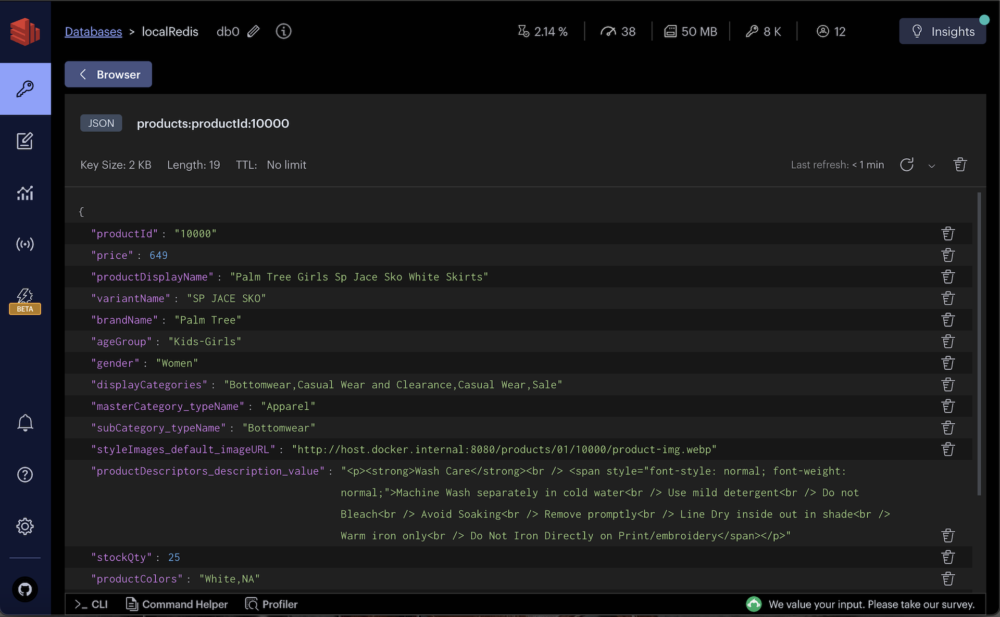
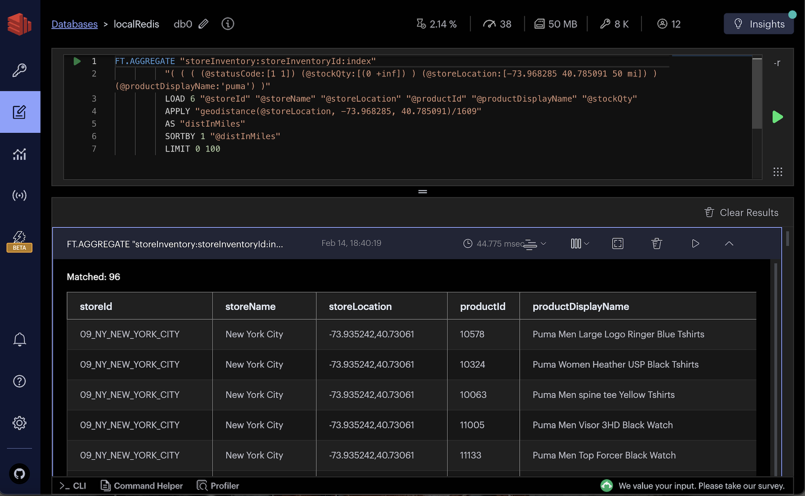
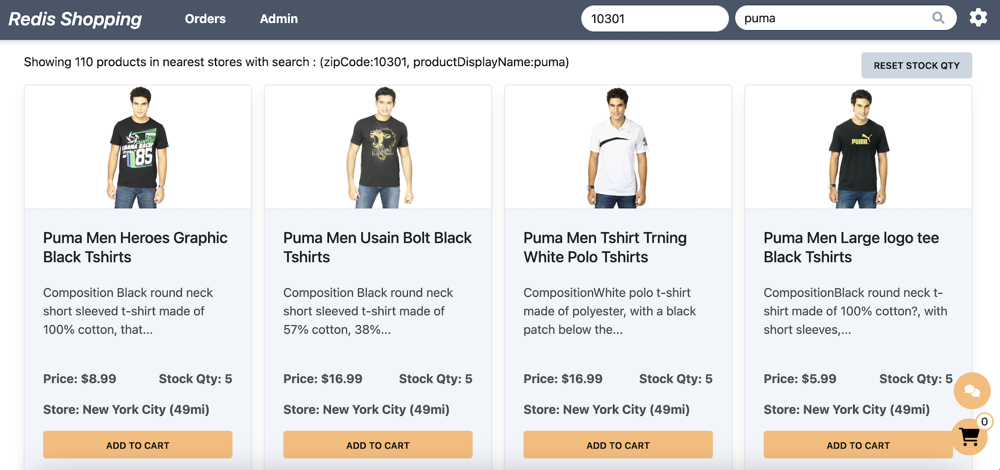

import Authors from '@theme/Authors';
import InitialMicroservicesArchitecture from '../../microservices/common-data/microservices-arch.mdx';
import MicroservicesEcommerceGeoDesign from '../common-geo/microservices-ecommerce-geo.mdx';
import SourceCode from '../common-geo/microservices-source-code-geo.mdx';

<Authors frontMatter={frontMatter} />

## What you will learn in this tutorial

In this comprehensive tutorial, you will gain practical knowledge and hands-on experience with Geo Location search capabilities using Redis, particularly focusing on its application within a microservices architecture for an e-commerce platform. Here's what you can expect to learn:

- **Integrating Geo Location Search with Redis**: Dive deep into the concept of Geo Location search, exploring how Redis can be leveraged to implement real-time location-based search functionalities such as proximity searches, geo-spatial queries, and location-based filtering.

- **Database Setup and Indexing with Redis**: Learn the steps for setting up your Redis database to support Geo Location search, including how to structure your data collections and index them effectively for fast and efficient querying.

- **Building and Querying Geo-Spatial Data**: Gain hands-on experience with writing and executing raw Redis queries for geo-spatial data, understanding the syntax and options available for searching within a radius, calculating distances, and sorting results based on geographical proximity.

- **Developing an API Endpoint for Geo Location Search**: Walk through the process of building a RESTful API endpoint that leverages Redis to perform Geo Location searches, demonstrating how to integrate this functionality into a Node.js backend.

## Microservices architecture for an e-commerce application

<SourceCode />

<InitialMicroservicesArchitecture />

## E-commerce application frontend using Next.js and Tailwind

<MicroservicesEcommerceGeoDesign />

## What is Geo Location search?

Geo Location search involves querying and processing data based on geographical locations identified by latitude and longitude coordinates. This capability is crucial for a wide range of applications, including location-based services, proximity searches, and spatial analysis.

It allows systems to store, index, and quickly retrieve data points within geographical contexts, such as finding all users within a certain distance from a specific point, or calculating the distance between two locations ..etc.

## Why you should use Redis for Geo Location search?

Redis's **geo-spatial** capabilities enable developers to build location-aware applications that can perform proximity searches, location-based filtering, and spatial analysis with ease.

Redis's **in-memory** architecture ensures that geo-spatial data is stored and processed in memory,
resulting in **low latency** and high throughput for location-based queries. This makes Redis an ideal choice for applications requiring **real-time** location-based search functionalities.

Consider a multi store shopping scenario where consumers locate a product online, place the order in their browser or mobile device, and pick up at nearest store location. This is called “buy-online-pickup-in-store” (BOPIS). Redis enables a **real-time view** of store inventory and and seamless BOPIS shopping experience.

## Database setup

<SourceCode />

### Collection details

Our demo application which utilizes two primary data collections within Redis to simulate an e-commerce platform's inventory system:

1. `products` collection : This collection stores detailed information about each product, including name, description, category and price.



:::tip

Utilize <u>[RedisInsight](https://redis.com/redis-enterprise/redis-insight/)</u> to interactively explore your Redis database and execute raw Redis commands in a user-friendly workbench environment.
:::

2. `storeInventory` collection : This collection maintains the inventory status of products across different store locations. It records the quantity of each product available at various stores, facilitating inventory tracking and management.


For the purpose of this demo, we simulate an e-commerce operation in various regions across New York (US), with each store location identified by a `storeId` and associated `stockQty` for products.


### Indexing data

To enable Geo Location searches within our storeInventory collection, it's crucial to index the data appropriately. Redis offers multiple methods for creating indexes: using the Command Line Interface (CLI) or using client libraries like Redis OM, node redis .. etc.

1. Using CLI command

To facilitate geo-spatial queries and other search operations on the `storeInventory` collection, follow these commands:

```sh
# Remove existing index
FT.DROPINDEX "storeInventory:storeInventoryId:index"

# Create a new index with geo-spatial and other field capabilities
FT.CREATE "storeInventory:storeInventoryId:index"
  ON JSON
  PREFIX 1 "storeInventory:storeInventoryId:"
  SCHEMA
    "$.storeId" AS "storeId" TAG SEPARATOR "|"
    "$.storeName" AS "storeName" TEXT
    "$.storeLocation" AS "storeLocation" GEO
    "$.productId" AS "productId" TAG SEPARATOR "|"
    "$.productDisplayName" AS "productDisplayName" TEXT
    "$.stockQty" AS "stockQty" NUMERIC
    "$.statusCode" AS "statusCode" NUMERIC
```

2. Using Redis OM

For applications leveraging the Node.js environment, Redis OM provides an elegant, object-mapping approach to interact with Redis. Below is an implementation example to set up the index using Redis OM:

```ts title="server/src/common/models/store-inventory-repo.ts"
// Import necessary Redis OM classes
import {
  Schema as RedisSchema,
  Repository as RedisRepository,
  EntityId as RedisEntityId,
} from 'redis-om';

import { getNodeRedisClient } from '../utils/redis/redis-wrapper';

// Define a prefix for store inventory keys and the schema for indexing
const STORE_INVENTORY_KEY_PREFIX = 'storeInventory:storeInventoryId';
const schema = new RedisSchema(STORE_INVENTORY_KEY_PREFIX, {
  storeId: { type: 'string', indexed: true },
  storeName: { type: 'text', indexed: true },
  storeLocation: { type: 'point', indexed: true }, // Uses longitude,latitude format

  productId: { type: 'string', indexed: true },
  productDisplayName: { type: 'text', indexed: true },
  stockQty: { type: 'number', indexed: true },
  statusCode: { type: 'number', indexed: true },
});

/*
 A Repository is the main interface into Redis OM. It gives us the methods to read, write, and remove a specific Entity
 */
const getRepository = () => {
  const redisClient = getNodeRedisClient();
  const repository = new RedisRepository(schema, redisClient);
  return repository;
};

/*
we need to create an index or we won't be able to search.
Redis OM uses hash to see if index needs to be recreated or not
*/
const createRedisIndex = async () => {
  const repository = getRepository();
  await repository.createIndex();
};

export {
  getRepository,
  createRedisIndex,
  RedisEntityId,
  STORE_INVENTORY_KEY_PREFIX,
};
```

```ts title="server/src/services/products/src/index.ts"
import * as StoreInventoryRepo from '../../../common/models/store-inventory-repo';

app.listen(PORT, async () => {
  //...

  // Create index for store inventory on startup
  await StoreInventoryRepo.createRedisIndex();
  //...
});
```

## Building Geo Location search with Redis

### Sample raw query

Once the data is indexed, you can execute raw Redis queries to perform Geo Location searches and other spatial operations. Here are two sample queries to demonstrate the capabilities:

1. **Searching Products Within a Radius**: This sample query demonstrates how to find products within a `50-mile` radius of a specific location (`New York City`) with a particular product name (`puma`). It combines geo-spatial search capabilities with text search to filter results based on both location and product name.

```sh
FT.SEARCH "storeInventory:storeInventoryId:index" "( ( ( (@statusCode:[1 1]) (@stockQty:[(0 +inf]) ) (@storeLocation:[-73.968285 40.785091 50 mi]) ) (@productDisplayName:'puma') )"
```

This query leverages the `FT.SEARCH` command to perform a search within the `storeInventory:storeInventoryId:index`. It specifies a circular area defined by the center's longitude and latitude and a radius of `50 miles`. Additionally, it filters products by availability `(@stockQty:[(0 +inf]))` and `@statusCode` indicating an active status `([1 1])`, combined with a match on the product display name containing `puma`.


2. **Aggregate Query for Sorted Results**: This aggregate query extends the first example by sorting the results based on the geographical distance from the search location and limiting the results to the first 100.

```sh
FT.AGGREGATE "storeInventory:storeInventoryId:index"
          "( ( ( (@statusCode:[1 1]) (@stockQty:[(0 +inf]) ) (@storeLocation:[-73.968285 40.785091 50 mi]) ) (@productDisplayName:'puma') )"
          LOAD 6 "@storeId" "@storeName" "@storeLocation" "@productId" "@productDisplayName" "@stockQty"
          APPLY "geodistance(@storeLocation, -73.968285, 40.785091)/1609"
          AS "distInMiles"
          SORTBY 1 "@distInMiles"
          LIMIT 0 100
```

In this query, `FT.AGGREGATE` is used to process and transform search results. The `APPLY` clause calculates the distance between each store location and the specified coordinates, converting the result into miles. The `SORTBY` clause orders the results by this distance, and `LIMIT` caps the output to 100 entries, making the query highly relevant for applications requiring sorted proximity-based search results.



### API endpoint

The `getStoreProductsByGeoFilter` API endpoint enables clients to search for store products based on geographical location and product name, demonstrating a practical application of Redis Geo Location search capabilities.

**API Request**

The request payload specifies the product name to search for, the search radius in miles, and the user's current location in latitude and longitude coordinates.

```json
POST http://localhost:3000/products/getStoreProductsByGeoFilter
{
    "productDisplayName":"puma",

    "searchRadiusInMiles":50,
    "userLocation": {
        "latitude": 40.785091,
        "longitude": -73.968285
    }
}
```

**API Response**

The response returns an array of products matching the search criteria, including detailed information about each product and its distance from the user's location.

```json
{
  "data": [
    {
      "productId": "11000",
      "price": 3995,
      "productDisplayName": "Puma Men Slick 3HD Yellow Black Watches",
      "variantName": "Slick 3HD Yellow",
      "brandName": "Puma",
      "ageGroup": "Adults-Men",
      "gender": "Men",
      "displayCategories": "Accessories",
      "masterCategory_typeName": "Accessories",
      "subCategory_typeName": "Watches",
      "styleImages_default_imageURL": "http://host.docker.internal:8080/images/11000.jpg",
      "productDescriptors_description_value": "...",

      "stockQty": "5",
      "storeId": "11_NY_MELVILLE",
      "storeLocation": {
        "longitude": -73.41512,
        "latitude": 40.79343
      },
      "distInMiles": "46.59194"
    }
    //...
  ],
  "error": null
}
```

### API implementation

This section outlines the implementation of the `getStoreProductsByGeoFilter` API, focusing on the `searchStoreInventoryByGeoFilter` function that executes the core search logic.

1. **Function Overview**: `searchStoreInventoryByGeoFilter` accepts an inventory filter object that includes optional product display name, search radius in miles, and user location. It constructs a query to find store products within the specified radius that match the product name.

2. **Query Construction**: The function builds a search query using Redis OM's fluent API, specifying conditions for product availability, stock quantity, and proximity to the user's location. It also optionally filters products by name if specified.

3. **Executing the Query**: The constructed query is executed against Redis using the ft.aggregate method, which allows for complex aggregations and transformations. The query results are processed to calculate the distance in miles from the user's location and sort the results accordingly.

4. **Result Processing**: The function filters out duplicate products across different stores, ensuring unique product listings in the final output. It then formats the store locations into a more readable structure and compiles the final list of products to return.

```ts
import * as StoreInventoryRepo from '../../../common/models/store-inventory-repo';

interface IInventoryBodyFilter {
  productDisplayName?: string;

  searchRadiusInMiles?: number;
  userLocation?: {
    latitude?: number;
    longitude?: number;
  };
}

const searchStoreInventoryByGeoFilter = async (
  _inventoryFilter: IInventoryBodyFilter,
) => {
  // (1) ---
  const redisClient = getNodeRedisClient();
  const repository = StoreInventoryRepo.getRepository();
  let storeProducts: IStoreInventory[] = [];
  const trimmedStoreProducts: IStoreInventory[] = []; // similar item of other stores are removed
  const uniqueProductIds = {};

  if (
    repository &&
    _inventoryFilter?.userLocation?.latitude &&
    _inventoryFilter?.userLocation?.longitude
  ) {
    const lat = _inventoryFilter.userLocation.latitude;
    const long = _inventoryFilter.userLocation.longitude;
    const radiusInMiles = _inventoryFilter.searchRadiusInMiles || 500;

    // (2) --- Query Construction
    let queryBuilder = repository
      .search()
      .and('statusCode')
      .eq(1)
      .and('stockQty')
      .gt(0)
      .and('storeLocation')
      .inRadius((circle) => {
        return circle.latitude(lat).longitude(long).radius(radiusInMiles).miles;
      });

    if (_inventoryFilter.productDisplayName) {
      queryBuilder = queryBuilder
        .and('productDisplayName')
        .matches(_inventoryFilter.productDisplayName);
    }

    console.log(queryBuilder.query);

    /* Sample queryBuilder.query to run on CLI
    FT.SEARCH "storeInventory:storeInventoryId:index" "( ( ( (@statusCode:[1 1]) (@stockQty:[(0 +inf]) ) (@storeLocation:[-73.968285 40.785091 50 mi]) ) (@productDisplayName:'puma') )"
            */

    // (3) --- Executing the Query
    const indexName = `storeInventory:storeInventoryId:index`;
    const aggregator = await redisClient.ft.aggregate(
      indexName,
      queryBuilder.query,
      {
        LOAD: [
          '@storeId',
          '@storeName',
          '@storeLocation',
          '@productId',
          '@productDisplayName',
          '@stockQty',
        ],
        STEPS: [
          {
            type: AggregateSteps.APPLY,
            expression: `geodistance(@storeLocation, ${long}, ${lat})/1609`,
            AS: 'distInMiles',
          },
          {
            type: AggregateSteps.SORTBY,
            BY: ['@distInMiles', '@productId'],
          },
          {
            type: AggregateSteps.LIMIT,
            from: 0,
            size: 1000,
          },
        ],
      },
    );

    /* Sample command to run on CLI
        FT.AGGREGATE "storeInventory:storeInventoryId:index"
          "( ( ( (@statusCode:[1 1]) (@stockQty:[(0 +inf]) ) (@storeLocation:[-73.968285 40.785091 50 mi]) ) (@productDisplayName:'puma') )"
          "LOAD" "6" "@storeId" "@storeName" "@storeLocation" "@productId" "@productDisplayName" "@stockQty"
          "APPLY" "geodistance(@storeLocation, -73.968285, 40.785091)/1609"
          "AS" "distInMiles"
          "SORTBY" "1" "@distInMiles"
          "LIMIT" "0" "100"
    */

    storeProducts = <IStoreInventory[]>aggregator.results;

    if (!storeProducts.length) {
      // throw `Product not found with in ${radiusInMiles}mi range!`;
    } else {
      // (4) --- Result Processing
      storeProducts.forEach((storeProduct) => {
        if (
          storeProduct?.productId &&
          !uniqueProductIds[storeProduct.productId]
        ) {
          uniqueProductIds[storeProduct.productId] = true;

          if (typeof storeProduct.storeLocation == 'string') {
            const location = storeProduct.storeLocation.split(',');
            storeProduct.storeLocation = {
              longitude: Number(location[0]),
              latitude: Number(location[1]),
            };
          }

          trimmedStoreProducts.push(storeProduct);
        }
      });
    }
  } else {
    throw 'Mandatory fields like userLocation latitude / longitude missing !';
  }

  return {
    storeProducts: trimmedStoreProducts,
    productIds: Object.keys(uniqueProductIds),
  };
};
```

The implementation demonstrates a practical use case for Redis's Geo Location search capabilities, showcasing how to perform proximity searches combined with other filtering criteria (like product name) and present the results in a user-friendly format.

### Front end

Make sure to select `Geo location search` in settings page to enable the feature.


Within the dashboard, users have the option to select a random zip code and search for products (say titled "puma"). The search results are comprehensively displayed, including essential details such as the product name, available stock quantity, the name of the store, and the distance of the store from the user's selected location.



## Ready to use Redis for Geo Location search?

Redis's Geo Location search capabilities offer a powerful and efficient way to perform proximity-based queries and analyses.

By leveraging Redis's in-memory data store and specialized geo commands, developers can build scalable, high-performance applications that respond quickly to location-based queries. The integration with the JavaScript ecosystem further simplifies the development process, enabling seamless application development and deployment.

### References

- [Redis YouTube channel](https://www.youtube.com/c/Redisinc)
- Clients like [Node Redis](https://github.com/redis/node-redis) and [Redis om Node](https://github.com/redis/redis-om-node) help you to use Redis in Node.js applications.
- [RedisInsight](https://redis.com/redis-enterprise/redis-insight/) : To view your Redis data or to play with raw Redis commands in the workbench
- [Try Redis Cloud for free](https://redis.com/try-free/)
