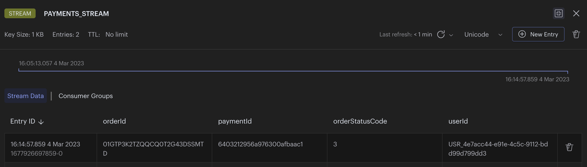

import Authors from '@theme/Authors';
import MicroservicesEcommerceDesign from '../common-data/microservices-ecommerce.mdx';
import MicroservicesArchitectureWithRedis from '../common-data/microservices-arch-with-redis.mdx';

<Authors frontMatter={frontMatter} />

:::tip GITHUB CODE

Source code for the application used in this tutorial

https://github.com/redis-developer/redis-microservices-ecommerce-solutions
:::

## Interservice Communication

When building a microservices application, people use different options for communication between services like

1. **Publish Subscribe** model : In pub sub model (fire & forget model), publisher just produces the messages & **active** subscribers at that time can consume those messages. Subscribers which are down cannot receive the messages at later point of time.
1. **Streams** : Most people decide to use an event **streaming** solution because of

- **Messages persistence** : Unlike pub sub model, messages are stored in streams. So Subscriber can always read messages at later point of time even if it is down for a while.

- **Inherent re-playability** : Even if subscriber crashes during the message processing, it can re-read exactly same unacknowledged message from stream. Say, crashed subscriber never came up - then consumer group feature allows consumers to process unacknowledged messages of other consumers after a specified time.

- **Separation of concerns** : Producers can produce messages to stream at **high speed** separately and consumers can process messages at their own speed separately. So separation of concerns solves both "fast producer -> slow consumer" or "slow producer -> fast consumer" problem by allowing to scale those services independently.

In an event-driven architecture you might have some services that publish an API, and other services that are simply producers and consumers of events with no external API.

## Why you should use Redis for Interservice Communication

Consider the following scenario.

You have an e-commerce application which is broken down in to different microservices like create an orders, create an invoice, process payment, handle fulfillment, etc. Microservices will allow each service to scale independently so now more customers can process their orders at less time simultaneously resulting in better user experience and higher sales volume.

When there are microservices, you obviously need some way of communication between them. You might initially consider using a product like **Kafka** for streaming, but the setup for it is rather complicated. What many people don't know about Redis is that it supports streams similar to Kafka. Given that you are likely to use Redis for caching already, it makes sense to also use it for stream processing. To reduce complexity of application architecture and maintenance, **Redis** is a great option for interservice communication. Keep reading for a break down of how to use Redis with streams for interservice communication.

## Ecommerce micro services architecture

<MicroservicesArchitectureWithRedis />

## Using Redis for Interservice Communication in an Event-driven Architecture

Below is an event flow diagram that outlines how the `orders` & `payments` services communicate through Redis with streams.


Let's outline the streams and events used below:

1. "orders service" inserts full "order" data to database

   ```json
   {
     "orderId": "01GTP3K2TZQQCQ0T2G43DSSMTD",
     "products": [
       {
         "productId": 11000,
         "qty": 3,
         "productPrice": 3995,
         "productData": {
           "productDisplayName": "Puma Men Slick 3HD Yellow Black Watches",
           "variantName": "Slick 3HD Yellow",
           "brandName": "Puma",
           "ageGroup": "Adults-Men",
           "gender": "Men"
           //...
         }
       },
       {
         "productId": 11001,
         "qty": 2,
         "productPrice": 5450,
         "productData": {
           "productDisplayName": "Puma Men Top Fluctuation Red Black Watches",
           "variantName": "Top Fluctuation Red",
           "brandName": "Puma",
           "ageGroup": "Adults-Men",
           "gender": "Men"
           //...
         }
       }
     ],
     "userId": "USR_4e7acc44-e91e-4c5c-9112-bdd99d799dd3",
     "orderStatusCode": 1, //order created
     "createdOn": {
       "$date": {
         "$numberLong": "1677926697801"
       }
     },
     "createdBy": "USR_4e7acc44-e91e-4c5c-9112-bdd99d799dd3",
     "statusCode": 1
   }
   ```

2. "orders service" also enters minimal data (orderId, orderAmount & userId) to `ORDERS_STREAM` to signal new order creation (acts as "PRODUCER" of "ORDERS_STREAM")

   

3. "payments service" listens to `ORDERS_STREAM`, process payment for new orderId and insert "payments" data to database (acts as "CONSUMER" of "ORDERS_STREAM")

   ```json
   {
     "paymentId": "6403212956a976300afbaac1",
     "orderId": "01GTP3K2TZQQCQ0T2G43DSSMTD",
     "orderAmount": 22885,
     "paidAmount": 22885,
     "orderStatusCode": 3, //payment successful
     "userId": "USR_4e7acc44-e91e-4c5c-9112-bdd99d799dd3",
     "createdOn": {
       "$date": {
         "$numberLong": "1677926697841"
       }
     },
     "createdBy": "USR_4e7acc44-e91e-4c5c-9112-bdd99d799dd3",
     "statusCode": 1
   }
   ```

4. "payments service" also enters minimal data (orderId,paymentId, orderStatusCode & userId) to `PAYMENTS_STREAM` - to signal new payment fulfillment (acts as "PRODUCER" of "PAYMENTS_STREAM")
   

5. "orders service" now listens to `PAYMENTS_STREAM`, updates orderStatus and paymentId in database accordingly for the order which has fulfilled payment (acts as "CONSUMER" of "PAYMENTS_STREAM")

```json
{
  //order collection update
  "orderId": "01GTP3K2TZQQCQ0T2G43DSSMTD",
  "paymentId": "6403212956a976300afbaac1",
  "orderStatusCode": 3 //payment success
  //...
}
```

## Ecommerce product

<MicroservicesEcommerceDesign />

## Sample Interservice Communication Application with Redis and MongoDB

We're using Redis to broker the events sent between the orders service and the payments service.

### Producer 1 (Orders Service)

Let's look at some of the code in the orders service to understand how it works.

(step 1) After order creation , (step 2) "orders service" enters minimal data to ORDERS_STREAM to signal new order creation (acts as "PRODUCER" of "ORDERS_STREAM")

```typescript
const addOrderIdToStream = async (
  orderId: string,
  orderAmount: number,
  userId: string,
) => {
  const nodeRedisClient = getNodeRedisClient();
  if (orderId && nodeRedisClient) {
    const streamKeyName = 'ORDERS_STREAM';
    const entry = {
      orderId: orderId,
      orderAmount: orderAmount.toFixed(2),
      userId: userId,
    };
    const id = '*'; //* = auto generate
    //xAdd adds entry to specified stream
    await nodeRedisClient.xAdd(streamKeyName, id, entry);
  }
};
```

### consumer 1 (payments Service)

(step 3)"payments service" listens to `ORDERS_STREAM` (acts as "CONSUMER" of "ORDERS_STREAM")

```typescript
//Below is some code for how you would use Redis to listen for the stream events:

async function listenToStream(
  onMessage: (message: any, messageId: string) => Promise<void>,
) {
  // using node-redis
  const redis = getNodeRedisClient();
  const streamKeyName = 'ORDERS_STREAM'; //stream name
  const groupName = 'ORDERS_CON_GROUP'; //listening consumer group name (custom)
  const consumerName = 'PAYMENTS_CON'; //listening consumer name (custom)
  const readMaxCount = 100;

  // Check if the stream group already exists
  if (!(await redis.exists(streamKeyName))) {
    const idPosition = '0'; //0 = start, $ = end or any specific id
    await nodeRedisClient.xGroupCreate(streamKeyName, groupName, idPosition, {
      MKSTREAM: true,
    });
  }

  // setup a loop to listen for stream events
  while (true) {
    // read set of messages from different streams
    const dataArr = await nodeRedisClient.xReadGroup(
      commandOptions({
        isolated: true,
      }),
      groupName,
      consumerName,
      [
        {
          // you can specify multiple streams in array
          key: streamKeyName,
          id: '>', // Next entry ID that no consumer in this group has read
        },
      ],
      {
        COUNT: readMaxCount, // Read n entries at a time
        BLOCK: 0, // block for 0 (infinite) seconds if there are none.
      },
    );

    for (let data of dataArr) {
      for (let messageItem of data.messages) {
        //process the message received (in our case, perform payment)
        await onMessage(messageItem.message, messageItem.id);

        // acknowledge individual messages after processing
        nodeRedisClient.xAck(streamKeyName, groupName, messageItem.id);
      }
    }
  }
}

//"listenToStream" listens for events and calls the `onMessage` callback to further handle the events.
listenToStream({
  onMessage: processPaymentForNewOrders,
});

const processPaymentForNewOrders: IMessageHandler = async (
  message,
  messageId,
) => {
  /*
   message = {
      orderId: "",
      orderAmount: "",
      userId: "",
    }
    */
  //process payment for new orderId and insert "payments" data to database
};
```

There are a few important things to note here:

1. Make sure the stream group doesn't exist prior to creating it.
1. Use `isolated: true,` in order to use the blocking version of `XREADGROUP` in [isolated execution](https://github.com/redis/node-redis/blob/master/docs/isolated-execution.md) mode.
1. Acknowledge individual messages after they have been processed to remove them from the queue (Pending entries list ) and avoid processing them more than once.

### producer 2 (payments Service)

(step 4) "payments service" also enters minimal data to `PAYMENTS_STREAM` - to signal new payment fulfillment (acts as "PRODUCER" of "PAYMENTS_STREAM")

```typescript
const addPaymentIdToStream = async (
  orderId: string,
  paymentId: string,
  orderStatus: number,
  userId: string,
) => {
  const nodeRedisClient = getNodeRedisClient();
  if (orderId && nodeRedisClient) {
    const streamKeyName = 'PAYMENTS_STREAM';
    const entry = {
      orderId: orderId,
      paymentId: paymentId,
      orderStatusCode: orderStatus.toString(),
      userId: userId,
    };
    const id = '*'; //* = auto generate
    //xAdd adds entry to specified stream
    await nodeRedisClient.xAdd(streamKeyName, id, entry);
  }
};
```

### consumer 2 (orders Service)

(step 5) "orders service" now listens to `PAYMENTS_STREAM` (acts as "CONSUMER" of "PAYMENTS_STREAM")

```typescript
//Below is some code for how you would use Redis to listen for the stream events:

async function listenToStream(
  onMessage: (message: any, messageId: string) => Promise<void>,
) {
  // using node-redis
  const redis = getNodeRedisClient();
  const streamKeyName = 'PAYMENTS_STREAM'; //stream name
  const groupName = 'PAYMENTS_CON_GROUP'; //listening consumer group name (custom)
  const consumerName = 'ORDERS_CON'; //listening consumer name (custom)
  const readMaxCount = 100;

  // Check if the stream group already exists
  if (!(await redis.exists(streamKeyName))) {
    const idPosition = '0'; //0 = start, $ = end or any specific id
    await nodeRedisClient.xGroupCreate(streamKeyName, groupName, idPosition, {
      MKSTREAM: true,
    });
  }

  // setup a loop to listen for stream events
  while (true) {
    // read set of messages from different streams
    const dataArr = await nodeRedisClient.xReadGroup(
      commandOptions({
        isolated: true,
      }),
      groupName,
      consumerName,
      [
        {
          // you can specify multiple streams in array
          key: streamKeyName,
          id: '>', // Next entry ID that no consumer in this group has read
        },
      ],
      {
        COUNT: readMaxCount, // Read n entries at a time
        BLOCK: 0, // block for 0 (infinite) seconds if there are none.
      },
    );

    for (let data of dataArr) {
      for (let messageItem of data.messages) {
        //process the message received (in our case, updateOrderStatus)
        await onMessage(messageItem.message, messageItem.id);

        // acknowledge individual messages after processing
        nodeRedisClient.xAck(streamKeyName, groupName, messageItem.id);
      }
    }
  }
}

//"listenToStream" listens for events and calls the `onMessage` callback to further handle the events.
listenToStream({
  onMessage: updateOrderStatus,
});

const updateOrderStatus: IMessageHandler = async (message, messageId) => {
  /*
   message = {
      orderId: "",
      paymentId: "",
      orderStatusCode:"",
      userId: "",
    }
    */
  //updates orderStatus and paymentId in database accordingly for the order which has fulfilled payment
  //updateOrderStatusInRedis(orderId,paymentId,orderStatusCode,userId)
  //updateOrderStatusInMongoDB(orderId,paymentId,orderStatusCode,userId)
};
```

:::tip

It's best practice to validate the incoming messages to make sure you can work with them.

:::

For the purposes of our application we are making a call to update the order status in Redis and MongoDB. An alternative option is to use something like RedisGears to synchronize the data between Redis and MongoDB. Doing so would allow you to simply write to Redis, which would then trigger RedisGears to subsequently write to MongoDB. It's a small difference, but many people choose to go this route because of the cleaner implementation and separation of concerns.

## Conclusion

That's all there is to it! You've now seen how to use Redis for streaming as both a producer and a consumer. Hopefully you can draw some inspiration from this tutorial and apply it to your own event streaming application. See below for some additional resources around this topic.

### Additional Resources

- Explore streams in detail in the [Redis University course on Redis Streams](https://university.redis.com/courses/ru202/)
- Check out our e-book on [Understanding Streams in Redis and Kafka – A Visual Guide](https://redis.com/docs/understanding-streams-in-redis-and-kafka-a-visual-guide/)
- [CQRS](/howtos/solutions/cqrs)
- [Query caching](/howtos/solutions/caching)
- [API gateway caching](/howtos/solutions/api-gateway-caching)
