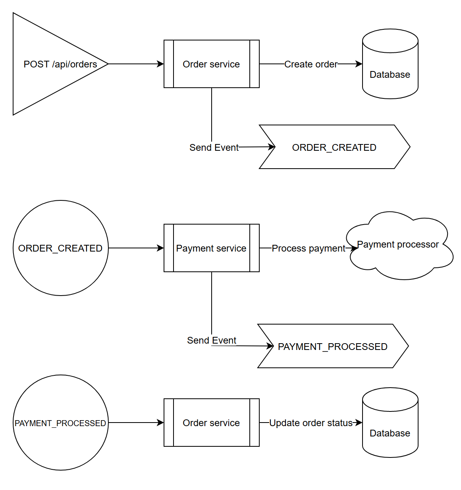

import Authors from '@theme/Authors';

<Authors frontMatter={frontMatter} />

<!-- TODO: Link to github repo -->

When building a microservices application you have a couple different options for communicating between your services. Most people decide to use an event streaming solution for interservice communication because of it's inherent replayability as well as how it helps you separate concerns. In an event-driven architecture you might have some services that publish an API, and other services that are simply producers and consumers of events with no external API.

## Why you should use Redis for Interservice Communication

Consider the following scenario. You have an e-commerce application that allows a customer to populate a shopping cart with products, and has a "Buy Now" button to facilitate ordering the products. When you first start out, you might setup a primary database like MongoDB and populate it with products. Then you might write a backend API to handle creating the order, creating an invoice, processing payment, handling fullfilment, and updating the customer's order history all in one go.

This method of synchronous order processing seems like a good idea, but you quickly find out that your database slows down as you gain more customers and have a higher sales volume. You decide that you need to process orders quickly so the customer doesn't have to wait. Then, when you have time you can create an invoice, process payment, handle fulfillment, etc. So you decide to separate each of these steps into microservices and use an event-driven approach that allows you to scale each service independently. You might initially consider using a product like Kafka for streaming, but the setup for it is rather complicated. What many people don't know about Redis is that it supports streams similar to Kafka. Given that you are likely to use Redis for caching already, it makes sense to also use it for stream processing. This makes Redis a great option for interservice communication. Keep reading for a break down of how to use Redis with streams for interservice communication.

### Using Redis for Interservice Communication in an Event-driven Architecture

Thinking about the e-commerce application, consider the following architecture:

1. `products service` - handles querying products from the database and returning them to the frontend
1. `orders service` - handles validating and creating orders
1. `order history service` - handles querying a customer's order history
1. `payments service` - handles processing orders for payment
1. `api gateway` - unifies your services under a single endpoint
1. `mongodb` - serves as the primary database, storing orders, order history, products, etc.
1. `redis` - serves as the stream processor and caching database

Here is what the architecture diagram looks like:


What is not depicted in the images above is the events happening to coordinate communication between the services. Let's outline the streams and events used below:

1. `ORDERS_STREAM` - Used to signal new orders
1. Producer - `orders service`
1. Consumers - `products service`
1. `PAYMENTS_STREAM` - Used to signal fullfilled payments
1. Producer - `products service`
1. Consumers - `orders service`

Below is an event flow diagram that outlines how the services communicate through Redis with streams.



## Sample Interservice Communication Application with Redis and MongoDB


<!-- TODO: Link to github repo -->

You can find the full source code for the app pictured above here. The frontend is build using Next.js, and the backend is in Node.js.

We're using Redis to broker the events sent between the orders service and the payments service. Let's look at some of the code in the orders service to understand how it works.

### Orders Service Event Consumer Setup

The first thing the orders service does is listen to the `PAYMENTS_STREAM` for `PAYMENT_PROCESSED` events. When a new event comes through, the orders service will update the status of an existing order. Below is some code for how you would use Redis to listen for the stream events:

```typescript
async function listenToStream(
  onMessage: (message: any, messageId: string) => Promise<void>,
) {
  // using node-redis
  const redis = getNodeRedisClient();
  const streamKeyName = 'PAYMENTS_STREAM';
  const groupName = 'PAYMENTS_CON_GROUP';
  const consumerName = 'ORDERS_CON';
  const readMaxCount = 100;

  // Check if the stream group already exists
  if (!(await redis.exists(streamKeyName))) {
    const idPosition = '0'; //0 = start, $ = end or any specific id
    await nodeRedisClient.xGroupCreate(streamKeyName, groupName, idPosition, {
      MKSTREAM: true,
    });
  }

  // setup a loop to listen for stream events
  while (true) {
    // read set of messages from different streams
    const dataArr = await nodeRedisClient.xReadGroup(
      commandOptions({
        isolated: true,
      }),
      groupName,
      consumerName,
      [
        {
          // you can specify multiple streams in array
          key: streamKeyName,
          id: '>', // Next entry ID that no consumer in this group has read
        },
      ],
      {
        COUNT: readMaxCount, // Read n entries at a time
        BLOCK: 0, // block for 0 (infinite) seconds if there are none.
      },
    );

    for (let data of dataArr) {
      for (let messageItem of data.messages) {
        await onMessage(messageItem.message, messageItem.id);

        // acknowledge individual messages after processing
        nodeRedisClient.xAck(streamKeyName, groupName, messageItem.id);
      }
    }
  }
}
```

There are a few important things to note here:

1. Make sure the stream group doesn't exist prior to creating it.
1. Use `isolated: true,` in order to use the blocking version of `XREADGROUP` in [isolated execution](https://github.com/redis/node-redis/blob/master/docs/isolated-execution.md) mode.
1. Acknowledge individual messages after they have been processed to remove them from the queue and avoid processing them more than once.

The code above simply listens for events and calls the `onMessage` callback to further handle the events. In the case of the orders service, the callback goes to a function to update the order status. Let's see what that looks like below.

```typescript
async function updateOrderStatus(message: any, messageId: string) {
  if (
    message &&
    message.orderId &&
    message.paymentId &&
    message.orderStatusCode
  ) {
    updateOrderStatusInRedis(
      message.orderId,
      message.paymentId,
      parseInt(message.orderStatusCode),
    );

    updateOrderStatusInMongoDB(
      message.orderId,
      message.paymentId,
      parseInt(message.orderStatusCode),
    );
  }
}
```

:::tip

It's best practice to validate the incoming messages to make sure you can work with them.

:::

For the purposes of our application we are making a call to update the order status in Redis and MongoDB. An alternative option is to use something like RedisGears to synchronoize the data between Redis and MongoDB. Doing so would allow you to simply write to Redis, which would then trigger RedisGears to subsequently write to MongoDB. It's a small difference, but many people choose to go this route because of the cleaner implementation and separation of concerns.

### Orders Service Event Producer Setup

Now that you've seen how to listen to a Redis stream and respond to events, it's time to learn how to publish events to a stream. The orders service sends events to signal when an order has been created and is ready for further processing. Let's look at the `createOrder` function to see what that looks like.

```typescript
async function createOrder(order: IOrder) {
  if (!order) {
    throw 'Order data is mandatory!';
  }

  order.orderStatusCode = ORDER_STATUS.CREATED;
  order.userId = USERS.DEFAULT; // Used as a shortcut, in a real app you would use customer session data
  order.createdOn = new Date();
  order.createdBy = order.userId;
  order.lastUpdatedOn = null;
  order.lastUpdatedBy = null;
  order.statusCode = DB_ROW_STATUS.ACTIVE;

  order = await validateOrder(order);

  const orderId = await addOrderToRedis(order);
  order.orderId = orderId;

  await addOrderToMongoDB(order);
  await addOrderIdToStream(orderId, orderAmount);

  return orderId;
}
```

THe `createOrder` function simply validates the order, and inserts it into Redis and MongoDB. Then it calls to `addOrderIdToStream`. Below you will find the contents of `addOrderIdToStream`.

```typescript
async function addOrderIdToStream(orderId: string, orderAmount: number) {
  // using node-redis
  const redis = getNodeRedisClient();
  const streamKeyName = 'ORDERS_STREAM';
  const entry = {
    orderId: orderId,
    orderAmount: orderAmount.toFixed(2),
  };
  const id = '*'; //* = auto generate

  await redis.xAdd(streamKeyName, id, entry);
}
```

## Conclusion

That's all there is to it! You've now seen how to use Redis for streaming as both a consumer and a producer. Hopefully you can draw some inspiration from this tutorial and apply it to your own event streaming application. See below for some additional resources around this topic.

## Additional Resources

<!-- TODO: Add links to other solutions tutorials here -->

1. Check out our e-book on [Understanding Streams in Redis and Kafka – A Visual Guide](https://redis.com/docs/understanding-streams-in-redis-and-kafka-a-visual-guide/)
1. Explore streams in detail in the [Redis University course on Redis Streams](https://university.redis.com/courses/ru202/)
