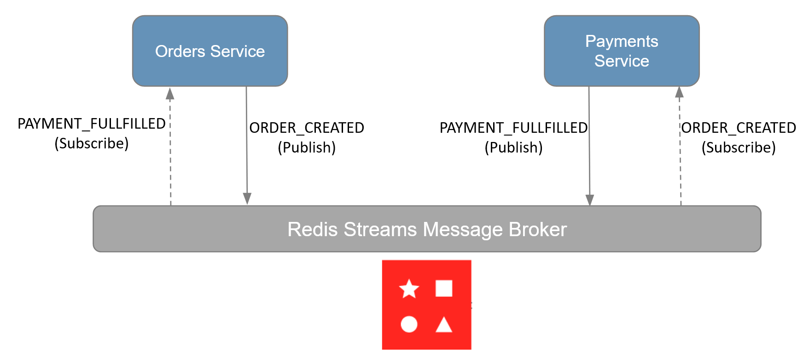
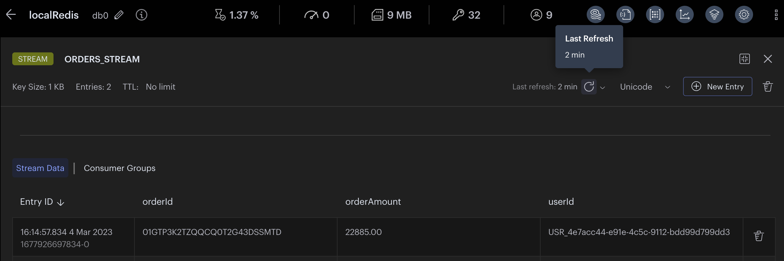
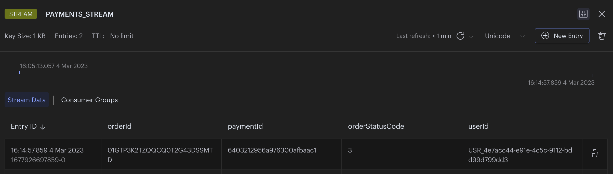

import Authors from '@theme/Authors';
import MicroservicesEcommerceDesign from '../common-data/microservices-ecommerce-old.mdx';
import MicroservicesArchitectureWithRedis from '../common-data/microservices-arch-with-redis-old.mdx';
import SourceCode from '../common-data/microservices-source-code-tip-old.mdx';
import RedisCloud from '../common-data/redis-enterprise.mdx';

<Authors frontMatter={frontMatter} />

<SourceCode />

## What is interservice communication?

When building a microservices application, people use a variety of options for communication between services. Among them:

1. **Publish/Subscribe** model: In the pub/sub model (fire and forget), a publisher produces messages, and subscribers that are _active at the time_ consume those messages. Inactive subscribers cannot receive the messages at a later point in time.
1. **Streaming**: Most microservices applications use an event-streaming solution because of:
   - **Message persistence**: Unlike the pub/sub model, messages stored in streams can be read by multiple consumers at any time; they fan out. So consumers can read messages at a later point in time, even if they were not active when the message was originally appended to the stream.
   - **Inherent replayability**: Even if a subscriber crashes during the message processing, it can re-read the exact same unacknowledged message from the stream. For example, say the crashed subscriber never comes back online; the consumer group feature allows consumers to process unacknowledged messages of other consumers after a specified time.
   - **Separation of concerns**: Producers can produce messages to stream at **high speed** separately and consumers can process messages at their own speed separately. This separation of concerns solves both the "fast producer -> slow consumer" and "slow producer -> fast consumer" problem, allowing for the scaling of those services independently.

In an event-driven microservices architecture, you might have some services that publish an API, and other services that are simply producers and consumers of events with no external API.

## Why you should use Redis for interservice communication

Consider the following scenario: You have an e-commerce application with an architecture that is broken down into different microservices including as `create an order`, `create an invoice`, `process a payment`, `fulfill and order`, and so on. Microservices allow you to separate these commands into different services to scale independently, enabling more customers to get their orders processed quickly and simultaneously, which results in a better user experience, higher sales volume, and less-cranky customer service staff.

When you use microservices, you need a tool for interservice communication. Initially, you might consider using a product like **Kafka** for streaming, but setting it up is rather complicated. What many people don't know about Redis is that it supports streams in the same way Kafka does. Given that you are likely already using Redis for caching, it makes sense to also use it for stream processing. To reduce the complexity of application architecture and maintenance, **Redis** is a great option for interservice communication. Here we break down the process of using Redis with streams for interservice communication.

## Microservices architecture for an e-commerce application

<MicroservicesArchitectureWithRedis />

This diagram illustrates how Redis Streams is used as the message broker between the `orders service` and the `payments service`:



:::tip

Redis Streams is more cost-effective than using Kafka or other similar technologies.
With sub-millisecond latency and a lightweight Streams log data structure, Redis is easier to deploy, develop, and operate.
:::

## Using Redis for interservice communication in an event-driven architecture

The following event flow diagram illustrates how the `orders service` and `payments service` communicate through Redis with streams:


Let's outline the streams and events used below:

1. The `orders service` inserts order data into the database.

   ```json
   //sample order data
   {
     "orderId": "01GTP3K2TZQQCQ0T2G43DSSMTD",
     "products": [
       {
         "productId": 11000,
         "qty": 3,
         "productPrice": 3995,
         "productData": {
           "productDisplayName": "Puma Men Slick 3HD Yellow Black Watches",
           "variantName": "Slick 3HD Yellow",
           "brandName": "Puma",
           "ageGroup": "Adults-Men",
           "gender": "Men"
           //...
         }
       },
       {
         "productId": 11001,
         "qty": 2,
         "productPrice": 5450,
         "productData": {
           "productDisplayName": "Puma Men Top Fluctuation Red Black Watches",
           "variantName": "Top Fluctuation Red",
           "brandName": "Puma",
           "ageGroup": "Adults-Men",
           "gender": "Men"
           //...
         }
       }
     ],
     "userId": "USR_4e7acc44-e91e-4c5c-9112-bdd99d799dd3",
     "orderStatusCode": 1, //order created
     "createdBy": "USR_4e7acc44-e91e-4c5c-9112-bdd99d799dd3",
     "statusCode": 1
   }
   ```

2. The `orders service` also appends minimal data (orderId, orderAmount, and userId) to the `ORDERS_STREAM` to signal new order creation (i.e., it acts as `PRODUCER` of the `ORDERS_STREAM`).

   

3. The `payments service` listens to the `ORDERS_STREAM` and processes payments for new orders, then inserts payment data into the database (i.e, it acts as the `CONSUMER` of the `ORDERS_STREAM`).

   ```json
   //sample payment data
   {
     "paymentId": "6403212956a976300afbaac1",
     "orderId": "01GTP3K2TZQQCQ0T2G43DSSMTD",
     "orderAmount": 22885,
     "paidAmount": 22885,
     "orderStatusCode": 3, //payment successful
     "userId": "USR_4e7acc44-e91e-4c5c-9112-bdd99d799dd3",
     "createdOn": {
       "$date": {
         "$numberLong": "1677926697841"
       }
     },
     "createdBy": "USR_4e7acc44-e91e-4c5c-9112-bdd99d799dd3",
     "statusCode": 1
   }
   ```

4. The `payments service` appends minimal data (orderId, paymentId, orderStatusCode, and userId) to the `PAYMENTS_STREAM` to signal a new payment (i.e., it acts as the `PRODUCER` of the `PAYMENTS_STREAM`).
   

5. The `orders service` listens to the `PAYMENTS_STREAM` and updates the orderStatus and paymentId for orders in the database accordingly as the order payment is fulfilled (i.e., it acts as the `CONSUMER` of the `PAYMENTS_STREAM`).

```json
{
  //order collection update
  "orderId": "01GTP3K2TZQQCQ0T2G43DSSMTD",
  "paymentId": "6403212956a976300afbaac1",
  "orderStatusCode": 3 //payment success
  //...
}
```

## E-commerce application frontend using Next.js and Tailwind

<MicroservicesEcommerceDesign />

<SourceCode />

## Building an interservice communication application with Redis

We use Redis to broker the events sent between the `orders service` and the `payments service`.

### Producer 1 (orders service)

Let's look at some of the code in the orders service to understand how it works:

1. Orders are created.
2. After order creation, the `orders service` appends minimal data to the `ORDERS_STREAM` to signal new order creation.

```typescript title="server/src/services/orders/src/service-impl.ts"
const addOrderIdToStream = async (
  orderId: string,
  orderAmount: number,
  userId: string,
) => {
  const nodeRedisClient = getNodeRedisClient();
  if (orderId && nodeRedisClient) {
    const streamKeyName = 'ORDERS_STREAM';
    const entry = {
      orderId: orderId,
      orderAmount: orderAmount.toFixed(2),
      userId: userId,
    };
    const id = '*'; //* = auto generate
    //xAdd adds entry to specified stream
    await nodeRedisClient.xAdd(streamKeyName, id, entry);
  }
};
```

### Consumer 1 (payments service)

3. The `payments service` listens to the `ORDERS_STREAM`

```typescript title="server/src/services/payments/src/service-impl.ts"
// Below is some code for how you would use Redis to listen for the stream events:

async function listenToStream(
  onMessage: (message: any, messageId: string) => Promise<void>,
) {
  // using node-redis
  const redis = getNodeRedisClient();
  const streamKeyName = 'ORDERS_STREAM'; //stream name
  const groupName = 'ORDERS_CON_GROUP'; // listening consumer group name (custom)
  const consumerName = 'PAYMENTS_CON'; // listening consumer name (custom)
  const readMaxCount = 100;

  // Check if the stream group already exists
  if (!(await redis.exists(streamKeyName))) {
    const idPosition = '0'; //0 = start, $ = end or any specific id
    await nodeRedisClient.xGroupCreate(streamKeyName, groupName, idPosition, {
      MKSTREAM: true,
    });
  }

  // setup a loop to listen for stream events
  while (true) {
    // read set of messages from different streams
    const dataArr = await nodeRedisClient.xReadGroup(
      commandOptions({
        isolated: true,
      }),
      groupName,
      consumerName,
      [
        {
          // you can specify multiple streams in array
          key: streamKeyName,
          id: '>', // Next entry ID that no consumer in this group has read
        },
      ],
      {
        COUNT: readMaxCount, // Read n entries at a time
        BLOCK: 0, // block for 0 (infinite) seconds if there are none.
      },
    );

    for (let data of dataArr) {
      for (let messageItem of data.messages) {
        // process the message received (in our case, perform payment)
        await onMessage(messageItem.message, messageItem.id);

        // acknowledge individual messages after processing
        nodeRedisClient.xAck(streamKeyName, groupName, messageItem.id);
      }
    }
  }
}

// `listenToStream` listens for events and calls the `onMessage` callback to further handle the events.
listenToStream({
  onMessage: processPaymentForNewOrders,
});

const processPaymentForNewOrders: IMessageHandler = async (
  message,
  messageId,
) => {
  /*
   message = {
      orderId: "",
      orderAmount: "",
      userId: "",
    }
    */
  // process payment for new orderId and insert "payments" data to database
};
```

:::note

There are a few important things to note here:

1. Make sure the stream group doesn't exist prior to creating it.
1. Use `isolated: true,` in order to use the blocking version of `XREADGROUP` in [isolated execution](https://github.com/redis/node-redis/blob/master/docs/isolated-execution.md) mode.
1. Acknowledge individual messages after you process them to remove the messages from the pending orders queue and to avoid processing them more than once.

:::

### Producer 2 (payments service)

4. The `payments service` appends minimal data to `PAYMENTS_STREAM` to signal that a payment has been fulfilled.

```typescript title="server/src/services/payments/src/service-impl.ts"
const addPaymentIdToStream = async (
  orderId: string,
  paymentId: string,
  orderStatus: number,
  userId: string,
) => {
  const nodeRedisClient = getNodeRedisClient();
  if (orderId && nodeRedisClient) {
    const streamKeyName = 'PAYMENTS_STREAM';
    const entry = {
      orderId: orderId,
      paymentId: paymentId,
      orderStatusCode: orderStatus.toString(),
      userId: userId,
    };
    const id = '*'; //* = auto generate
    //xAdd adds entry to specified stream
    await nodeRedisClient.xAdd(streamKeyName, id, entry);
  }
};
```

### Consumer 2 (orders service)

5. The `orders service` listens to the `PAYMENTS_STREAM` and updates the order when payments are fulfilled.

```typescript title="server/src/services/orders/src/service-impl.ts"
//Below is some code for how you would use Redis to listen for the stream events:

async function listenToStream(
  onMessage: (message: any, messageId: string) => Promise<void>,
) {
  // using node-redis
  const redis = getNodeRedisClient();
  const streamKeyName = 'PAYMENTS_STREAM'; //stream name
  const groupName = 'PAYMENTS_CON_GROUP'; //listening consumer group name (custom)
  const consumerName = 'ORDERS_CON'; //listening consumer name (custom)
  const readMaxCount = 100;

  // Check if the stream group already exists
  if (!(await redis.exists(streamKeyName))) {
    const idPosition = '0'; //0 = start, $ = end or any specific id
    await nodeRedisClient.xGroupCreate(streamKeyName, groupName, idPosition, {
      MKSTREAM: true,
    });
  }

  // setup a loop to listen for stream events
  while (true) {
    // read set of messages from different streams
    const dataArr = await nodeRedisClient.xReadGroup(
      commandOptions({
        isolated: true,
      }),
      groupName,
      consumerName,
      [
        {
          // you can specify multiple streams in array
          key: streamKeyName,
          id: '>', // Next entry ID that no consumer in this group has read
        },
      ],
      {
        COUNT: readMaxCount, // Read n entries at a time
        BLOCK: 0, // block for 0 (infinite) seconds if there are none.
      },
    );

    for (let data of dataArr) {
      for (let messageItem of data.messages) {
        //process the message received (in our case, updateOrderStatus)
        await onMessage(messageItem.message, messageItem.id);

        // acknowledge individual messages after processing
        nodeRedisClient.xAck(streamKeyName, groupName, messageItem.id);
      }
    }
  }
}

// `listenToStream` listens for events and calls the `onMessage` callback to further handle the events.
listenToStream({
  onMessage: updateOrderStatus,
});

const updateOrderStatus: IMessageHandler = async (message, messageId) => {
  /*
   message = {
      orderId: "",
      paymentId: "",
      orderStatusCode:"",
      userId: "",
    }
    */
  // updates orderStatus and paymentId in database accordingly for the order which has fulfilled payment
  // updateOrderStatusInRedis(orderId,paymentId,orderStatusCode,userId)
  // updateOrderStatusInMongoDB(orderId,paymentId,orderStatusCode,userId)
};
```

:::tip

It's a best practice to validate all incoming messages to make sure you can work with them.

:::

For the purposes of our application, we make a call to update the order status in both Redis and primary database in the same service (For simplicity, we are not using any synchronization technique between databases rather focusing on how the data is stored and accessed in Redis). Another common pattern is to have your services write to one database, and then separately use a CDC mechanism to update the other database. For example, you could write directly to Redis, then use **Triggers and Functions** to handle synchronizing Redis and primary database in the background.

:::tip

If you use **Redis Cloud**, you will find that Redis Streams is available on the same multi-tenant data platform you already use for caching. Redis Cloud also has high availability, message persistence, support for multiple clients, and resiliency with primary/secondary data replication… all built in.

:::

## Ready to use Redis for streaming?

That's all there is to it! You now know how to use Redis for streaming as both a producer and a consumer. Hopefully, you can draw some inspiration from this tutorial and apply it to your own event streaming application. For more on this topic, check out the additional resources below:

### Additional resources

- Redis Streams
  - Explore streams in detail in the [Redis University course on Redis Streams](https://university.redis.com/courses/ru202/)
  - Check out our e-book on [Understanding Streams in Redis and Kafka: A Visual Guide](https://redis.com/docs/understanding-streams-in-redis-and-kafka-a-visual-guide/)
- Microservices with Redis
  - [CQRS](/howtos/solutions/microservices/cqrs)
  - [Query caching](/howtos/solutions/microservices/caching)
  - [API gateway caching](/howtos/solutions/microservices/api-gateway-caching)
- [Redis YouTube channel](https://www.youtube.com/c/Redisinc)
- Clients like [Node Redis](https://github.com/redis/node-redis) and [Redis om Node](https://github.com/redis/redis-om-node) help you to use Redis in Node.js applications.
- [RedisInsight](https://redis.com/redis-enterprise/redis-insight/) : To view your Redis data or to play with raw Redis commands in the workbench
- [Try Redis Cloud for free](https://redis.com/try-free/)
