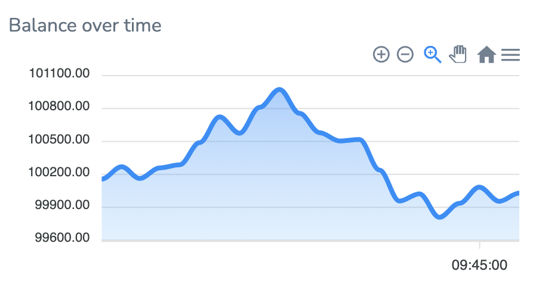
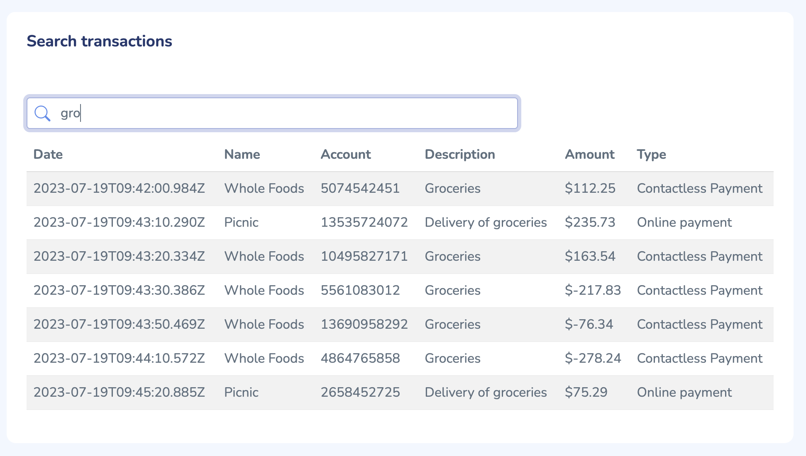
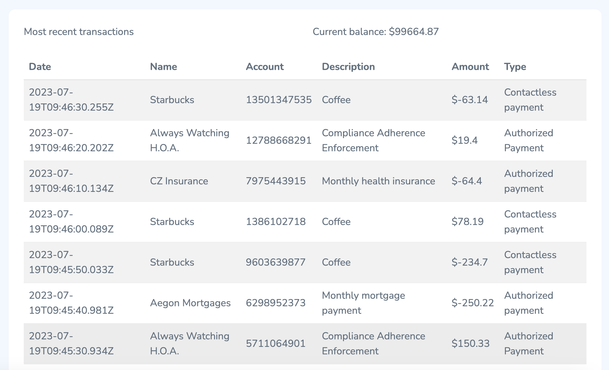

import GeneralAdditionalResources from '../common-mb/additional-resources.mdx';
import MobileBankingSourceCode from '../common-mb/source-code-tip.mdx';
import MobileBankingDataSeeding from '../common-mb/data-seeding.mdx';

<MobileBankingSourceCode />

## What is account dashboard for mobile banking?

An account dashboard is a page in a mobile banking app to instantly render account highlights to users. A customer can click on any of the accounts on the dashboard to see the real time account details, such as latest transactions, mortgage amount they have left to pay, checking and savings, etc.

Account dashboard make customer's finances easily visible in one place. It reduces financial complexity for the customer and fosters customer loyalty


1. Banks store information in a number of separate databases that support individual banking products

2. Key customer account details (balances, recent transactions) across the banks product portfolio are prefetched into Redis Enterprise using Redis Data Integration (RDI)

3. Redis Enterprise powers customer's account dashboards, enabling mobile banking users to view balances and other high-priority information immediately upon login

## Why you should use Redis for mobile banking account dashboard?

- **Resilience**: Redis Enterprise provides resilience with 99.999% uptime and Active-Active Geo Distribution to prevent loss of critical user profile data

- **Scalability**: Redis Enterprise provides < 1ms performance at incredibly high scale to ensure apps perform under peak loads

- **JSON Support**: Provides the ability to create and store account information as JSON documents with the < 1ms speed of Redis

- **Querying and Indexing**: Redis Enterprise can quickly identify and store data from multiple different databases and index data to make it readily searchable

:::note

Redis Stack supports the [<u>**JSON**</u>](/howtos/redisjson/) data type and allows you to index and querying JSON and [<u>**more**</u>](https://redis.io/docs/stack/). So your Redis data is not limited to simple key-value stringified data.

:::

## Building account dashboard with Redis

<MobileBankingSourceCode />

Download the above source code and run following command to start the demo application

```sh
docker compose up
```

After docker up & running, open [http://localhost:8080/](http://localhost:8080/) url in browser to view application

### Data seeding

<MobileBankingDataSeeding />

### Balance over time

**Dashboard widget**



**API end point**

|               |                                   |
| ------------- | --------------------------------- |
| Endpoint      | `/transaction/balance`            |
| Code Location | `/routers/transaction-router.js`  |
| Parameters    | none                              |
| Return value  | `[{x: timestamp, y: value}, ...]` |

The balance endpoint leverages **[Redis time series](https://redis.io/docs/stack/timeseries/) feature**, It returns the range of all values from the time series object `balance_ts`. The resulting range is converted to an array of objects with each object containing an `x` property containing the timestamp and a `y` property containing the associated value. This endpoint supplies the time series chart with coordinates to plot a visualization of the balance over time.

```js title="app/routers/transaction-router.js"
const BALANCE_TS = 'balance_ts';

/* fetch transactions up to sometime ago */
transactionRouter.get('/balance', async (req, res) => {
  //time series range
  const balance = await redis.ts.range(
    BALANCE_TS,
    Date.now() - 1000 * 60 * 5, //from
    Date.now(), //to
  );

  let balancePayload = balance.map((entry) => {
    return {
      x: entry.timestamp,
      y: entry.value,
    };
  });

  res.send(balancePayload);
});
```

### Biggest spenders

**Dashboard widget**


**API end point**

|               |                                  |
| ------------- | -------------------------------- |
| Endpoint      | `/transaction//biggestspenders`  |
| Code Location | `/routers/transaction-router.js` |
| Parameters    | none                             |
| Return value  | `{labels:[...], series:[...] }`  |

The biggest spenders endpoint leverages **[Redis sorted sets](https://redis.io/docs/manual/patterns/indexes/) as a secondary index**, It retrieves all members of the sorted set `bigspenders` that have scores greater than zero. The top five or less are returned to provide the UI pie chart with data. The labels array contains the names of the biggest spenders and the series array contains the numeric values associated with each member name.

```js title="app/routers/transaction-router.js"
const SORTED_SET_KEY = 'bigspenders';

/* fetch top 5 biggest spenders */
transactionRouter.get('/biggestspenders', async (req, res) => {
  const range = await redis.zRangeByScoreWithScores(
    SORTED_SET_KEY,
    0,
    Infinity,
  );
  let series = [];
  let labels = [];

  range.slice(0, 5).forEach((spender) => {
    series.push(parseFloat(spender.score.toFixed(2)));
    labels.push(spender.value);
  });

  res.send({ series, labels });
});
```

### Search existing transactions

**Dashboard widget**



**API end point**

|                  |                                  |
| ---------------- | -------------------------------- |
| Endpoint         | `/transaction/search`            |
| Code Location    | `/routers/transaction-router.js` |
| Query Parameters | term                             |
| Return value     | array of results matching term   |

The search endpoint leverages Redis **[Search and Query](https://redis.io/docs/stack/search/)** feature, It receives a `term` query parameter from the UI. A [Redis om Node](https://github.com/redis/redis-om-node) query for the fields `description`, `fromAccountName`, and `accountType` will trigger and return results.

```js title="app/routers/transaction-router.js"
transactionRouter.get('/search', async (req, res) => {
  const term = req.query.term;

  let results;

  if (term.length >= 3) {
    results = await bankRepo
      .search()
      .where('description')
      .matches(term)
      .or('fromAccountName')
      .matches(term)
      .or('transactionType')
      .equals(term)
      .return.all({ pageSize: 1000 });
  }
  res.send(results);
});
```

### Get recent transactions

**Dashboard widget**



**API end point**

|               |                                  |
| ------------- | -------------------------------- |
| Endpoint      | `/transaction/transactions`      |
| Code Location | `/routers/transaction-router.js` |
| Parameters    | none                             |
| Return value  | array of results                 |

Even the transactions endpoint leverages Redis **[Search and Query](https://redis.io/docs/stack/search/)** feature. A [Redis om Node](https://github.com/redis/redis-om-node) query will trigger and return ten most recent transactions.

```js title="app/routers/transaction-router.js"
/* return ten most recent transactions */
transactionRouter.get('/transactions', async (req, res) => {
  const transactions = await bankRepo
    .search()
    .sortBy('transactionDate', 'DESC')
    .return.all({ pageSize: 10 });

  res.send(transactions.slice(0, 10));
});
```

## Ready to use Redis in account dashboard?

Hopefully, this tutorial has helped you visualize how to use Redis for account dashboard, specifically in the context of mobile banking. For additional resources related to this topic, check out the links below:

### Additional resources

- [Mobile Banking Session Management](/howtos/solutions/mobile-banking/session-management)

<GeneralAdditionalResources />
