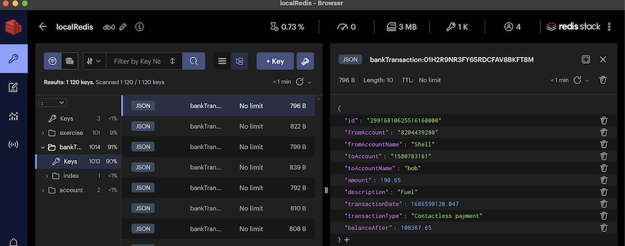

This application leverages **Redis core data structures, JSON, TimeSeries, Search and Query features**. The data seeded is later used to show a searchable transaction overview with realtime updates as well as a personal finance management overview with realtime balance and biggest spenders updates.

On application startup in `app/server.js`, a cron is scheduled to create random bank transactions at regular intervals and seed those transactions in to Redis.

```js title="app/server.js"
//cron job to trigger createBankTransaction() at regular intervals

cron.schedule('*/10 * * * * *', async () => {
  const userName = process.env.REDIS_USERNAME;

  createBankTransaction(userName);

  //...
});
```

The transaction generator creates a randomized banking debit or credit which will reflect on a starting user balance of $100,000.00

The transaction is saved as a JSON document within Redis. The `balanceAfter` value is recorded in a Timeseries with the key `balance_ts`. The transaction is also added to a stream (`transactions`) as an entry. The sorted set `bigspenders` is also updated - the associated **`fromAccountName`** member within the sorted set is incremented by the transaction amount. Note that this amount can be positive or negative.

```js title="app/transactions/transactionsGenerator.js"
let balance = 100000.0;

export const createBankTransaction = async () => {
  //to create random bank transaction
  let vendorsList = source.source; //app/transactions/transaction_sources.js
  const random = Math.floor(Math.random() * 9999999999);

  const vendor = vendorsList[random % vendorsList.length]; //random vendor from the list

  const amount = createTransactionAmount(vendor.fromAccountName, random);
  const transaction = {
    id: random * random,
    fromAccount: Math.floor((random / 2) * 3).toString(),
    fromAccountName: vendor.fromAccountName,
    toAccount: '1580783161',
    toAccountName: 'bob',
    amount: amount,
    description: vendor.description,
    transactionDate: new Date(),
    transactionType: vendor.type,
    balanceAfter: balance,
  };

  //redis json feature
  const bankTransaction = await bankTransactionRepository.save(transaction);
  console.log('Created bankTransaction!');
  // ...
};

const createTransactionAmount = (vendor, random) => {
  let amount = createAmount(); //random amount
  balance += amount;
  balance = parseFloat(balance.toFixed(2));

  //redis time series feature
  redis.ts.add(BALANCE_TS, '*', balance, { DUPLICATE_POLICY: 'first' });
  //redis sorted set as secondary index
  redis.zIncrBy(SORTED_SET_KEY, amount * -1, vendor);

  return amount;
};
```

Sample `bankTransaction` data view using [RedisInsight](https://redis.com/redis-enterprise/redis-insight/)




:::tip
Download [<u>**RedisInsight**</u>](https://redis.com/redis-enterprise/redis-insight/) to view your Redis data or to play with raw Redis commands in the workbench. Learn more by reading the [<u>**RedisInsight tutorial**</u>](/explore/redisinsight/)
:::
