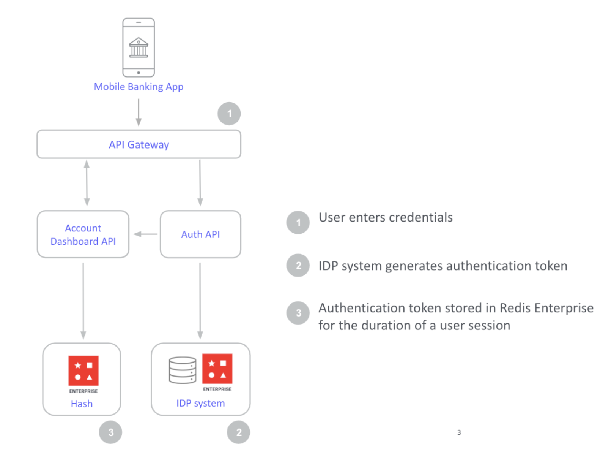
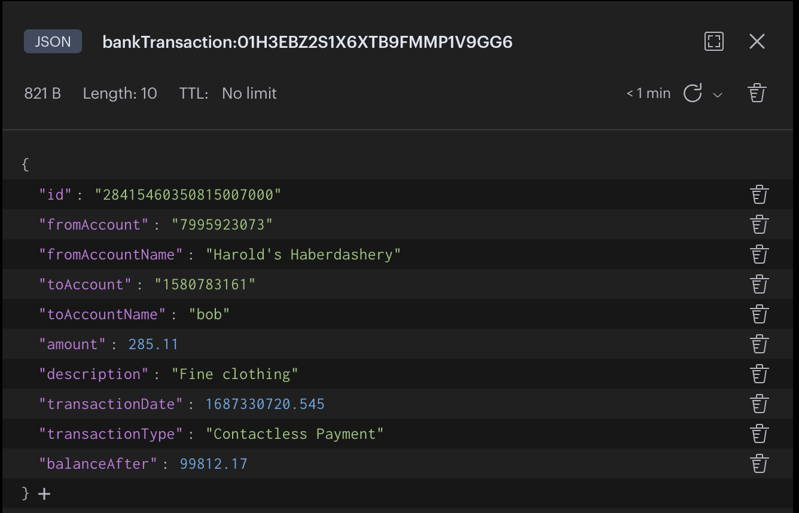
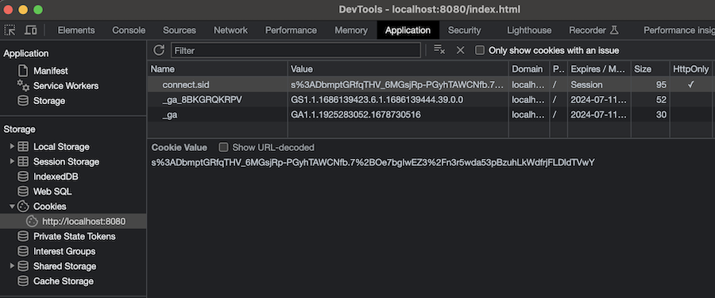
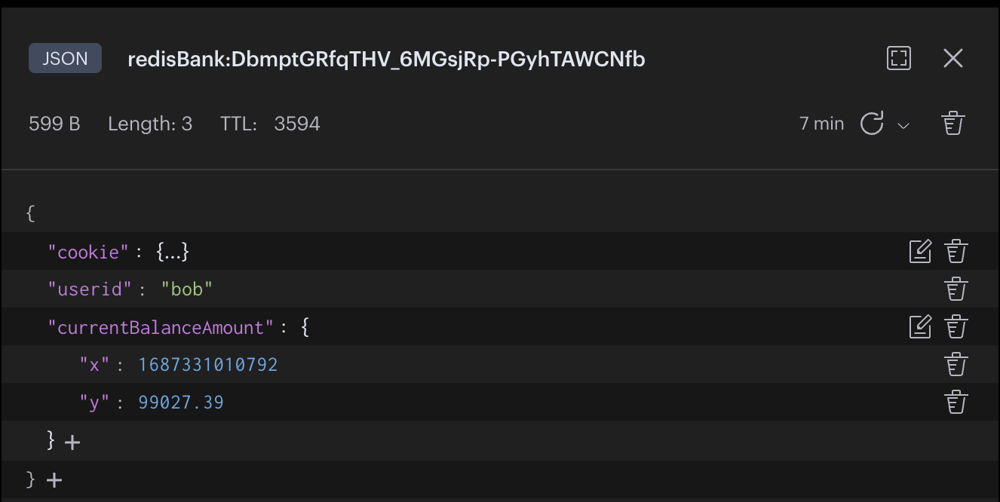

import GeneralAdditionalResources from '../common-mb/additional-resources.mdx';
import MobileBankingSourceCode from '../common-mb/source-code-tip.mdx';

import MobileBankingDashboardBalance from './images/demo-dashboard-balance-widget.png';

<MobileBankingSourceCode />

## What is Authentication and Session Storage for Mobile Banking?

After a user has successfully entered their login credentials, mobile banking apps use a `token` and `sessionId` created by the server to represent a user's identity. The `token` is stored in Redis for the duration of a user session and also sent in the login response to the banking application client (mobile/ browser). The client application then sends the `token` with every request to server and server validates it before processing the request.



:::note

Redis Stack supports the [**JSON**](/howtos/redisjson/) data type and allows you to index and querying JSON and [**more**](https://redis.io/docs/stack/). So your session store is not limited to simple key-value stringified data.

:::

The session store houses critical information related to each user as they navigate an application for the duration of their session. Mobile banking session data may include, but is not limited to following information:

- User's profile information, such as name, date of birth, email address, etc.
- User's permissions, such as `user`, `admin`, `supervisor`, `super-admin`, etc.
- Other app-related data like recent transaction(s), balance etc.
- Session expiration, such as one hour from now, one week from now, etc.

## Why you should use Redis for mobile banking session management?

- **Resilience**: Redis Enterprise offers incredible resilience with **99.999% uptime**. After all, authentication token stores must provide round-the-clock availability. This ensures that users get uninterrupted, 24/7 access to their applications.

- **Scalability**: Token stores need to be highly scalable so that they don't become a bottleneck when a **high volume of users** authenticate at once. Redis Enterprise provides **< 1ms latency** at incredibly high throughput (up to **100MM ops/second**) which makes authentication and session data access much faster!

- **Integration with common libraries and platforms**: Since Redis open source is integrated into most session management libraries and platforms, Redis Enterprise can seamlessly integrate when upgrading from open source Redis (e.g. `express-session` and [`connect-redis-stack`](https://www.npmjs.com/package/connect-redis-stack) libraries integration is demonstrated in this tutorial)

:::tip

Read our ebook that answers the question: [**Are JSON Web Tokens (JWT) Safe?**](https://redis.com/docs/json-web-tokens-jwts-are-not-safe/) It discusses when and how to safely use JWTs, with battle-tested solutions for session management.

:::

## Building session management with Redis

<MobileBankingSourceCode />

Download the above source code and run following command to start the demo application

```sh
docker compose up
```

After docker up & running, open [http://localhost:8080/](http://localhost:8080/) url in browser to view application

### Data seeding

On application startup in `app/server.js`, a cron is scheduled to create random bank transactions at regular intervals and seed those transactions in to Redis.

```js title="app/server.js"
//cron job to trigger createBankTransaction() at regular intervals

cron.schedule('*/10 * * * * *', async () => {
  const userName = process.env.REDIS_USERNAME;

  createBankTransaction(userName);

  //...
});
```

```js title="app/transactions/transactionsGenerator.js"
export const createBankTransaction = async () => {
  //to create random bank transaction
  let vendorsList = source.source; //app/transactions/transaction_sources.js
  const random = Math.floor(Math.random() * 9999999999);

  const vendor = vendorsList[random % vendorsList.length]; //random vendor from the list

  const amount = createTransactionAmount(vendor.fromAccountName, random); //random amount
  const transaction = {
    id: random * random,
    fromAccount: Math.floor((random / 2) * 3).toString(),
    fromAccountName: vendor.fromAccountName,
    toAccount: '1580783161',
    toAccountName: 'bob',
    amount: amount,
    description: vendor.description,
    transactionDate: new Date(),
    transactionType: vendor.type,
    balanceAfter: balance,
  };

  const bankTransaction = await bankTransactionRepository.save(transaction);
  console.log('Created bankTransaction!');
  // ...
};
```

Sample `bankTransaction` data view using [RedisInsight](https://redis.com/redis-enterprise/redis-insight/)




:::tip
Download [**RedisInsight**](https://redis.com/redis-enterprise/redis-insight/) to view your Redis data or to play with raw Redis commands in the workbench. Learn more by reading the [**RedisInsight tutorial**](/explore/redisinsight/)
:::

### Session configuration

Redis is integrated into many session management libraries, We will be using [connect-redis-stack](https://www.npmjs.com/package/connect-redis-stack) library for this demo which provides Redis session storage for your
[express-session](https://www.npmjs.com/package/express-session) application.

The following code illustrates configuring Redis sessions and with `express-session`.

```js title="app/server.js"
import session from 'express-session';
import { RedisStackStore } from 'connect-redis-stack';

/* configure your session store */
const store = new RedisStackStore({
  client: redis, //redis client
  prefix: 'redisBank:', //redis key prefix
  ttlInSeconds: 3600, //session expiry time
});

const app = express();

// ...

app.use(
  session({
    store: store, //using redis store for session
    resave: false,
    saveUninitialized: false,
    secret: '5UP3r 53Cr37', //from env file
  }),
);

//...
app.listen(8080, () => console.log('Listening on port 8080'));
```

### Login API (Session id generation)


Let's look at the `/perform_login` API code which is triggered on the click of Login button from [login page](http://localhost:8080/)

Since [connect-redis-stack](https://www.npmjs.com/package/connect-redis-stack) is an express middleware, a session is automatically created at the start of the request, and updated at the end of the HTTP(API) response if `req.session` variable is altered.

```js
app.post('/perform_login', (req, res) => {
  let session = req.session;
  console.log(session);
  /*
  Session {
    cookie: { path: '/', _expires: null, originalMaxAge: null, httpOnly: true }
  }
  */
  //hardcoded user for demo
  if (req.body.username == 'bob' && req.body.password == 'foobared') {
    //on successful login (for bob user)
    session = req.session;
    session.userid = req.body.username; //create session data
    res.redirect('/index.html');
  } else {
    res.redirect('/auth-login.html');
  }
});
```

In above code - `session.userid` variable is assigned with a value on successful login (for "bob" user), so a session is created in Redis with assigned data and only Redis key (sessionId) is stored in client cookie.

- Dashboard page after successful login
  

- Session entry in Redis
  

- Open developer tools in Dashboard page to check client cookie `connect.sid` (containing only sessionId)
  

Now on every other API request from client, [connect-redis-stack](https://www.npmjs.com/package/connect-redis-stack) library makes sure to load session details from redis to `req.session` variable based on the client cookie (sessionId).

### Balance API (Session storage)

Consider the below `/transaction/balance` API code to demonstrate session storage.

We have to modify the `req.session` variable to update session data.
Let's add more session data like current balance amount of the user .

```js title="app/routers/transaction-router.js"
/* fetch all transactions up to an hour ago /transaction/balance */
transactionRouter.get('/balance', async (req, res) => {
  const balance = await redis.ts.range(
    BALANCE_TS,
    Date.now() - 1000 * 60 * 5,
    Date.now(),
  );

  let balancePayload = balance.map((entry) => {
    return {
      x: entry.timestamp,
      y: entry.value,
    };
  });

  let session = req.session;
  if (session.userid && balancePayload.length) {
    //adding latest BalanceAmount to session
    session.currentBalanceAmount = balancePayload[balancePayload.length - 1]; //updating session data
  }

  res.send(balancePayload);
});
```

- Updated session entry in Redis with `currentBalanceAmount` field ('x' denoting timestamp and 'y' denoting balance amount at that timestamp)
  

- Verify the latest balance amount in the Dashboard UI
  

## Ready to use Redis in session management?

Hopefully, this tutorial has helped you visualize how to use Redis for better session management, specifically in the context of mobile banking. For additional resources related to this topic, check out the links below:

### Additional resources

- [Are JSON Web Tokens (JWT) Safe?](https://redis.com/docs/json-web-tokens-jwts-are-not-safe/)

<GeneralAdditionalResources />
