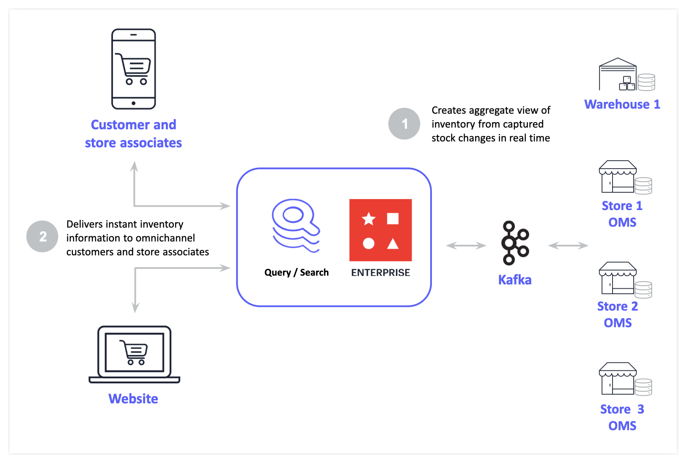

import Authors from '@theme/Authors';

import RetrieveSKU from './api/retrieve-sku.mdx';
import UpdateSKU from './api/update-sku.mdx';
import IncrementSKU from './api/increment-sku.mdx';
import DecrementSKU from './api/decrement-sku.mdx';
import RetrieveManySKUs from './api/retrieve-many-skus.mdx';
import DecrementManySKUs from './api/decrement-many-skus.mdx';

import RealTimeInventorySourceCode from '../common-rti/source-code-tip.mdx';
import RealTimeInventoryChallenges from '../common-rti/rti-challenges.mdx';
import RealTimeInventoryCustomerProofs from '../common-rti/customer-proofs.mdx';
import GeneralAdditionalResources from '../common-rti/additional-resources.mdx';

<Authors frontMatter={frontMatter} />

<RealTimeInventorySourceCode />

## What is available-to-promise (ATP)?

The major requirement in a **retail inventory system** is presenting an accurate, real-time view of inventory to shoppers and store associates enabling buy-online-pickup-in-store (BOPIS). Optimizing fulfillment from multiple inventory locations.

**Available to promise (ATP)** is the projected amount of inventory left available to sell, not including allocated inventory. It allows businesses to control distribution to their customers and predict inventory. The ATP model helps retailers keep inventory costs down such as ordering costs, carrying costs and stock-out costs. ATP is helpful as long as consumer buying forecasts remain correct. Implementing ATP processes effectively for retailers can mean the difference between sustained growth and an inventory that repeatedly runs out of customer's favorite products missing sales opportunities and harming customer experience.

### How to calculate available-to-promise

Calculating available-to-promise is a relatively simple undertaking. Complete the following formula for an accurate breakdown of available-to-promise capabilities:

```
Available-to-promise = QuantityOnHand + Supply - Demand
```

This formula includes the following elements:

- QuantityOnHand: the total number of products that are immediately available to a company
- Supply: the total stock of a product available for sale
- Demand: the amount of a specific product that consumers are willing to purchase

## Current challenges in real time inventory

<RealTimeInventoryChallenges />

## Why you should use Redis for available-to-promise

- **Increased inventory visibility**: Redis Enterprise provides highly scalable, real-time inventory synchronization between stores providing views into what stock is Available-To-Promise. Customers want to buy from a retailer who can check stock across multiple locations and provide real-time views on what's available locally.

- **Enhanced customer experience**: Sub-millisecond latency means online customers can easily get real-time views of shopping carts, pricing, and in stock availability. Redis Enterprise built-in search engine delivers full text and aggregated faceted search of inventory in real time, scaling performance to instantly search inventories with millions of product types helping customers fill their shopping carts faster, keeping them engaged and loyal.

- **Cost efficiency at scale**: Redis Enterprise offers real-time, bi-directional consistency between stores and data integration capabilities with enterprise systems without the complexity and costs of managing message brokers, auditing, and reconciliation.

## Real time inventory with Redis



Using Redis, System delivers real-time synchronization of inventory across stores, in transit and warehouses. Provide retailers the most accurate, timely data on inventory across their entire store network and consumers positive customer experiences searching and locating inventory.

Redis Data Integration (RDI) capabilities enable accurate real-time inventory management and system of record synchronization. Redis advanced inventory search and query capabilities provide accurate available inventory information to multichannel and omnichannel customers and store associates.

This solution increases inventory turnover ratios resulting in lower inventory costs, higher revenue and profits. It also reduces the impact of customer searches on Systems of Record and Inventory Management Systems (IMS).

### Customer proof points

<RealTimeInventoryCustomerProofs />

## Building a real time inventory service with redis

<RealTimeInventorySourceCode />

Managing inventory or a **SKU (stock keeping unit)** process contains some activities like :

1. RetrieveSKU : Fetch the current quantity of a product
1. UpdateSKU : Update the latest quantity of a product
1. IncrementSKU : Increment the quantity by a specific value (Say, when more products are procured)
1. DecrementSKU : Decrement the quantity by a specific value (Say, after order fulfillment of the product)
1. RetrieveManySKUs : Fetch the current quantity of **multiple** products (Say, to verify products in stock before payment)
1. DecrementManySKUs: Decrement the quantity of **multiple** products (Say, after an order fulfillment with multiple products)

### RetrieveSKU

<RetrieveSKU />

### UpdateSKU

<UpdateSKU />

### IncrementSKU

<IncrementSKU />

### DecrementSKU

<DecrementSKU />

### RetrieveManySKUs

<RetrieveManySKUs />

### DecrementManySKUs

<DecrementManySKUs />

## Ready to use Redis in a Real time inventory system?

Hopefully, this tutorial has helped you visualize how to use Redis in a Real time inventory system for product availability across different location stores. For additional resources related to this topic, check out the links below:

### Additional resources

- Real time inventory with Redis
  - [Real time Local Inventory Search](/howtos/solutions/real-time-inventory/local-inventory-search)
- General
  <GeneralAdditionalResources />
