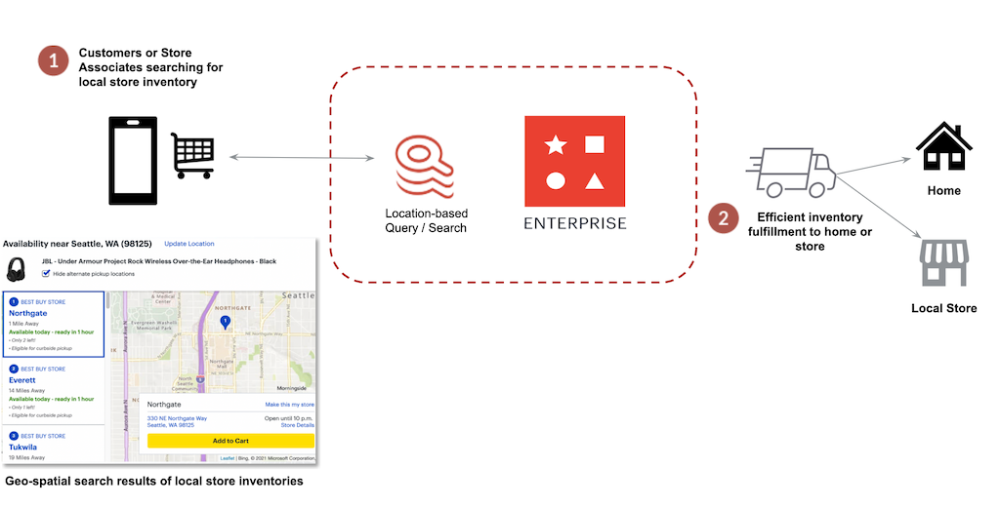
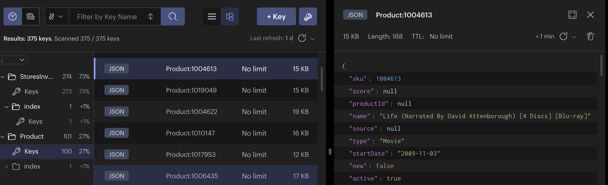
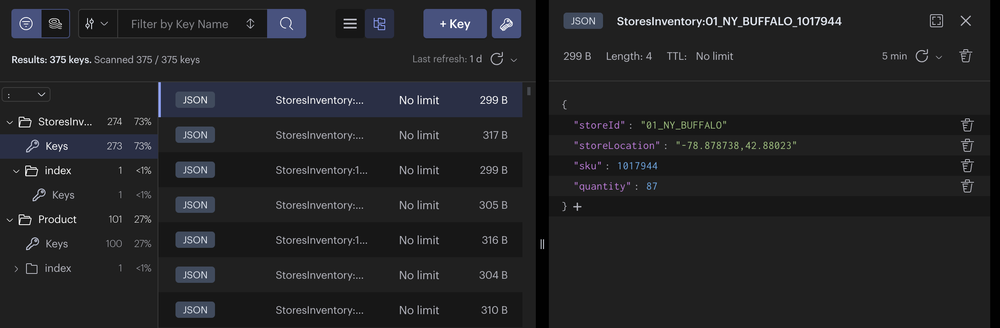

import Authors from '@theme/Authors';

import InventorySearch from './api/inventory-search.mdx';
import InventorySearchWithDistance from './api/inventory-search-with-distance.mdx';

import RealTimeInventorySourceCode from '../common-rti/source-code-tip.mdx';
import RealTimeInventoryChallenges from '../common-rti/rti-challenges.mdx';
import RealTimeInventoryCustomerProofs from '../common-rti/customer-proofs.mdx';
import GeneralAdditionalResources from '../common-rti/additional-resources.mdx';

import newYorkState from './images/newyork-state.png';

<Authors frontMatter={frontMatter} />

<RealTimeInventorySourceCode />

## What is real-time local inventory search?

**Real-time local inventory search** is a method of utilizing advanced product search capabilities across a group of stores or warehouses in a region or geographic area by which a retailer can enhance the customer experience with a localized view of inventory while fulfilling orders from the closest store possible.

Geospatial search of merchandise local to the consumer helps sell stock faster, lowers inventory levels, and thus increases inventory turnover ratio.
Consumers locate a product online, place the order in their browser or mobile device, and pick up at nearest store location. This is called “buy-online-pickup-in-store” (BOPIS)

## Current challenges in real time inventory

<RealTimeInventoryChallenges />

## Why you should use Redis for local inventory search

- **Accurate location/regional inventory search**: Redis Cloud geospatial search capabilities enable retailers to provide local inventories by store location across geographies and regions based on a consumer's location. This enables a real-time view of store inventory and and seamless BOPIS shopping experience.

- **Consistent and accurate inventory view across multichannel and omnichannel experiences**: Accurate inventory information no matter what channel the shopper is using, in-store, kiosk, online, or mobile. Redis Cloud provides a single source of truth for inventory information across all channels.

- **Real-time search performance at scale**: Redis Cloud real-time search and query engine allows retailers to provide instant application and inventory search responses and scale performance effortlessly during peak periods.

## Real-time local inventory search with Redis



Redis provides geospatial search capabilities across a group of stores or warehouses in a region or geographic area allowing a retailer to quickly show the available inventory local to the customer.

Redis Cloud processes event streams, keeping store inventories up-to-date in real-time. This enhances the customer experience with localized, accurate search of inventory while fulfilling orders from the nearest and fewest stores possible.

This solution lowers days sales of inventory (DSI), selling inventory faster and carrying less inventory for increased revenue generation and profits over a shorter time period.

It also reduces fulfillment costs to home and local stores enhancing a retailer's ability to fulfill orders with the lowest delivery and shipping costs.

:::tip Customer proof points

<RealTimeInventoryCustomerProofs />

:::

## Building a real time local inventory search with redis

<RealTimeInventorySourceCode />

### Setting up the data

Once the application source code is downloaded, run following commands to populate data in Redis:

```shell
# install packages
npm install

# Seed data to Redis
npm run seed
```

The demo uses two collections:

- **Product collection**: Stores product details like `productId`, `name`, `price`, `image`, and other details
  

:::tip
Download <u>[RedisInsight](https://redis.com/redis-enterprise/redis-insight/)</u> to view your Redis data or to play with raw Redis commands in the workbench.
:::

- **StoresInventory collection**: Stores product quantity available at different local stores.

For demo purpose, we are using the below regions in New York, US as store locations. Products are mapped to these location stores with a `storeId` and `quantity`.




Let's build the following APIs to demonstrate geospatial search using Redis:

- **InventorySearch API**: Search Products in local stores within a search radius.
- **InventorySearchWithDistance API**: Search Product in local stores within search radius and sort results by distance from current user location to store.

### InventorySearch API

<InventorySearch />

### InventorySearchWithDistance API

<InventorySearchWithDistance />

## Ready to use Redis for real-time local inventory search?

Hopefully this tutorial has helped you visualize how to use Redis for real-time local inventory search across different regional stores. For additional resources related to this topic, check out the links below:

### Additional resources

- Real time inventory with Redis
  - [Available to Promise in Real-time Inventory](/howtos/solutions/real-time-inventory/available-to-promise)
- General
  <GeneralAdditionalResources />
