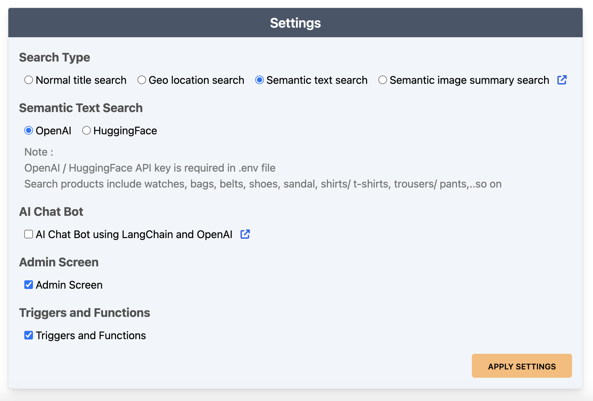
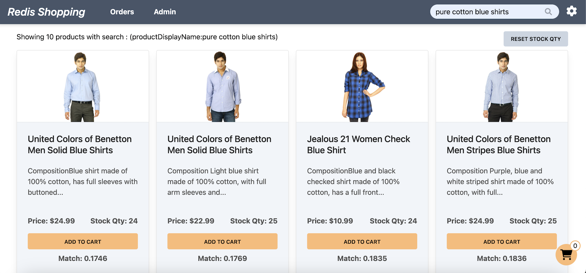

The e-commerce microservices application consists of a frontend, built using [Next.js](https://nextjs.org/) with [TailwindCSS](https://tailwindcss.com/). The application backend uses [Node.js](https://nodejs.org). The data is stored in [Redis](https://redis.com/try-free/) and either MongoDB or PostgreSQL, using [Prisma](https://www.prisma.io/docs/reference/database-reference/supported-databases). Below are screenshots showcasing the frontend of the e-commerce app.

**Dashboard:** Displays a list of products with different search functionalities, configurable in the settings page.

**Settings:** Accessible by clicking the gear icon at the top right of the dashboard. Control the search bar, chatbot visibility, and other features here.

**Dashboard (Semantic Text Search):** Configured for semantic text search, the search bar enables natural language queries. Example: "pure cotton blue shirts."

**Shopping Cart:** Add products to the cart and check out using the "Buy Now" button.

**Order History:** Post-purchase, the 'Orders' link in the top navigation bar shows the order status and history.

**Admin Panel:** Accessible via the 'admin' link in the top navigation. Displays purchase statistics and trending products.

