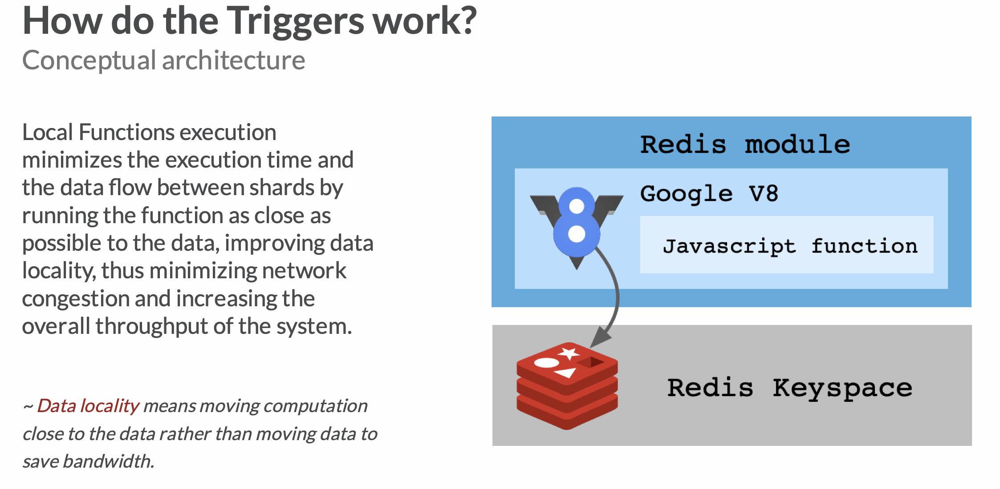
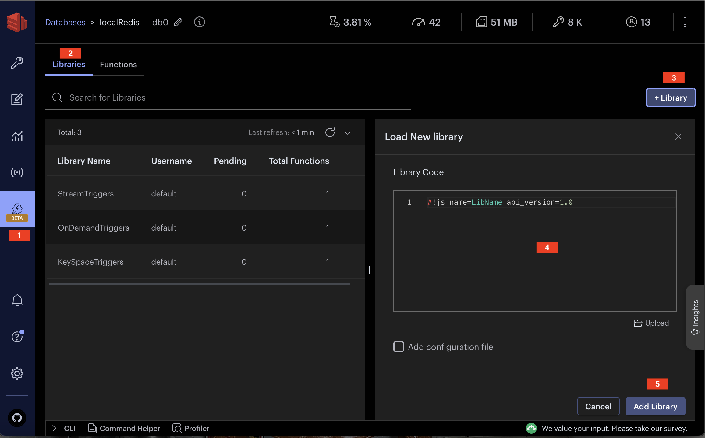
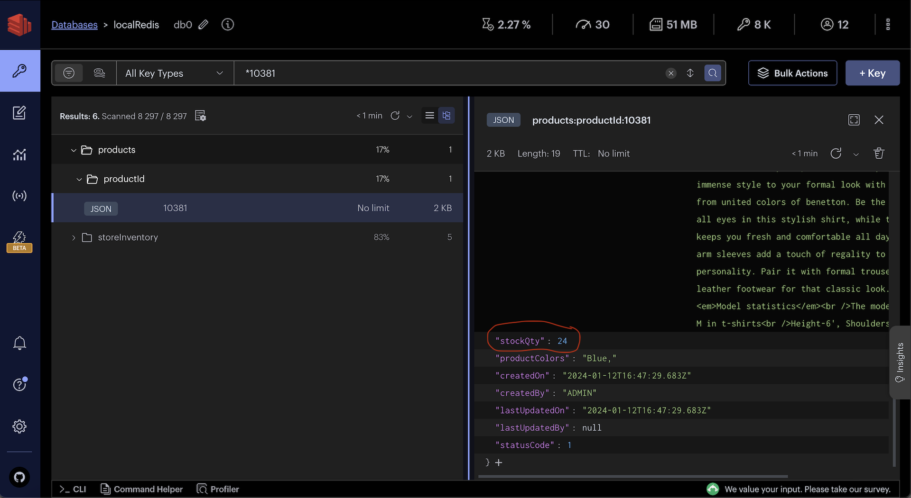
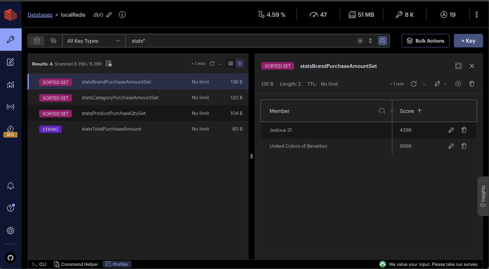
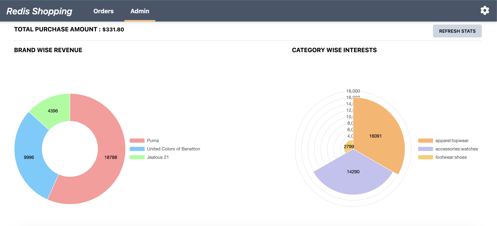

import Authors from '@theme/Authors';
import InitialMicroservicesArchitecture from '../../microservices/common-data/microservices-arch.mdx';
import MicroservicesEcommerceTFDesign from '../common-tf/microservices-ecommerce-tf.mdx';
import SourceCode from '../common-tf/microservices-source-code-tf.mdx';

<Authors frontMatter={frontMatter} />

## What you will learn in this tutorial

In this comprehensive tutorial on Redis 7.2's **Triggers and Functions**, you'll gain insights and practical skills in the following areas:

- **Understanding Redis Triggers and Functions**: Grasp the fundamentals of Redis's new programmability features, including how to use JavaScript code for data-driven triggers and functions.
- **Application Scenarios**: Explore real-world applications in an e-commerce context, such as inventory management and sales statistics calculations.
- **Types of Triggers**: Learn the distinction and use cases for `On-demand` Triggers, `KeySpace` Triggers, and `Stream` Triggers.
- **Hands-on Implementation**: Get practical experience by creating and deploying various triggers and functions in a simulated e-commerce environment.

## Microservices architecture for an e-commerce application

<SourceCode />

<InitialMicroservicesArchitecture />

## E-commerce application frontend using Next.js and Tailwind

<MicroservicesEcommerceTFDesign />

## What are triggers and functions ?

Triggers and functions represent a revolutionary step in Redis's programmability, introduced in Redis 7.2. This feature empowers developers to program, store, and execute **JavaScript code** in response to data changes directly within the Redis database, similar to stored procedures or triggers in traditional SQL databases.

This capability lets developers define events (called `triggers`) to execute `functions` closer to the data. That is, developers define business logic that executes in response to database events or commands. That speeds up the code and related interactions, because there is no wait to bring code from clients into the database.



### Advantages

Incorporating triggers and functions into Redis capitalizes on its renowned real-time performance and simplicity:

- **Reduced Latency**: By processing tasks directly within Redis, you minimize network overhead, saving time and computational resources.
- **Real-time event processing**: Triggers are executed in **real-time** and keep the **atomicity** of the command. This removes potential data inconsistencies that are introduced by applying async logic through application code.
- **JavaScript**: Use the most known language by professional developers. This lowers the learning curve compared to the lesser-known Lua Functions in earlier Redis Gears.
- **Compatibility**: Seamlessly integrate with existing Redis Stack capabilities and data structures.

### Types of triggers and functions

Triggers and functions in Redis can be categorized into three types, based on their activation methods:

- **On-demand Triggers**: These are explicitly invoked by calling them directly.
- **KeySpace Triggers**: Triggered by operations on keys, such as creation, update, or deletion.
- **Stream Triggers**: Activated when new entries are added to a Redis stream.

### Sample product data

To illustrate the application of triggers and functions, let's consider a simplified e-commerce dataset. This dataset includes detailed product information, which we will use throughout our tutorial.

```ts title="database/fashion-dataset/001/products/*.json"
const products = [
  {
    productId: '11000',
    price: 3995,
    productDisplayName: 'Puma Men Slick 3HD Yellow Black Watches',
    variantName: 'Slick 3HD Yellow',
    brandName: 'Puma',
    ageGroup: 'Adults-Men',
    gender: 'Men',
    displayCategories: 'Accessories',
    masterCategory_typeName: 'Accessories',
    subCategory_typeName: 'Watches',
    styleImages_default_imageURL:
      'http://host.docker.internal:8080/images/11000.jpg',
    productDescriptors_description_value: 'Stylish and comfortable, ...',
    stockQty: 25,
  },
  //...
];
```

## OnDemand trigger

On-demand triggers in Redis are JavaScript functions that are explicitly invoked to perform specific tasks.

### Application Scenario: Resetting Inventory

In our e-commerce demo, consider a feature where we need to reset the stock quantity of all products. We'll implement this by clicking a `RESET STOCK QTY` button in the UI dashboard, triggering the `resetInventory` function.

### Creating the function

Let's craft a function named `resetInventory` under the namespace `OnDemandTriggers`. This function will reset the inventory (stock quantity) of all products to 25.

```js title="database/src/triggers/on-demand-trigger.js"
#!js name=OnDemandTriggers api_version=1.0

redis.registerAsyncFunction('resetInventory', async function (client) {
  let cursor = '0';
  const DEFAULT_PRODUCT_QTY = 25;

  redis.log('resetInventory');
  do {
    client.block((client) => {
      //scan all the product keys in the database
      let res = client.call('scan', cursor, 'match', 'products:productId:*');
      cursor = res[0];
      let keys = res[1];
      // loop through all the product keys and set the stockQty to 25
      keys.forEach((key) => {
        if (!key.match('index:hash')) {
          client.call(
            'JSON.SET',
            key,
            '$.stockQty',
            DEFAULT_PRODUCT_QTY.toString(),
          );
        }
      });
    });
  } while (cursor != '0');

  return 'resetInventory completed !';
});
```

### Adding the function to Redis

We can add functions to Redis using various methods:

1. Using redis-cli

```sh
redis-cli  -x TFUNCTION LOAD < ./on-demand-trigger.js
# or if you want to replace the function
redis-cli -x TFUNCTION LOAD REPLACE . < ./on-demand-trigger.js
```

2. Using code

```ts title="database/src/triggers.ts"
import type { NodeRedisClientType } from './config.js';
import * as path from 'path';
import * as fs from 'fs/promises';

async function addTriggerToRedis(
  fileRelativePath: string,
  redisClient: NodeRedisClientType,
) {
  const filePath = path.join(__dirname, fileRelativePath);
  const fileData = await fs.readFile(filePath);
  let jsCode = fileData.toString();
  jsCode = jsCode.replace(/\r?\n/g, '\n');

  try {
    const result = await redisClient.sendCommand([
      'TFUNCTION',
      'LOAD',
      'REPLACE',
      jsCode,
    ]);
    console.log(`addTriggersToRedis ${fileRelativePath}`, result);
  } catch (err) {
    console.log(err);
  }
}
```

```ts
addTriggerToRedis('triggers/on-demand-trigger.js', redisClient);
```

3. Using RedisInsight

Navigate to the `Triggers and Functions` section in RedisInsight, then to `Libraries`, and use create library to paste and save your function.



### Testing the function

1. Using redis-cli

```sh
redis-cli TFCALLASYNC OnDemandTriggers.resetInventory 0
```

2. Using code

Clicking on the 'RESET STOCK QTY' button triggers the triggerResetInventory API.

```json
POST http://localhost:3000/products/triggerResetInventory
{
}
```

This invokes the `resetInventory` function:

```ts title="server/src/services/products/src/service-impl.ts"
const triggerResetInventory = async () => {
  const redisClient = getNodeRedisClient();

  //@ts-ignore
  const result = await redisClient.sendCommand(
    ['TFCALLASYNC', 'OnDemandTriggers.resetInventory', '0'],
    {
      isolated: true,
    },
  );
  console.log(`triggerResetInventory :  `, result);

  return result;
};
```

3. Using RedisInsight

Test the command in RedisInsight's workbench and view the results.


### Verifying data integrity

Post-execution, check whether the `stockQty` for each product is reset to the default value.


## KeySpace trigger

A KeySpace trigger allows you to execute custom logic whenever a set of keys matching a specific pattern is added/ modified in the Redis database. It provides a way to react to changes in the data and perform actions based on those changes.

### Application Scenario : Managing product stock quantity

In our e-commerce demo, let's address a common need: decreasing product stock quantity upon placing an order. We'll achieve this using a `KeySpace trigger` that listens to `orders:orderId` keys and updates the product stock quantities accordingly.

### Creating the function

We'll develop `updateProductStockQty` under the `KeySpaceTriggers` namespace. This function will be responsible for adjusting stock quantities based on order details.

```js title="database/src/triggers/key-space-trigger.js"
#!js name=KeySpaceTriggers api_version=1.0
redis.registerKeySpaceTrigger(
  'updateProductStockQty',
  'orders:orderId:', // Keys starting with this prefix are monitored
  function (client, data) {
    const errors = [];

    try {
      if (
        client &&
        data?.event == 'json.set' &&
        data?.key != 'orders:orderId:index:hash'
      ) {
        const orderId = data.key;
        // get the order details from the orderId key
        let result = client.call('JSON.GET', orderId);
        result = result ? JSON.parse(result) : '';
        const order = Array.isArray(result) ? result[0] : result;

        if (order?.products?.length && !order.triggerProcessed) {
          try {
            //create a log stream to log the trigger events and errors
            client.call(
              'XGROUP',
              'CREATE',
              'TRIGGER_LOGS_STREAM',
              'TRIGGER_LOGS_GROUP',
              '$',
              'MKSTREAM',
            );
          } catch (streamConErr) {
            // if log stream already exists
          }

          // reduce stockQty for each product in the order
          for (const product of order.products) {
            let decreaseQtyBy = (-1 * product.qty).toString();
            client.call(
              'JSON.NUMINCRBY',
              `products:productId:${product.productId}`,
              '.stockQty',
              decreaseQtyBy,
            );

            // add log entry
            client.call(
              'XADD',
              'TRIGGER_LOGS_STREAM',
              '*',
              'message',
              `For productId ${product.productId}, stockQty ${decreaseQtyBy}`,
              'orderId',
              orderId,
              'function',
              'updateProductStockQty',
            );
          }

          // set triggerProcessed flag to avoid duplicate processing
          client.call('JSON.SET', orderId, '.triggerProcessed', '1');
        }
      }
    } catch (generalErr) {
      generalErr = JSON.stringify(
        generalErr,
        Object.getOwnPropertyNames(generalErr),
      );
      errors.push(generalErr);
    }

    if (errors.length) {
      //log error
      client.call(
        'XADD',
        'TRIGGER_LOGS_STREAM',
        '*',
        'message',
        JSON.stringify(errors),
        'orderId',
        data.key,
        'function',
        'updateProductStockQty',
      );
    }
  },
);
```

In this script, we listen to changes in the `orders:orderId:` keys. Upon detecting a new order, the function retrieves the order details and accordingly decreases the stock quantity for each product in the order.

### Adding the function to Redis

We can add functions to Redis using various methods:

1. Using redis-cli

```sh
redis-cli  -x TFUNCTION LOAD < ./key-space-trigger.js
# or if you want to replace the function
redis-cli -x TFUNCTION LOAD REPLACE . < ./key-space-trigger.js
```

2. Using code

```ts title="database/src/triggers.ts"
import type { NodeRedisClientType } from './config.js';
import * as path from 'path';
import * as fs from 'fs/promises';

async function addTriggerToRedis(
  fileRelativePath: string,
  redisClient: NodeRedisClientType,
) {
  const filePath = path.join(__dirname, fileRelativePath);
  const fileData = await fs.readFile(filePath);
  let jsCode = fileData.toString();
  jsCode = jsCode.replace(/\r?\n/g, '\n');

  try {
    const result = await redisClient.sendCommand([
      'TFUNCTION',
      'LOAD',
      'REPLACE',
      jsCode,
    ]);
    console.log(`addTriggersToRedis ${fileRelativePath}`, result);
  } catch (err) {
    console.log(err);
  }
}
```

```ts
addTriggerToRedis('triggers/key-space-trigger.js', redisClient);
```

3. Using RedisInsight

Navigate to the `Triggers and Functions` section in RedisInsight, then to `Libraries`, and use create library to paste and save your function.


### Testing the function

In our demo, placing an order through the `Buy Now` button triggers the `createOrder` API, which in turn creates a new `orders:orderId:` key, activating the `updateProductStockQty` function.

Sample createOrder API request:

```json
POST http://localhost:3000/orders/createOrder
{
  "products": [
    {
      "productId": "11002",
      "qty": 1,
      "productPrice": 4950,
    },
    {
      "productId": "11012",
      "qty": 2,
      "productPrice": 1195,
    }
  ]
}
```

A sample order creation command in Redis:

```sh
"JSON.SET" "orders:orderId:24b38a47-2b7d-4c5d-ba25-b74749e34c65" "$" "{"products":[{"productId":"10381","qty":1,"productPrice":2499,"productData":{}},{"productId":"11030","qty":1,"productPrice":1099,"productData":{}}],"userId":"USR_f0f00a86-7131-40e1-9d89-765b4cc1927f","orderId":"24b38a47-2b7d-4c5d-ba25-b74749e34c65","orderStatusCode":1}"
```

The creation of this new key triggers `updateProductStockQty`, leading to the adjustment of stock quantities.

Monitor the trigger's activity in the `TRIGGER_LOGS_STREAM` for logs and potential errors.


### Verifying data integrity

After the function execution, verify the decreased `stockQty` for each involved product.



## Stream trigger

A stream trigger allows you to listen to a Redis stream and execute a function whenever new data is added to the stream. It is commonly used for real-time data processing and event-driven architectures.

### Application Scenario : Calculating sales statistics

In our e-commerce demo, let's consider a feature where we need to calculate sales statistics for the products. We'll implement this using a `Stream trigger` that listens to `TRANSACTION_STREAM` and updates the sales statistics accordingly.

### Creating the function

We'll develop `calculateStats` under the `StreamTriggers` namespace. This function will be responsible for calculating sales statistics based on the order details.

```js title="database/src/triggers/stream-trigger.js"
#!js name=StreamTriggers api_version=1.0

redis.registerStreamTrigger(
  'calculateStats', // trigger name
  'TRANSACTION_STREAM', // Detects new data added to the stream
  function (client, data) {
    // data = JSON.stringify(
    //     data,
    //     (key, value) => (typeof value === "bigint" ? value.toString() : value) //id conversion
    // );

    // data = JSON.parse(data);

    var streamEntry = {};
    for (let i = 0; i < data.record?.length; i++) {
      streamEntry[data.record[i][0]] = data.record[i][1];
    }

    streamEntry.transactionPipeline = JSON.parse(
      streamEntry.transactionPipeline,
    );
    streamEntry.orderDetails = JSON.parse(streamEntry.orderDetails);

    if (
      streamEntry.transactionPipeline?.length == 1 &&
      streamEntry.transactionPipeline[0] == 'PAYMENT_PROCESSED' &&
      streamEntry.orderDetails
    ) {
      //log
      client.call(
        'XADD',
        'TRIGGER_LOGS_STREAM',
        '*',
        'message',
        `${streamEntry.transactionPipeline}`,
        'orderId',
        `orders:orderId:${streamEntry.orderDetails.orderId}`,
        'function',
        'calculateStats',
      );

      const orderAmount = parseInt(streamEntry.orderDetails.orderAmount); //remove decimal
      const products = streamEntry.orderDetails.products;

      // sales
      client.call('INCRBY', 'statsTotalPurchaseAmount', orderAmount.toString());

      for (let product of products) {
        const totalProductAmount =
          parseInt(product.qty) * parseInt(product.productPrice);

        // trending products
        client.call(
          'ZINCRBY',
          'statsProductPurchaseQtySet',
          product.qty.toString(),
          product.productId,
        );

        // category wise purchase interest
        const category = (
          product.productData.masterCategory_typeName +
          ':' +
          product.productData.subCategory_typeName
        ).toLowerCase();
        client.call(
          'ZINCRBY',
          'statsCategoryPurchaseAmountSet',
          totalProductAmount.toString(),
          category,
        );

        // largest brand purchases
        const brand = product.productData.brandName;
        client.call(
          'ZINCRBY',
          'statsBrandPurchaseAmountSet',
          totalProductAmount.toString(),
          brand,
        );
      }
    }
  },
  {
    isStreamTrimmed: false, //whether the stream should be trimmed automatically after the data is processed by the consumer.
    window: 1,
  },
);
```

### Adding the function to Redis

We can add functions to Redis using various methods:

1. Using redis-cli

```sh
redis-cli  -x TFUNCTION LOAD < ./stream-trigger.js
# or if you want to replace the function
redis-cli -x TFUNCTION LOAD REPLACE . < ./stream-trigger.js
```

2. Using code

```ts title="database/src/triggers.ts"
import type { NodeRedisClientType } from './config.js';
import * as path from 'path';
import * as fs from 'fs/promises';

async function addTriggerToRedis(
  fileRelativePath: string,
  redisClient: NodeRedisClientType,
) {
  const filePath = path.join(__dirname, fileRelativePath);
  const fileData = await fs.readFile(filePath);
  let jsCode = fileData.toString();
  jsCode = jsCode.replace(/\r?\n/g, '\n');

  try {
    const result = await redisClient.sendCommand([
      'TFUNCTION',
      'LOAD',
      'REPLACE',
      jsCode,
    ]);
    console.log(`addTriggersToRedis ${fileRelativePath}`, result);
  } catch (err) {
    console.log(err);
  }
}
```

```ts
addTriggerToRedis('triggers/stream-trigger.js', redisClient);
```

3. Using RedisInsight

Navigate to the `Triggers and Functions` section in RedisInsight, then to `Libraries`, and use create library to paste and save your function.


### Testing the function

In our demo, placing an order through the `Buy Now` button creates a new order involving different transaction steps like transaction risk assessment, payment fulfillment etc. All these steps along with order details are logged in `TRANSACTION_STREAM`.

Sample code to add details to a stream:

```ts
const addMessageToTransactionStream = async (message) => {
  if (message) {
    const streamKeyName = 'TRANSACTION_STREAM';
    try {
      const nodeRedisClient = getNodeRedisClient();
      if (nodeRedisClient && message) {
        const id = '*'; //* = auto generate
        await nodeRedisClient.xAdd(streamKeyName, id, message);
      }
    } catch (err) {
      console.error('addMessageToTransactionStream error !', err);
    }
  }
};
```

A sample command to add details to the stream:

```sh
"XADD" "TRANSACTION_STREAM" "*" "action" "PAYMENT_PROCESSED" "userId" "USR_f0f00a86-7131"  "orderDetails" "{'orderId':'bc438c5d-117e-41bd-97fa-943c03be0b1c','products':[],'paymentId':'clrrl8yp50007pf851m7f92u2'}" "transactionPipeline" "['PAYMENT_PROCESSED']"
```

The `calculateStats` function listens to `TRANSACTION_STREAM` stream and updates the sales statistics accordingly.

Check different stats variable values in RedisInsight which were used in trigger function `calculateStats`.


### Verifying data integrity

After the function execution, verify the updated admin dashboard.

**Admin Panel:** Accessible via the 'admin' link in the top navigation. Check purchase statistics and trending products in UI.



## Ready to use Redis triggers and functions

We've covered key concepts like `On-demand`, `KeySpace`, and `Stream` triggers, and applied them in real e-commerce scenarios. These advanced functionalities of Redis open up a myriad of possibilities for data processing and automation, allowing you to build applications that are not only faster but also more intelligent.

As you continue to explore Redis and its evolving ecosystem, remember that these `triggers and functions` are just the beginning. Redis offers a rich set of features that can be combined in creative ways to solve complex problems and deliver high-performance solutions.

### References

- [Triggers and Functions quick start](https://redis.io/docs/interact/programmability/triggers-and-functions/quick_start_ri/)
