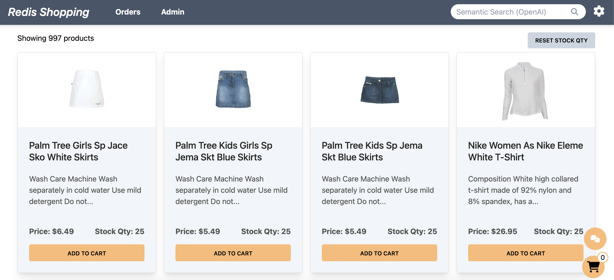
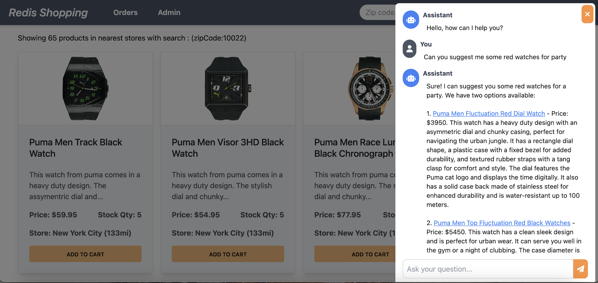
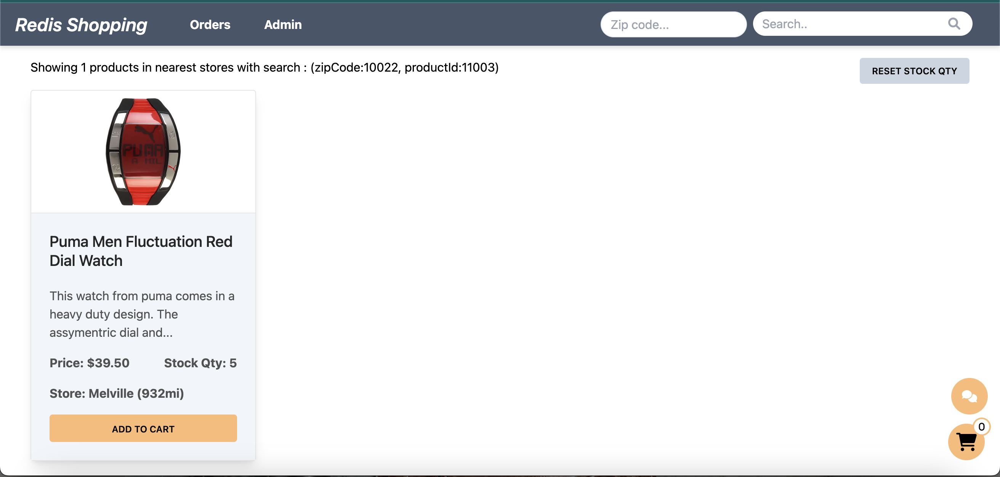
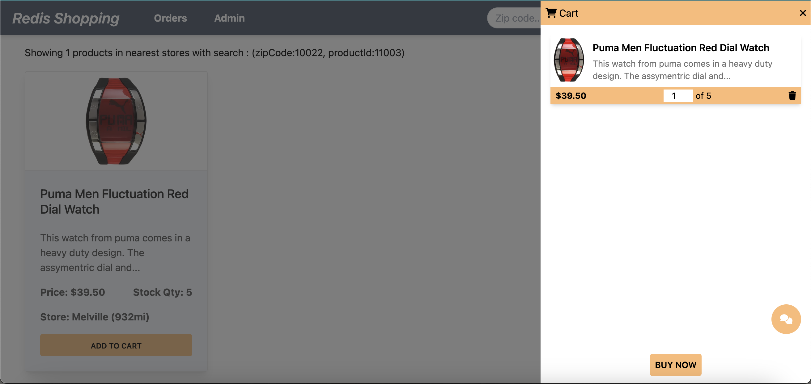
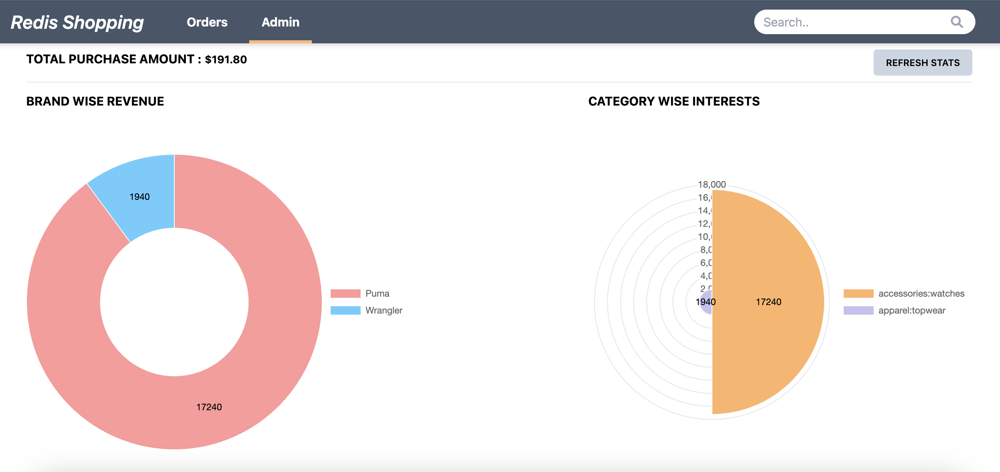

The e-commerce microservices application consists of a frontend, built using [Next.js](https://nextjs.org/) with [TailwindCSS](https://tailwindcss.com/). The application backend uses [Node.js](https://nodejs.org). The data is stored in
[Redis](https://redis.com/try-free/) and MongoDB/ Postgressql using [Prisma](https://www.prisma.io/docs/reference/database-reference/supported-databases). Below you will find screenshots of the frontend of the e-commerce app:

- `Dashboard`: Shows the list of products with search functionality

  

- `Chat bot`: The chat bot is available on the bottom right corner of the page. It can be used to search for products and view the product details.

  

  Clicking on a product in the chat shows the product details on dashboard

  

- `Shopping Cart`: Add products to the cart, then check out using the "Buy Now" button
  

- `Order history`: Once an order is placed, the `Orders` link in the top navigation bar shows the order status and history

  

- `Admin`: The `admin` link in the top navigation bar shows purchase stats and trending products.

  
  
