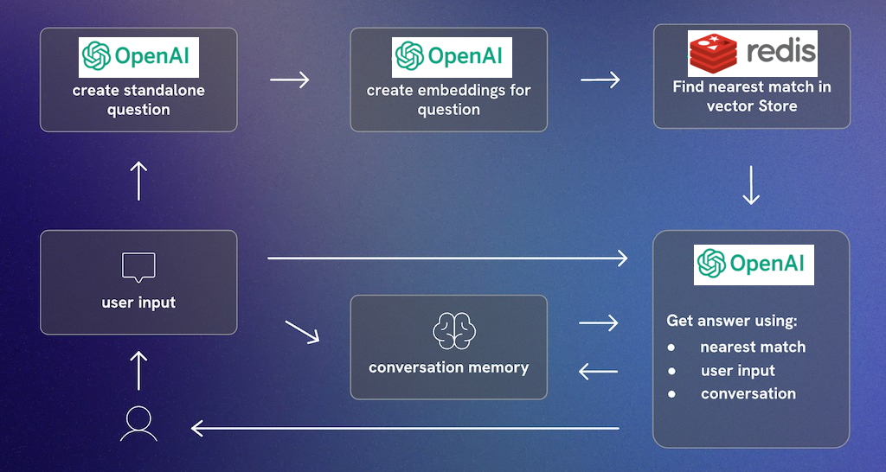
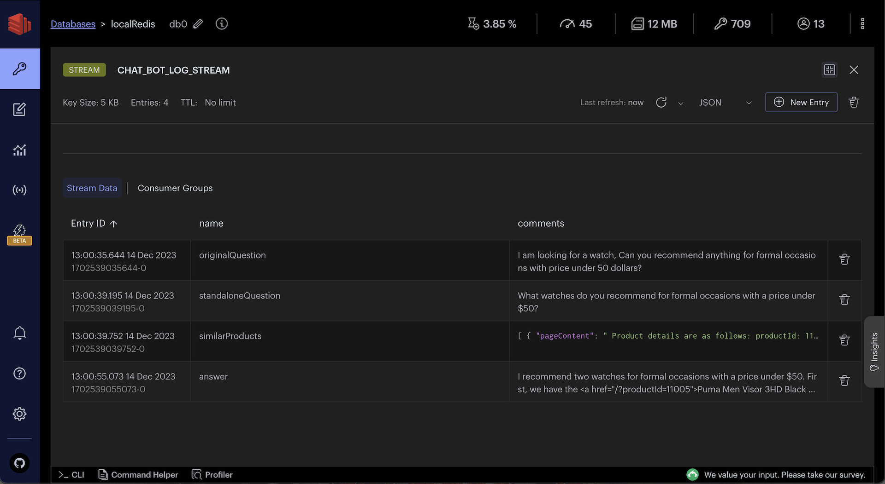

import Authors from '@theme/Authors';
import InitialMicroservicesArchitecture from '../../microservices/common-data/microservices-arch.mdx';
import MicroservicesEcommerceAIDesign from '../common-ai/microservices-ecommerce-ai.mdx';
import SourceCode from '../common-ai/microservices-source-code-ai.mdx';

<Authors frontMatter={frontMatter} />

## What you will learn in this tutorial

In this tutorial, you'll learn how to build a GenAI chatbot using `LangChain` and `Redis`. You'll also learn how to use `OpenAI's` language model to generate responses to user queries and how to use Redis to store and retrieve data.

Here's what's covered:

- **E-Commerce App** : A sample e-commerce application where users can search for products and ask questions about them, add them to their cart, and purchase them.
- **Chatbot Architecture** : The architecture of the chatbot, including the flow diagram, sample user prompt and it's AI response.
- **Database setup** : Generating OpenAI embeddings for products and storing them in Redis.
- **Setting up the chatbot API** : Creating a chatbot API that uses OpenAI and Redis to answer user questions and recommend products.

## Terminology

**Generative AI**, also known as **GenAI**, is a category of artificial intelligence that specializes in creating new content based on pre-existing data. It can generate a wide array of content types, including text, images, videos, sounds, code, 3D designs, and other media formats. Unlike traditional AI models that focus on analyzing and interpreting existing data, GenAI models learn from existing data and then use their knowledge to generate something entirely new.

**[LangChain](https://js.langchain.com)** is an innovative library for building language model applications. It offers a structured way to combine different components like language models (e.g., OpenAI's models), storage solutions (like Redis), and custom logic. This modular approach facilitates the creation of sophisticated AI applications, including chatbots.

**[OpenAI](https://openai.com/)** provides advanced language models like GPT-3, which have revolutionized the field with their ability to understand and generate human-like text. These models form the backbone of many modern AI applications, including chatbots.

## Microservices architecture for an e-commerce application

<SourceCode />

<InitialMicroservicesArchitecture />

## E-commerce application frontend using Next.js and Tailwind

<MicroservicesEcommerceAIDesign />

## Chatbot architecture

### Flow diagram



1> **Create Standalone Question**: Create a standalone question using `OpenAI's` language model.

A standalone question is just a question reduced to the minimum number of words needed to express the request for information.

```js
//Example
userQuestion =
  "I'm thinking of buying one of your T-shirts but I need to know what your returns policy is as some T-shirts just don't fit me and I don't want to waste money.";

//semanticMeaning of above question
standAloneQuestion = 'What is your return policy?';
```

2> **Create Embeddings for Question**: Once the question is created, `OpenAI's` language model generates an embedding for the question.

3> **Find Nearest Match in Redis Vector Store**: The embedding is then used to query `Redis` vector store. The system searches for the nearest match to the question embedding among stored vectors

4> **Get Answer**: With the user initial question, the nearest match from the vector store, and the conversation memory, `OpenAI's` language model generates an answer. This answer is then provided to the user.

Note : The system maintains a conversation memory, which tracks the ongoing conversation's context. This memory is crucial for ensuring the continuity and relevance of the conversation.

5> **User Receives Answer**: The answer is sent back to the user, completing the interaction cycle. The conversation memory is updated with this latest exchange to inform future responses.

### Sample user prompt and AI response

Say, OriginalQuestion of user is as follows:

`I am looking for a watch, Can you recommend anything for formal occasions with price under 50 dollars?`

Converted standaloneQuestion by openAI is as follows:

`What watches do you recommend for formal occasions with a price under $50?`

After vector similarity search on **Redis**, we get the following similarProducts:

```ts
similarProducts = [
  {
    pageContent: ` Product details are as follows:
                      productId: 11005.
                      productDisplayName: Puma Men Visor 3HD Black Watch.
                      price: 5495  ...`,
    metadata: { productId: '11005' },
  },
  {
    pageContent: ` Product details are as follows:
                      productId: 11006.
                      productDisplayName: Puma Men Race Luminous Black Chronograph Watch.
                      price: 7795 ... `,
    metadata: { productId: '11006' },
  },
];
```

The final openAI response with above context and earlier chat history (if any) is as follows:

```ts
answer = `I recommend two watches for formal occasions with a price under $50. 

First, we have the <a href="/?productId=11005">Puma Men Visor 3HD Black Watch</a> priced at $54.95. This watch features a heavy-duty design with a stylish dial and chunky casing, giving it a tough appearance - perfect for navigating the urban jungle. It has a square dial shape and a 32 mm case diameter. The watch comes with a 2-year warranty and is water-resistant up to 50 meters. 

Second, we have the <a href="/?productId=11006">Puma Men Race Luminous Black Chronograph Watch</a> priced at $77.95. This watch also features a heavy-duty design with a stylish dial and chunky casing. It has a round dial shape and a 40 mm case diameter. The watch comes with a 2-year warranty and is water-resistant up to 50 meters. 

Both these watches from Puma are perfect for formal occasions and are priced under $50. I hope this helps, and please let me know if you have any other questions!`;
```

## Database setup

:::info
Sign up for an <u>[OpenAI account](https://platform.openai.com/)</u> to get your API key to be used in the demo (add OPEN_AI_API_KEY variable in .env file). You can also refer to the <u>[OpenAI API documentation](https://platform.openai.com/docs/api-reference/introduction)</u> for more information.
:::

<SourceCode />

### Sample data

For the purposes of this tutorial, let's consider a simplified e-commerce context. The `products` JSON provided offers a glimpse into AI search functionalities we'll be operating on.

```ts title="database/fashion-dataset/001/products/*.json"
const products = [
  {
    productId: '11000',
    price: 3995,
    productDisplayName: 'Puma Men Slick 3HD Yellow Black Watches',
    variantName: 'Slick 3HD Yellow',
    brandName: 'Puma',
    ageGroup: 'Adults-Men',
    gender: 'Men',
    displayCategories: 'Accessories',
    masterCategory_typeName: 'Accessories',
    subCategory_typeName: 'Watches',
    styleImages_default_imageURL:
      'http://host.docker.internal:8080/images/11000.jpg',
    productDescriptors_description_value:
      '<p style="text-align: justify;">Stylish and comfortable, ...',
    stockQty: 25,
  },
  //...
];
```

### OpenAI embeddings seeding

Below is the sample code to seed `products` data as openAI embeddings into Redis.

```ts title="database/src/open-ai.ts"
import { Document } from 'langchain/document';
import { OpenAIEmbeddings } from 'langchain/embeddings/openai';
import { RedisVectorStore } from 'langchain/vectorstores/redis';

/**
 * Adds OpenAI embeddings to Redis for the given products.
 *
 * @param _products - An array of (ecommerce) products.
 * @param _redisClient - The Redis client used to connect to the Redis server.
 * @param _openAIApiKey - The API key for accessing the OpenAI service.
 */
const addOpenAIEmbeddingsToRedis = async (
  _products,
  _redisClient,
  _openAIApiKey,
) => {
  if (_products?.length > 0 && _redisClient && _openAIApiKey) {
    // Check if the data is already seeded
    const existingKeys = await _redisClient.keys('openAIProducts:*');
    if (existingKeys.length > 0) {
      console.log('seeding openAIEmbeddings skipped !');
      return;
    }

    const vectorDocs: Document[] = [];
    // Create a document for each product
    for (let product of _products) {
      let doc = new Document({
        metadata: {
          productId: product.productId,
        },
        pageContent: ` Product details are as follows:
                productId: ${product.productId}.
    
                productDisplayName: ${product.productDisplayName}.
                
                price: ${product.price}.
    
                variantName: ${product.variantName}.
    
                brandName: ${product.brandName}.
    
                ageGroup: ${product.ageGroup}.
    
                gender: ${product.gender}.
    
                productColors: ${product.productColors}
    
                Category:  ${product.displayCategories}, ${product.masterCategory_typeName} - ${product.subCategory_typeName}
    
                productDescription:  ${product.productDescriptors_description_value}`,
      });

      vectorDocs.push(doc);
    }

    // Create a new OpenAIEmbeddings instance
    const embeddings = new OpenAIEmbeddings({
      openAIApiKey: _openAIApiKey,
    });
    // Add the documents to the RedisVectorStore
    const vectorStore = await RedisVectorStore.fromDocuments(
      vectorDocs,
      embeddings,
      {
        redisClient: _redisClient,
        indexName: 'openAIProductsIdx',
        keyPrefix: 'openAIProducts:',
      },
    );
    console.log('seeding OpenAIEmbeddings completed');
  }
};
```

You can observe openAIProducts JSON in RedisInsight:


:::tip

Download <u>[RedisInsight](https://redis.com/redis-enterprise/redis-insight/)</u> to visually explore your Redis data or to engage with raw Redis commands in the workbench.

:::

## Setting up the chatbot API

<SourceCode />

Once products data is seeded as openAI embeddings into Redis, we can create a `chatbot` API to answer user questions and recommend products.

### API end point

The code that follows shows an example API request and response for the `chatBot` API:

**Request**

```json
POST http://localhost:3000/products/chatBot
{
    "userMessage":"I am looking for a watch, Can you recommend anything for formal occasions with price under 50 dollars?"
}
```

**Response**

```json
{
  "data": "I recommend two watches for formal occasions with a price under $50.

  First, we have the <a href='/?productId=11005'>Puma Men Visor 3HD Black Watch</a> priced at $54.95. This watch features a heavy-duty design with a stylish dial and chunky casing, giving it a tough appearance - perfect for navigating the urban jungle. It has a square dial shape and a 32 mm case diameter. The watch comes with a 2-year warranty and is water-resistant up to 50 meters.

  Second, we have the <a href='/?productId=11006'>Puma Men Race Luminous Black Chronograph Watch</a> priced at $77.95. This watch also features a heavy-duty design with a stylish dial and chunky casing. It has a round dial shape and a 40 mm case diameter. The watch comes with a 2-year warranty and is water-resistant up to 50 meters.

  Both these watches from Puma are perfect for formal occasions and are priced under $50. I hope this helps, and please let me know if you have any other questions!",

  "error": null,
  "auth": "SES_54f211db-50a7-45df-8067-c3dc4272beb2"
}
```

### API implementation

When you make a request, it goes through the API gateway to the `products` service. Ultimately, it ends up calling an `chatBotMessage` function which looks as follows:

```ts title="server/src/services/products/src/open-ai-prompt.ts"
import {
  ChatOpenAI,
  ChatOpenAICallOptions,
} from 'langchain/chat_models/openai';
import { PromptTemplate } from 'langchain/prompts';
import { OpenAIEmbeddings } from 'langchain/embeddings/openai';
import { RedisVectorStore } from 'langchain/vectorstores/redis';
import { StringOutputParser } from 'langchain/schema/output_parser';
import { Document } from 'langchain/document';

let llm: ChatOpenAI<ChatOpenAICallOptions>;

const chatBotMessage = async (
  _userMessage: string,
  _sessionId: string,
  _openAIApiKey: string,
) => {
  const CHAT_BOT_LOG = 'CHAT_BOT_LOG_STREAM';
  const redisWrapperInst = getRedis();

  // Add user message to chat history
  const chatHistoryName = 'chatHistory:' + _sessionId;
  redisWrapperInst.addItemToList(
    chatHistoryName,
    'userMessage: ' + _userMessage,
  );
  // add log
  addMessageToStream(
    { name: 'originalQuestion', comments: _userMessage },
    CHAT_BOT_LOG,
  );

  // (1) Create a standalone question
  const standaloneQuestion = await convertToStandAloneQuestion(
    _userMessage,
    _sessionId,
    _openAIApiKey,
  );
  // add log
  addMessageToStream(
    { name: 'standaloneQuestion', comments: standaloneQuestion },
    CHAT_BOT_LOG,
  );

  // (2) Get similar products from Redis
  const similarProducts = await getSimilarProductsByVSS(
    standaloneQuestion,
    _openAIApiKey,
  );
  if (similarProducts?.length) {
    // add log
    addMessageToStream(
      { name: 'similarProducts', comments: JSON.stringify(similarProducts) },
      CHAT_BOT_LOG,
    );
  }

  // Combine the product details into a single document
  const productDetails = combineVectorDocuments(similarProducts);
  console.log('productDetails:', productDetails);

  // (3) Get answer from OpenAI
  const answer = await convertToAnswer(
    _userMessage,
    standaloneQuestion,
    productDetails,
    _sessionId,
    _openAIApiKey,
  );
  // add log
  addMessageToStream({ name: 'answer', comments: answer }, CHAT_BOT_LOG);

  // Add answer to chat history
  redisWrapperInst.addItemToList(
    chatHistoryName,
    'openAIMessage(You): ' + answer,
  );

  return answer;
};
```

Below function converts the userMessage to standaloneQuestion using `openAI`

```ts title="server/src/services/products/src/open-ai-prompt.ts"
// (1) Create a standalone question
const convertToStandAloneQuestion = async (
  _userQuestion: string,
  _sessionId: string,
  _openAIApiKey: string,
) => {
  const llm = getOpenAIInstance(_openAIApiKey);

  const chatHistory = await getChatHistory(_sessionId);

  const standaloneQuestionTemplate = `Given some conversation history (if any) and a question, convert it to a standalone question. 
    ***********************************************************
    conversation history: 
         ${chatHistory}
    ***********************************************************
    question: {question} 
    standalone question:`;

  const standaloneQuestionPrompt = PromptTemplate.fromTemplate(
    standaloneQuestionTemplate,
  );

  const chain = standaloneQuestionPrompt
    .pipe(llm)
    .pipe(new StringOutputParser());

  const response = await chain.invoke({
    question: _userQuestion,
  });

  return response;
};
const getOpenAIInstance = (_openAIApiKey: string) => {
  if (!llm) {
    llm = new ChatOpenAI({
      openAIApiKey: _openAIApiKey,
    });
  }
  return llm;
};

const getChatHistory = async (_sessionId: string, _separator?: string) => {
  let chatHistory = '';
  if (!_separator) {
    _separator = '\n\n';
  }
  if (_sessionId) {
    const redisWrapperInst = getRedis();
    const chatHistoryName = 'chatHistory:' + _sessionId;
    const items = await redisWrapperInst.getAllItemsFromList(chatHistoryName);

    if (items?.length) {
      chatHistory = items.join(_separator);
    }
  }
  return chatHistory;
};
const combineVectorDocuments = (
  _vectorDocs: Document[],
  _separator?: string,
) => {
  if (!_separator) {
    _separator = '\n\n --------------------- \n\n';
  }
  return _vectorDocs.map((doc) => doc.pageContent).join(_separator);
};
```

Below function uses `Redis` to find similar products for the standaloneQuestion

```ts title="server/src/services/products/src/open-ai-prompt.ts"
// (2) Get similar products from Redis
const getSimilarProductsByVSS = async (
  _standAloneQuestion: string,
  _openAIApiKey: string,
) => {
  const client = getNodeRedisClient();

  const embeddings = new OpenAIEmbeddings({
    openAIApiKey: _openAIApiKey,
  });
  const vectorStore = new RedisVectorStore(embeddings, {
    redisClient: client,
    indexName: 'openAIProductsIdx',
    keyPrefix: 'openAIProducts:',
  });

  const KNN = 3;
  /* Simple standalone search in the vector DB */
  const vectorDocs = await vectorStore.similaritySearch(
    _standAloneQuestion,
    KNN,
  );

  return vectorDocs;
};
```

Below function uses `openAI` to convert the standaloneQuestion, similar products from Redis and other context to a human understandable answer.

```ts title="server/src/services/products/src/open-ai-prompt.ts"
// (3) Get answer from OpenAI
const convertToAnswer = async (
  _originalQuestion: string,
  _standAloneQuestion: string,
  _productDetails: string,
  _sessionId: string,
  _openAIApiKey: string,
) => {
  const llm = getOpenAIInstance(_openAIApiKey);

  const chatHistory = await getChatHistory(_sessionId);

  const answerTemplate = `
    Please assume the persona of a retail shopping assistant for this conversation.
    Use a friendly tone, and assume the target audience are normal people looking for a product in a ecommerce website.

    ***********************************************************
    ${
      chatHistory
        ? `
    Conversation history between user and you is : 
       ${chatHistory}
    `
        : ''
    }
    ***********************************************************
    OriginalQuestion of user is : {originalQuestion}
    ***********************************************************
    converted stand alone question is : {standAloneQuestion}
    ***********************************************************
    resulting details of products for the stand alone question are :
             {productDetails}
    Note : Different product details are separated by "---------------------" (if any)            
    ***********************************************************
    Answer the question based on the context provided and the conversation history.
    
    If you  don't know the answer, please direct the questioner to email help@redis.com. Don't try to suggest any product out of context as it may not be in the store.

    Let the answer include product display name, price and optional other details based on question asked.

    Let the product display name be a link like <a href="/?productId="> productDisplayName </a>
    so that user can click on it and go to the product page with help of productId.
    
    answer: `;

  const answerPrompt = PromptTemplate.fromTemplate(answerTemplate);
  const chain = answerPrompt.pipe(llm).pipe(new StringOutputParser());

  const response = await chain.invoke({
    originalQuestion: _originalQuestion,
    standAloneQuestion: _standAloneQuestion,
    productDetails: _productDetails,
  });

  return response;
};
```

You can observe chat history and intermediate chat logs in RedisInsight:




:::tip

Download <u>[RedisInsight](https://redis.com/redis-enterprise/redis-insight/)</u> to visually explore your Redis data or to engage with raw Redis commands in the workbench.

:::

## Ready to use Redis for genAI chatbot?

Building a GenAI chatbot using LangChain and Redis involves integrating advanced AI models with efficient storage solutions. This tutorial covers the fundamental steps and code needed to develop a chatbot capable of handling e-commerce queries. With these tools, you can create a responsive, intelligent chatbot for a variety of applications

## Further reading

- [Perform vector similarity search using Redis](/howtos/solutions/vector/getting-started-vector)

- [LangChain JS](https://js.langchain.com/docs/get_started/quickstart)
  - [Learn LangChain](https://scrimba.com/learn/langchain)
- [LangChain redis integration](https://js.langchain.com/docs/integrations/vectorstores/redis)
