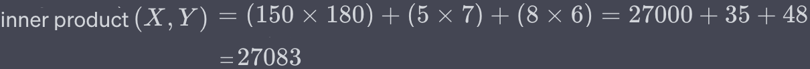
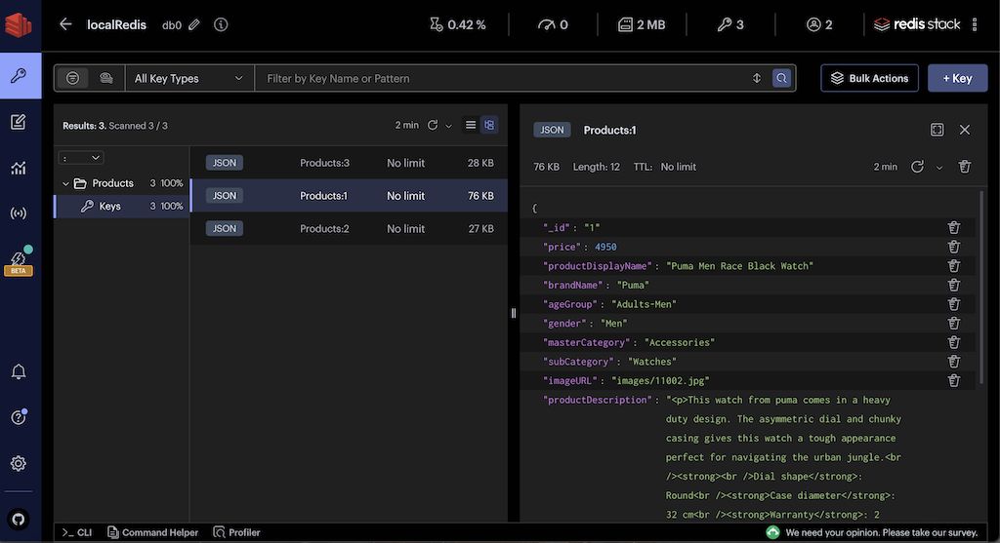

import Authors from '@theme/Authors';
import SampleWatchImage from './images/11001.jpg';
import EuclideanDistanceFormulaImage from './images/euclidean-distance-formula.png';
import EuclideanDistanceSampleImage from './images/euclidean-distance-sample.png';
import CosineFormulaImage from './images/cosine-formula.png';
import CosineSampleImage from './images/cosine-sample.png';
import IpFormulaImage from './images/ip-formula.png';
import IpSampleImage from './images/ip-sample.png';

<Authors frontMatter={frontMatter} />

:::tip GITHUB CODE

Below is a command to the clone the source code used in this tutorial

git clone https://github.com/redis-developer/redis-vector-nodejs-solutions.git
:::

## What is a vector in machine learning?

In the context of machine learning, a vector is a mathematical representation of data. It is an ordered list of numbers that encode the features or attributes of a piece of data.

Vectors can be thought of as points in a multi-dimensional space where each dimension corresponds to a feature.
**For example**, consider a simple dataset about ecommerce `products`. Each product might have features such as `price`, `quality`, and `popularity`.

| Id  | Product                                  | Price ($) | Quality (1 - 10) | Popularity (1 - 10) |
| --- | ---------------------------------------- | --------- | ---------------- | ------------------- |
| 1   | Puma Men Race Black Watch                | 150       | 5                | 8                   |
| 2   | Puma Men Top Fluctuation Red Black Watch | 180       | 7                | 6                   |
| 3   | Inkfruit Women Behind Cream Tshirt       | 5         | 9                | 7                   |

Now, product 1 `Puma Men Race Black Watch` might be represented as the vector `[150, 5, 8]`

In a more complex scenario, like natural language processing (NLP), words or entire sentences can be converted into dense vectors (often referred to as embeddings) that capture the semantic meaning of the text.Vectors play a foundational role in many machine learning algorithms, particularly those that involve distance measurements, such as clustering and classification algorithms.

## What is vector similarity?

Vector similarity is a measure that quantifies how alike two vectors are, typically by evaluating the `distance` or `angle` between them in a multi-dimensional space.
When vectors represent data points, such as texts or images, the similarity score can indicate how similar the underlying data points are in terms of their features or content.

### Use cases for vector similarity:

- **Recommendation Systems**: If you have vectors representing user preferences or item profiles, you can quickly find items that are most similar to a user's preference vector.
- **Image Search**: Store vectors representing image features, and then retrieve images most similar to a given image's vector.
- **Textual Content Retrieval**: Store vectors representing textual content (e.g., articles, product descriptions) and find the most relevant texts for a given query vector.

## How to calculate vector similarity?

There are several ways to calculate vector similarity, but some of the most common methods include:

### Euclidean Distance (L2 norm)

**Euclidean Distance (L2 norm)** computes the "straight line" distance between two points in a multi-dimensional space. Lower values indicate closer proximity, and hence higher similarity.


Lets consider `product 1` and `product 2` from above ecommerce dataset and calculate `Euclidean Distance` between those products with all features.


For the purpose of this demonstration, We will consider 2D chart built using [chart.js](https://www.chartjs.org/) of `Price vs. Quality` features (rather all features with multi dimensional chart) for our products and calculate `Euclidean Distance` between products with Price & Quality features only.


### Cosine Similarity

**Cosine Similarity** measures the cosine of the angle between two vectors. The cosine similarity value ranges between -1 and 1. A value closer to 1 implies a smaller angle and higher similarity, while a value closer to -1 implies a larger angle and lower similarity. Cosine similarity is particularly popular in NLP when dealing with text vectors.


Note: If two vectors are pointing in the same direction, the cosine of the angle between them is 1. If they're orthogonal, the cosine is 0, and if they're pointing in opposite directions, the cosine is -1.

Lets consider same `product 1` and `product 2` from above ecommerce dataset and calculate `Cosine Distance` between those products with all features.


Lets consider 2D chart built using [chart.js](https://www.chartjs.org/) of `Price vs. Quality` features for our products and visualize `Cosine Similarity` between products with Price & Quality features only.


### Inner Product

**Inner Product (dot product)** The inner product (or dot product) isn't a distance metric in the traditional sense but can be used to calculate similarity, especially when vectors are normalized (have a magnitude of 1). It's the sum of the products of the corresponding entries of the two sequences of numbers.


Note: The inner product can be thought of as a measure of how much two vectors "align"
in a given vector space. Higher values indicate higher similarity. However, the raw
values can be large for long vectors; hence, normalization is recommended for better
interpretation. If the vectors are normalized, their dot product will be `1 if they
are identical` and `0 if they are orthogonal` (uncorrelated).

Lets consider same `product 1` and `product 2` from above ecommerce dataset and calculate `inner Product` between those products with all features.



:::note
Vectors can also be stored in databases in **binary formats** to save space. In practical applications, it's crucial to strike a balance between the dimensionality of the vectors (which impacts storage and computational costs) and the quality or granularity of the information they capture.
:::

## Generating vectors

The [Hugging Face Transformers](https://huggingface.co/docs/transformers.js/index) library provides pre-trained models that can be fine-tuned or used out-of-the-box for various NLP (natural language processing) tasks. In our context, we're interested in generating sentence and image embeddings (vector).

:::note
transformers.j library is essentially the JavaScript version of Hugging Face's popular Python library.
:::

### Sentence vector

:::tip GITHUB CODE

Below is a command to the clone the source code used in this tutorial

git clone https://github.com/redis-developer/redis-vector-nodejs-solutions.git
:::

To obtain sentence embeddings, let's use a hugging face model called [Xenova/all-distilroberta-v1](https://huggingface.co/Xenova/all-distilroberta-v1) which is compatible version of [sentence-transformers/all-distilroberta-v1](https://huggingface.co/sentence-transformers/all-distilroberta-v1) for transformer.js with ONNX weights.

:::note

<u>[ONNX (Open Neural Network eXchange)](https://onnx.ai) </u> is an open standard
that defines a common set of operators and a common file format to represent deep
learning models in a wide variety of frameworks, including PyTorch and TensorFlow
:::

Below is a Node.js code sample that showcases how to generate vector embeddings for the any sentence provided:

```sh
npm install @xenova/transformers
```

```js title="src/text-vector-gen.ts"
import * as transformers from '@xenova/transformers';

async function generateSentenceEmbeddings(_sentence): Promise<number[]> {
  let modelName = 'Xenova/all-distilroberta-v1';
  let pipe = await transformers.pipeline('feature-extraction', modelName);

  let vectorOutput = await pipe(_sentence, {
    pooling: 'mean',
    normalize: true,
  });

  const embeddings: number[] = Object.values(vectorOutput?.data); //object to array
  return embeddings;
}

export { generateSentenceEmbeddings };
```

```js title="sample output"
const embeddings = await generateSentenceEmbeddings('I Love Redis !');
console.log(embeddings);
/*
 768 dim vector output
 embeddings = [ 
    -0.005076113156974316,  -0.006047232076525688,   -0.03189406543970108,
    -0.019677048549056053,    0.05152582749724388,  -0.035989608615636826,
    -0.009754283353686333,   0.002385444939136505,   -0.04979122802615166,
    ....]
*/
```

### Image vector

:::tip GITHUB CODE

Below is a command to the clone the source code used in this tutorial

git clone https://github.com/redis-developer/redis-vector-nodejs-solutions.git
:::

```sh
npm i @tensorflow/tfjs @tensorflow/tfjs-node @tensorflow-models/mobilenet jpeg-js
```

```js title="src/image-vector-gen.ts"
import * as tf from '@tensorflow/tfjs-node';
import * as mobilenet from '@tensorflow-models/mobilenet';

import * as jpeg from 'jpeg-js';

import * as path from 'path';
import { fileURLToPath } from 'url';
import * as fs from 'fs/promises';

const __filename = fileURLToPath(import.meta.url);
const __dirname = path.dirname(__filename);

async function decodeImage(imagePath) {
  imagePath = path.join(__dirname, imagePath);

  const buffer = await fs.readFile(imagePath);
  const rawImageData = jpeg.decode(buffer);
  const imageTensor = tf.browser.fromPixels(rawImageData);
  return imageTensor;
}

async function generateImageEmbeddings(imagePath: string) {
  const imageTensor = await decodeImage(imagePath);

  // Load MobileNet model
  const model = await mobilenet.load();

  //to check properly classifying image
  const prediction = await model.classify(imageTensor);
  console.log(`${imagePath} prediction`, prediction);

  // Preprocess the image and get the intermediate activation.
  const activation = model.infer(imageTensor, true);

  // Convert the tensor to a regular array.
  const vectorOutput = await activation.data();

  imageTensor.dispose(); // Clean up tensor

  return vectorOutput; //DIM 1024
}
```

<div style={{display:'flex'}}>

<div>

:::note
We are using <u>[mobilenet model](https://github.com/tensorflow/tfjs-models/tree/master/mobilenet)</u> which is trained only on small <u>[set of image classes](https://github.com/tensorflow/tfjs-examples/blob/master/mobilenet/imagenet_classes.js)</u>. Selecting an image classification model depends on various factors, such as the dataset size, dataset diversity, computational resources, and the specific needs of the application. There are many image classification models like EfficientNet, ResNets, Vision Transformers (ViT)..etc which can be chosen from based on your requirements.
:::

Please find vector details for the sample watch image (11001.jpg)

</div>


</div>

```js title="sample output"
//watch image
const imageEmbeddings = await generateImageEmbeddings('images/11001.jpg');
console.log(imageEmbeddings);
/*
 1024 dim vector output
 imageEmbeddings = [ 
    0.013823275454342365,    0.33256298303604126,                     0,
    2.2764432430267334,    0.14010703563690186,     0.972867488861084,
    1.2307443618774414,      2.254523992538452,   0.44696325063705444,
    ....]

  images/11001.jpg (mobilenet model) prediction [
  { className: 'digital watch', probability: 0.28117117285728455 },
  { className: 'spotlight, spot', probability: 0.15369531512260437 },
  { className: 'digital clock', probability: 0.15267866849899292 }
]
*/
```

## Database setup

### Sample Data seeding

Let's assume a simplified e-commerce scenario. consider below `products` JSON for vector search demonstration in this tutorial.

```js title="src/data.ts"
const products = [
  {
    _id: '1',
    price: 4950,
    productDisplayName: 'Puma Men Race Black Watch',
    brandName: 'Puma',
    ageGroup: 'Adults-Men',
    gender: 'Men',
    masterCategory: 'Accessories',
    subCategory: 'Watches',
    imageURL: 'images/11002.jpg',
    productDescription:
      '<p>This watch from puma comes in a heavy duty design. The asymmetric dial and chunky casing gives this watch a tough appearance perfect for navigating the urban jungle.<br /><strong><br />Dial shape</strong>: Round<br /><strong>Case diameter</strong>: 32 cm<br /><strong>Warranty</strong>: 2 Years<br /><br />Stainless steel case with a fixed bezel for added durability, style and comfort<br />Leather straps with a tang clasp for comfort and style<br />Black dial with cat logo on the 12 hour mark<br />Date aperture at the 3 hour mark<br />Analog time display<br />Solid case back made of stainless steel for enhanced durability<br />Water resistant upto 100 metres</p>',
  },
  {
    _id: '2',
    price: 5450,
    productDisplayName: 'Puma Men Top Fluctuation Red Black Watches',
    brandName: 'Puma',
    ageGroup: 'Adults-Men',
    gender: 'Men',
    masterCategory: 'Accessories',
    subCategory: 'Watches',
    imageURL: 'images/11001.jpg',
    productDescription:
      '<p style="text-align: justify;">This watch from puma comes in a clean sleek design. This active watch is perfect for urban wear and can serve you well in the gym or a night of clubbing.<br /><strong><br />Case diameter</strong>: 40 mm&lt;</p>',
  },

  {
    _id: '3',
    price: 499,
    productDisplayName: 'Inkfruit Women Behind Cream Tshirts',
    brandName: 'Inkfruit',
    ageGroup: 'Adults-Women',
    gender: 'Women',
    masterCategory: 'Apparel',
    subCategory: 'Topwear',
    imageURL: 'images/11008.jpg',
    productDescription:
      '<p><strong>Composition</strong><br />Yellow round neck t-shirt made of 100% cotton, has short sleeves and graphic print on the front<br /><br /><strong>Fitting</strong><br />Comfort<br /><br /><strong>Wash care</strong><br />Hand wash separately in cool water at 30 degrees <br />Do not scrub <br />Do not bleach <br />Turn inside out and dry flat in shade <br />Warm iron on reverse<br />Do not iron on print<br /><br />Flaunt your pretty, long legs in style with this inkfruit t-shirt. The graphic print oozes sensuality, while the cotton fabric keeps you fresh and comfortable all day. Team this with a short denim skirt and high-heeled sandals and get behind the wheel in style.<br /><br /><em>Model statistics</em><br />The model wears size M in t-shirts <br />Height: 5\'7", Chest: 33"</p>',
  },
];
```

:::tip GITHUB CODE

Below is a command to the clone the source code used in this tutorial

git clone https://github.com/redis-developer/redis-vector-nodejs-solutions.git
:::

Below is the sample code to add `products` data as JSON in Redis along with vectors of product descriptions and product image.

```js title="src/index.ts"
async function addProductWithEmbeddings(_products) {
  const nodeRedisClient = getNodeRedisClient();

  if (_products && _products.length) {
    for (let product of _products) {
      console.log(
        `generating description embeddings for product ${product._id}`,
      );
      const sentenceEmbedding = await generateSentenceEmbeddings(
        product.productDescription,
      );
      product['productDescriptionEmbeddings'] = sentenceEmbedding;

      console.log(`generating image embeddings for product ${product._id}`);
      const imageEmbedding = await generateImageEmbeddings(product.imageURL);
      product['productImageEmbeddings'] = imageEmbedding;

      await nodeRedisClient.json.set(`products:${product._id}`, '$', {
        ...product,
      });
      console.log(`product ${product._id} added to redis`);
    }
  }
}
```

Data view in RedisInsight



:::tip
Download <u>[RedisInsight](https://redis.com/redis-enterprise/redis-insight/)</u> to view your Redis data or to play with raw Redis commands in the workbench. learn more about <u>[RedisInsight in tutorials](/explore/redisinsight/)</u>
:::

### Create vector index

Below implementation shows indexing different field types in Redis including vector fields like productDescriptionEmbeddings and productImageEmbeddings.

```ts title="src/redis-index.ts"
import {
  createClient,
  SchemaFieldTypes,
  VectorAlgorithms,
  RediSearchSchema,
} from 'redis';

const PRODUCTS_KEY_PREFIX = 'products';
const PRODUCTS_INDEX_KEY = 'idx:products';
const REDIS_URI = 'redis://localhost:6379';
let nodeRedisClient = null;

const getNodeRedisClient = async () => {
  if (!nodeRedisClient) {
    nodeRedisClient = createClient({ url: REDIS_URI });
    await nodeRedisClient.connect();
  }
  return nodeRedisClient;
};

const createRedisIndex = async () => {
  /*    (RAW COMMAND)
          FT.CREATE idx:products
          ON JSON
              PREFIX 1 "products:"
          SCHEMA
          "$.productDisplayName" as productDisplayName TEXT NOSTEM SORTABLE
          "$.brandName" as brandName TEXT NOSTEM SORTABLE
          "$.price" as price NUMERIC SORTABLE
          "$.masterCategory" as "masterCategory" TAG
          "$.subCategory" as subCategory TAG
          "$.productDescriptionEmbeddings" as productDescriptionEmbeddings VECTOR "FLAT" 10
                  "TYPE" FLOAT32
                  "DIM" 768
                  "DISTANCE_METRIC" "L2"
                  "INITIAL_CAP" 111
                  "BLOCK_SIZE"  111
          "$.productDescription" as productDescription TEXT NOSTEM SORTABLE       
          "$.imageURL" as imageURL TEXT NOSTEM       
          "$.productImageEmbeddings" as productImageEmbeddings VECTOR "HNSW" 8
                          "TYPE" FLOAT32
                          "DIM" 1024
                          "DISTANCE_METRIC" "COSINE"
                          "INITIAL_CAP" 111
          
      */
  const nodeRedisClient = await getNodeRedisClient();

  const schema: RediSearchSchema = {
    '$.productDisplayName': {
      type: SchemaFieldTypes.TEXT,
      NOSTEM: true,
      SORTABLE: true,
      AS: 'productDisplayName',
    },
    '$.brandName': {
      type: SchemaFieldTypes.TEXT,
      NOSTEM: true,
      SORTABLE: true,
      AS: 'brandName',
    },
    '$.price': {
      type: SchemaFieldTypes.NUMERIC,
      SORTABLE: true,
      AS: 'price',
    },
    '$.masterCategory': {
      type: SchemaFieldTypes.TAG,
      AS: 'masterCategory',
    },
    '$.subCategory': {
      type: SchemaFieldTypes.TAG,
      AS: 'subCategory',
    },
    '$.productDescriptionEmbeddings': {
      type: SchemaFieldTypes.VECTOR,
      TYPE: 'FLOAT32',
      ALGORITHM: VectorAlgorithms.FLAT,
      DIM: 768,
      DISTANCE_METRIC: 'L2',
      INITIAL_CAP: 111,
      BLOCK_SIZE: 111,
      AS: 'productDescriptionEmbeddings',
    },
    '$.productDescription': {
      type: SchemaFieldTypes.TEXT,
      NOSTEM: true,
      SORTABLE: true,
      AS: 'productDescription',
    },
    '$.imageURL': {
      type: SchemaFieldTypes.TEXT,
      NOSTEM: true,
      AS: 'imageURL',
    },
    '$.productImageEmbeddings': {
      type: SchemaFieldTypes.VECTOR,
      TYPE: 'FLOAT32',
      ALGORITHM: VectorAlgorithms.HNSW, //Hierarchical Navigable Small World graphs
      DIM: 1024,
      DISTANCE_METRIC: 'COSINE',
      INITIAL_CAP: 111,
      AS: 'productImageEmbeddings',
    },
  };
  console.log(`index ${PRODUCTS_INDEX_KEY} created`);

  try {
    await nodeRedisClient.ft.dropIndex(PRODUCTS_INDEX_KEY);
  } catch (indexErr) {
    console.error(indexErr);
  }
  await nodeRedisClient.ft.create(PRODUCTS_INDEX_KEY, schema, {
    ON: 'JSON',
    PREFIX: PRODUCTS_KEY_PREFIX,
  });
};
```

:::note FLAT VS HNSW indexing
FLAT : When you index your vectors in a "FLAT" manner, you're essentially storing them as they are, without any additional structure or hierarchy. When you query against a FLAT index, the algorithm will perform a linear scan through all the vectors to find the most similar ones. This is a more accurate, but much slower and compute intensive approach (suitable for smaller dataset).

HNSW : (Hierarchical Navigable Small World) :
HNSW is a graph-based method for indexing high-dimensional data. For bigger datasets it becomes slower to compare with every single vector in the index, so a probabilistic approach through the HNSW algorithm provides very fast search results (but sacrifices some accuracy)
:::

## What is vector search by KNN?

KNN, or k-Nearest Neighbors, is an algorithm used in both classification and regression tasks, but when referring to "KNN Search," we're typically discussing the task of finding the "k" points in a dataset that are closest (most similar) to a given query point. In the context of vector search, this means identifying the "k" vectors in our database that are most similar to a given query vector, usually based on some distance metric like cosine similarity or Euclidean distance.

Redis provides support for vector search, allowing you to index and then search for vectors [using the KNN approach](https://redis.io/docs/stack/search/reference/vectors/#pure-knn-queries).

### Vector KNN query with Redis

```ts title="src/knn-query.ts"
const float32Buffer = (arr) => {
  const floatArray = new Float32Array(arr);
  const float32Buffer = Buffer.from(floatArray.buffer);
  return float32Buffer;
};
const queryProductDescriptionEmbeddingsByKNN = async (
  _searchTxt,
  _resultCount,
) => {
  //A KNN query will give us the top n documents that best match the query vector.

  /*  sample raw query

        FT.SEARCH idx:products
        "*=>[KNN 5 @productDescriptionEmbeddings $searchBlob AS score]" 
        RETURN 4 score brandName productDisplayName imageURL 
        SORTBY score 
        PARAMS 2 searchBlob "6\xf7\..." 
        DIALECT 2 

    */
  //https://redis.io/docs/interact/search-and-query/query/

  console.log(`queryProductDescriptionEmbeddingsByKNN started`);
  let results = {};
  if (_searchTxt) {
    _resultCount = _resultCount ?? 5;

    const nodeRedisClient = getNodeRedisClient();
    const searchTxtVectorArr = await generateSentenceEmbeddings(_searchTxt);

    const searchQuery = `*=>[KNN ${_resultCount} @productDescriptionEmbeddings $searchBlob AS score]`;

    results = await nodeRedisClient.ft.search(PRODUCTS_INDEX_KEY, searchQuery, {
      PARAMS: {
        searchBlob: float32Buffer(searchTxtVectorArr),
      },
      RETURN: ['score', 'brandName', 'productDisplayName', 'imageURL'],
      SORTBY: {
        BY: 'score',
        // DIRECTION: "DESC"
      },
      DIALECT: 2,
    });
  } else {
    throw 'Search text cannot be empty';
  }

  return results;
};
```

```js title="sample output"
const result = await queryProductDescriptionEmbeddingsByKNN(
  'Puma watch with cat',
  3,
);
console.log(JSON.stringify(result, null, 4));

/*
(Lower score/distance indicates higher similarity)
{
    "total": 3,
    "documents": [
        {
            "id": "products:1",
            "value": {
                "score": "0.762174725533",
                "brandName": "Puma",
                "productDisplayName": "Puma Men Race Black Watch",
                "imageURL": "images/11002.jpg"
            }
        },
        {
            "id": "products:2",
            "value": {
                "score": "0.825711071491",
                "brandName": "Puma",
                "productDisplayName": "Puma Men Top Fluctuation Red Black Watches",
                "imageURL": "images/11001.jpg"
            }
        },
        {
            "id": "products:3",
            "value": {
                "score": "1.79949247837",
                "brandName": "Inkfruit",
                "productDisplayName": "Inkfruit Women Behind Cream Tshirts",
                "imageURL": "images/11008.jpg"
            }
        }
    ]
}
*/
```

- [hybrid-knn-queries](https://redis.io/docs/interact/search-and-query/search/vectors/#hybrid-knn-queries)

## What is vector search by range ?

### Vector range query with Redis
